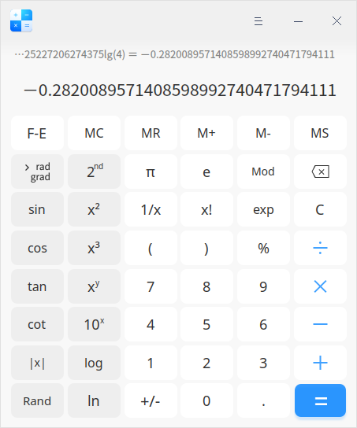
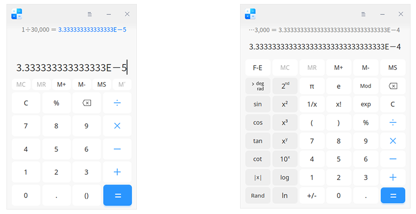

# 计算器|../common/deepin-calculator.svg|

## 概述

计算器是一款简单易用的桌面计算器，支持标准模式和科学模式。完美支持键盘输入，在键盘输入时还支持符号容错及计算结果联动。

## 操作介绍

在计算器界面，单击  > **模式**，您可以：

- 选择 **标准**，切换到标准模式界面，执行基本的加减乘除运算。
- 选择 **科学**，切换到科学模式界面，执行函数、指数、方根等高级运算。

### 标准模式

| 图标                       | 名称     | 说明                                                         |
| -------------------------- | :------- | ------------------------------------------------------------ |
| 0~9                        | 数字键   | 基本阿拉伯数字。                                             |
|                        | 清除键 | 清除所有内存。                                           |
|                        | 存储键  | 重新调用内存。 |
|                       | 存储键 | 内存增加；将当前数值累加到存储器中，中断数字输入。    |
|                        | 存储键 | 内存减少；从存储器内容中减去当前显示值，中断数字输入。           |
|                         | 存储键  | 内存存储；将输入框中的数值添加到内存列表中。                       |
|   /                       | 存储键  | 单击展开内存列表，单击折叠内存列表；关闭应用后内存清零。 |
| C/AC                      | 清除     | 分别表示清除当前的表达式内容，清空所有历史表达式。 |
| %                          | 百分号   | 用来输入百分号。                                             |
|  | 删除     | 单击一次向前删除1个字符。                                    |
| +-×÷                       | 加减乘除 | 基本数学运算符，用来进行加法、减法、乘法、除法运算。         |
| .                          | 小数点   | 用来输入小数点。                                             |
| ()                         | 括号     | 用来输入括号，单击一次，同时显示左右括号。如果从键盘输入，输入左括号则出现左括号，输入右括号则出现右括号，若只出现一侧括号，则表达式计算错误。 |
| =                          | 等于     | 用来得出计算结果。                                           |
### 科学模式

| 图标                       | 名称     | 说明                                                         |
| -------------------------- | :------- | ------------------------------------------------------------ |
| F-E        | 科学计数 | 单击 **F-E** 开启科学计数，再次单击关闭科学计数。 |
| // | 度量转换 | 分别计算角度、梯度、弧度。 |
| sin、cos、tan、cot          | 三角函数 | 分别计算数值的正弦、余弦、正切、余切。                        |
| sin-1、cos-1、tan-1、cot-1 | 反三角函数 | 单击 **2nd** 切换到第二功能界面，分别计算sin、cos、tan、cot的反三角函数。 |
| &#124;x&#124;、Rand | F函数 | 分别计算数值的绝对值和随机显示一个31位的小数。                |
| 2nd | 第二功能键 | 单击 **2nd** 切换到第二功能界面；再次单击切换到三角函数与次方运算界面。 |
|  x2、x3 、xy | 幂函数 | 分别计算数值的平方、立方、y次方。 |
|  10x、2x、ex  | 指数函数 | 分别计算10的x次方、2的x次方和e的x次方。其中2x和ex为第二功能界面按钮。 |
|  、、 | 幂函数  | 单击 **2nd** 切换到第二功能界面，分别计算数值的平方根、立方根、x的y次方根。 |
| log、In、logyx | 对数函数 | 分别以10为底的对数值、以e为底的对数值、以y为底x的对数。其中logyx 为第二功能界面按钮。 |
| π | 圆周率 | 约等于3.14159......，可精确到小数点后31位。 |
| e              | 自然常数 | 约等于2.71828......，可精确到小数点后31位。 |
| Mod            | 求余函数 | 显示x/y的模数或余数。 |
| 1/x | 反比例函数 | 计算显示数值的倒数。 |
|x! | 阶乘 | 计算显示数字的阶乘。 |
|exp | 指数 | 允许输入用科学计数法表示的数字。 |

> 窍门：您可以单击  > **历史记录** 查看科学模式下的历史表达式和内存列表，也可以删除历史记录。

### 数学符号容错

计算器支持键盘操作，除了支持常规的数字和运算符，还支持数学符号容错功能，让您在键盘输入表达式时，键盘的中英文状态和大小写状态，都不会影响输入表达式。

另外还支持一些特殊的符号容错：

- 乘法符号容错处理：输入 * （星号）和x （字母x）都会触发乘法符号激活；
- 除法符号容错处理：输入 / 字符触发除法符号激活；
- 加法符号容错处理：输入 +（加号）触发加法符号激活； 
- 减法符号容错处理：输入 - （减号）和_ （下划线）都会触发减法符号激活；
- 百分号符号容错处理：输入 % 字符触发百分号激活；
- 小数点符号容错处理：输入 . （英文小数点）和。（中文句号）都会触发小数点符号激活； 
- 括号符号容错处理：输入左圆括号和右圆括号都会触发括号符号激活；
- 等于号 符号容错处理：输入 = （等于号）或按 **Enter** 键都会触发等于号符号激活；
- 清除符号容错处理：按 **Esc** 键触发清除符号激活；
- 删除符号容错处理：按 **Backspace** 键触发删除符号激活；

### 表达式

+ 在当前输入表达式区域单击 =（等号）、或按下键盘上的 **Enter** 键执行计算，当前输入框中显示计算结果数字，表达式进入历史表达式区域。
+ 重新编辑：单击单条历史表达式，可重新编辑表达式，表达式显示在输入表达式区域 ，重新编辑后按下键盘上的 **Enter** 键或 **=** （等号），可修改历史表达式及联动表达式的数字结果。
+ 表达式错误：如果输入的表达式错误，无法计算，则显示表达式错误。

### 科学计数法

在标准模式和科学模式下，计算结果分别大于16位和32位时用科学计数法显示，即计算结果取前16位/32位乘以10的正负n次方。

+ 当计算结果为正数且大于16位/32位时，显示数字+小数点后15位/31位+E+数字。
+ 当计算结果为小数且大于16位/32位时，显示数字+小数点后15位/31位+E-数字。

### 数字联动

- 当一个计算表达式显示数字结果后，可以继续输入操作符号，此时，新表达式的第一个数就是上一个表达式的计算结果。

  例如，当前表达式是 10 + 20 = 30， 显示计算结果 30 后，键入 + 号，再输入数字9，会新建一个新的表达式为 30 + 9，按 **Enter** 键，得出新表达式的计算结果为39。

- 两个表达式产生联动后，修改上一个表达式的数字和操作符，如果其计算结果改变，则会影响与其联动的新表达式的结果。

  例如，两个表达式 10 + 20 = 30 和 30 +9 = 39 产生联动，如果将第一个表达式的操作符 + 号修改为 x 号，算式为 10 x 20 = 200 ， 则第二个表达式自动转变为 200 + 9 = 209；根据此规则，最多可支持9条表达式联动。

- 重新编辑含有联动数字的表达式时，修改联动数字或联动数字的表达式错误时，联动解除，同时会取消数字高亮显示。

>说明：仅在标准模式下支持数字联动。

## 主菜单

在主菜单中，您可以切换运算模式、切换窗口主题、查看帮助手册，了解计算器的更多信息。

### 历史记录

历史记录仅在科学模式下才被激活，请先切换至科学模式再查看历史记录。

1. 在计算器界面，单击 。
2. 单击 **历史记录**，查看历史表达式和内存列表。
   
   >说明：关闭应用后，历史记录会清零。

### 主题

窗口主题包含浅色主题、深色主题和系统主题。

1. 在计算器界面，单击 。
2. 单击 **主题**，选择一个主题颜色。

### 帮助

查看帮助手册，进一步了解和使用计算器。

1. 在计算器界面，单击 。
2. 单击 **帮助**。
3. 查看计算器的帮助手册。

### 关于

1. 在计算器界面，单击 。
2. 单击 **关于**。
3. 查看计算器的版本和介绍。

### 退出

1. 在计算器界面，单击 。
2. 单击 **退出**。

文档更新时间: 2021-06-08 版本: 5.6
