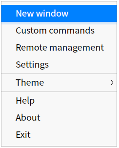
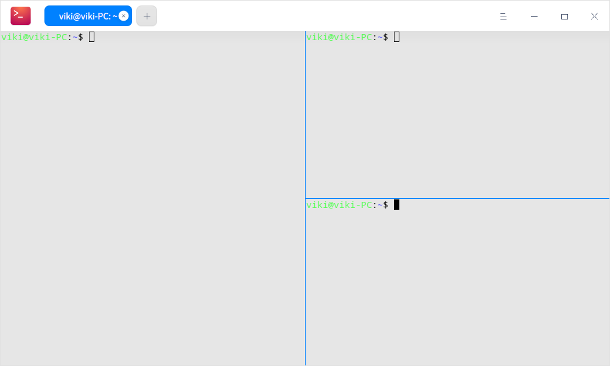
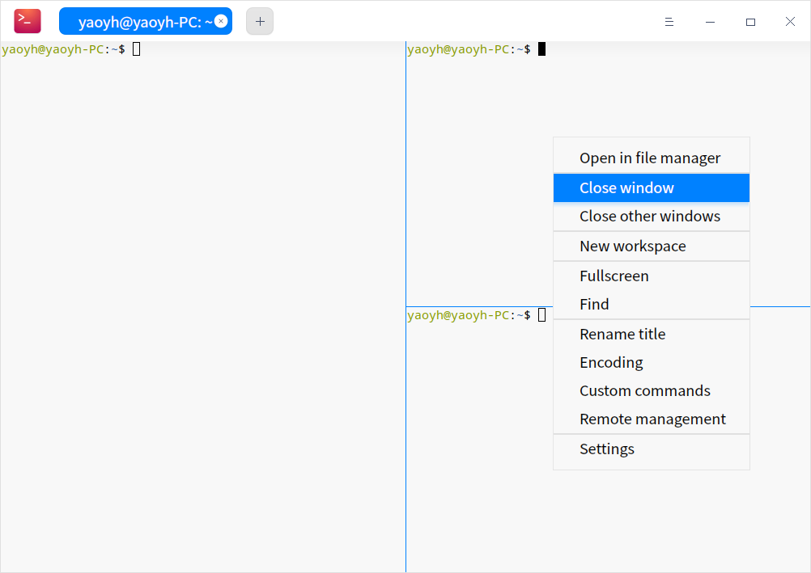
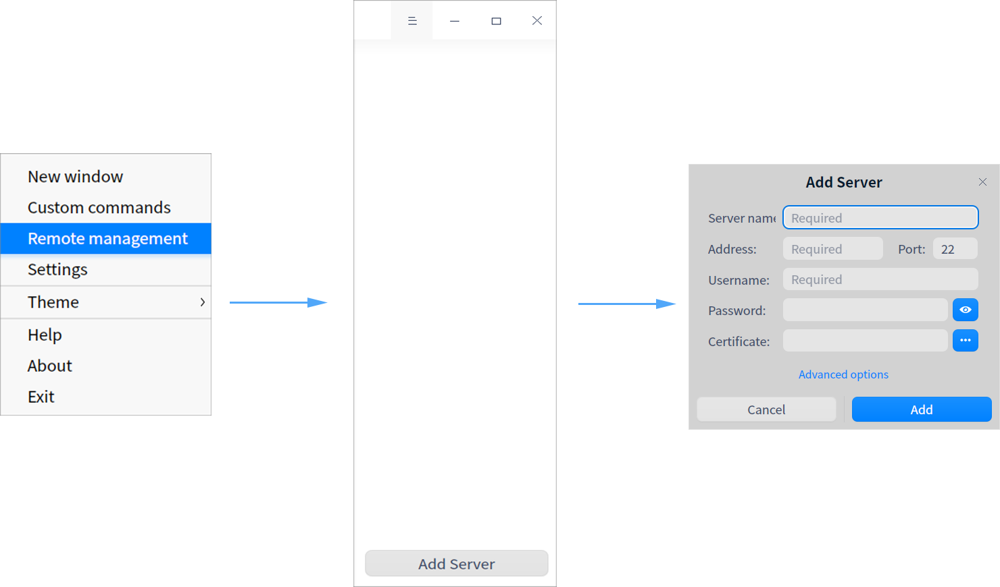
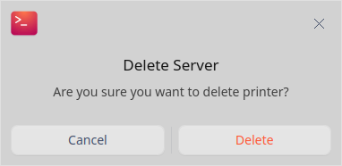

# Terminal|../common/deepin-terminal.svg|

## Overview

Terminal is a terminal emulator with simple interface providing diversified powerful functions including multi-windows, workspace, remote management, Quake mode, among others. You can instantly start and close Terminal smoothly like any normal file windows, refraining you from limitations and hassles while writing commands. Take a try of the Quake mode which enables you to browse other windows while inputting commands on one screen. When there are multiple tasks, you can add tabs in terminal to create more workspaces like in the browser or split the workspace into multiple windows. It's also a piece of cake to upload and download files with remote management. More powerful functions are waiting for you to explore!

## Guide

You can run, exit, and create shortcuts for Terminal in the following ways.

### Run Terminal 

1. Click the Launcher icon  in the dock to enter launcher interface.
2. Locate Terminal  by scrolling the mouse wheel or searching "terminal" in the Launcher interface and click it to run.
3. Right-click  to: 
 - Select **Send to desktop** to create a desktop shortcut.
 - Select **Send to dock** to fix it in the dock.
 - Select **Add to startup** to add the application to startup and it will automatically run when the system starts up.

>  Notes: You can also press **Ctrl** + **Alt** + **T** to open Terminal.

### Exit Terminal

1. On the Terminal interface, click   to exit.
2. Right-click  in the Dock and select **Close All** or **Force Quit** to exit.
3. On the Terminal interface, click  to select **Exit**.

>  Notes: A prompt will display when programs are still running in Terminal to avoid your data loss caused by forced shutdown.

### View Shortcuts

On the Terminal interface, press **Ctrl ** + **Shift** + **?** to view shortcuts. Proficiency in shortcuts will greatly improve your efficiency.

## Basic Operations

You can right-click on the Terminal interface for daily operations.

### Find 

You can use the **Find** function to quickly search contents in terminal.

1. Right-click on the Terminal interface to select **Find** or click the **Ctrl** + **Alt ** + **F** key on the keyboard.
2. Type the word in search box.
3. Press the **Enter** key on the keyboard and the search results will be highlighted.
4. Press **Esc** on the keyboard or click any blank area on the Terminal interface to hide search.

>  Tips: Press **Enter** to search down from the current location. You can also search by clicking  and  on the interface.

### Web Search 

You can use the browser in Terminal for quick and convenient web search against selected content on the Terminal interface. 

1. On the Terminal interface, select the content you want to search.
2. Right-click and select **Search**.
3. Select a search website.
4. Your browser will pop up and start searching based on the content you select on the Terminal interface.

### Copy/Paste 

- Copy
   - On the Terminal interface, select the content you want to copy and press **Ctrl** + **Shift** + **C**.
   - On the Terminal interface, select the content you want to copy, right-click, and select **Copy**.
- Paste
   - On the Terminal interface, press **Ctrl** + **Shift** + **V**.
   - On the Terminal interface, middle-click to paste.
   - On the Terminal interface, right-click, and select **Paste**.

> Tips: 
   > - If you want to copy a hyperlink, you don't need to select any content. Just simply copy it with a right-click.
   > - Check **Copy on select** in **Settings** under the main menu to copy the selected text to clipboard automatically.

### Select Quake Mode

Quake Mode is a unique function of Terminal. Press **Alt** + **F2** to open a quake window, and press again to hide it.

>  Tips: You can also right-click  in the Dock, and select **Quake Terminal** to open a quake window.

### Open Files and Applications 

On the Terminal interface, select the file in the current directory and right-click to **Open** it by system application.

1. On the Terminal interface, input **ls -al** to display files in current directory.
2. Double-click to select the file name.
3. Right-click and select **Open**.

### Adjust Encoding Method

When there is a messy code or display error, you may switch the encoding to solve it.

1. On the Terminal interface, right-click and select **Encoding**.
2. Select one encoding in the list to see if the content is correctly displayed.
3. Repeat Step 2 until you get correct display of content.

>  Notes: Usually, correct encoding methods are matched automatically in Terminal. Once any error appears under some special circumstances, you can adjust encoding methods manually. You can directly choose the correct encoding method if you are sure of it. If you are not sure, you can try multiple times. 

## Window Operations

Window serves as the foundation for your operations in Terminal. You can create many workspaces, or split one into multiple windows.

### Create Window

You can create a new window in the following ways:
  - Open Terminal and click > **New Window**.
  - Click  in the Dock to select **New Window**.

### Display Window in Fullscreen

1. Open Terminal in the launcher interface.

2. Press **F11** to display Terminal in fullscreen.

3. If you want to restore to the normal display, please press **F11**.

> Notes: You can also right-click to select **Fullscreen** or **Exit fullscreen** on the Terminal interface.

### Split Window

1. Open Terminal in Launcher.
2. Right-click on the Terminal interface.
  - Select **Vertical split** to split the interface into left and right columns.
  - Select **Horizontal split** to split the interface into top and bottom rows.
3. You can input commands in each terminal window, and view execution results of different commands in different windows simultaneously.

>  Tips: You can also press **Ctrl** + **Shift** + **J** on keyboard to split windows vertically, and press **Ctrl** + **Shift** + **H** to split windows horizontally.

### Close Window

You can close multiple split windows in the following steps:
1. On the Terminal interface, move the cursor over one of the split windows.
2. Right-click and you can:
  - Select **Close window** to close this split window.
  - Select **Close other windows** to close other split windows except for the current one.

## Workspace Operations

### Create Workspace

You can create new workspaces in the following ways:
  - On the Terminal interface, right-click and select **New workspace** to create a new workspace.
  - On the Terminal interface, Click  on the top to create a new workspace.
  - Press **Ctrl** + **Shift** + **T** on the keyboard to create a new workspace.

### Select Workspace

You can freely switch among different workspaces in the following ways:

  - Directly click the workspace tab to select a workspace.
  - Press **Ctrl** + **Tab** to switch in sequence.
  - Press **Ctrl** + **Shift** + **1~9** number keys to select the workspace. When there are more than 9 workspaces, pressing **Ctrl** + **Shift** + **9** will select the last workspace instead of the ninth one.

### Close Workspace

You can close workspace in the following ways:

1. Select the tab of one workspace, and click  to close it.
2. Right-click any workspace tab and:
  - Select **Close workspace** to close it.
  - Select **Close other workspaces** to close other workspaces other than the current one.

>  Tips: When there is only one window in the workspace, you can also right-click and select **Close window** to close the workspace.

### Rename Title

1. Open Terminal in Launcher.
2. On the Terminal interface, right-click and select **Rename title**.
3. Input the name and click **Confirm**.

>  Tips: You can also press **F2**  to rename the window.

## Remote Server Management

You can open the remote management panel to add remote servers via the main menu or the right-click menu. Once a remote server is added into the management list, you can automatically login just by one click. 

### Add Server

1. On the Terminal interface, click > **Remote management**.
2. Click **Add Server** and a pop-up box will display.
3. Fill out **Server name**, **Address**, **Username** and **Password**.
4. Click **Add**.

   >   Notes: If you need to set up more parameters, click **Advanced options**. 

### Edit Server

1. On the Remote Management interface, click  on the server.
2. Edit server information as needed.
3. Click **Save**.

>  Notes: For better identification and usage, you can also customize the server name.

### Group Servers

When you set a group for a server, it will be added in the corresponding group and displayed in the remote management panel on the right side.

1. On the terminal interface, click the **Add Server** icon to open the Add Server dialogue or click the icon beside an existing server to open the Edit Server dialogue.
2. Click **Advanced options**.
3. Input **Group** information.
4. Click **Save**.

### Search Server

When there are multiple servers or groups, the search box will be displayed on the top, so you can quickly search all servers.

1. On the Terminal interface, right-click and select **Remote management**. 
2. Input the keywords and press **Enter**.
3. The search results will be displayed.

### Upload/Download File

You can upload and download files after logging into a remote server.

#### Upload Files

1. On the Remote Management panel, select one server to log in.
2. On the Terminal interface, right-click and select **Upload file**.
3. Select the file to be uploaded in the pop-up window.
4. Click **Upload** and the file will be uploaded to the remote server.

#### Download Files

1. On the Remote Management panel, select one server to log in.
2. On the Terminal interface, right-click and select **Download file**.
3. Select the storage location.
4. Input the path of the file to be downloaded. The file will be downloaded to the specified location.

### Delete Server

1. Enter the **Edit Server** interface.
2. Click **Advanced options**.
3. Select **Delete Server**.
4. Click **Delete** on the pop-up window to confirm.

## Main Menu

In the Main Menu, you can [create new window](#Create Window), customize commands, switch themes, view help manual, and get more information about Terminal.

### Theme

The window theme provides three theme types, namely Light Theme, Dark Theme and System Theme .

1. On the Terminal interface, click .
2. Click **Theme** to choose one theme.

### Custom Commands 

1. On the Terminal interface, click  > **Custom commands**.
2. Select **Add Command**.
3. Input **Name**, **Command** and **Shortcuts**.
4. Click **Add**.

### Settings

#### Basic Settings

1. On the Terminal interface, click  > **Settings**.
2. In the **Basic** options, you can:
    - Set **Opacity** for the background.

    > Notes: if Window Effect is turned off in Control Center, the **Opacity** scroll bar will be hidden.
    
    - Set the type and size for font.

#### Shortcuts Settings

1. On the Terminal interface, click  > **Settings**.
2. In the **Shortcuts** options, you can:
    - Modify shortcuts: Click the shortcuts to be modified and input new shortcuts via the keyboard in the editable input box.
    - Disable shortcuts: Click the shortcuts to be modified and the input box will be editable.  Press **Backspace** on the keyboard to disable the shortcut.

#### Advanced Settings

1. On the Terminal interface, click > **Settings**.
2. In the **Advanced** options, you can:
    - Select **Cursor style**.
    - Enable or disable **Cursor blink**.
    - Enable or disable **Copy on select**.
    - Enable or disable **Scroll on keystroke**.
    - Enable or disable **Scroll on output**.
    - Set the startup mode for window .
    - Enable or disable **Hide Quake window after losing focus**.
    - Enable or disable **Blur background**.
    > Notes: if Window Effect is turned off in Control Center, **Blur background** option will be hidden.

3. **Restore Defaults**: Click this icon to restore to all default settings.

### Help

1. On the Terminal interface, click .
2. Click **Help** to view the manual of Terminal.

### About

1. On the Terminal interface, click .
2. Click **About** to view the version and introduction of Terminal.

### Exit

1. On the Terminal interface, click .
2. Click **Exit** to exit Terminal.

Update Date: 2021-04-09 Version: 5.3
