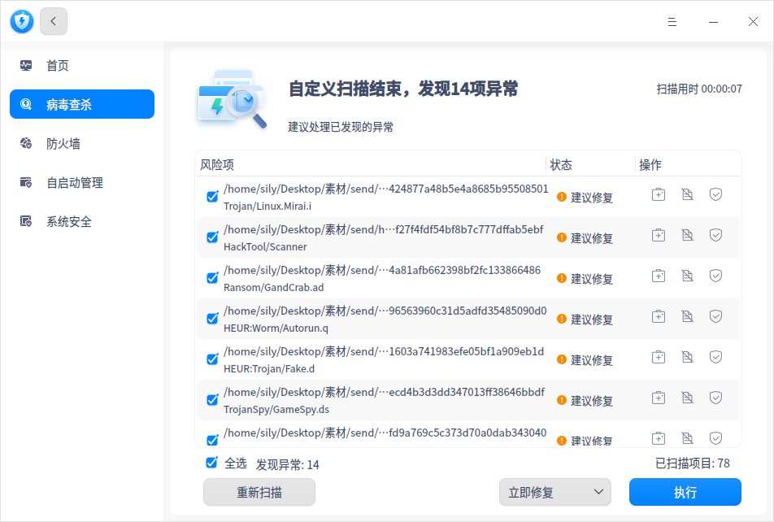
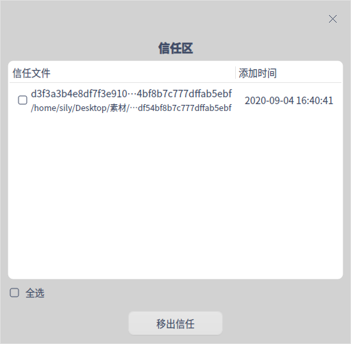
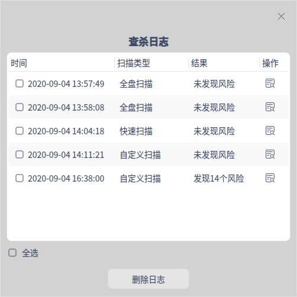
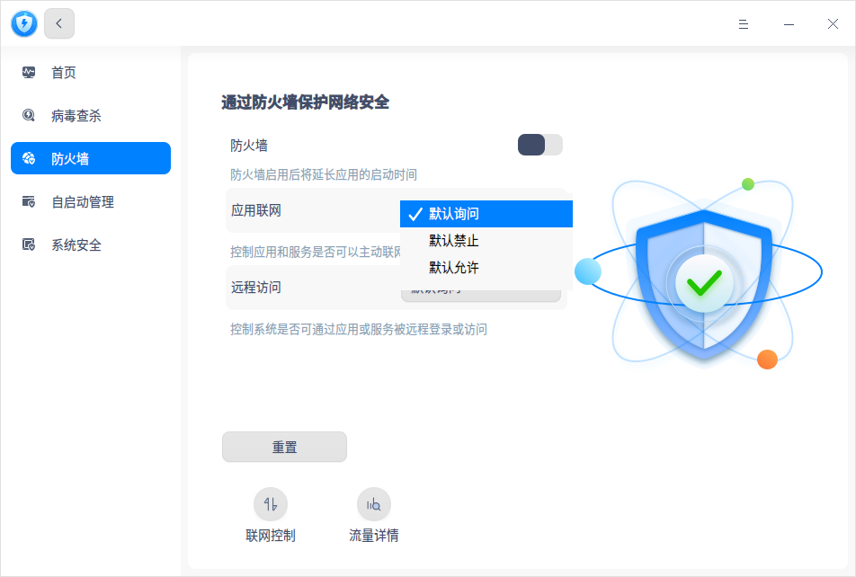
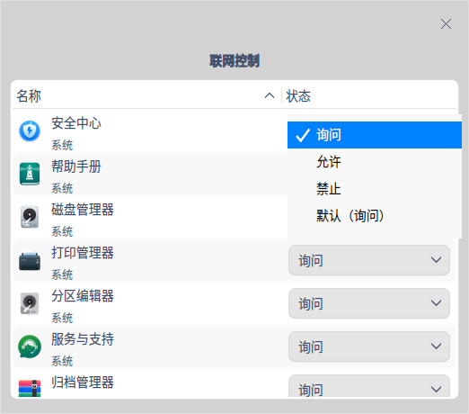
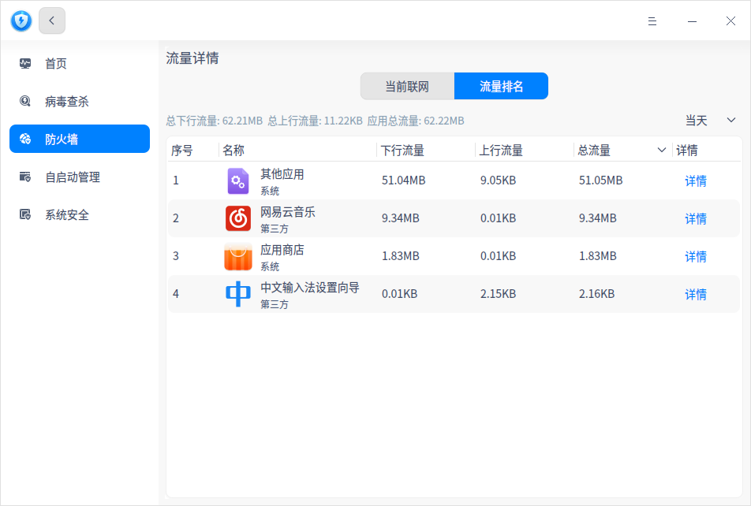
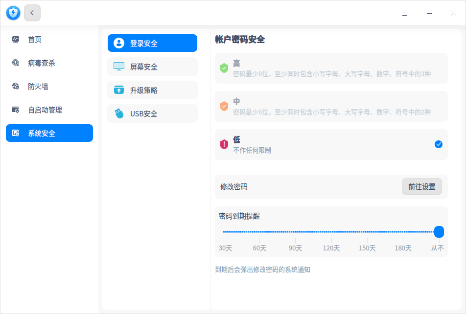
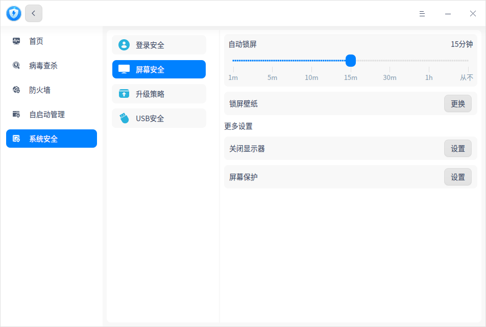
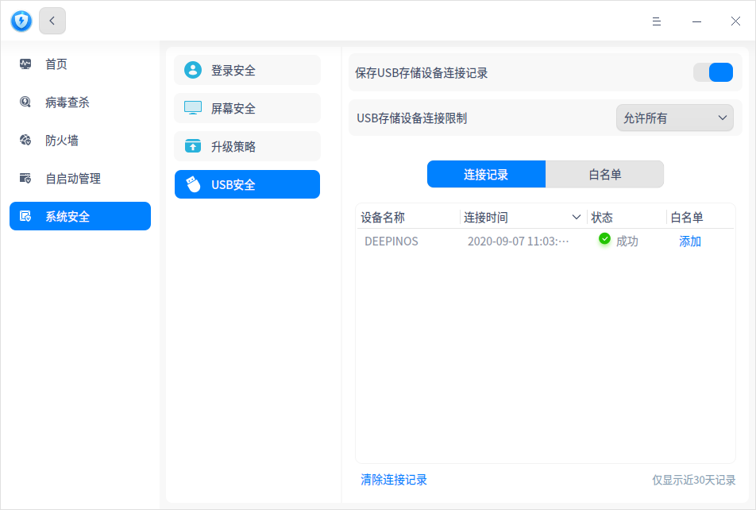
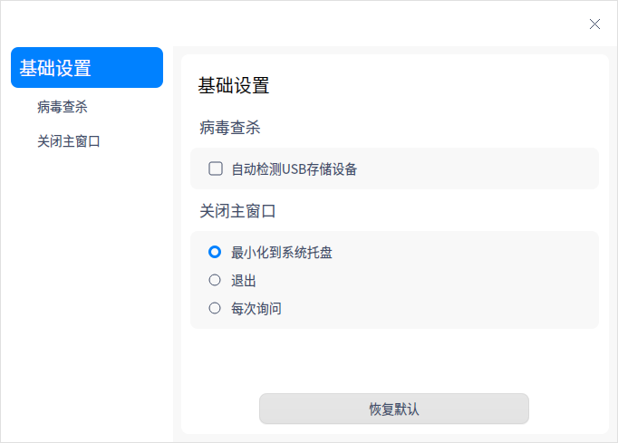

# 安全中心|../common/deepin-defender.svg|

## 概述

安全中心是一款提供系统体检、病毒查杀、防火墙、自启动管理、系统安全等功能的应用工具。

## 使用入门

您可以通过以下方式运行或关闭安全中心，或者创建快捷方式。

### 运行安全中心

1. 单击任务栏上的启动器 ，进入启动器界面。
2. 上下滚动鼠标滚轮浏览或通过搜索，找到安全中心   ，单击运行  。
3. 右键单击 ，您可以：
   - 单击 **发送到桌面**，在桌面创建快捷方式。

   - 单击 **发送到任务栏**，将应用程序固定到任务栏。

   - 单击 **开机自动启动**，将应用程序添加到开机启动项，在电脑开机时自动运行该应用程序。

### 关闭安全中心

- 在安全中心界面，单击，退出安全中心。
- 右键单击任务栏上的 图标，选择 **关闭所有** 来退出安全中心。
- 在安全中心界面单击  ，选择 **退出** 来退出安全中心。

## 操作介绍

### 首页体检

打开安全中心，选择左侧导航栏的 **首页**。在首页可以单击 **立即体检**，进行系统体检。

体检完后，可以根据系统的安全状况选择是否提升系统安全性，如帐户密码安全等级较低、未设置锁屏时间等，单击 **前往设置**，可重新设置。

### 病毒查杀
#### 病毒扫描

安全中心支持三种病毒扫描方式，分别为全盘扫描、快速扫描和自定义扫描。

1. 打开安全中心，选择左侧导航栏的 **病毒查杀**。在病毒查杀界面，根据需求选择病毒扫描方式，扫描完成后会显示扫描结果。

   

2. 根据扫描结果，可以对每个风险项单独操作，也可以选择批量操作。有以下几个操作项：

   修复：单击修复按钮  后，风险项被修复，下次扫描不会被判定为异常。

   隔离：单击隔离按钮  后，风险项被隔离，隔离后不会影响其他文件，下次扫描不会被判定为异常，可在隔离区查看。

   信任：单击信任按钮  后，风险项被信任，下次扫描不会被判定为异常，可在信任区查看。

   

#### 隔离区

在病毒查杀界面，单击 **隔离区**，查看隔离文件列表，还可以选择将文件移出隔离。

#### 信任区

在病毒查杀界面，单击 **信任区**，查看信任文件列表，还可以选择将文件移出信任。

#### 查杀日志

在病毒查杀界面，单击 **查杀日志**，查看每次病毒扫描的时间、扫描类型及结果。单击详情按钮 ，可查看日志详情，还可以选择删除日志。

#### 病毒库更新

每天都有新病毒产生，所以要定期更新病毒库，以满足计算机的安全需求。

在病毒查杀界面，如果有新的病毒库，在界面右下角单击 **有更新** 后，您可以选择是否更新病毒库。

### 防火墙

打开安全中心，选择左侧导航栏的 **防火墙**，在防火墙页面可以设置应用联网、远程访问及查看流量详情。

#### 全局设置

在防火墙界面，可针对所有的应用和服务进行应用联网和远程访问设置。还可以重置防火墙设置，执行后 **应用联网 **和 **远程访问** 恢复为默认选项 **默认询问**。

**防火墙开关**

防火墙开关主要控制应用联网及远程访问功能是否生效，但是不影响流量详情功能的使用，系统默认为关闭状态：

关闭：联网管控/远程访问管控功能都不生效。

开启：联网管控/远程访问管控功能生效，可以根据下文介绍进行设置。

**应用联网 **

控制所有应用和服务的默认联网设置，下拉框有三个选项。
1. 默认询问（默认选项）：应用每次主动联网的时候，给出提示 **xxx需要连接网络**，可以选择 **仅允许本次**、**始终允许** 或 **禁止**。 

   - 仅允许本次：不修改该应用的联网设置，本次允许联网。
   - 始终允许：修改该应用的联网设置为 **允许**，以后应用主动联网时不再提示，本次允许联网。
   - 禁止：不修改该应用的联网设置，本次不允许联网。

2. 默认禁止：应用每次联网的时候，给出提示 **防火墙已禁止xxx连接网络**，可以选择 **前往设置** 或 **确定**。

3. 默认允许：应用每次联网的时候，默认允许，不会弹框提示。

   

**远程访问 **

控制系统是否可通过应用或服务被远程登录或访问，下拉框有三个选项。

1. 默认询问（默认选项）：应用或服务开启端口监听时，给出提示 **xxx需要开启远程访问**，可以选择 **仅允许本次**、**始终允许** 或 **禁止**。 
   - 仅允许本次：不修改该应用远程访问的设置，本次允许远程访问。
   - 始终允许：修改该应用远程访问的设置为 **允许**，以后应用主动开启远程访问的时候不再提示，本次允许被远程访问。
   - 禁止：不修改该应用远程访问的设置，本次不允许被远程访问。
2. 默认禁止：应用或服务开启端口监听时，给出提示 **防火墙已禁止xxx开启远程访问**，可以选择 **前往设置** 或 **确定**。
3. 默认允许：应用每次开启远程访问的时候，默认允许，不会弹框提示。

**重置 **

在防火墙首页单击 **重置**，应用联网和远程访问都重置为默认选项 **默认询问**。

#### 联网控制

联网控制是设置启动器中单个应用联网的状态。在防火墙首页，单击 **联网控制**，每个应用或服务下拉框有四种选项。

- 询问：应用联网时给出提示，同“默认（询问）”。

- 允许：应用联网时默认允许，不会有提示信息，同“默认（允许）”

- 禁止：应用联网时给出提示，同“默认（禁止）”。

- 默认（xx）：对应应用联网的默认设置。

   > 窍门：名称和状态支持单击排序，升序：允许、询问、禁止、默认（xx），降序：禁止、询问、允许、默认（xx）。 

   

#### 流量详情

在防火墙首页，单击 **流量详情**，进入页面。流量详情页面包含 **当前联网** 和 **流量排名**。

- 当前联网页面展示所有启动中的应用，展示每个应用当前的下行网速、上行网速。单击管控按钮，跳转到联网控制页面。

   

- 流量排名页面，可以查看启动器里的所有应用的流量排名，包括下行流量、上行流量、总流量、流量时间分布详情。列表右上角支持切换时间跨度：当天、昨天、当月、上月。

    

### 自启动管理

打开安全中心，选择左侧导航栏的 **自启动管理**。自启动管理页面仅显示启动器里的应用，包括应用名称、自启动状态和操作按钮。每个应用可选择允许或禁止开机自启动。
 

### 系统安全
打开安全中心，选择左侧导航栏的 **系统安全**。进入系统安全页面可以设置帐户密码级别、屏幕保护、升级策略及USB连接。

#### 登录安全
在系统安全界面，选择 **登录安全**，进入密码设置界面。可以设置密码安全等级，还可以设置密码到期提醒时间，定期更换密码。
- 安全等级为 **高** 或 **中** ：在控制中心修改密码，或创建新用户设置密码时，若设置的密码不符合级别要求，会保存失败，您可以前往安全中心修改等级或重新设置密码。
- 安全等级为 **低** ：在控制中心修改密码，或创建新用户设置密码的时候，直接保存新设置的密码。

#### 屏幕安全

在系统安全界面，选择 **屏幕安全**，进入屏幕设置界面。可以设置自动锁屏时间，锁屏壁纸，电源设置和屏幕保护设置。

其中单击 "关闭显示器" 的 **设置** 按钮，界面会跳转到控制中心 **使用电源** 界面。

#### 升级策略

在系统安全界面，选择 **升级策略**，进入系统更新设置界面。可以查看当前系统版本是否最新、是否选择升级，也可以开启更新提醒和自动下载更新。

#### USB安全
在系统安全界面，选择 **USB安全**，进入USB设置界面。开启 **保存USB存储设备连接记录** 开关，可以查看带存储功能的 USB 设备连接电脑的记录。

还可以将常用的USB设备加入白名单，设置只允许白名单设备连接电脑，防止电脑数据泄露。

## 主菜单

在主菜单中，您可以进行基础设置，切换窗口主题，查看帮助手册等操作。

### 设置

1. 在安全中心界面，单击 。

2. 选择 **设置**，您可以进行以下操作：

   病毒查杀：勾选 **自动检测USB存储设备** ，病毒查杀时会自动检测USB存储设备。

   关闭主窗口：
      - 选择 **最小化到系统托盘**，关闭主窗口时，应用将隐藏到系统托盘。

      - 选择 **退出**，关闭主窗口时直接退出应用。

      - 选择 **每次询问**，每次关闭主窗口时会弹出确认弹窗。

   

3. 单击 **恢复默认**，可将当前页面恢复为默认设置。

### 主题

窗口主题包含浅色主题、深色主题和系统主题。

1. 在安全中心界面，单击。
2. 选择 **主题**，选择一个主题颜色。

### 帮助

1. 在安全中心界面，单击 。
2. 选择 **帮助**，查看帮助手册，进一步了解和使用安全中心。

### 关于

1. 在安全中心界面，单击 。
2. 选择 **关于**，查看安全中心的版本和介绍。

### 退出

1. 在安全中心界面，单击 。
2. 选择 **退出**。

文档更新时间: 2021-05-17 版本: 2.1
