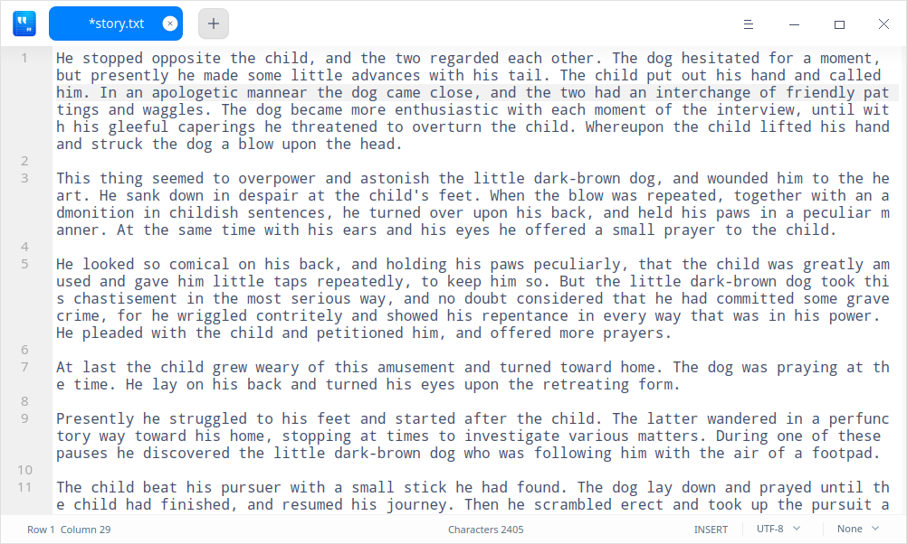
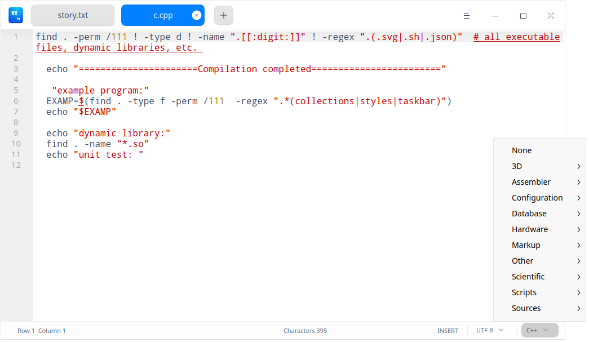
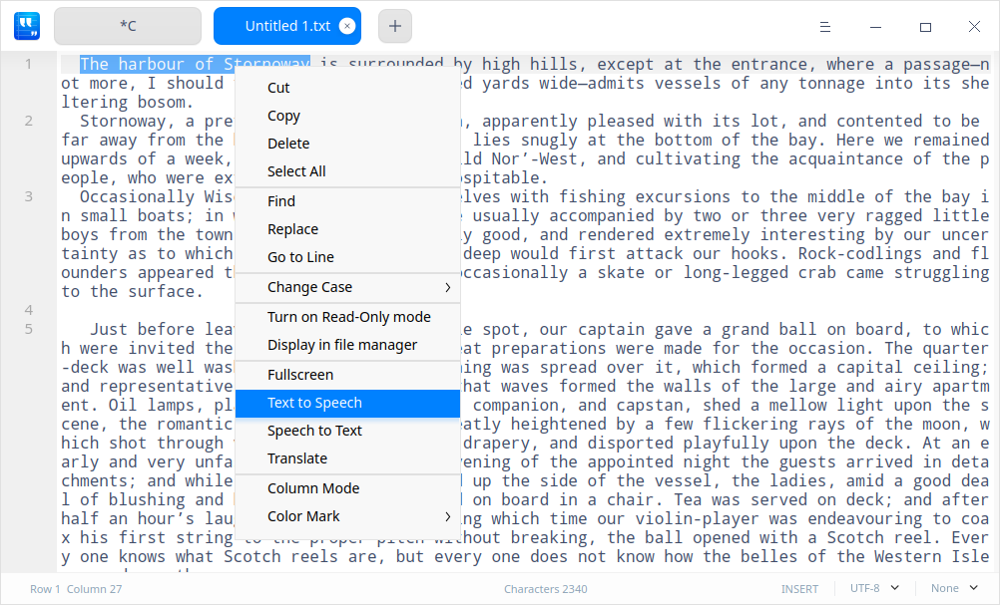
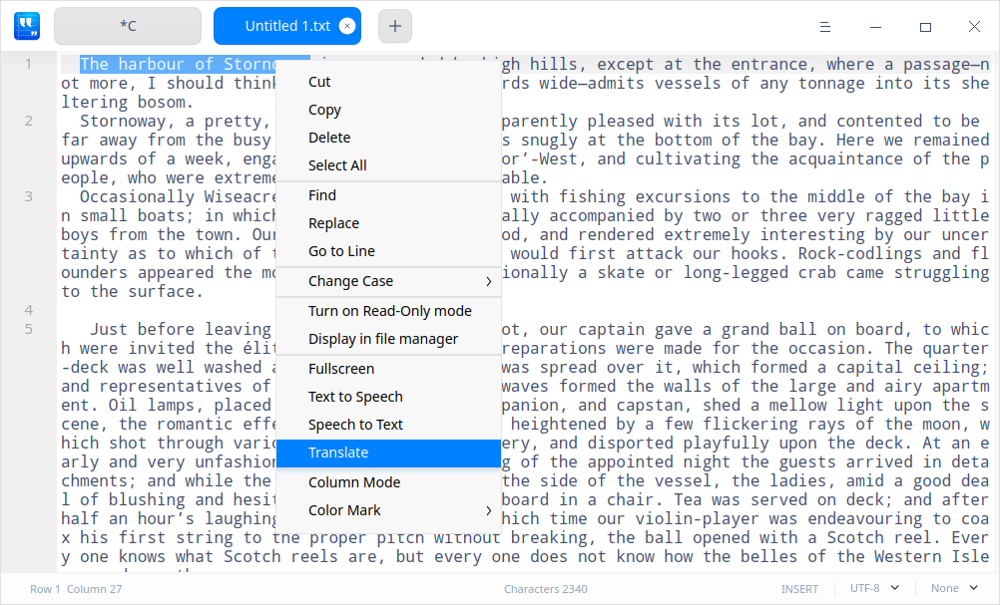

# Text Editor|../common/deepin-editor.svg|

## Overview

Text Editor is a simple text editing tool. You can use it to write a simple text document, or make it a code editing tool with its advanced features which support code syntax highlighting.

## Guide

### Run Text Editor

1. Click the Launcher icon  in the Dock to enter the Launcher interface. 
2. Locate Text Editor  by  scrolling the mouse wheel or searching "text editor" in the Launcher interface, and click it to run.
3. In Launcher, right-click Text Editor to:
  - Click **Send to desktop** to create a desktop shortcut.
  - Click **Send to dock** to fix it in the Dock.
  - Click **Add to startup** to add the application to startup, and it will automatically run when the system starts up.

### Exit Text Editor

- On the Text Editor interface, click  to exit.
- On the Text Editor interface, click > **Exit** to exit.
- Right-click  in the Dock, and select **Close All** to exit.

### View Shortcuts

On the Text Editor Interface, press **Ctrl** + **Shift** + **?** to view all the shortcuts. You can also check shortcuts in the Settings. Proficiency in shortcuts will greatly improve your efficiency.

## Basic Operations

### Manage Tabs

- Create New Tabs/Windows
  - Click  or > **New tab** on the title bar or press **Ctrl + T** to create a new tab.
  - Click > **New window** or press **Ctrl + N** to create a new window.

- Adjust Tabs/Windows
  - Drag the tab in the same window to reorder tabs.
  - Scroll the mouse wheel on the title of a tab to reorder tabs in the same window.
  - Move the tab out of the window to create a new window or move the tab from one window to another.

- Close Tabs /Windows

  The window will be closed as well when there is only one tab in the window.

  - Press **Ctrl + W** to close the file on the file interface.
  - Move the cursor to the file title, and click the  icon there or the mouse middle button to close the file.
  - Right-click the file title and select **Close tab** or **Close other tabs** or **More options** to close the tabs.

>  Notes: If you make changes to the file but does not save it, you will be prompted by Text Editor to save before closing the file.

### Open Files

You can open one or multiple text files at one time in the following ways, and the selected file will open in the new tab:

- Drag the file directly to the Text Editor interface or the Text Editor icon.
- Right-click the file and Select **Open with** > **Text Editor**. After selecting Text Editor as the default application for text files in Control Center, you can double-click the file to open it directly.
- On the Text Editor interface, click > **Open file** or use the shortcuts **Ctrl + O** to open the file in File Manager.

### Save Files

- Press the shortcuts **Ctrl + S** or click > **Save** to save the current document.
- Press the shortcuts **Ctrl + Shift + S** or click > **Save as** to save the file as a new one.

### Print Files

To print a file in the Text Editor interface, you should connect and set up the printer first.

1. Click > **Print**, or press **Ctrl + P** to open the print preview interface.
2. On the preview interface, preview the document, select a printer, and set the printing page. 
3. Click the **Advanced** option on the preview interface to select parameters including paper size and layout. 
4. Click **Print** to start printing at the printer selected.

## Edit Texts

### Move Cursor

In addition to the arrow keys and mouse clicks, you can also use the following shortcuts to move the cursor quickly:

| Function   |  Shortcuts |
| --------------- | ------------ |
| Save cursor position | Ctrl + Shift + > |
| Reset cursor position (Jump to cursor last saving position) | Ctrl + Shift + < |
| Forward one word (Jump forward over one word) | Ctrl + Right |
| Backward one word (Jump backward over one word) | Ctrl + Left |
| Move to end of line | End |
| Move to start of line | Home |
| Move to end of text | Ctrl + End |
| Move to start of text | Ctrl + Home |
| Move to line indentation | Ctrl + M |
| Forward over a pair (Jump forward after the right parenthesis) | Alt + P |
| Backward over a pair (Jump backward before the left parenthesis) | Alt + N |

### Change Cases

It helps you change the case of selected text. You can change it to lowercase, uppercase, or capitalize the initial.

1. Select the text.
2. Right-click and select **Change Case**.
3. Choose **Upper Case**, **Lower Case**, or **Capitalize**. The changes will take effect immediately.

You can also use **Alt** + **U/L/C** to quickly switch the cases.

### Highlight Texts
Text Editor supports highlighting different kinds of texts.

Click the  triangle symbol at the far right corner of the status bar at the bottom, and select the type of text you want to highlight. The corresponding contents in the text will be highlighted automatically.

### Delete Texts

In addition to deleting characters one by one, you can quickly delete characters by using the following shortcuts:

| Function   |  Shortcuts |
| --------------- | ------------ |
| Delete to end of line | Ctrl + K |
| Delete current line | Ctrl + Shift + K |
| Delete one word backward | Alt + Shift + N |
| Delete one word forward | Alt + Shift + M |

### Undo

If you make an incorrect operation, press **Ctrl + Z** to undo it, or right-click and select **Undo**.

### Find Texts

1. Click  > **Find**, or press **Ctrl + F** to open the **Find** box in the bottom of the Text Editor interface.
2. Input the text you want to find. 
3. Click **Previous**/**Next** to find each match, or press the **Enter** key to find the next match.
4. Press the **Esc** key or click the close icon to close the dialog box.

> Tips: Select the text and conduct search. The text selected will be automatically displayed in the **Find** box.

### Replace Texts
1. Click  > **Replace**, or press **Ctrl + H** to open the **Replace** box  in the bottom of the Text Editor interface.
2.  Input the text to be replaced and the new text.
3.  Click **Replace** to replace the matches one by one, and click **Replace Rest** and **Replace All** to replace the rest or all the matches at once. Click **Skip** to skip the current matching text.
4.  Press **Esc** or click the close icon to close the dialog box.

### Go to Line
Use Go to Line to jump to the specific line directly.

Right-click and select **Go to Line**; or press **Ctrl + G**, and then input the line number to go to that line.

### Edit Line

Use the shortcuts below to edit lines easily:

| Function  |  Shortcuts |
| ------------ | ------------ |
| New line above (Insert one line above) | Ctrl + Enter |
| New line below (Insert one line below) | Ctrl + Shift + Enter |
| Duplicate line | Ctrl + Shift + D |
| Swap line up (Swap the current line with above line) | Ctrl + Shift + Up |
| Swap line down (Swap the current line with below line)  | Ctrl + Shift + Down |
| Scroll up one line | Super + Shift + Up |
| Scroll down one line | Super + Shift + Down |
| Mark | Alt + H |
| Unmark | Alt + Shift + H |
| Copy line | Super + C |
| Cut line | Super + X |
| Merge lines | Ctrl + J |

### Enable/Disable Read-only Mode

1. Open the document with Text Editor, right-click on the Text Editor interface, and select **Turn on Read-Only mode**.

&nbsp;&nbsp;&nbsp;&nbsp;&nbsp;&nbsp;&nbsp;&nbsp;&nbsp;&nbsp;&nbsp;&nbsp;&nbsp;

2. Right-click on the Text Editor interface, and select **Turn off Read-Only mode** under the read-only mode.

### Text to Speech  

You can perform the following operations after enabling the Text to Speech and Speech to Text features in the Control Center.

1. Right-click and select **Speech to Text**. The input voices through microphone will be converted to texts and can be edited in the document.
2. Select a paragraph of texts. Right-click it and select **Text to Speech**. The texts selected will be broadcast.

>  Notes: The **Text to Speech** option in the right-click menu is grayed out and cannot be activated when no text is selected.

### Translate
1. Enable **Translation** in **Control Center** > **Assistive Tools** and set the corresponding language pairs according to your needs. 
2. Select the texts to be translated in Text Editor. Right-click and select **Translate**, and the texts selected will be translated into the target language.

### Use Column Mode

Press and hold the **Alt** key on the keyboard, drag the mouse to select multiple lines, and edit the identical contents in multiple lines of codes efficiently by using the column mode function. 

### Color Mark

Select the text to be marked in Text Editor, right-click to select **Color Mark**, and select the corresponding options in the drop-down list as needed.

&nbsp;&nbsp;&nbsp;&nbsp;&nbsp;&nbsp;&nbsp;&nbsp;&nbsp;&nbsp;&nbsp;&nbsp;&nbsp;

- Select **Mark** to mark a certain line or a paragraph of texts. You can choose from 8 colors displayed through icons.
   - Place the cursor at any line and you can mark the current line.
   - Select a paragraph of texts and you can mark the selected texts.
- Select **Mark All** to mark all the contents in Text Editor, or mark all the matching contents of selected texts in Text Editor. You can choose from 8 colors displayed through icons.
   - Place the cursor at any line and you can mark all contents.
   - Select any content and you can mark the same content in the whole document. 
- Select **Clear Last Mark** to cancel the last mark operation.
- Select **Clear All Marks** to cancel all the current marks.

### Manage Bookmark 

You can add a bookmark for any current line on the Text Editor interface. The icon  shows up when you move the cursor to any line in the left column, and the icon  will appear after a bookmark is successfully added.

- Add bookmark
   + Click  to add a bookmark for the line.
   + Right-click  and select **Add bookmark** to add a bookmark for the line.
   + Place the cursor on any line, and press **Ctrl + F2** to add a bookmark for the line.

-   Delete bookmark 
   + Click the colored bookmark icon  to delete the bookmark of the line directly.
   + Right-click the colored bookmark icon  , and select **Remove Bookmark** to delete the bookmark in the line.
   + Right-click a bookmark, and select **Remove All Bookmarks** to delete all the bookmarks in the text.
  > Notes: The bookmark icon appears only when cursor is hovered over to the left of the line number in the left column; when it's moved beyond the left bookmark column, the bookmark icon will disappear. Click the icon when it appears and it will be filled with color, after which this filled color icon will remain no matter if the cursor hovers near the bookmark column.

### Manage Comment 

You can add comments to any text with a code type suffix, such as cpp and java, among others.

- Add comment
  - Select the text needed, and right-click to select **Add Comment**.
  - Select the text needed, and press **Alt + A** to add comment.

- Cancel comment
  - Select the text with comments, and right-click to select **Remove Comment**.
  - Select the text with comments, and press **Alt + Z** to cancel comment.

>  Notes: This supports comments in different languages. Please refer to actual conditions for detailed information. For example, comment symbol for C, C# and Java is //, and comment symbol for Python is #.

## Main Menu

On the main menu, you can create new windows, create new files, [Find Texts](#Find Texts), [Replace Texts](#Replace Texts), [Save Files](#Save Files), switch window themes, view help manual, and get more information about Text Editor.

### Settings

You can set the basic information, shortcuts, and advanced information in settings.

#### Basic Settings

Click > **Settings** and you can perform the following in the **Basic** option:

- Select the Font and Font Size.
- Check or uncheck **Word wrap**.
- Check **Code folding flag** and  or  are displayed in the edit area. Right-click and select **Fold/Unfold Current Level** or **Fold/Unfold All** to perform the corresponding operations.
- Check **Show line numbers** to display the line number in the edit area.
- Check **Show whitespaces and tabs** to display all the white spaces and tabs. You can also input or delete white spaces and tabs manually.

>  Tips: You can also use **Ctrl + “+”/ “-” ** to adjust the font size, and press **Ctrl + 0** to restore to default font size.

#### Shortcuts Settings
1. Click > **Settings** to view the current shortcut in the **Shortcuts** option.
2. Select a keymap in **Shortcuts** and view the shortcuts.
3. You can click and customize new shortcuts.

>  Notes: You can choose a proper keymap to fit your habits, including standard keymap, Emacs keymap, or customize it as you like.

#### Advanced Settings

1. Click > **Settings**.
2. In the **Advanced** option, you can set:
   - Window size: Normal, Maximum, or Fullscreen;
   - Tab width: The width of a tab character.

### Theme

The window theme provides three theme types, namely Light Theme, Dark Theme, and System Theme.

1. On the Text Editor interface, click .
2. Click **Theme** to select one theme.

### Help

1. On the Text Editor interface, click .
2. Select **Help** to view the manual of Text Editor.

### About

1. On the Text Editor interface, click .
2. Select **About** to view the version and introduction of Text Editor.

### Exit

1. On the Text Editor interface, click .
2. Click **Exit** to exit Text Editor. 

Update Date: 2021-06-23 Version: 5.9
