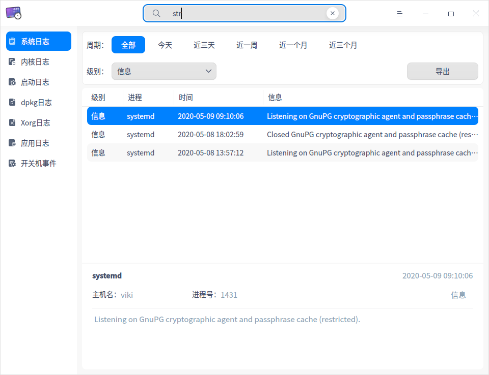
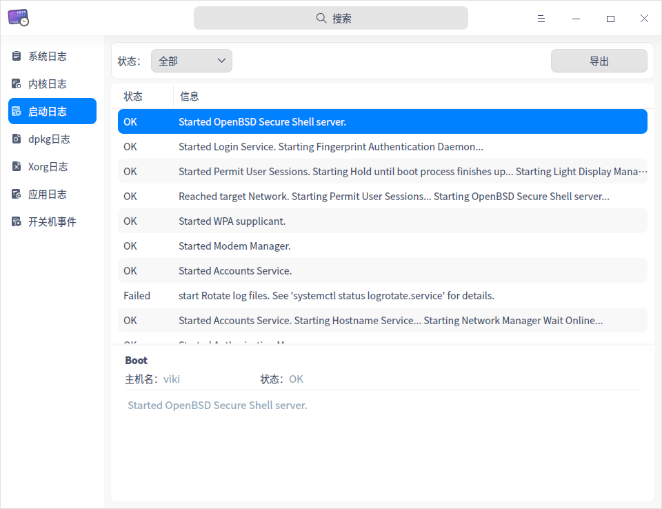
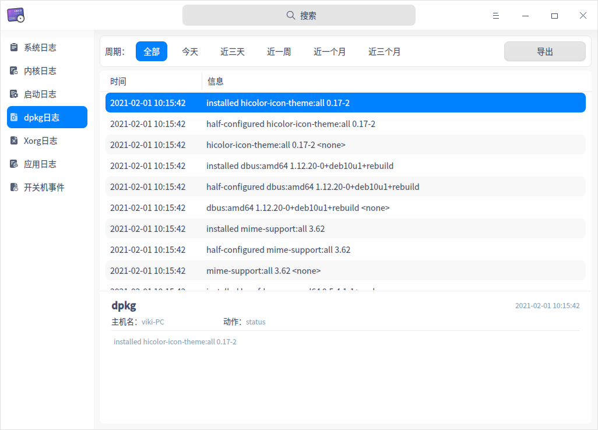
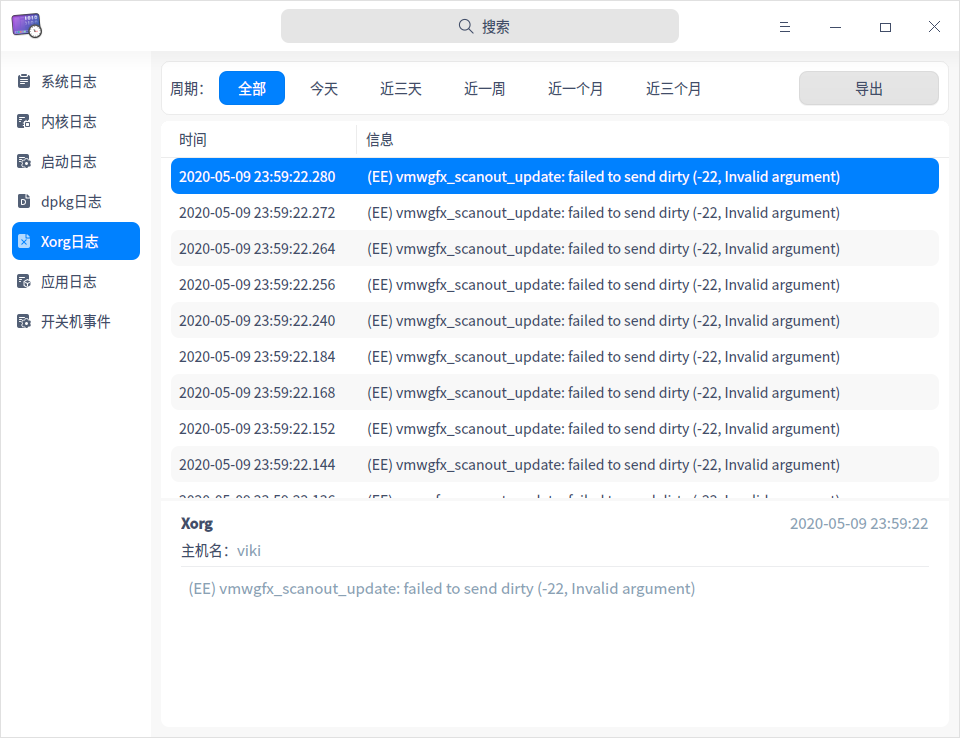
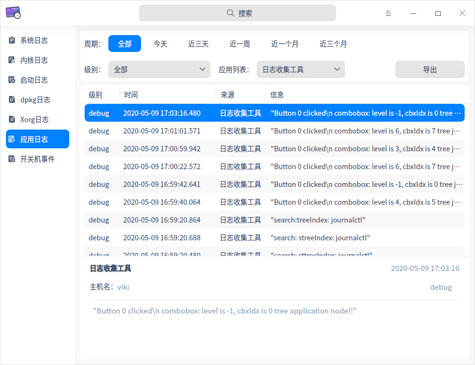

# 日志收集工具|../common/deepin-log-viewer.svg|

## 概述

日志收集工具是负责收集程序运行时所产生日志的小工具，如操作系统和应用程序在启动、运行等过程中的相关信息。您可以通过分析详细日志信息，快速的找到故障原因并解决问题。

## 使用入门

您可以通过以下方式运行或关闭日志收集工具，或者创建快捷方式。

### 运行日志收集工具

1. 单击任务栏上的 进入启动器界面。
2. 上下滚动鼠标滚轮浏览或通过搜索找到   ，单击运行日志收集工具。
3. 右键点，您可以：
   - 单击 **发送到桌面**，在桌面创建快捷方式。

   - 单击 **发送到任务栏**，将应用程序固定到任务栏。

   - 单击 **开机自动启动**，将应用程序添加到开机启动项，在电脑开机时自动运行该应用程序。

### 关闭日志收集工具

- 在日志收集工具界面，单击   ，退出日志收集工具。
- 右键单击任务栏上的   图标，选择 **关闭所有** 来退出日志收集工具。
- 在日志收集工具界面单击  ，选择 **退出** 来退出日志收集工具。

## 操作介绍

### 搜索

1. 日志收集工具支持两种搜索方式：文字搜索和语音搜索。

   - 文字搜索：单击，输入关键字；

   - 语音搜索：单击， 输入语音，语音会转化为文字显示在搜索框中；

2. 输入成功后，界面显示搜索结果；如果没有发现匹配的服务时，在列表中间显示 **无搜索结果**。

3. 单击  ，则清空搜索内容。

### 筛选器

筛选器包括：**周期**、**级别**、**状态**、**应用列表** 及 **事件类型**。
- 按周期筛选：按照日志的生成的时间顺序进行筛选的方式。

  选项包括：全部、今天、近三天、近一周、近一个月、近三个月，默认选项为全部。

  适用类型：除了启动日志没有显示时间外，其他类型的日志都支持按周期筛选。

- 按级别筛选：按照事件的级别高低进行筛选的方式。

  选项包括：全部、紧急、严重警告、严重、错误、警告、注意、信息、调试，默认选项为信息；

  适用类型：系统日志、应用日志。

- 按状态列表筛选：

  仅适用于启动日志，选项包括：全部、OK、Failed，默认选项为全部。

- 按应用列表筛选：

  仅适用于应用日志，对应用程序的log文件进行筛选，默认选项为第一个log文件。
  
- 按事件类型筛选：
  
  仅适用于开关机事件，选项包括：全部、登录、开机，关机，默认选项为全部。

### 系统日志

1. 在日志收集工具界面，单击 **系统日志 **。
2. 界面显示系统日志列表，显示字段为级别、进程、时间和信息。
3. 选中某条日志后，列表下方会显示该日志的详细信息，包括日志进程、主机名、进程号、级别、时间和详细信息。

### 内核日志

1. 在日志收集工具界面，单击 **内核日志 **。
2. 界面显示内核日志列表，显示字段为时间、主机名、进程和信息。
3. 选中某条日志后，列表下方会显示该日志的详细信息，包括时间、主机名、进程和详细信息。

### 启动日志

1. 在日志收集工具界面，单击 **启动日志 **。
2. 界面显示启动日志列表，显示字段为状态和信息。
3. 选中某条日志后，列表下方会显示该日志的详细信息，包括进程、主机名、状态和详细信息。

### dpkg日志

1. 在日志收集工具界面，单击 **dpkg日志 **。
2. 界面显示dpkg日志列表，显示字段为时间和信息。
3. 选中某条日志后，列表下方会显示该日志的详细信息，包括进程、主机名、动作、时间和详细信息。

### Xorg日志

1. 在日志收集工具界面，单击 **Ｘorg日志 **。
2. 界面显示Xorg日志列表，显示字段为时间和信息。
3. 选中某条日志后，列表下方会显示该日志的详细信息，包括进程、主机名、时间和详细信息。

### 应用日志

1. 在日志收集工具界面，单击 **应用日志 **。
2. 界面显示应用日志列表，显示字段为级别、时间、来源和信息。
3. 选中某条日志后，列表下方会显示该日志的详细信息，包括来源、主机名、时间、级别和详细信息。

> 

### 开关机事件

1. 在日志收集工具界面，单击 **开关机事件 **。
2. 界面显示开关机事件列表，显示字段为事件类型、用户名、时间和信息。
3. 选中某条日志后，列表下方会显示该日志的详细信息，包括主机名、事件类型、用户名和详细信息。

> 

> ：在查看日志的过程中，如果有弹框出现 **查看日志需要授权** 界面，输入登录密码即可继续查看。

### 导出

用户可以将当前日志导出为文件进行保存，支持导出的文件格式为txt/doc/xls/html。

1. 在日志收集工具界面，单击**导出**。
2. 弹出系统文件管理器界面，编辑文件名，选择好格式。
3. 单击 **保存**，完成操作。

## 主菜单

在主菜单中，您可以进行切换窗口主题，查看帮助手册等操作。

### 主题

窗口主题包含浅色主题、深色主题和系统主题，其中系统主题为默认设置。

1. 在日志收集工具界面，单击。
2. 单击 **主题**，选择一个主题颜色。

### 帮助

查看帮助手册，通过帮助进一步让您了解和使用日志收集工具。

1. 在日志收集工具界面，单击 。
2. 单击 **帮助**。
3. 查看关于日志收集工具的帮助手册。

### 关于

1. 在日志收集工具界面，单击 。
2. 单击 **关于**。
3. 查看关于日志收集工具的版本和介绍。

### 退出

1. 在日志收集工具界面，单击 。
2. 单击 **退出**。

