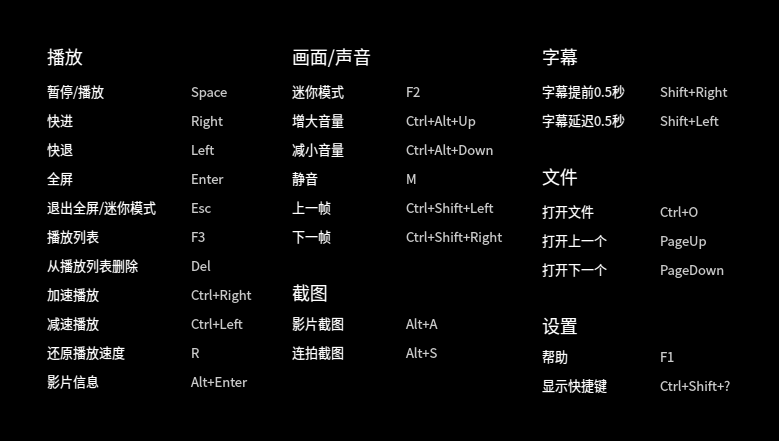
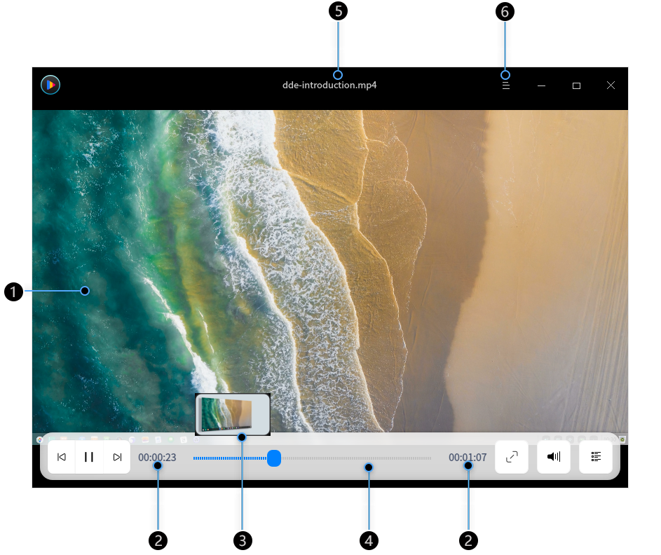
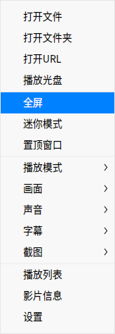
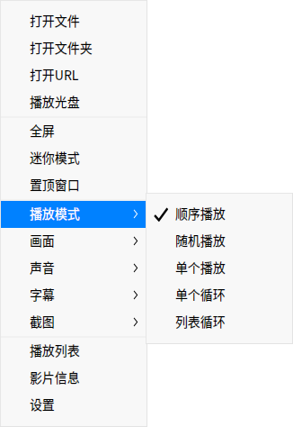
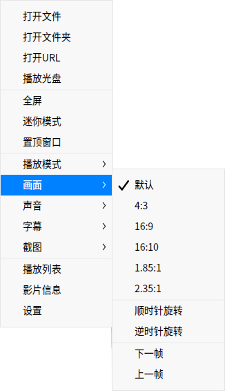
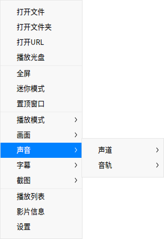
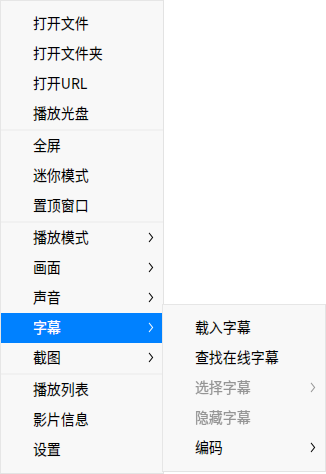
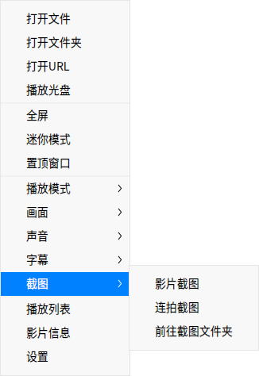
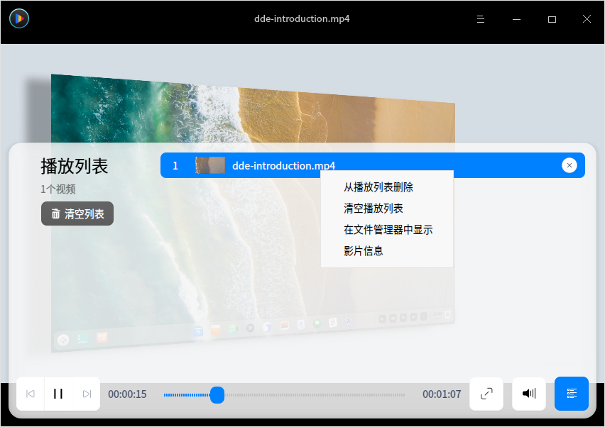

# 影院|../common/deepin-movie.svg|

## 概述

影院是一款界面简洁，性能流畅的视频播放软件，兼容多种视频格式，支持播放本地视频或流媒体文件、在线查找字幕或手动加载字幕等功能。

## 使用入门

### 运行影院

1. 单击任务栏上的启动器图标 ，进入启动器界面。
2. 上下滚动鼠标滚轮浏览或通过搜索，找到影院图标 ，单击运行。
3. 右键单击 ，您可以：
 - 单击 **发送到桌面**，在桌面创建快捷方式。
 - 单击 **发送到任务栏**，将应用程序固定到任务栏。
 - 单击 **开机自动启动**，将应用程序添加到开机启动项，在电脑开机时自动运行该应用。

### 关闭影院
- 在影院界面单击  ，退出影院。
- 在任务栏右键单击 ，选择 **关闭所有**，退出影院。
- 在影院界面单击 ，选择 **退出**，退出影院。

### 查看快捷键

在影院界面，使用快捷键 **Ctrl + Shift + ?** 打开快捷键预览界面。熟练地使用快捷键，将大大提升您的操作效率。

 

## 主界面

| 标号 | 名称     | 说明                                                         |
| ---- | -------- | ------------------------------------------------------------ |
| 1    | 播放窗口 | 显示视频内容，当鼠标指针移入播放窗口后将显示标题栏和工具栏，当鼠标移出播放窗口或无操作时将隐藏标题栏和工具栏。播放窗口为无框模式，您可以任意拖拽播放窗口，手动调节播放窗口的大小。 |
| 2    | 时间显示 | 显示当前播放视频的时间总长和已经播放的时间信息。             |
| 3    | 预览窗口 | 显示视频内容，通过预览窗口查看某一时间点的视频内容。         |
| 4    | 进度条   | 显示视频播放进度，拖拽进度条可以改变视频播放进度。将鼠标指针置于进度条上，将显示视频预览窗口。 |
| 5    | 标题栏   | 显示正在播放的视频名称。                                     |
| 6    | 主菜单  | 通过主菜单可添加影片、设置影片、切换窗口主题、查看帮助手册和版本信息等。                      |

> 说明 ：当鼠标置于进度条上时，默认显示预览窗口。若要关闭预览窗口，请在设置中取消勾选 **鼠标悬停进度条时显示预览**。

### 工具栏介绍

| 图标                                                       | 名称              | 图标                                                      | 名称           |
| ---------------------------------------------------------- | ----------------- | --------------------------------------------------------- | -------------- |
|      | 播放上一个影片    |     | 播放下一个影片 |
|      | 开始播放影片      |  | 暂停播放影片   |
|   | 全屏播放          |  |  退出全屏      |
|   | 调节音量       ||呼出/隐藏播放列表|

## 操作介绍

### 添加影片

您可以通过以下方式来添加影片：
- 当播放列表没有文件时，单击  或  按钮，打开文件管理器选择影片文件。
- 单击鼠标右键或从选择 **打开文件**，打开文件管理器选择影片文件。
- 单击鼠标右键或从选择 **打开文件夹**，文件夹中的影音文件将全部显示在播放列表中，并依次进行播放。
- 单击鼠标右键，选择 **打开URL**，输入视频文件的网络地址，播放影片。
- 单击鼠标右键，选择 **播放光盘**，播放光盘中的影片。
- 直接拖拽文件或文件夹到影院界面上，来添加本地影片。
  
>  说明：当使用触控屏电脑时，一指按住影片文件拖拽到影院界面来播放影片。

>  注意 ：使用影院播放网络视频时，请确保您的电脑是连网状态。

### 快进/快退

- 在影院界面，鼠标拖动进度条来快进或快退视频。
- 在影院界面，按下键盘上的  快进视频或 键快退视频。
> 说明 ：当使用触控屏电脑时，在全屏状态下，一指向左滑动视频区域快退视频，一指向右滑动视频区域快进视频。

### 加速/减速播放

- 在影院界面，按下键盘上的 **Ctrl** +键，视频加速播放。

- 如果要减速播放，请按下键盘上的 **Ctrl** +键。

- 如果要恢复原速播放，请按下键盘上的  键。

> 说明 ：加速/ 减速播放是相对于原播放速度而言的，每加速/减速一次，视频播放速度默认增加/减少0.1 倍。如果按住键盘上的 **Ctrl** + 或  键不放，视频播放速度将递增或递减。最高播放速度为2倍的原播放速度，最低播放速度为0.1倍的原播放速度。

### 调整播放窗口

您可以灵活地调整播放窗口大小，在影院界面，单击鼠标右键：

- 选择 **全屏**，将影院窗口调整为全屏。
- 选择 **迷你模式**，将影院窗口调整为迷你模式。
- 选择 **置顶窗口**，将影院窗口置顶到最前面，操作其他窗口时也不会遮挡影院窗口。
- 您也可以使用鼠标拖拽窗口边缘，自由调整窗口大小。

> 说明 ：在影院窗口上双击鼠标，在全屏与正常窗口之间切换。

### 调整播放模式

1. 在影院界面，单击鼠标右键。
2. 选择 **播放模式**，在下拉菜单中：
 - 选择 **顺序播放**，影院将按照播放列表顺序依次播放影片，当列表中最后一个影片播放结束后停止。
 - 选择 **随机播放**，影院将随机播放列表中的影片，当全部影片随机播放一遍之后继续循环随机播放。
 - 选择 **单个播放**，影院将当前影片播放完成后停止。
 - 选择 **单个循环**，影院将循环播放当前影片。
 - 选择 **列表循环**，影院将按照播放列表顺序依次播放影片，当列表中最后一个影片播放结束后重新播放第一个影片。

### 调整画面
1. 在影院界面，单击鼠标右键。
2. 选择 **画面**，在下拉菜单中：
 - 选择画面比例，将播放画面调整成相应的比例。
 - 选择旋转方式，将播放画面顺时针或逆时针旋转。
 - 选择上一帧/下一帧。

### 调整声音

1. 在影院界面，单击鼠标右键。
2. 选择 **声音**，在下拉菜单中：
 - 选择 **声道**，选择影片的播放声道。
 - 选择 **音轨**，选择影片的播放音轨。

>  说明：当使用触控屏电脑时，在全屏状态下，一指向上滑动视频画面区域增加音量，一指向下滑动视频画面区域减小音量。

### 调整字幕
1. 在影院界面，单击鼠标右键。
2. 选择 **字幕**，在下拉菜单中：
 - 选择 **载入字幕**，手动选择字幕文件加入到影片中。
 - 选择 **查找在线字幕**，影院将在线匹配字幕，匹配成功后自动载入。
 - 选择 **选择字幕**，在多个字幕间切换选择。
 - 选择 **隐藏字幕**，取消当前的字幕显示。
 - 选择 **编码**，切换字幕的编码方式，来解决某些情况下字幕显示乱码的问题。

### 截图
1. 在影院界面，单击鼠标右键。
2. 选择 **截图**，在下拉菜单中：
 - 选择 **影片截图**，可以对当前画面进行截图。
 - 选择 **连拍截图**，可以分别截取影片不同时段的图片，最后组成一张剧情连拍预览图。
 - 选择 **前往截图文件夹**，查看截图。

### 查看影片信息

1. 在影院界面，单击鼠标右键。
2. 选择 **影片信息**，查看影片信息、编码信息、音频流信息。

## 列表管理

在播放列表中管理已添加的视频文件。

### 删除视频文件

1. 在影院界面，单击 。
2. 进入播放列表窗口，右键单击视频文件。
3. 选择 **从播放列表删除**。

>  窍门： 在播放列表界面，选择一个视频文件，单击按钮 将该视频文件从列表中移除。

### 清空播放列表

1. 在影院界面，单击 。
2. 进入播放列表窗口，右键单击视频文件。
3. 选择 **清空播放列表** 或 直接单击左侧 **清空列表**。

### 在文件管理器中显示

1. 在影院界面，单击 。
2. 进入播放列表窗口，右键单击视频文件。
3. 选择 **在文件管理器中显示**，打开该视频所在的文件夹。

## 主菜单

在主菜单中，您可以打开文件/文件夹添加影片、设置影片播放、切换窗口主题、查看帮助手册、了解影院的更多信息。

### 设置

设置中包含基础设置、快捷键设置和字幕设置。

#### 基础设置

1. 在影院界面，单击鼠标右键或 。
2. 选择 **设置**。
3. 在 **播放** 选项，您可以：
  - 勾选 **退出影院时清空播放列表** 复选框，退出影院后将播放列表全部清空。
  - 勾选 **自动从上次停止位置播放** 复选框，在打开影院后自动接续上次关闭时的视频播放。
  - 勾选 **自动查找相似文件连续播放** 复选框，将同一个文件夹下名称相似的视频，自动添加到播放列表中依次进行播放。
  - 勾选 **鼠标悬停进度条时显示预览** 复选框，当鼠标置于播放进度条上时显示预览窗口。
  - 勾选 **鼠标滑动进度条为胶片格式** 复选框，当鼠标置于播放进度条时显示胶片样式。

      >说明：仅x86平台支持胶片格式。

  - 勾选 **最小化时暂停** 复选框，在影院最小化时自动暂停视频文件的播放。
  - 设置默认播放模式，在“默认播放模式”下拉框中选择一个模式，下次启动影院时默认以该模式来播放。
4. 在 **截图** 选项，设置截图存储路径。

#### 快捷键设置

1. 在影院界面，单击鼠标右键或 。
2. 选择 **设置**。
3. 在 **快捷键** 选项中查看快捷键，支持自定义快捷键。

#### 字幕设置

1. 在影院界面，单击鼠标右键或 。
2. 选择 **设置**。
3. 在 **字幕** 选项，设置字体样式和字号大小。

### 主题

窗口主题包含浅色主题、深色主题和系统主题。

1. 在影院界面，单击。
2. 选择 **主题**，选择一种主题颜色。

### 帮助

查看帮助手册，进一步了解和使用影院。

1. 在影院界面，单击  。
2. 选择 **帮助**。
3. 查看影院的帮助手册。

### 关于

1. 在影院界面，单击  。
2. 选择 **关于**。
3. 查看影院的版本和介绍。

### 退出

1. 在影院界面，单击 。
2. 选择 **退出**。

文档更新时间: 2021-05-17 版本: 5.7
