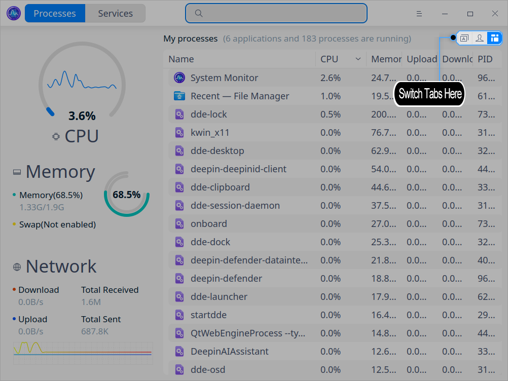
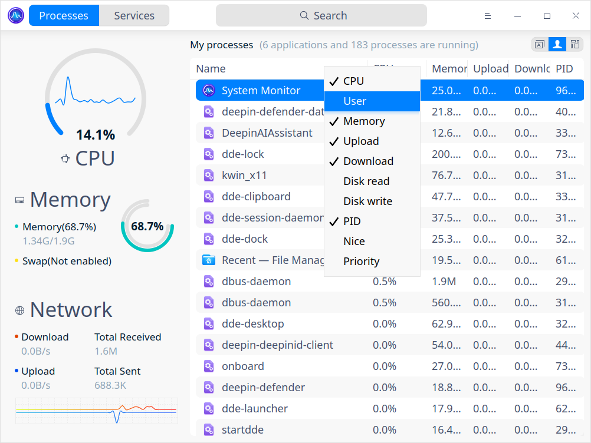
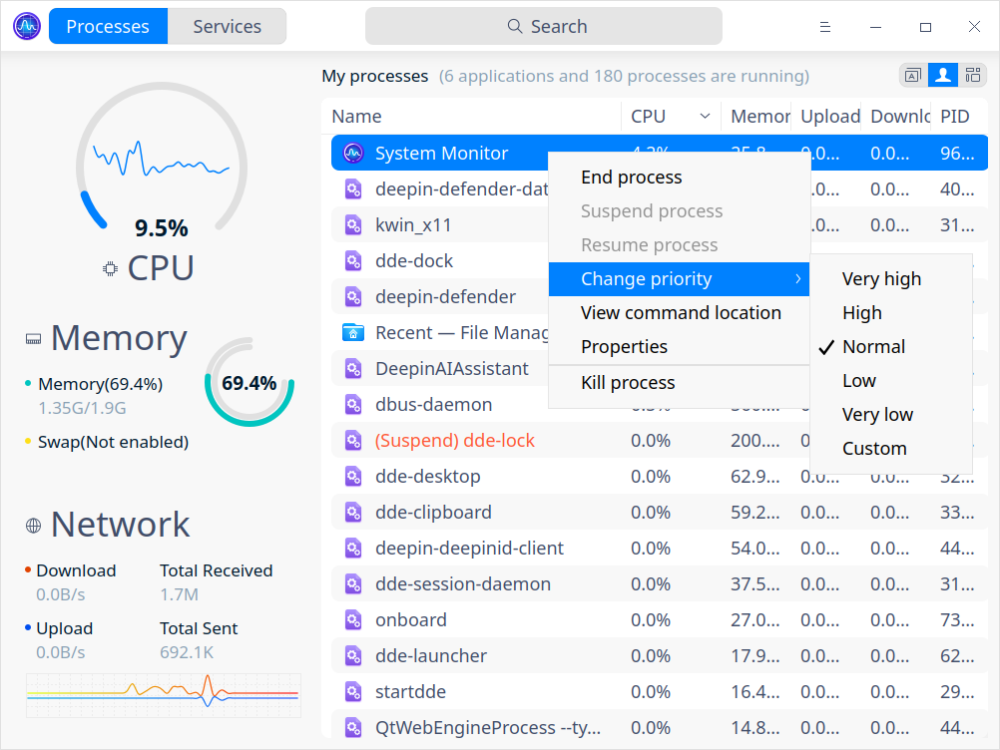

# System Monitor |../common/deepin-system-monitor.svg|

## Overview

System Monitor is a system tool monitoring and managing hardware load, program running and system services. It supports real-time monitoring of CPU status, memory footprint, and upload/download speed, helps manage system and application process, and enables searching and force ending of processes.

## Basic Operations

### Search Process

1. Click in the Search box.  
2. Enter keywords and the search results will be displayed automatically.

### Hardware Monitoring

Click > **View** in the System Monitor interface, select **Expand** or **Compact** and view the CPU, memory and network status of your system in **Expand** view or **Compact** view.

| Name    | Description                                                  |
| ------- | ------------------------------------------------------------ |
| CPU     | Display the running and loading status of your CPU over the recent period of time |
| Memory  | Display the total memory and swap and their current footprints |
| Network | Display the upload and download speed of the current network in real-time |
| Disk    | Display the reading and writing speed in the current disk which is only in "Compact" view |

### Process Management

#### Switch Process Tabs

Click the top right tabs on the System Monitoring interface to view **Applications**, **My processes** and **All processes**.

- Click  to switch to **Applications**. 
- Click  to switch to **My processes**. 
- Click  to switch to **All processes**.

#### Adjust Process Order

You can adjust the process order by Name, CPU, User, Memory, Upload, Download, Disk read, Disk write, PID, Nice and Priority.

- On the System Monitor interface, click the tabs in the top of the process list to sort the processes. Multiple clicks allow sorting from low to high or high to low.
- Right-click the top tabs to check the options you want to view or uncheck the options you want to hide.

#### End Process

System Monitor can be used to end processes.

1. On the System Monitor interface, right-click the process you want to end.
2. Select **End Process**.
3. Click **End** in the pop-up window to confirm.

>  Notes:  You can also right-click a process to select **Kill process** to end the process. This feature may cause data loss. Please proceed with caution.

#### End Application

1. On the System Monitor interface, click .

2. Select **Force end application** (available for graphical processes only).
3. Click the window of application you want to close according to the prompt.

4. Click **Force End** in the pop-up window to confirm.

>  Notes: Press **Esc** on the keyboard to terminate the operation above and return to the System Monitor interface.
>

#### Suspend/Resume Process

1. On the System Monitor interface, right-click the process you want to suspend.
2. Select **Suspend process**. The process will be tagged with **(Suspend)** and turned red in the list. 
3. Right-click it again and select **Resume process** to resume it.

#### Change Process Priority 

1. On the System Monitor interface, right-click a process.
2. Select **Change priority** and select a priority level.

> Notes: You can also select **Custom** to customize the priority level.

#### View Process Location

1. On the System Monitor interface, right-click the process you want to view.
2. Select **View command location** to open the location in File Manager. 

#### View Process Properties

1. On the System Monitor interface, right-click the process you want to view.
2. Select **Properties** to view the name, command line, and start time of the process.

### System service management

You can start, stop, restart, set startup type, and refresh system service processes.
In the list of system services, force-ending of application is prohibited.

> Attention: For better system operation, please don't end any system services processes and root processes.

#### Start system service
1. Select the **Services** tab on the System Monitor interface.
2. Select a process that is not started yet, right-click it, and select **Start**. Enter the password if an authentication window pops up.
3. **active** is displayed in the **Active** column.
4. Right-click the service and select **Startup type**. Select from **Auto** and **Manual** options.
5. Right-click the service and select **Refresh**.

#### Stop system service

1. Select the **Services** tab on the System Monitor interface.
2. Select a process that is started already, right-click it, and select **Stop**. Enter the password if an authentication window pops up.
3. **inactive** is displayed in the **Active** column.
4. Right-click the service and select **Refresh**.

You can also right-click a system process and select **Restart**. 

## Main Menu

In the main menu, you can switch monitoring modes and themes, view help manual, and learn more information of System Monitor.

### Theme

The window theme provides three theme types, namely Light Theme, Dark Theme, and System Theme.

1. On the System Monitor interface, click .
2. Click **Theme** to select one theme.

### View

System Monitor offers Expand view and Compact view for your choice.

1. On the System Monitor interface, click .
2. Click **View** to select one mode.

>  Notes: Compact view and expand view are only available for processes.

### Help

1. On the System Monitor interface, click .
2. Click **Help** to view the manual of System Monitor.

### About

1.  On the System Monitor interface, click .
2.  Click **About** to view the version and introduction of System Monitor.

### Exit

1. On the System Monitor interface, click .
2. Click **Exit** to exit System Monitor.

Update Date: 2021-04-29 Version: 5.8
