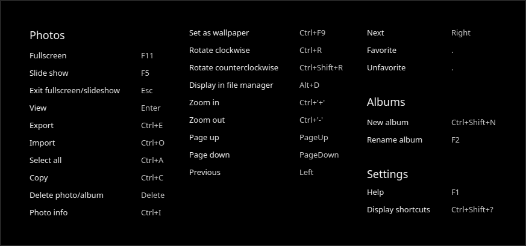
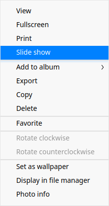
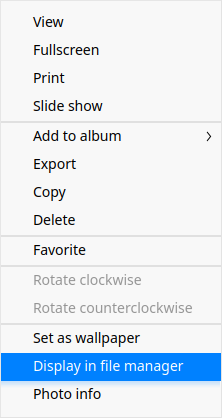
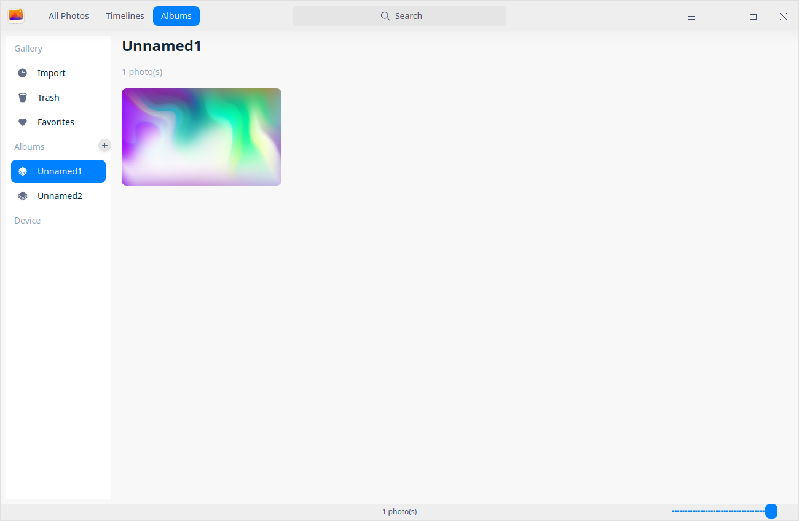
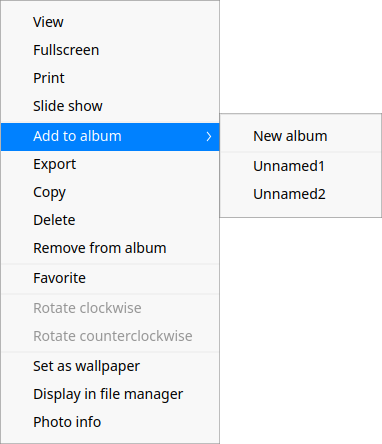

# Album|../common/deepin-album.svg|

## Overview

Album is a stylish and smooth photo management tool, supporting photo viewing and managing in various formats. You can sort your photos by date or timeline, add them to the Favorites or category them into different albums to manage photos in an order way.

## Guide

You can run, close, and create shortcuts for Album in the following ways.

### Run Album

1. Click  in the Dock and enter the Launcher interface.
2. Locate  by scrolling the mouse wheel or searching "album" in the Launcher interface and click it to run.
3. Right-click  and you can:
 - Click **Send to desktop** to create a desktop shortcut.
 - Click **Send to dock** to fix the application in the dock.
 - Click **Add to startup** to add the application to startup and it will automatically run when the system starts up.

>  Tips: In Control Center, you can set Album as the default photo viewing application. Please refer to [Default Applications](dman:///dde#Default Application Settings) for specific operations.

### Exit Album

- On the Album interface, clickto exit Album.
- Right-click  in the dock and select **Close All** to exit Album.
- On the Album interface, click  and select **Exit** to exit Album.

### View Shortcuts

On the Album interface, press **Ctrl** + **Shift** + **?** to view shortcuts. Proficiency in shortcuts will greatly improve your efficiency.

## Photo Management

You are able to manage photos by **Timelines** and **Albums** after launching Album.

### Import Photos

On the Album interface, you are able to import photos as follows:
- Click> **Import photos**.
- Drag directly the photo or the folder where the photo is located to the Album interface.
- Import photos from the mobile device.

>  Tips: You can also import photos to the empty Album by clicking **Import Photos** on the Album interface.

>  Notes: The photo formats supported include BMP, GIF, JPG, PNG, PBM, PGM, PPM, XBM, XPM, SVG, DDS, ICNS, JP2, MNG, TGA, TIFF, WBMP, WEBP, PSD, PDF, and EPS.

### Search Photos 

1. In the search box on top of the Album interface, click  to enter keywords.
2. Press the **Enter** key on the keyboard to locate the photos quickly.
   - When there is information matched, a search result list will be displayed on the interface.
   - When there is no information matched, **No search results** will be displayed on the interface.

### View Photos

Click the scroll bar on the Album interface to adjust the thumbnail size of photos.

Double-click the photo, or right-click the photo and select **View** to enter the photo viewing interface. Press **Esc** on the keyboard to exit.

&nbsp;&nbsp;&nbsp;&nbsp;&nbsp;&nbsp;&nbsp;&nbsp;&nbsp;&nbsp;&nbsp;&nbsp;&nbsp;

| Icon                                               | Name                    | Description                                                  |
| -------------------------------------------------- | ----------------------- | ------------------------------------------------------------ |
|               | Back                    | Back to the main interface.                                  |
|                      | Previous                | Switch to the previous photo.                                |
|                              | Next                    | Switch to the next image.                                    |
|                | 1:1 Size                | The photo will be displayed in 1:1 size without changing the size of the window. |
|                    | Fit to window           | The photo will be resized to adapt to the current window.    |
|                        | Favorite                | Add favorite photos to your Favorites.                       |
|  | Rotate clockwise        | Rotate the photo 90 degrees clockwise.                       |
|              | Rotate counterclockwise | Rotate the photo 90 degrees counterclockwise.                |
|                          | Delete                  | Delete the current photo.                                    |

&nbsp;&nbsp;&nbsp;&nbsp;&nbsp;&nbsp;&nbsp;&nbsp;&nbsp;&nbsp;&nbsp;&nbsp;&nbsp;
>  Tips: Scroll the mouse wheel to enlarge the picture. If the photo size exceeds the window, a navigation window will appear at the lower part. Drag the box in the window to fast locate the corresponding photo areas. You can click  on the top right corner of the navigation window to close it. Right-click the photo, you can select **Hide navigation window/Show navigation window**.

### View Timelines

In Timelines, all photos are sorted by date. Photos with the same date are displayed together and photos with different dates are displayed in different columns. You are able to locate photos of a specific date quickly by Timelines.

### Print Photos

1. On the Album interface, select the photo to be printed and right-click to select **Print**.
2. Select the printer and set the printing parameters.
3. Click **Print**.

>  Notes: Click **Options** to customize the printing parameters.

### Slide Show

1. On the Album interface, right-click a photo.
2. Select **Slide show** to play the photo as slides in full screen.
3. Press **Esc** on the keyboard to exit. 

### Copy Photos

1. On the Album interface, right-click a photo.
2. Select **Copy**.
3. Right-click on the desktop or in a target place and select **Paste** to copy the photo file there.

### Delete Photos

You can delete photos from Album in the following ways:

- Click the  icon on the Album interface when viewing photos.
- Right-click the photo and select **Delete**.
- On the Album interface, click to select the photo and press **Delete** on the keyboard.

>  Tips: The deleted photos in the Album are not deleted permanently but are temporarily stored in the **Trash** album. When the number displayed in remaining days on the photo is 0, the photos will be deleted permanently. You are able to restore or permanently delete the photos here in advance.

### Favorite Photos

1. On the Album interface, right-click a photo.
2. Select **Favorite** and the photo will be added to the **Favorites** album.
3. Right-click the photo in Favorites to **Unfavorite** it.

>  Tips: When viewing a photo, click the  icon to favorite the photo and click  again to unfavorite it.

### Rotate Photos

1. On the Album interface, right-click a photo and select **Rotate clockwise** or **Rotate counterclockwise**.
2. The photo will be rotated clockwise or counterclockwise for 90 degrees.

### Set as Wallpaper

1. Right-click the photo on the Album interface. 
2. Select **Set as wallpaper** to set the current photo as wallpaper.

### Display in File Manager

1. Right-click the photo on the Album interface. 
2. Select **Display in file manager** to open the folder where the photo is located.

### View Photo Information

1. Right-click the photo on the Album interface. 
2. Select **Photo info** to view the detailed information of photos.

## Album Management

On the Album interface, you are able to create new albums, manage photos in the album, and view all albums.

>  Notes: **Import**, **Trash**, and **Favorites** are albums generated automatically by the system according to the actual conditions, which cannot be deleted or renamed.

### Create New Albums

1. On the Albums interface, Click  or > **New album**.
2. Enter the album name and click **Create**.

&nbsp;&nbsp;&nbsp;&nbsp;&nbsp;&nbsp;&nbsp;&nbsp;&nbsp;&nbsp;&nbsp;&nbsp;&nbsp;

>  Tips: You are able to create a new album by right-clicking the album created to select **New album**, or create a new album when adding photos to albums.

### Add Photos to Albums

1. On the Album interface, right-click a photo and select **Add to album**.

2. Select an album and add the photo to it.

&nbsp;&nbsp;&nbsp;&nbsp;&nbsp;&nbsp;&nbsp;&nbsp;&nbsp;&nbsp;&nbsp;&nbsp;&nbsp;

> Tips: You are also able to add photos to an album by dragging the photo or photo folder directly to it.

### Delete Photos from Albums

1. On the Albums interface, right-click a photo in an album.
2. Select **Remove from album** to remove the photo from the album.

### Rename Albums

1. On the Albums interface, right-click the album to be renamed and select **Rename**. 
2. Enter the album name and press the **Enter** key on the keyboard, or click the blank area of the interface.

### Export Albums

1. On the Albums interface, right-click an album.
2. Select **Export**.

### Delete Albums

1. On the Albums interface, right-click an album.
2. Select **Delete**.

## Main Menu

In the main menu, you can [Create New Albums](#Create New Albums), [Import Photos](#Import Photos), view help manual, and get more information about Album.

### Help

1.  On the Album interface, click .
2.  Click **Help** to view the manual of Album.

### About

1.  On the Album interface, click .
2.  Click **About** to view the version and introduction of Album.

### Exit

1.  On the Album interface, click .
2.  Click **Exit** to exit Album.