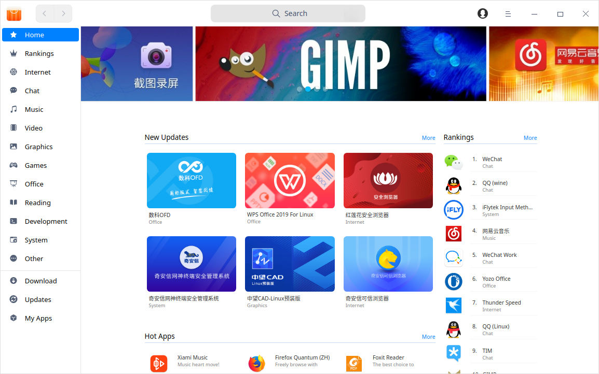
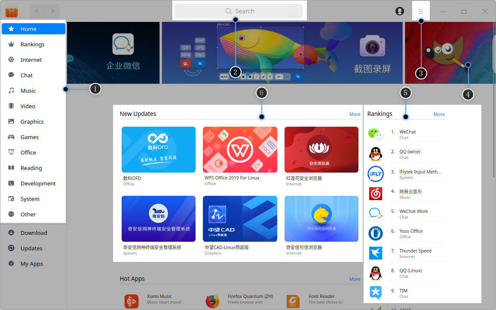
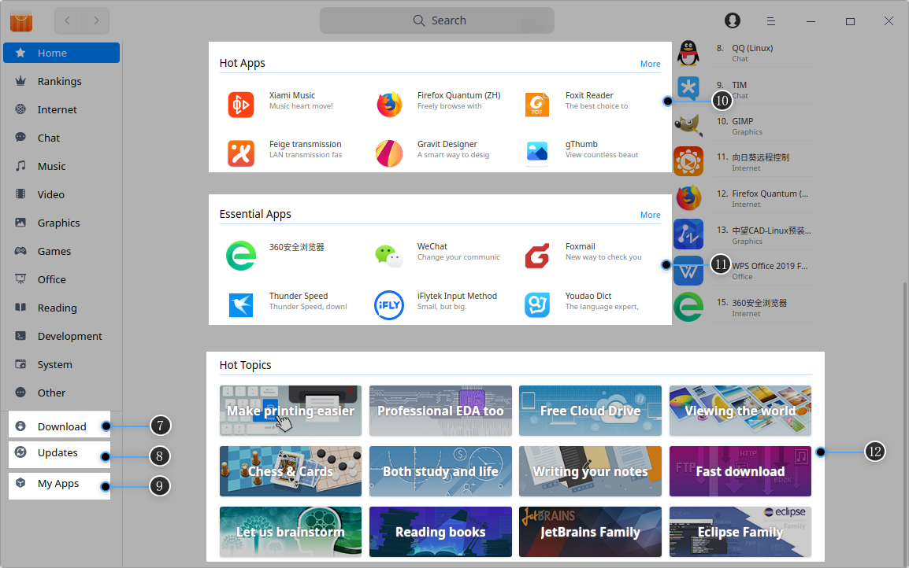
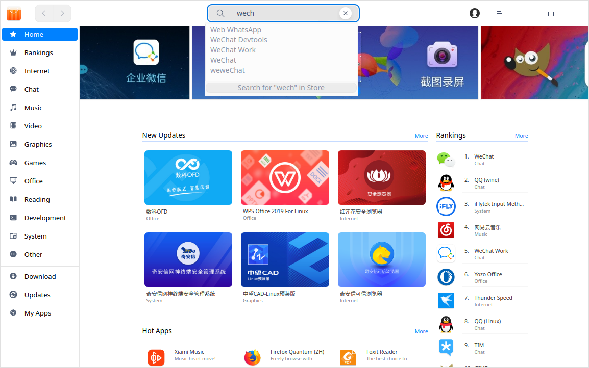
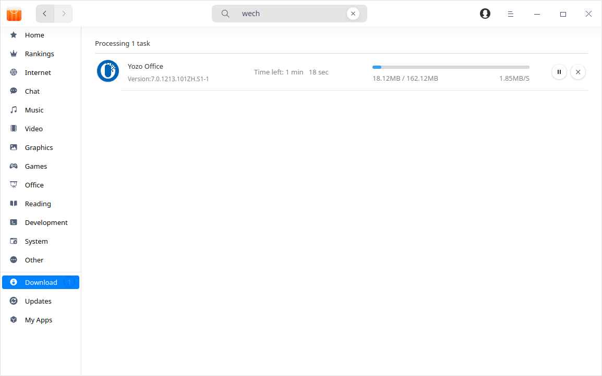
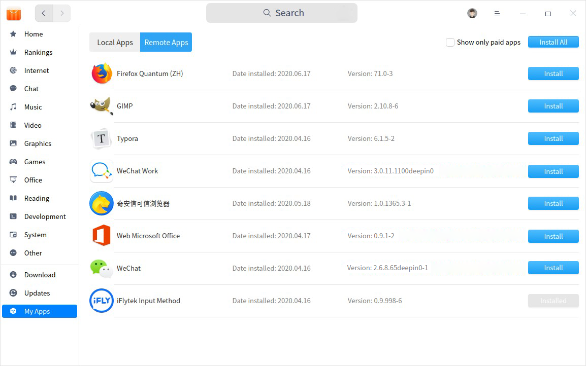
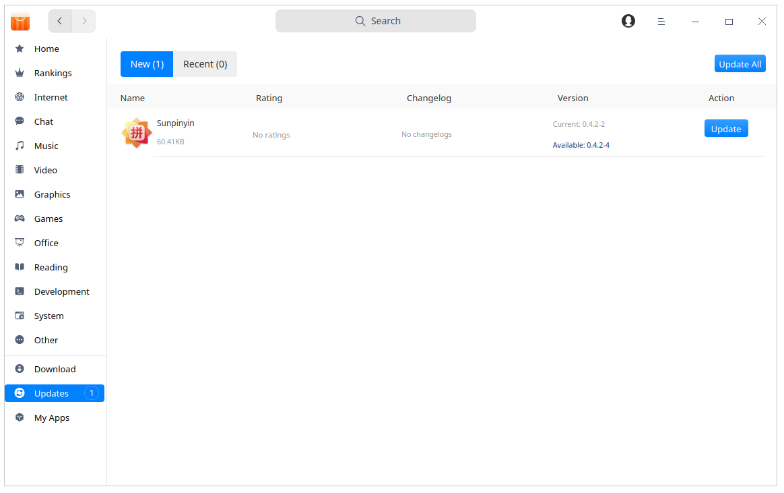
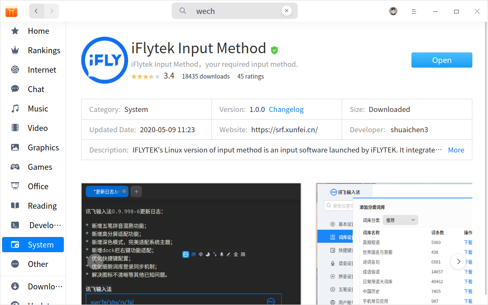
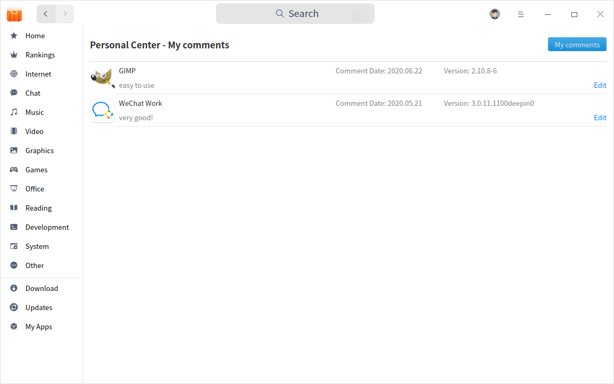

# App Store|../common/deepin-appstore.svg|

## Overview
App Store is a piece of application that integrates functions such as application display, downloading, installation, uninstallation, commenting, rating, and recommendation. App Store collects different types of applications for you, each one has been installed and verified manually. You can search the popular applications with one-click download and automatic installation.           

## Guide

You can run, close or create a shortcut of App Store as follows.

### Run App Store

1. Click    in the lower left corner of the dock to enter launcher interface.
2. Locate  by scrolling the mouse wheel or searching "App Store" in the Launcher interface and click it to run. 
3. Right-click    to:
 - Select **Send to desktop** to create a shortcut on the desktop.
 - Select **Send to dock** to fix it onto the dock.
 - Select **Add to startup** to add it to startup. When the computer starts up, App Store runs automatically.

>  Notes: App Store has been fixed on the dock by default. You can click on   on the dock to run it.

### Exit App Store

- On App Store interface, click  to exit.
- Right-click   on Dock and select  **Close All** or **Force Quit** to exit.
- On App Store interface, click   and select  **Exit**.

## Main Interface
Main interface consists of navigation bar, search box, main menu, slide show, new updates, hot apps, rankings, essential apps, hot topics, download management， updates and my apps.

<table class="block1">
    <caption>Main Interface</caption>
    <tbody>
        <tr>
            <td width="20px">1</td>
            <td width="100px">Left panel</td>
            <td>It mainly displays the home page, rankings and application categories.</td>
        </tr>
        <tr>
            <td>2</td>
            <td>Search box</td>
            <td>You can quickly search applications in App Store by search box.</td>
        </tr>
         <tr>
            <td>3</td>
            <td>Main menu</td>
            <td>You can clear cache, switch themes, view contents of Help and About, and exit App Store.</td>
        </tr>
        <tr>
            <td>4</td>
            <td>Slide show</td>
            <td>Images of recommended apps are played in a slide show.</td>
        </tr>
         <tr>
            <td>5</td>
            <td>Rankings</td>
            <td>App downloading rankings are displayed in the homepage.</td>
        </tr>
        <tr>
            <td>6</td>
            <td>New Updates</td>
            <td>Applications that are newly added into App Store are displayed here.</td>
        </tr>
        <tr>
            <td>7</td>
            <td>Download</td>
            <td>Currently downloading tasks, downloading and installing progress are displayed here. You can pause and delete any download task.</td>
        </tr>
        <tr>
            <td>8</td>
            <td>Updates</td>
            <td>You can view applications to be updated here and you can choose whether to update it or not.</td>
        </tr>
        <tr>
            <td>9</td>
            <td>My Apps</td>
            <td>You can view all apps installed and uninstall apps you don't need any more here.</td>
        </tr>
            <tr>
            <td>10</td>
            <td>Hot Apps</td>
            <td>Recommended popular apps are displayed here.</td>
        </tr>
             <tr>
            <td>11</td>
            <td>Essential Apps</td>
            <td>You can view all essential software and install the ones you want here.</td>
        </tr>
      <tr>
            <td>12</td>
            <td>Hot Topics</td>
            <td>Hot app categories are displayed here.</td>
        </tr>
   </tbody>
   </table>

## Application Management
You can search, download and install different categories of applications, and also, you can explore more splendid applications through slide show, new updates, essential applications, popular applications, recommendations, hot topics, rankings, user comments and other ways. 

### Search Applications
1. Search function is built in App Store, you can click to input keywords;

2. When you input a keyword, all applications containing that keyword will be displayed automatically below, then you can view all applications containing that keyword.

### Download/Install Applications
App Store offers one-click downloading and installation of applications. During the downloading and installing process, you can pause and delete, as well as view the current progress.

App Store supports application synchronization. After signing in, you can synchronize the applications installed on other devices with the same account, and install the Cloud apps at one click.

> Notes: If you haven't signed in, installed applications will be displayed in local applications only.

#### Local Applications

1. On App Store interface, you can directly hover the cursor over the application icon or name, then click   .

2. Click **Download** in the left panel to view downloading/installing progress.

   > Tips: you can click the application icon or name to enter the information page to view basic information and then click  .

   

3. After installation, installed applications are displayed in local applications only. Click **App filter** to screen applications based on categories.

   

   

   

#### Cloud applications

1. Sign in your cloud account, select  **My Apps** to show the interface of My Apps from Personal Center.
2. Click **Remote Apps** to view all cloud applications installed by the account.
3. Select the ones you want to install and click  .
4. After installation, the apps will be displayed both in local apps and remote apps synchronically.
5. If you want to install applications in batches, you can choose  **Install All **. Check all cloud applications you want to install, click  **Start Installation**.

### Update Applications

Select **Updates** on the interface to view view applications to be updated here and you can choose whether to update it or not.

> Tips: You can also update/upgrade applications in Control Center. Refer to [Update Settings](dman:///dde#Update Settings) for particular operations.

### Uninstall Applications

Besides uninstalling applications in Launcher (specific operations refer to [Uninstall Applications](dman:///dde#Uninstall Applications)）you can directly uninstall applications in App Store.

On  **My Apps ** interface, click **Local Apps**, find the applications you want to uninstall, click  .

## Application Page

### Application Details
You can open the information page of any application to view its ratings, download times, category, version, package size, updated date and information such as application tags, sources, brief introduction and comments.

### Comment and Rate

- After sign in, you can comment on and rate the applications. But you have to submit your comments and ratings at the same time.

> Tips: You can click the icon at the right of the comment to like it.

- Click the avatar on the title bar and select  **My Comments**  to view and edit all your ratings and comments.

> Notes: If you haven't signed in your cloud account, you can not comment or rate but only view comments and ratings.

## Main Menu

### Sign In
1. On App Store interface, click the avatar on the title bar.
2. In the pop-up window, input username/email/phone number and password.

3. Click **Sign In**.

> Attention: If you don't have an account yet, you can click **Sign Up** in the pop-up box to sign up. 

### Clear cache
1. Click   on the main interface.
2. Click  **Clear cache** to clear up package caches.

### Theme

The window theme includes Light Theme, Dark Theme and System Theme (default).

1. Click   on the main interface.
2. Click **Theme** to choose one theme.

### Help

Click Help to get the manual, which will help you further know and use App Store.

1. Click   on the main interface.
2. Click  **Help** to view the manual of App Store.

### About
1. Click   on the main interface.
2. Click **About** to view version information about App Store and **UnionTech Software Privacy Policy**.

### Exit
1. Click   on the main interface.
2. Click  **Exit**.

Update Date: 2020-09-22 Version: 6.0
