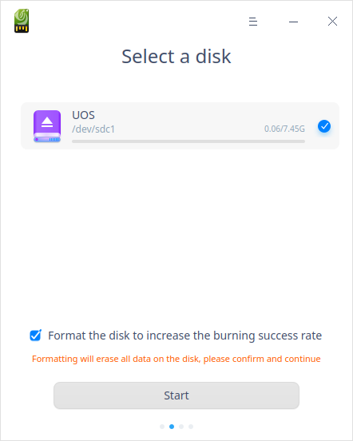

# Boot Maker|../common/deepin-boot-maker.svg|

## Overview

Boot Maker is an easy-to-use tool with a simple interface to help you burn the system image files into installation medium such as CDs and USB disks.

## Guide

### Run Boot Maker

1. Click  on the Dock to enter the interface of launcher.

2. Locate  by scrolling the mouse wheel or searching "Boot Maker" in the Launcher interface and click it to run. 

3. Right-click to:

   - Select **Send to desktop** to create a shortcut on the desktop.
   - Select  **Send to dock** to fix it onto the dock.
   - Select **Add to startup** to run it automatically when the computer is turned on.

###  Exit Boot Maker

- On the main interface, click to exit.
- Right-click   on the Dock, select **Close all** or **Force Quit** to exit.
- On interface of Device Manager, click   and select **Exit** to exit.

## Operations

### Preparation

1. Download the latest official image file from UnionTech OS official website.
2. Prepare an empty USB disk (8GB).
3. Run Boot Maker.
 - Boot Maker is built in UnionTech OS system by default, so you can find it in Launcher quickly.
 - For Windows system, you can also extract xxx-boot-maker.exe from the image file.
 - You can download its specified version from UnionTech OS official website.

### Select Image File

There are two ways to select the image file:

1.Click **Select an ISO image file** to select the downloaded file, then click **Next**.

2.Drag an ISO image file and drop it to the interface, then click **Next**.

> Notes: Please check if the MD5 checksum of image file is the same as that in the official website in advance. Failure would occur due to ISO image files that are not downloaded from official website or not downloaded completely.

### Select Disk

Select the USB disk and click **Start**.

> Tips: It's suggested to check the box **Format the disk to increase the burning success rate**.

### Burned Successfully

It takes a few minutes to make a boot disk. Please wait patiently. Please do not remove the USB disk or shut down the computer. When the progress bar is full, a prompt **Successful** pops up, which means the boot disk is made successfully.  

### Burning Failed

Common causes of failure may include:

- Wrong disk format
- Wrong disk space 
- Wrong disk mounting (Only applicable for Linux)
- Image distract error
- Execute command error
- Unknown error

> Notes: Click **Feedback** when you see this button, then jump to user feedback page of the community website, and the system will upload the error log automatically. 

## Main Menu

In the main menu, you can switch themes, view manual, and so on.

### Theme

The window theme includes Light Theme, Dark Theme and System Theme (default).

1. Click on the interface.
2. Click  **Theme** to select one.

### Help

You can click to view the manual, which will help you further know and use Boot Maker.

1. Click on the interface.
2. Click **Help**.
3. View the manual.

### About

1. Click on the interface.
2. Click **About**.
3. View the version description.

### Exit

1. Click on the interface.

2. Click **Exit**.

Update Date: 2020-09-30 Version: 5.4
