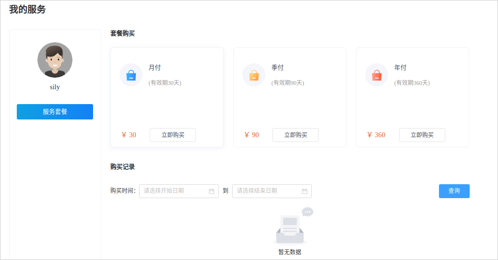

# 联系人|../common/deepin-contacts.svg|

## 概述

联系人是基于网络帐号的联系人通讯管理软件，支持多人视频会议、屏幕共享等功能，可以极大的方便用户讨论沟通，提高效率。

## 使用入门

您可以通过以下方式运行或关闭联系人应用，或者创建快捷方式。

### 运行联系人

1. 单击任务栏上的 进入启动器界面。
2. 通过浏览找到  单击运行。
3. 右键单击，您可以：
   - 单击 **发送到桌面**，在桌面创建快捷方式。
   - 单击 **发送到任务栏**，将应用程序固定到任务栏。
   - 单击 **开机自动启动**，将应用程序添加到开机启动项，在电脑开机时自动运行该应用程序。

### 关闭联系人

- 在联系人界面，单击   ，退出联系人应用。
- 右键单击任务栏上的  图标，选择 **关闭所有** 来退出联系人应用。
- 在联系人界面单击  ，选择 **退出** 来退出联系人应用。

## 登录

运行 **联系人** 应用后，将自动调用操作系统 **网络帐户登录** 界面。

#### 注册

1. 运行 **联系人** 应用后，将自动调用操作系统 **网络帐户登录** 界面。如果没有网络帐号，可通过以下方式注册。

2. 单击 **注册** 超链接后，成功调用操作系统中的默认浏览器，并打开注册页面。

3. 根据页面提示，输入相关信息进行网络帐号注册。

4. 注册完成后，可返回登录界面进行登录。

#### 忘记密码

1. 单击 **联系人** 应用后，将自动调用操作系统 **网络帐户登录** 界面。如果忘记登录密码，可通过以下方式找回。

2. 单击 **忘记密码？** 超链接后，成功调用操作系统中的默认浏览器，可以重置密码。

3. 成功找回密码后，可返回登录界面进行登录。

#### 自动登录

1. 前提：操作系统网络帐号已登录。

2. 运行 **联系人** 应用后，系统将自动登录联系人主界面，不需要输入帐号和密码。

#### 手动登录

1. 前提：操作系统网络帐号未登录。

2. 运行 **联系人** 应用后，弹出 **网络帐户登录** 对话框。

3. 输入网络帐号和密码，验证通过后。同步完成联系人客户端登录，并跳转至联系人主界面。 

## 联系人

在联系人主界面，单击，进入联系人界面。

### 搜索

1. 搜索前提：已经添加了好友或创建群组。

2. 在搜索框中输入想要搜索的好友网络帐号、好友昵称、好友备注、群名称，可以快速的找到联系人。

  >  ：搜索对象与网络帐号呈一定相关性，非陌生人对象。

### 新的朋友

主要显示请求加你为好友的联系人信息。

1. 当自己被别人添加为好友时，会弹出红色的角标提示。
2. 单击 **新的朋友**，可选择 **同意** 或 **拒绝** 添加此好友，同时还可以查看历史好友添加的记录。

### 好友

#### 添加好友分组

1. 系统有一个默认好友分组，如果想添加其他的好友分组，可进行以下操作。

2. 将光标放到 **好友** 上，单击右键；或左键单击，出现 **添加好友分组** 弹框。

3. 单击 **添加好友分组**，输入名称，即可成功添加。如果创建时没有命名，也可单击右键 **重命名分组**。

#### 删除好友分组

1. 选择需要删除的好友分组，单击右键；或左键单击，选择 **删除分组**。
2. 弹出确认框，单击 **确定**，选定的组将被删除，组内的好友则会移动至默认好友分组。

#### 添加好友

添加好友有三种方式，第一种是主界面单击，选择 **添加好友**，第二种是选择好需要的群分组，单击右键选择 **添加好友**，第三中是在对应好友分组后左键单击，选择 **添加好友**。

1. 选择 **添加好友**。

2. 输入用户名、邮箱或手机号查找好友，查找成功后会在列表中出现，单击。

   

3. 弹出好友请求页面，选择好友分组，输入请求信息，单击 **发送**。

   

4. 好友同意请求后，在分组中可以看到好友信息，说明添加成功。

5. 添加成功后，可修改备注名。

#### 好友信息

1. 在好友列表中，选中需要查看的好友，会显示详情信息页面。
2. 好友信息包括帐号、备注名、手机及邮箱信息，还可以创建视频会议。

  

#### 移动好友

1. 选择需要移动的好友，单击右键。
2. 勾选新的好友分组，即可完成移动。

#### 删除好友

1. 选择需要删除的好友，单击右键，选择 **删除好友**。
2. 弹出确认框，单击 **确定**，选定的好友将被删除。

#### 创建会议

1. 前提：好友在线，会议才可拨通。
2. 单击，可创建视频会议。

### 群
#### 添加群分组

系统有一个默认群分组，如果想添加其他的群分组，可进行以下操作。

1. 将光标放到 **群** 上，单击右键；或左键单击，出现 **添加群分组** 弹框。
2. 单击 **添加群分组**，输入群分组名称，即可成功添加。如果创建时没有命名，也可单击右键 **重命名分组**。

#### 删除群分组

1. 选择需要删除的群分组，单击右键；或左键单击，选择 **删除分组**。
2. 弹出确认框，单击 **确定**，选定的组将被删除，组内的群则会移动至默认群分组。

#### 创建新群

创建新群有三种方式，第一种是主界面单击，选择 **创建新群**；第二种是选择好需要的群分组，单击右键选择 **创建新群**；第三种是在群分组后左键单击，选择 **创建新群**；创建成功后，群成员也会出现此群，并被分到 **默认群分组**。

1. 选择 **创建新群**。

2. 自定义群名称，从好友分组勾选加入群组的好友。

3. 单击 **确定**，创建成功，可以在默认群分组中查找新建的群组。

#### 群信息

1. 在群列表表中，选中需要查看的群，会弹出详细信息页面。
2. 群信息主要为群名称、群公告、创建日期、邀请模式和群成员，还可解散群及转让群。

  

#### 移动群

1. 选择需要移动的群，单击右键。
2. 勾选新的群分组，即可完成群移动。

#### 解散群

1. 当不需要某群的时候，可以选择解散群。
2. 选中需要解散的群，单击 。
3. 单击 **确定** 后，群就不存在了，同时群成员的群列表中也会自动删除此群。
>  ：只有群创建者可以解散群，群成员只能选择退出群。

#### 转让群

1. 选中需要转让的群，单击。
2. 搜索或浏览被转让的好友，勾选后单击 **确定**，界面显示只有退出群的权限，说明转让成功。

#### 创建群会议

1. 单击，创建视频会议。
2. 勾选参会的成员，设置会议属性，单击 **确定**。
3. 会议创建成功，可以在会议界面查看。

## 会议

在联系人主界面，单击，进入会议界面。

### 搜索

1. 搜索前提：已经创建了会议或会议已经结束了。

2. 搜索方式有两种，通过会议室号码或会议名称。

   - 通过会议室号码搜索：每个用户都有一个固定的会议室号码，搜索会议号就是搜索其他人邀请你开过的所有会议，显示结果可能会有多个。
   - 通过会议名称搜索：会议名称命名可以重复，搜索会议名称时，显示结果可能会有多个。

### 创建会议

1. 单击，可创建会议。
2. 弹出创建会议的信息，用户可根据实际需求设置。

   - 会议名称：可以自己设置会议名称，也可用默认会议名称。

   - 会议室号：每个用户只有一个固定的会议室号，不可设置。

   - 开始时间：会议可以立即开始，也可预约。如果想要立即开始会议，就打开 **立即开始** 开关；如果想预约会议，则选择预约时间。

   - 时长：根据实际需要选择会议时长，建议选择时长大于实际会议时长。会议时间达到设置时间后，会议将自动退出。

   - 会议密码：可选择设置会议密码共享给与会成员，没有密码的人无法进入会议，保证会议的安全性。

   - 会议模式：会议模式有三种：允许客人拨入、参会者邀请，创建者邀请，三种模式的权限从小到大。

     - 允许客人拨入：将会议室号与密码共享给客人，客人单击 **快速参加会议**，输入会议室号码及密码接入会议。进入会议后，可以邀请其他人参加会议。
     - 参会者邀请：参会者有邀请其他人参加会议的权限。
     - 创建者邀请：参会者只能被创建者邀请才可以加入会议。

   - 参会方数：设置参数人数，普通用户参数方数最多10人。

   - 邀请成员：可从左侧好友列表中选择参会人员。

### 快速参加会议

快速参加会议功能对应的是 **允许客人拨入** 这种会议模式。

1. 单击 **快速参加会议**，弹出信息框。

2. 输入会议室号码及密码，选择是否关闭摄像头或麦克风后，单击确定，即可接入会议。

### 会议进行中

进入会议后，会议发起者可进行如下会议设置。

   - 静音：可设置麦克风是否静音，默认麦克风开启。

   - 关闭视频：可设置摄像头是否关闭，默认摄像头开启。

   - 屏幕共享：可设置屏幕是否共享，共享后其他参会人可以看到你的屏幕。

     画廊视图：视频会议窗口可分为演讲者视图和画廊视图，演讲者视图是一主数从；画廊视图是均匀分布，支持2*2分布，如果窗口超过４个，则根据语音激活排序先后进行跳动显示。

     

   - 设置：设置麦克风，扬声器，摄像头及静音时是否通知。

     

   - 关闭会议：创建者关闭会议后，整个会议就结束；参会者无关闭会议权限。

   - 挂断会议：会议挂断后，实际会议并没有结束，还可以再次进入会议。

     

### 会议室

主要展示会议室列表及信息，会议室列表中默认生成 **我的会议室**。
   - 会议号码：当第一次运行联系人应用时，就会生成一个会议室号码，每个用户的会议室号码都是固定的。

   - 方数限制：普通用户的会议室最多为10人。

   - 会议室授予：可以将自己的会议室授权给其他人，其他人就可以使用被授权的会议室创建视频会议．并出现在  **会议室**列表中。

### 待开始会议

主要展示待开始会议列表及会议信息。
   - 会议号码：待开始会议的会议室号码。
   - 会议时间：展示会议开始日期，开始及结束时间点。
   - 会议室模式：上文中已说明会议室模式及差异。
   - 方数限制：当前会议允许接入的人数。
   - 会议成员：展示会议参与人的信息。
   - 分享：单击，可复制会议信息，发给其他参会者接入。
   - 编辑：单击，可修改会议信息。
   - 删除：单击，可删除待开始的会议。

### 历史会议

主要展示已经结束的会议列表及会议信息。

## 主菜单

在主菜单中，您可以查看用户个人信息，基础设置，切换窗口主题，查看帮助手册等操作。

### 用户个人信息

1. 在联系人主界面，单击  ，选中 **用户个人信息**。

2. 可查看用户个人信息，及购买服务套餐。

    

3. 单击 **充值**，在我的服务界面，您可以选择买月卡、季卡或年卡，还可以查看购买记录。购买服务套餐后，您有以下权益：

    - 视频会议的与会人数扩大至100人；
    - 单个会议室时长可以达到12小时 ；

4. 选好需要的服务套餐后，单击 **立即购买**，付费后即可体验相应的服务。

    

5. 购买成功后，在用户个人信息界面会显示套餐剩余天数，还可以续费。

### 设置

1. 在联系人主界面，单击  。

2. 单击 **设置**。

3. 设置麦克风，扬声器，摄像头及静音时是否通知，也可在会议中进行设置。

### 主题

窗口主题包含浅色主题、深色主题和系统主题，其中系统主题为默认设置。

1. 在联系人主界面，单击 。
2. 单击 **主题**，选择一个主题颜色。

### 帮助

获取联系人的帮助手册，让您进一步了解和使用联系人。

1. 在联系人主界面，单击 。
2. 单击 **帮助**，查看联系人的帮助手册。

### 关于

1. 在联系人主界面，单击  。
2. 单击 **关于**。
3. 查看关于联系人的版本和介绍。

### 退出

1. 在联系人主界面，单击  。
2. 单击 **退出**。

