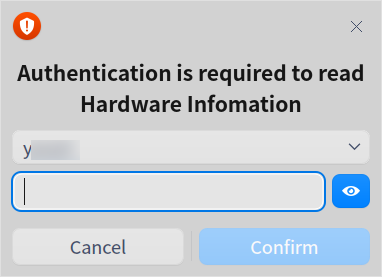
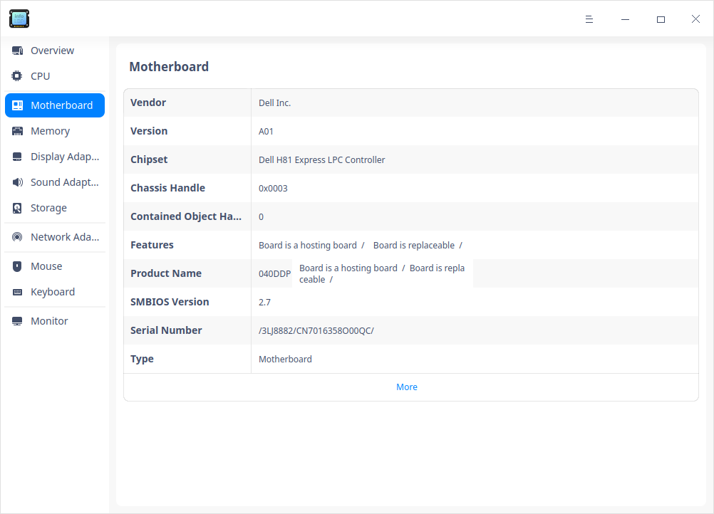
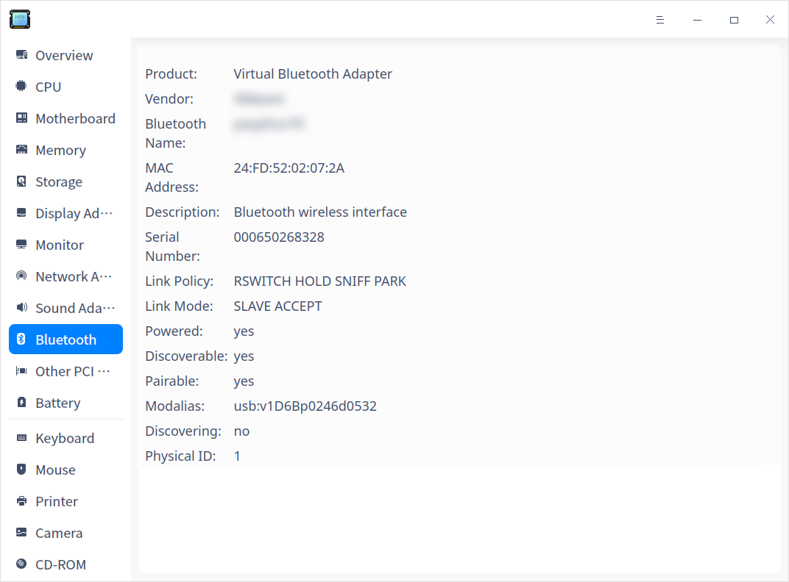
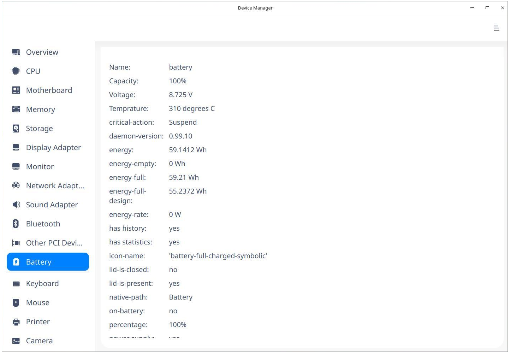
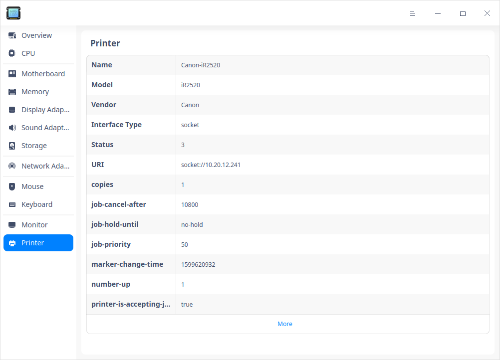

# Device Manager|../common/deepin-devicemanager.svg|

## Overview 

Device Manager is a tool to view and manage hardware devices, through which you can view all kinds of parameters and export data of all hardware devices running in the operating system. 

## Guide

You can run, close or create a shortcut for Device Manager as follows.

### Run Device Manager

1. Click  on the Dock to enter the interface of launcher.

2. Locate  by scrolling the mouse wheel or searching "Device Manager" in the Launcher interface and click it to run. An authentication box pops up. You should input the login password for verification. 

   

3. Right-click to:

   - Select **Send to desktop** to create a shortcut on the desktop.

   - Select  **Send to dock** to fix it onto the dock.

   - Select **Add to startup** to run it automatically when the computer is turned on.

   

### Exit Device Manager

- On the main interface, click to exit.
- Right-click   on the Dock, select **Close all** or **Force Quit** to exit.
- On interface of Device Manager, click   and select **Exit** to exit.

## Operations

### Overview

1. On the main interface, click **Overview**.
2. You can see a list containing **device**, **operating system**, **CPU** and so on in this interface, and particular info such as brands, names, models and specifications in it as well. 

### CPU

1. On the main interface, click **CPU**.
2. You can view a CPU list and particular info such as name, vendor, architecture, model and so on. 

### Motherboard 

1. On the main interface, click **Motherboard**. 
2. You can view info about motherboard, such as vendor, BIOS revision, characteristics, and so on.

### Memory

1. On the main interface, click **Memory**.
2. You can view a memory list and particular info such as name, vendor, size, type, speed and so on.

### Storage

1. On the main interface, click **Storage**.
2. You can view a storage device list and particular info such as model, vendor, media type, size, speed and so on.

### Display Adapter

1. On the main interface, click **Display Adapter**.
2. You can view info about Display Adapter such as name, EGL version and so on.

### Monitor

1. On the main interface, click **Monitor **.
2. You can view info about Monitor such as name, vendor, current resolution, size and so on.

### Network Adapter

1. On the main interface, click **Network Adapter**.
2. You can view info about Network Adapter such as name, vendor, MAC address, type and so on.

### Sound Adapter

1. On the main interface, click **Sound Adapter **.
2. You can view a list of audio adapters and info such as name, model and so on.

### Bluetooth

1. On the main interface, click **Bluetooth**.
2. You can view a list of device name, address, and link mode and so on.

### Other PCI Devices
1. On the main interface, click **Other PCI Devices**.
2. You will see **No other PCI devices found** if no such devices are connected.

### Battery 
1. On the main interface, click **Battery**.
2. You can view information about the battery such as the name, capacity, and so on.

### Keyboard

1. On the main interface, click **Keyboard **.
2. You can view info such as name, vendor, interface and so on.

### Mouse

1. On the main interface, click **Mouse**.
2. You can view info such as name, bus info, model, driver, speed and so on.

### Printer

1. On the main interface, click **Printer**.
2. You can view a list of printers connected and info such as name, vendor, model, URI and so on.

### Camera
1. On the main interface, click **Camera**.
2. You can view a list of printers connected and info such as name, vendor, model, and so on.

### CD-ROM
Device Manager is able to identify both internal and external optical drives.
1. On the main interface, click **CD-ROM**. 
2. You will see **No CD-ROM found** if no such devices are connected.
>Notes: The CD-ROM is a part of the computer to read the data in the optical disk. Its ability depends on the hardware configuration of the computer. If your device supports the CD burning function, you can back up important files to the CD regularly to prevent data loss.

### Other Devices
Other devices include input devices with other interfaces other than PCI, such as light pen, tablet, digital board and joystick.
>Notes: If more than one device is detected, selecting one will directly display the selected device information. If the device is not detected, you will see **No other devices found** displayed in this interface.

### Right-click Operations 

**Copy**: To copy contents selected by cursor, right-click to select  **Copy**.

**Refresh**: Right-click and select  **Refresh** to reload info of all devices of the operating system. You can also use shortcut key F5 to realize this function.

**Export**: Click **Export**, a file saving interface pops up. Select the saving path and format(txt/docx/xls/html) and then click **Save** to finish exporting. 

## Main Menu

In the main menu, you can view manual, and know more about Device Manager.

### Help

Click Help to get the manual, which will help you further know and use Device Manager.

1. Click on the interface.
2. Click **Help** to view the manual.

### About

1. Click on the interface.
2. Click **About** to view version and introduction about Device Manager.

### Exit

1. Click on the interface.
2. Click  **Exit**.

Update Date: 2021-06-23 Version: 5.6
