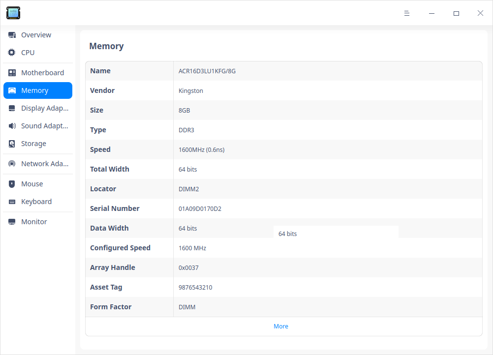
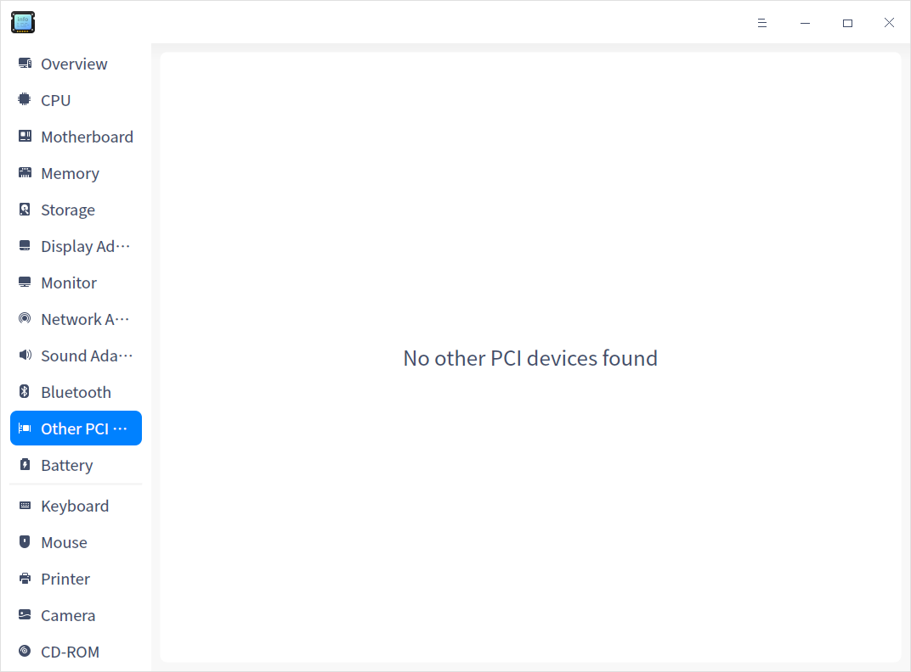
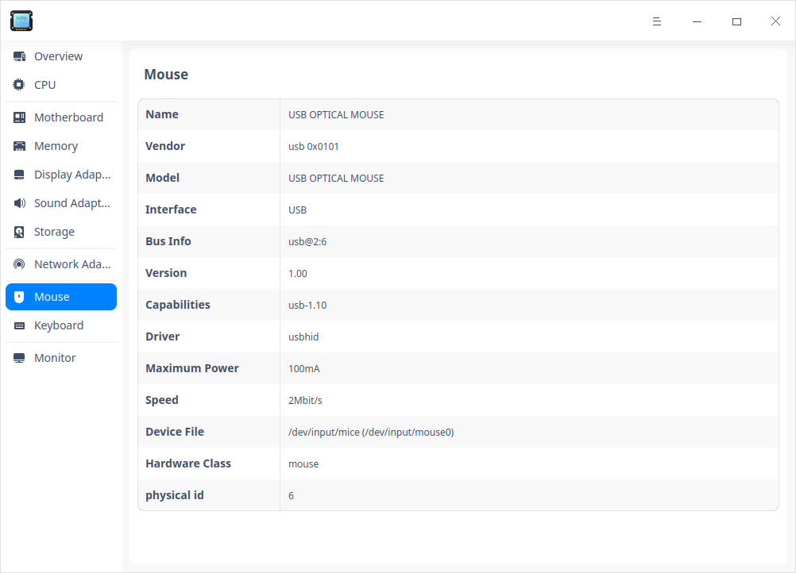

# Device Manager|../common/deepin-devicemanager.svg|

## Overview 

Device Manager is a tool to view and manage hardware devices, through which you can view all kinds of parameters and export data of all hardware devices running in the operating system. 

## Guide

You can run, close or create a shortcut for Device Manager as follows.

### Run Device Manager

1. Click  on the Dock to enter the interface of launcher.

2. Locate  by scrolling the mouse wheel or searching "Device Manager" in the Launcher interface and click it to run. An authentication box pops up. You should input the UOS password for verification. 

   

3. Right-click to:

   - Select **Send to desktop** to create a shortcut on the desktop.

   - Select  **Send to dock** to fix it onto the dock.

   - Select **Add to startup** to run it automatically when the computer is turned on.

   

### Exit Device Manager

- On the main interface, click to exit.
- Right-click   on the Dock, select **Close all** or **Force Quit** to exit.
- On interface of Device Manager, click   and select **Exit** to exit.

## Operations
### Overview

1. On the main interface, click **Overview**.
2. You can see a list containing **Device**, **Operating System**, **CPU** and so on in this interface, and particular info such as brands, names, models and specifications in it as well. 

### CPU

1. On the main interface, click **CPU**.
2. You can view a CPU list and particular info such as name, vendor, architecture, model and so on. 

### Motherboard 

1. On the main interface, click **Motherboard**. 
2. You can view info about motherboard, memory bank, system, Bios, chassis, and so on.

### Memory

1. On the main interface, click **Memory**.
2. You can view a memory list and particular info such as model, vendor, size, type, speed and so on.

### Storage

1. On the main interface, click **Storage**.
2. You can view a storage device list and particular info such as model, vendor, media type, size, speed and so on.

### Display Adapter

1. On the main interface, click **Display Adapter**.
2. You can view info about Display Adapter such as name, vendor, graphic memory, resolution, driver and so on.

### Monitor

1. On the main interface, click **Monitor **.
2. You can view info about Monitor such as name, vendor, resolution, connect type and so on.

### Network Adapter

1. On the main interface, click **Network Adapter**.
2. You can view info about Network Adapter such as name, vendor, Mac address, speed and so on.

### Sound Adapter

1. On the main interface, click **Sound Adapter **。
2. You can view a list of audio adapters and info such as name, vendor, bus info, width, driver and so on.

### Bluetooth

1. On the main interface, click **Bluetooth **.
2. You can view info about bluetooth such as name, vendor, Mac address, connect type and so on.

### Other PCI Devices

1. On the main interface, click **Other PCI Devices **.
2. If no PCI devices are connected to the computer, you will see a hint **No Other PCI Devices Found!** .

### Battery
1. On the main interface, click **Battery **.
2. You can view info such as name, vendor, size, type, and so on.

### Keyboard

1. On the main interface, click **Keyboard **。
2. You can view info such as name, vendor, bus info, type, driver and so on.

### Mouse

1. On the main interface, click **Mouse**.
2. You can view info such as name, bus info, type, driver, speed and so on.

### Printer

1. On the main interface, click **Printer**.
2. You can view a list of printers connected and info such as name, vendor, model, device URI and so on.

### Camera

Image Devices include cameras and scanners and so on connected to any port.

1. On the main interface, click **Camera**.
2. You can view info such as name, vendor, type, and so on.

### CD-ROM

Device Manager is capable to identify built-in and externally connected CD-ROM drives.

1. On the main interface, click **CD-ROM**.
2. You can view info such as name, vendor, type, and so on.

### Other Devices

Other devices include other non-PCI input devices connected to other ports such as electronic pens, handwriting pads, joysticks and so on. 

> Notes: If several devices are found, you can select one to view its info. If no devices are found, you will see a hint **No Other PCI Devices Found**.

### Right-click Operations 

**Copy**: To copy contents selected by cursor, right-click to select  **Copy**.

**Refresh**: Right-click and select  **Refresh** to reload info of all devices of the operating system. You can also use shortcut key F5 to realize this function.

**Export**: Right-click and select **Export**，an interface to save files pops up. To finish exporting info, select the path you want to save the file and file name and format(txt/docx/xls/html) and click **Save**. 

## Main Menu

In the main menu, you can switch themes, view manual, and so on.

### Theme

The window theme includes Light Theme, Dark Theme and System Theme (default).

1. Click on the interface.
2. Click  **Theme** to select one.

### Help

Click Help to get the manual, which will help you further know and use Device Manager.

1. Click on the interface.
2. Click **Help** to view the manual.

### About

1. Click on the interface.
2. Click **About** to view version and introduction about Device Manager.

### Exit

1. Click on the interface.
2. Click  **Exit**.

Update Date: 2020-08-24 Version: 5.5
