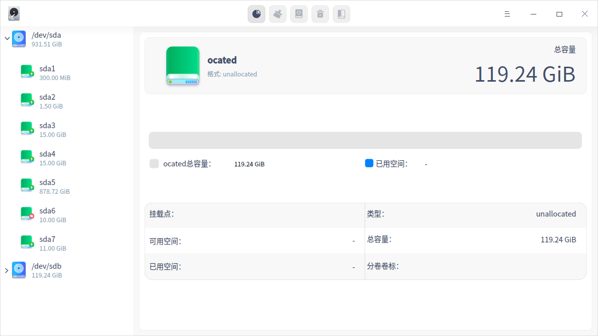
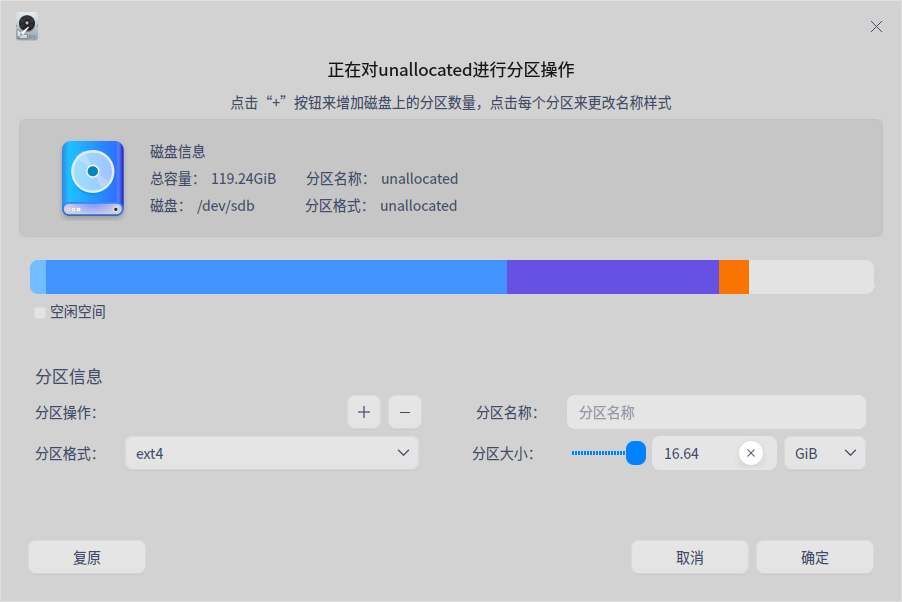
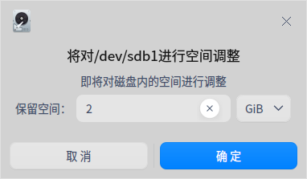
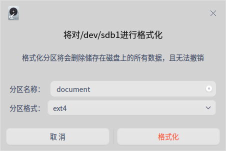
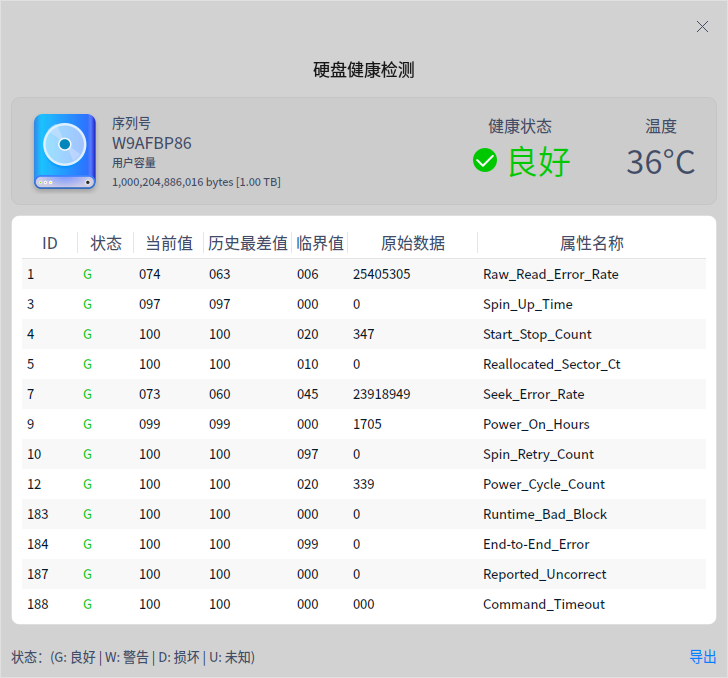

# 磁盘管理器|../common/disk-manager.svg|

## 概述

磁盘管理器是一款管理磁盘的工具，可帮助用户进行磁盘分区管理、磁盘数据管理及磁盘健康管理。

## 使用入门

您可以通过以下方式运行或关闭磁盘管理器，或者创建快捷方式。

### 运行磁盘管理器

1. 单击任务栏上的启动器图标 ，进入启动器界面。

2. 上下滚动鼠标滚轮浏览或通过搜索，找到磁盘管理器图标 ，单击运行。弹出授权框，需要输入系统登录密码进行认证。

   

3. 右键单击  ，您可以：
   - 单击 **发送到桌面**，在桌面创建快捷方式。

   - 单击 **发送到任务栏**，将应用程序固定到任务栏。

   - 单击 **开机自动启动**，将应用程序添加到开机启动项，在电脑开机时自动运行该应用程序。

### 关闭磁盘管理器

- 在磁盘管理器界面，单击   ，退出磁盘管理器。
- 右键单击任务栏上的 ，选择 **关闭所有** 来退出磁盘管理器。
- 在磁盘管理器界面单击  ，选择 **退出** 来退出磁盘管理器。

## 磁盘分区管理
磁盘管理器主界面显示磁盘列表及其分区信息，包括分区格式、分区总量、挂载点等详细信息。还可以新建分区、调整分区空间、格式化、挂载及卸载分区等。

### 新建分区

1. 在磁盘管理器主界面，选中未分配的分区，并在顶部功能栏单击分区按钮 。

2. 弹出确认框，单击 **确定** 后进入分区操作界面。在分区操作界面，可查看分区总容量、名称、格式及所属的磁盘信息。

3. 在分区信息区域填写新分区名称、分区大小，并选择分区格式，然后单击增加按钮 。可新建多个分区，磁盘条形图中会分段显示每个分区及其名称。在新建分区的过程中，单击删除按钮 ，可删除分区。

   

   > 注意：最多可创建24个分区，且新分区的空间不得小于52 MB，否则无法创建。

4. 创建完分区后，单击 **确定** ，新建的分区会显示在对应磁盘下。

5. 在新建分区的过程中会自动格式化该分区。若要正常使用新建分区，还需要手动挂载，详细操作请参考 [分区挂载](#分区挂载) 。

   > 说明：如果是在移动设备如usb上新建分区，重新插拔设备后，该分区会被自动挂在到/media/...路径下，无需手动挂载。

### 空间调整

若分区空间太小 ，可以选择调整空间，使用前提是选中的分区处于卸载状态。

1. 在磁盘管理器主界面，选中卸载状态的分区，并在顶部功能栏单击空间调整按钮  。

2. 弹出空间调整界面，填写需要扩容的大小，并单击 **确定**。

   

3. 扩容完成后，可查看分区的总容量。

### 隐藏分区

隐藏分区后，在“计算机”中看不到对应的分区，但在磁盘管理器中可见。隐藏分区内的文件不会丢失，只是无法正常访问。

使用前提是：选中的分区不是系统分区，且处于卸载状态。

1. 在磁盘管理器主界面，选中一个分区，并单击右键。

2. 选择 **隐藏分区** 后弹出确认框，单击 **隐藏**，该分区的图标则转换为隐藏状态。

   

### 显示分区

1. 在磁盘管理器主界面，选中隐藏的分区，并单击右键。
2. 选择 **显示分区** 后弹出确认框，单击 **显示**，该分区的图标则转换为显示状态。
3. 取消隐藏后分区处于卸载状态，若要正常使用，还需手动挂载。

## 磁盘数据管理

### 格式化分区

格式化主要是更改分区格式时使用的，格式化分区后，将会删除该分区储存在磁盘上的所有数据，且无法撤销，请谨慎操作。

使用前提：选中的分区为空闲分区，处于卸载状态。

1. 在磁盘管理器主界面，选中一个分区，并在顶部功能栏单击格式化按钮  。

2. 弹出格式化操作界面，填写分区的名称，并选择分区格式。

   

3. 确定后，单击 **格式化** 即可。

### 挂载分区

1. 在磁盘管理器主界面，选中未挂载的分区，并在顶部功能栏单击挂载按钮  。

2. 弹出挂载操作界面，选择或创建挂载点后，单击 **挂载** 即可。

   

> 注意：一个分区挂载在一个已存在的目录上，这个目录可以不为空，但挂载后这个目录下以前的内容将不可用，请谨慎操作。

### 卸载分区

若要修改分区的挂载点，可先卸载，再重新挂载。

1. 在磁盘管理器主界面，选中一个分区，并在顶部功能栏单击卸载按钮   。
2. 弹出确认框，确认无正在运行的程序后，单击 **卸载**  即可。

### 删除分区

删除分区后，该分区中的所有文件都会丢失，请谨慎操作。

使用前提：选中的分区处于卸载状态。

1. 在磁盘管理器主界面，选中一个分区，并单击右键。
2. 选择 **删除分区** 后弹出确认框，单击 **删除**，该分区在对应磁盘下消失。

## 磁盘健康管理

### 磁盘信息

1. 在磁盘管理器主界面，选中磁盘，并单击右键，选择 **磁盘信息**。

2. 可查看磁盘的序列号、设备模型、用户容量及转速等信息。

   

3. 单击 **导出**，还可以将磁盘信息导出到指定的文件夹。

### 硬盘健康检测

1. 在磁盘管理器主界面，选中磁盘，并单击右键，选择 **健康管理**，继续选择 **硬盘健康检测** 。

2. 可查看磁盘的健康状态是否良好，当前的温度及各属性的状态。

   

3. 单击 **导出**，还可以将硬盘健康检测信息导出到指定的文件夹。

### 分区表错误检测

1. 在磁盘管理器主界面，选中磁盘，并单击右键，选择 **健康管理**，继续选择 **分区表错误检测** 。
2. 若分区表没有错误，则弹出 **分区表检测正常** 提示；若分区表有错误，会弹出错误报告，您可以根据错误报告去修复问题。

## 主菜单

在主菜单中，您可以进行切换窗口主题，查看帮助手册等。

### 主题

窗口主题包含浅色主题、深色主题和系统主题。

1. 在磁盘管理器界面，单击。
2. 单击 **主题**，选择一个主题颜色。

### 帮助

1. 在磁盘管理器界面，单击 。
2. 单击 **帮助**，查看帮助手册，进一步了解和使用磁盘管理器。

### 关于

1. 在磁盘管理器界面，单击 。
2. 单击 **关于**，查看磁盘管理器的版本和介绍。

### 退出

1. 在磁盘管理器界面，单击 。
2. 单击 **退出**。

文档更新时间: 2021-01-15 版本: 1.1
