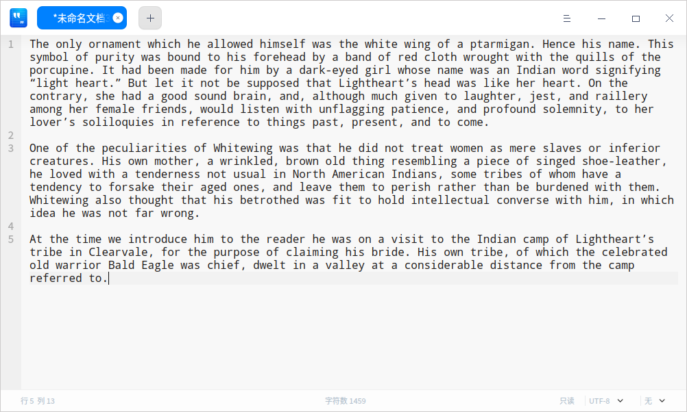
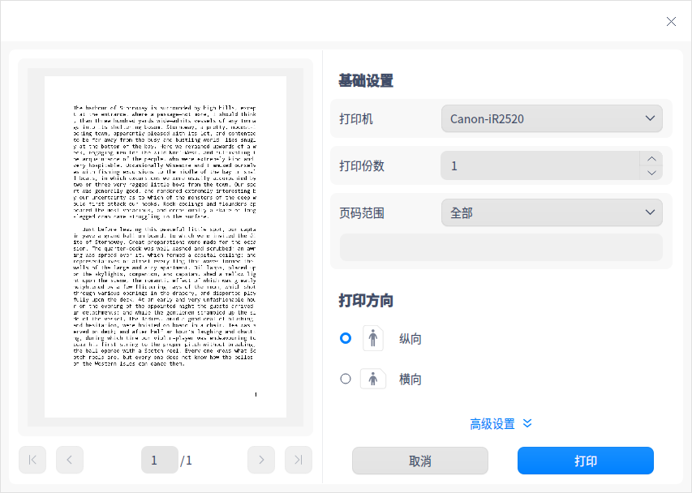
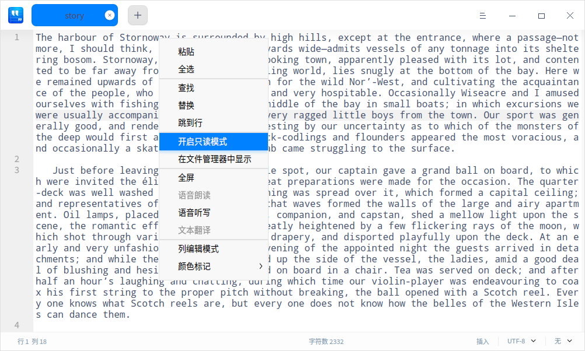
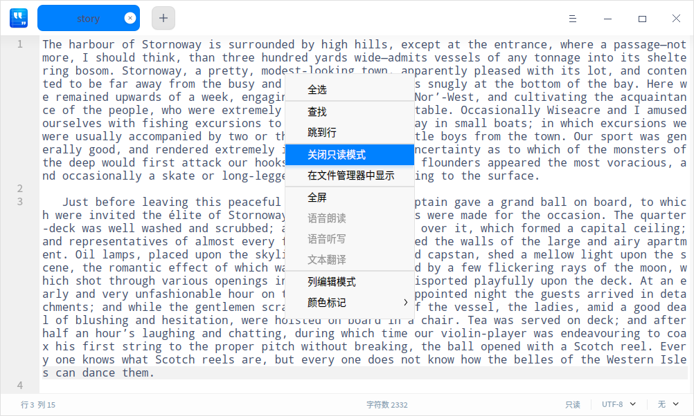
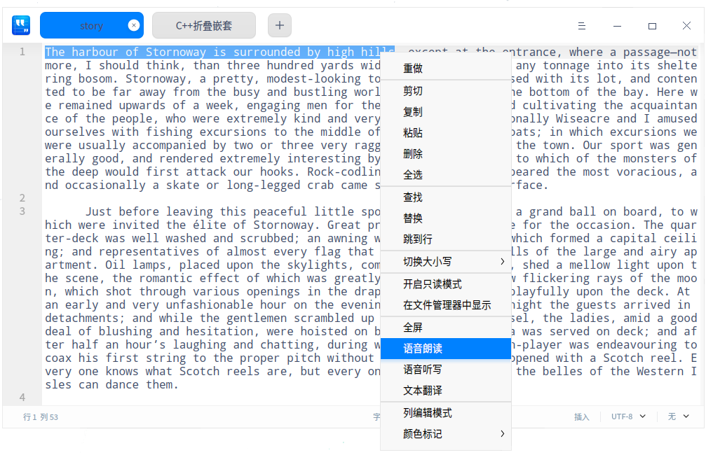
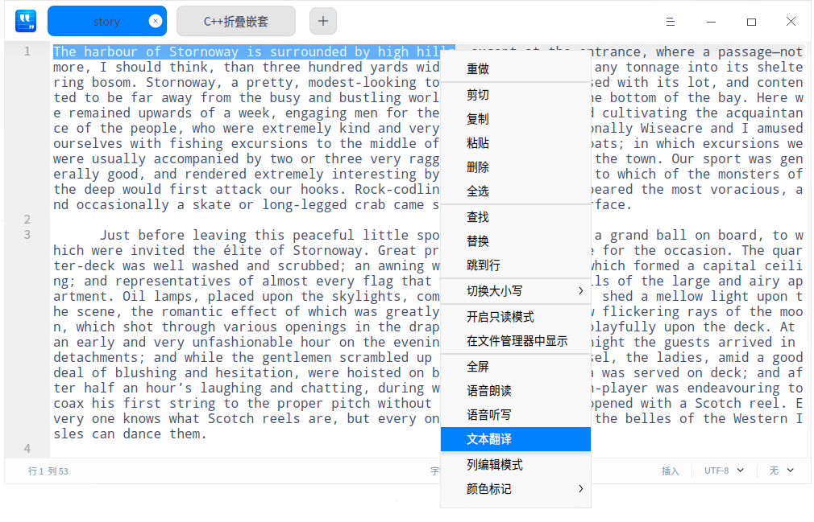
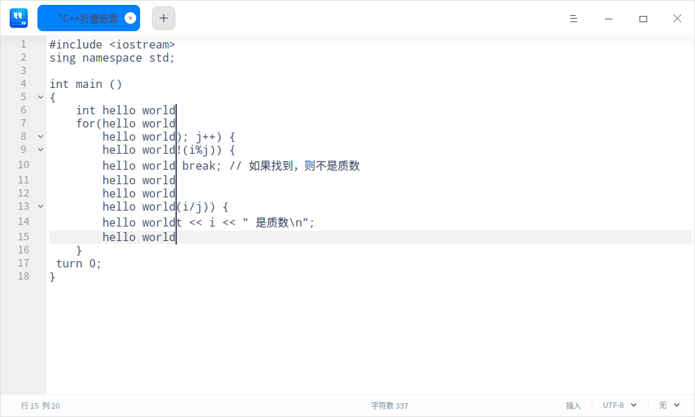

# 文本编辑器|../common/deepin-editor.svg|

## 概述

文本编辑器是一个简单的文本编辑工具。您可以用它书写简单的文本文档，也可以使用它的高级特性，让它成为一个代码编辑工具，支持代码语法高亮。

## 使用入门

### 运行文本编辑器

1. 单击桌面底部的 ，进入启动器界面。
2. 搜索或浏览找到文本编辑器 图标并打开。
3. 在启动器中，右键单击文本编辑器图标，您可以：

 - 单击 **发送到桌面**，在桌面创建快捷方式。
 - 单击 **发送到任务栏**，将应用程序固定到任务栏。
 - 单击 **开机自动启动**，将应用程序添加到开机启动项，在电脑开机时自动运行该应用。

### 退出文本编辑器

- 在文本编辑器界面，单击 ，退出文本编辑器。
- 在文本编辑器界面，单击主菜单  > **退出** 来退出文本编辑器。
- 在任务栏右键单击 ，选择 **关闭所有** 来退出文本编辑器。

### 查看快捷键

在文本编辑器界面上，按下键盘上的 **Ctrl + Shift + ?** 组合键来查看快捷键。您也可以在设置界面查看快捷键。熟练地使用快捷键，将大大提升您的操作效率。

## 基本操作

### 管理标签页

- 新建标签页/窗口

   - 单击标签页上的  或  > **新标签页** 或使用组合键 **Ctrl + T** 创建一个新的标签页。
   - 单击 > **新窗口** 或使用组合键 **Ctrl + N** 创建一个新的窗口。

- 调整标签页/窗口

   - 拖拽同一窗口内的标签页重新排序。
   - 滚动鼠标切换同一窗口内的标签页。
   - 移出标签页创建一个新的窗口，或者从一个窗口移到另外一个窗口中。

- 关闭标签页/窗口

   当窗口中仅有一个标签页时，关闭标签页的同时也会关闭窗口。
   - 使用 **Ctrl + W** 组合键关闭当前标签页。
   - 单击标签页上的  按钮或者单击鼠标中键，关闭当前标签页。
   - 右键单击标签页，选择 **关闭标签页** 、**关闭其他标签页** 或 **更多关闭方式** 来关闭标签页。

   > 说明：如果您的文件发生了变化而没有保存，文本编辑器会在关闭前提示您保存更改。

### 打开文件

您可以采用以下方式打开一个或同时打开多个文本文件，选中的文件会在新标签页打开：

- 直接拖动文件到文本编辑器界面或其图标上。
- 右键单击文件，选择用文本编辑器打开。选择文本编辑器为默认打开程序后，可直接双击打开。
- 在文本编辑器界面，单击  > **打开文件**，选择文件。
- 在文本编辑器界面，使用 **Ctrl + O** 组合键，选择文件打开。

### 保存文件
- 单击  > **保存**，保存文件。
- 使用 **Ctrl + S** 或 **Ctrl + Shift + S** 组合键保存当前文件。

### 打印文件

在文本编辑器中使用打印，需要提前连接并配置好打印机。

1. 单击  > **打印**，也可以使用组合键 **Ctrl + P** 打开打印预览。
2. 在打印预览界面，您可以预览文件，选择打印机并设置打印页面。
3. 在打印预览界面，单击 **高级设置**，可配置纸张大小、打印方式等相关参数。
4. 单击 **打印** 即可将文件发送到打印机打印。

## 编辑文本

### 移动光标

除使用方向键和鼠标单击移动光标，您还可以使用以下快捷键迅速移动光标：

| 功能   |  快捷键 |
| --------------- | ------------ |
| 保存光标位置 | Ctrl + Shift + > |
| 重置光标位置（跳转到上次光标保存的位置） | Ctrl + Shift + < |
| 右移一个词 （光标向右跳过一个词） | Ctrl + 右方向键 |
| 左移一个词 （光标向左跳过一个词） | Ctrl + 左方向键 |
| 移动到行尾 | End |
| 移动到行头 | Home |
| 移动到文本结尾 | Ctrl + End |
| 移动到文本开头 | Ctrl + Home |
| 移动到行缩进 | Ctrl + M |
| 向右匹配 （光标移动到右括号的后面） | Alt + P |
| 向左匹配（光标移动到左括号的前面） | Alt + N |

### 切换大小写

此功能帮助您更改选中文本的大小写。您可以将选中文本全部改为小写字母，大写字母，或者让首字母大写。

1. 选中待更改的文本内容。
2. 单击右键，选择 **切换大小写**。
3. 选择 **大写**/**小写**/**首字母大写 **选项。文本格式的更改会立即生效。

您也可以使用快捷键 **Alt + U/ L/ C** 迅速切换大小写。

### 高亮文本

文本编辑器支持高亮不同类型的文本。
单击底部状态栏最右侧的三角符号， 选择某种文本类型。若文本中有相应内容则会自动高亮。

### 删除文本
除了向左或向右逐个删除字符外，您还可以使用以下快捷键迅速删除字符：

| 功能   |  快捷键 |
| --------------- | ------------ |
| 删除到行尾 | Ctrl + K |
| 删除当前行 | Ctrl + Shift + K |
| 向左删除一个词 | Alt + Shift + N |
| 向右删除一个词 | Alt + Shift + M |

### 撤销操作

如果在文本编辑时发生误操作, 您可以使用组合键 **Ctrl + Z** 取消这个操作， 或者在右键菜单中选择 **撤销**。

### 查找文本

1. 单击  > **查找 **或使用组合键 **Ctrl + F** 可以在下方打开查找窗口。
2. 在查找窗口中输入您想要搜索的文本。
3. 单击 **下一个**、**上一个** 逐个查找，或使用 **Enter** 键查找下一个匹配项。
4. 按下 **Esc** 键或单击关闭按钮，关闭查找窗口。

> 窍门：如果您使用鼠标选中一段文本，然后按 **Ctrl + F** 进行搜索，则这段文本会自动出现在查找窗口中。

### 替换文本
1. 单击  > **替换** 或使用组合键 **Ctrl + H** 可以在下方打开替换窗口。
2. 在替换窗口中输入您想要替换的文本以及新文本。
3. 单击 **替换** 逐个替换，单击 **剩余替换**、**全部替换** 一次性替换剩余的或所有的匹配文本。单击 **跳过** 不替换当前匹配的文本。
4. 按下 **Esc** 键或单击关闭按钮，关闭搜索窗口。

### 跳到行
使用该功能可以迅速跳转到任一行。
在右键菜单中选择 **跳到行** 或者使用 **Ctrl + G** ，输入行号即可跳转到相应行。

### 编辑行

您可以使用以下快捷键迅速编辑行：

| 功能   |  快捷键 |
| ------------ | ------------ |
| 向上插入一行（在上方插入一行） | Ctrl + Enter |
| 向下插入一行（在下方插入一行） | Ctrl + Shift + Enter |
| 复制并粘贴当前行 | Ctrl + Shift + D |
| 上移一行（与上一行交换位置） | Ctrl + Shift + Up |
| 下移一行（与下一行交换位置） | Ctrl + Shift + Down |
| 向上滚动一行 | Super + Shift + Up |
| 向下滚动一行 | Super + Shift + Down |
| 设置标记 | Alt + H |
| 取消标记 | Alt + Shift + H |
| 复制行 | Super + C |
| 剪切行 | Super + X |
| 合并行 | Ctrl + J |

### 开启/关闭只读模式

1. 使用文本编辑器打开文档，单击右键，选择 **开启只读模式**。
2. 在只读模式下，单击右键，选择 **关闭只读模式**。

### 语音朗读

在“控制中心”>“辅助功能”中开启语音朗读、语音听写功能后，可以执行如下操作。

1. 单击右键，选择 **语音听写**，通过麦克风语音输入后，转译文字将被编辑在文档中。
2. 选择一段文字后，单击右键，选择 **语音朗读**，语音播报选中的文字。

   > 说明：当未选择文字时，右键菜单中 **语音朗读** 不可激活，处置灰状态。

### 文本翻译

在“控制中心”>“辅助功能”中开启文本翻译并选择语言后，可以执行以下操作。
1. 在文本编辑器界面选择一段文本后，单击右键，选择 **文本翻译**，可将该段文本内容翻译成目标语言。

### 列编辑

在文本编辑器界面，按住键盘上的 **Alt** 键不放，鼠标左键单击多列启动列编辑模式，为多行代码同时编辑相同的内容，提高工作效率。

### 颜色标记

在文本编辑器界面，鼠标右键选择 **颜色标记**，在其下拉列表中进行选择。

   - **添加标记**：对某一行或某一段文本内容添加颜色标记；有8种颜色按钮可供选择。
      + 将光标定在某一行，标记当前所在的行。
      + 选中一段文本内容后，标记选中的文本内容。
   - **标记所有**：将文本内容全部标记或对已选中的文本内容，在全文中标记匹配项；有8种颜色按钮可供选择。
      + 将光标定在任意一行，将文本内容全部标记。
      + 选中一段文本内容，在全文中标记匹配项。

   - **清除上次标记**：清除上次标记操作。
   - **清除所有标记**：清除当前所有标记。

### 书签管理

在文本编辑器界面，您可以为任意一行的文本内容添加一个书签，将鼠标移至左侧栏任意一行处会显示 ，添加成功后该行的书签图标会变为蓝色填充的图标 。

- 添加书签

  + 鼠标左键单击 ，为该行添加书签。
  + 鼠标右键单击 ，选择 **添加书签**，为该行添加一个书签。
  + 将光标定在文本中任意一行，使用组合键 **Ctrl + F2** 为该行添加一个书签。

- 删除书签

  + 鼠标左键单击已填充颜色的书签图标，直接删除该行书签。
  + 鼠标右键单击已填充颜色的书签图标，选择 **取消书签**，删除该行书签。
  + 鼠标右键单击书签图标，选择 **清除所有书签**，删除该文本的全部书签。

   >说明：鼠标移到左侧行号前面才会显示书签图标，移出书签区域，书签图标消失。添加书签后，该图标一直显示。 

### 注释管理

在文本编辑器界面，您可对扩展名为.cpp 、.java 、.py等代码类型的文件进行添加注释的操作。

- 添加注释
    + 选中一段文本内容，在右键菜单中选择 **添加注释**。
    + 选中一段文本内容，使用组合键 **Alt + A** 添加注释。
    
- 取消注释
    + 选中一段已添加注释的文本内容，在右键菜单中选择 **取消注释**。
    + 选中一段已添加注释的文本内容，使用组合键 **Alt + Z** 取消注释。

   >说明：支持不同代码语言的注释，具体以实际为主。例如C，C#，Java注释符号为 //，Python 注释符号为 #。

## 主菜单

在主菜单中，您可以 [新建窗口](#新建文件)、[新建标签页](#新建文件)、[查找文本](#查找文本)、[替换文本](#替换文本)、[保存文件](#保存文件)、切换窗口主题、查看帮助手册、了解文本编辑器的更多信息。

### 设置

您可以对基础信息、快捷键和高级信息进行设置。

#### 基础设置

1. 单击 > **设置**。
2. 在基础设置选项，您可以选择：
 - 设置字体样式，选择字体和字号。
 - 勾选 **自动换行**，在编辑区自动换行。
 - 勾选 **代码折叠标志**，在左侧栏显示  或者 按钮，右键单击按钮选择折叠/展开当前层次或所有层次。
 - 勾选 **显示行号**，在左侧栏显示行号。
 - 勾选 **显示空白制符/制表符**，显示文本中的空白字符和制表符，您也可手动输入或删除空白字符和制表符。

   > 窍门：您还可以使用 **Ctrl + “+”/ “-” ** 来调节文本编辑器的默认字号。使用 **Ctrl + 0** 恢复默认字号。

#### 快捷键设置

1. 单击  > **设置**，在 **快捷键** 选项查看当前快捷键。
2. 选择一种快捷键映射。
3. 单击快捷键编辑框，可以自定义快捷键。

   > 说明: 快捷键映射允许您选择某一种键盘快捷键。您可以使用标准快捷键，Emacs快捷键，或自定义快捷键，以符合您的使用习惯。

#### 高级设置

1. 单击  >**设置**。
2. 在 **高级设置** 选项，您可以设置：
   - 窗口默认大小为：正常窗口，最大化或全屏。
   - Tab字符宽度：Tab缩进所占用的空间大小。

   > 注意：单击设置界面上的 **恢复默认**，会将所有设置恢复到默认状态。

### 主题

窗口主题包含浅色主题、深色主题和跟随系统主题。

1. 在文本编辑器界面，单击 。
2. 单击 **主题**，选择一个主题颜色。

### 帮助

查看帮助手册，进一步了解和使用文本编辑器。

1. 在文本编辑器界面，单击 。
2. 单击 **帮助**。
3. 查看文本编辑器的帮助手册。

### 关于

1. 在文本编辑器界面，单击 。
2. 单击 **关于**。
3. 查看编辑器的版本和介绍。

### 退出

1. 在文本编辑器界面，单击 。
2. 单击 **退出**。

文档更新时间: 2021-01-15 版本: 5.9
