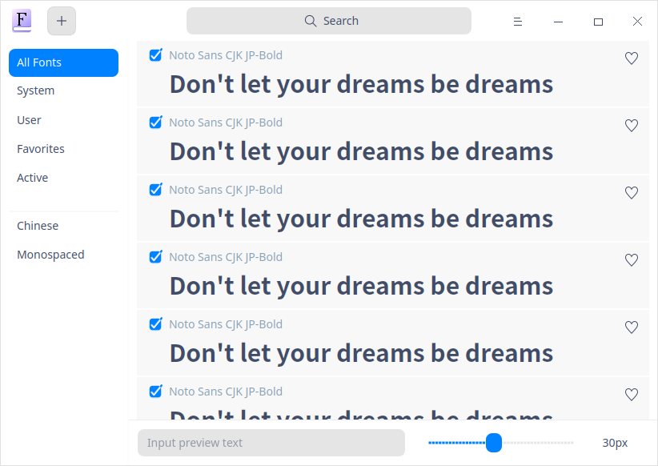
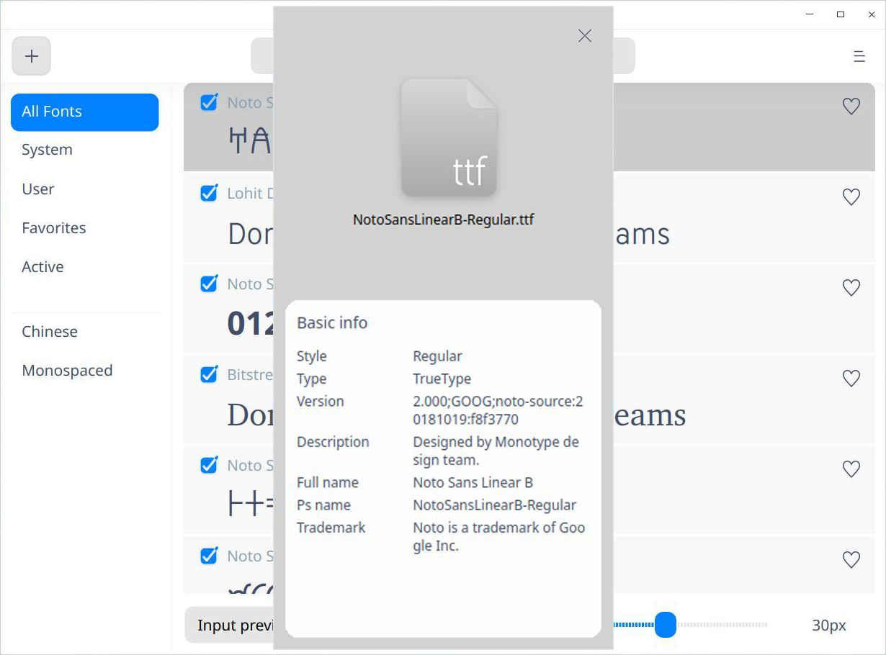

# Font Manager|../common/deepin-font-manager.svg|

## Overview

Font manager is a powerful font management tool. With Font Manager, you are not only able to search, install, enable, disable, and delete fonts among others, but also preview fonts by inputting texts and setting the text size. 

It supports fonts in ttf, ttc, and otf formats.

## Guide

You can run, exit, and create shortcuts for Font Manager in the following ways.

### Run Font Manager

1. Click  in the dock to enter the Launcher interface.
2. Locate  by by scrolling the mouse wheel or searching "font manager" in the Launcher interface, and click it to run.
3. Right-click  , and you can:

   - Click **Send to desktop** to create a desktop shortcut
   - Click **Send to dock** to fix it in the Dock.
   - Click **Add to startup** to add the application to startup, and it will automatically run when the system starts up.

### Exit Font Manager

- Click  on the Font Manager interface to exit Font Manager.
- Right-click  in the dock, and select **Close All** to exit.
- Click  on the Font Manager interface, and select **Exit** to exit.

## Operation

### Introduce Interface

| Name       | Description                                                  |
| ---------- | ------------------------------------------------------------ |
| All fonts  | A collection of system fonts and user fonts, with all fonts displayed by default. |
| System     | Font lists that come with the system. The fonts in this font set cannot be deleted or disabled. |
| User       | Font lists installed by the user.                            |
| Favorites  | Your favorite font lists, i.e. the collection of fonts selected from other font sets. |
| Active     | All font collections under the startup status.               |
| Chinese    | Chinese characters in all font sets, displaying the Chinese name. |
| Monospaced | All fonts with the same character width.                     |

### Install Fonts

With Font Manager, you can not only install a single font but also install multiple fonts in a batch.

#### Single Font Installation

1. On the Font Manager interface, click  or select > **Add font**.
2. Select the font file to be installed, right-click and select **Open**, or double-click the font file to open Font Manager for installation.
3. Please enter the authorization password in the pop-up authorization window (if any).
4. Right-click the font file after successful installation, and select **Display in file manager** to view the specific installation location.

>  Tips: You can also right-click the font file, select **Open with** >  **Font Manager** to enter the Font Manager interface, and install the font.

>  Notes: Font Manager will detect your fonts automatically. If the font has been installed locally, a prompt message will pop up to advise you that an identical version has already been installed. You can select **Exit** or **Continue** to exit or continue the installation.

#### Batch Installation

You can add multiple fonts in a batch at one time by dragging or selecting files in the Font Manager. Please refer to [Single Font Installation](#Single Font Installation) for the installation steps. Pay attention to the following during batch installation:

- You can install a single font or batch fonts after successful batch installation.
- Re-installation can be performed for fonts which are already installed locally during batch installation.

>  Notes: If you want to use the installed font as your system font, you can open the **Control Center**, click **Font** in **Personalization**, and set the font as **Standard Font**.

### Search Fonts

1. In the search box on top of the Font Manager interface, you can click to enter keywords.

2. Press the Enter key on the keyboard to conduct searching.
   - When there is matched information, the search result lists will be displayed on the interface. 
   - When there is no matched information, **No search results** will be displayed on the interface.

3. When there are matched fonts, you can preview the contents matching with the search criteria by entering texts in the bottom text preview box, and dragging the control bar horizontally to adjust the font size.

4. Click  or delete the entered information in the search box to clear the current search criteria or cancel the search.

### Export Fonts

1. On the Font Manager interface, right-click the font and select **Export**.

2. A prompt message **The font exported to your desktop** pops up, and disappears several seconds later.

   The exported font is saved in the desk folder by default, with Font as its default folder name.

>  Notes: Single and batch font(s) export are supported. Only the latest version of the same font is exported. No copy will be exported. System font cannot be exported.

### View Basic Font Information

You can view the basic font information via Font Manager.

1. Right-click the font and select **Details** in the font sets list on the Font Manager interface.

2. You can view the font icon, name, style, type, version, and description information.

### View Font Installation Location

When the font is installed successfully, you can view its installation location via File Manager.

Right-click and select **Display in file manager** in the font sets list on the Font Manager interface to view the specific installation location.

### Preview Fonts

Each text block of the font in the font sets presents the corresponding font style, and you can view the display effect by previewing fonts.

The default preview copy is **Don't let your dreams be dreams**, and is displayed in English.

1. Enter texts in the font preview input box at the bottom on the Font Manager interface.
2. Set the font size by dragging the control bar horizontally.
3. View the display effect in the font set list.

   >  Notes: Drag the scroll bar to the left to reduce the font size, and drag it to the right to enlarge the font size. The font size ranges from 6px to 60px.

### Favorite/Unfavorite Fonts

You can favorite or unfavorite a font via Font Manager.
1. Click **All Fonts** on the Font Manager interface.
2. Click the  icon to the right of a row in the list.
3. View the font in the **Favorites** List. The status is changed to **Favorite** .
4. Click the  icon in the **All Fonts** lists. The unfavorite font will not be displayed in the **Favorites** list, and the font status displayed in other font set lists is changed to **Unfavorite** .
5. In the **All Fonts** list,  you can also right-click and select **Favorite** or **Unfavorite**.

>  Notes: Favorite/Unfavorite are available for a single font and a batch of fonts.

### Enable/Disable Fonts

You can enable or disable a font in the Font Manager interface.

1. Select the font with **Disabled** status in the **User** list on the Font Manager interface.
2. Check the font. The font will be enabled and displayed in the **Active** list. 
3. Click the checked font in the **Active** list to disable the font. The disabled font will not be displayed in the **Active** list, and is grayed out in other font set lists with a **Disabled** status.
4. You can also right-click and select **Enable** or **Disable** in the **User** list to complete the corresponding operation. 

>  Notes: Enable/Disable functions are available for a single font and a batch of fonts. System font and font currently being used can not be disabled.

### Delete Fonts

You can delete a font in the Font Manager interface.

>  Notes: Delete function is available for a single font and a batch of fonts. System font and font currently being used can not be deleted.

1. Select a font in the **User** list on the Font Manager interface, right-click and select **Delete**.
2. Click **Delete** in the pop-up box.
3. Enter the authorization password in the pop-up authorization dialogue (if any) to delete the font.

## Main Menu

On the main menu, you can view help manual and get more information about Font Manager.

### Help

1. On the Font Manager interface, click .
2. Click **Help** to view the manual of Font Manager.

### About

1. On the Font Manager interface, click .
2. Click **About** to view the version and introduction of Font Manager.

### Exit

1. On the Font Manager interface, click .
2. Click **Exit** to exit Font Manager.