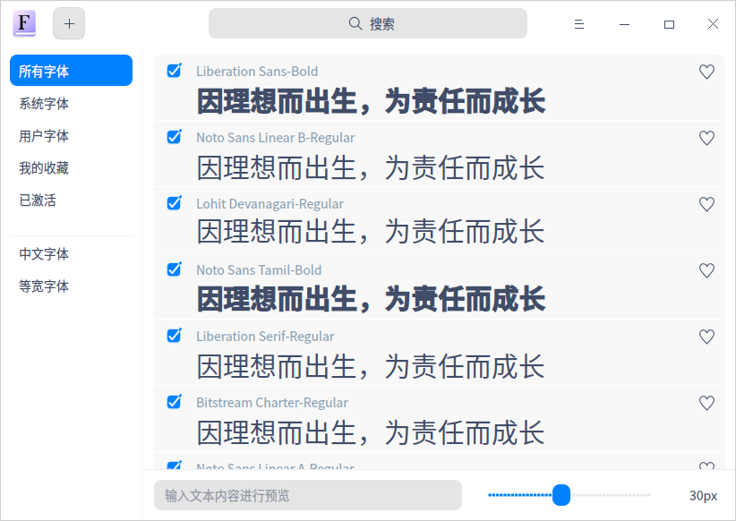
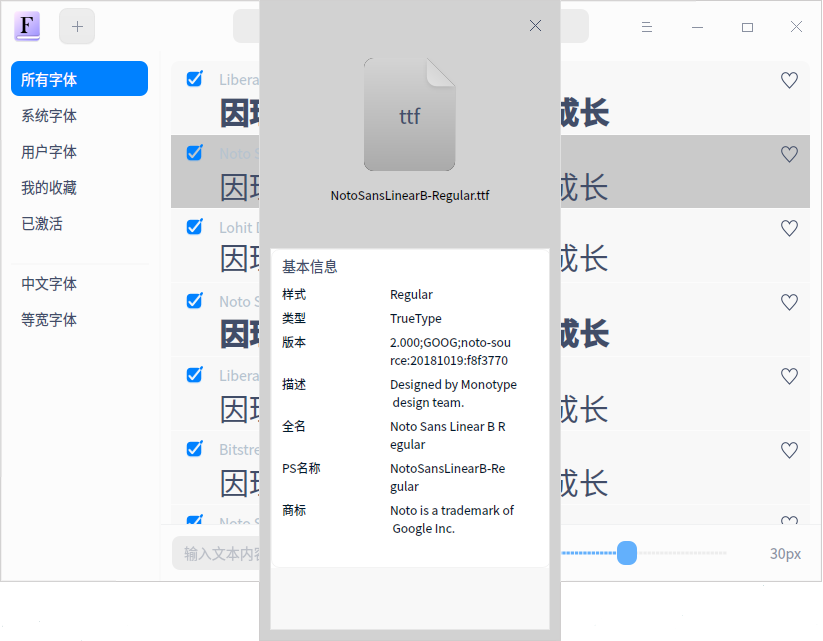
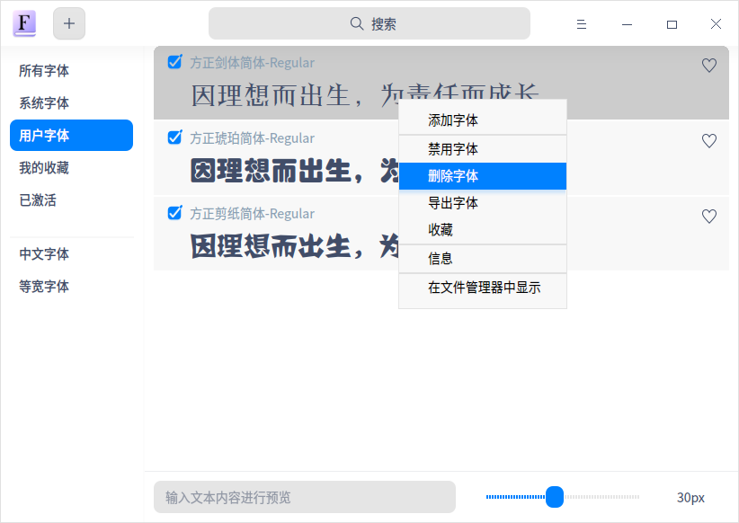

# 字体管理器|../common/deepin-font-manager.svg|

## 概述

字体管理器是一款功能强大的字体管理工具，可以帮助用户安装字体，并且具有查找、启用、禁用、收藏、删除字体等功能，还可以通过输入文本内容、设置文本大小进行字体预览。

字体管理器支持安装的字体格式有ttf、ttc、otf。

## 使用入门

您可以通过以下方式运行或关闭字体管理器，或者创建字体管理器的快捷方式。

### 运行字体管理器

1. 单击任务栏上的启动器图标 ，进入启动器界面。
2. 上下滚动鼠标滚轮浏览或通过搜索，找到字体管理器图标 ，单击运行。
3. 右键单击 ，您可以：

   - 单击 **发送到桌面**，在桌面创建快捷方式。
   - 单击 **发送到任务栏**，将应用程序固定到任务栏。
   - 单击 **开机自动启动**，将应用程序添加到开机启动项，在电脑开机时自动运行该应用。

### 关闭字体管理器

- 在字体管理器界面单击 ，退出字体管理器。
- 在任务栏右键单击 ，选择 **关闭所有**，退出字体管理器。
- 在字体管理器界面单击 ，选择 **退出**，退出字体管理器。

## 操作介绍

### 界面介绍

| 名称     | 说明                                                       |
| -------- | ---------------------------------------------------------- |
| 所有字体 | 系统字体和用户字体的集合，默认显示所有字体。               |
| 系统字体 | 系统自带的字体列表，不能被禁用和删除。     |
| 用户字体 | 用户安装的字体列表。                                         |
| 我的收藏 | 用户收藏的字体列表。 |
| 已激活   | 启用状态的所有字体合集。                                   |
| 中文字体 | 所有字体中的中文字体。                     |
| 等宽字体 | 所有字体中字符宽度相同的字体。                             |

### 安装字体

字体管理器可以安装单个字体，也可以批量安装多个字体，您可以通过以下方式进行安装。

- 在字体管理器界面，单击  或  > **添加字体**，或右键单击字体，选择 **添加字体**。
- 双击字体文件。
- 右键单击字体文件并选择 **打开方式** > **字体管理器**，进入字体管理器界面，安装字体。
- 将字体文件拖拽到字体管理器界面或图标上。

> 说明: 
> - 字体管理器会自动检测您的字体，如果本地已经安装过该字体，会显示已安装相同版本的提示信息，此时可以选择  **退出**  或 **继续** 安装操作。
> - 您可以打开 **控制中心** > **个性化** > **字体** 来设置 **标准字体**。

### 预览字体

字体集中字体的每个文本块呈现着字体的样式，可以通过预览字体来体验字体的显示效果。

默认预览文案中文为“因理想而出生，为责任而成长”。

1. 在底部字体预览输入框中输入文本内容。
2. 通过左右拖动滑块设置字体大小，在字体集列表中查看字体显示效果。

   > 说明：向左滑动为缩小字体，向右滑动为放大字体，字体大小范围为6px - 60px。

### 搜索字体

1. 在字体管理器搜索框中，单击 。
2. 输入关键字，实时展示搜索结果。
3. 在搜索框中单击 ，或删除搜索框中输入的信息，即可清除当前输入的搜索条件或取消搜索。

### 导出字体

1. 在用户字体列表，右键单击字体。
2. 选择 **导出字体** 导出该字体。

导出字体默认存储路径：桌面文件夹；文件夹默认名称：字体

> 说明：既支持导出单个字体，也支持批量导出字体，系统字体不能被导出。

### 收藏/取消收藏字体

当您需要收藏或取消收藏字体时，可以使用字体管理器执行该操作。
1. 选择一个未被收藏的字体并单击其右侧  图标，或右键单击该字体，选择 **收藏**。
2. 选择一个已被收藏的字体并单击其右侧  图标，或右键单击该字体，选择 **取消收藏**。

   被收藏的字体会在“我的收藏”列表中显示。

> 说明：既支持收藏/取消收藏单个字体，也支持批量收藏/取消收藏字体。

### 启用/禁用字体 

您可以在字体管理器中启用或禁用“用户字体”。用户字体默认为已启用状态。

1. 在用户字体列表，取消已勾选的字体状态，或右键单击该字体，选择 **禁用字体** 来禁用该字体。
2. 勾选被禁用的字体，或右键单击该字体，选择 **启用字体** 来启用该字体。

   已启用的字体会在“已激活”列表中显示。

> 说明：既支持启用/禁用单个字体，也支持批量启用/禁用字体，系统字体和系统正在使用的用户字体不能被禁用。

### 查看字体基本信息

您可以通过字体管理器查看字体基本信息。

1. 在字体管理器界面，右键单击字体。
2. 选择 **信息**，查看该字体具体信息。

### 查看字体安装位置

1. 在字体管理器界面，右键单击字体。
2. 选择 **在文件管理器中显示**，查看该字体的安装位置。

### 删除字体

当您需要删除字体时，可以使用字体管理器执行该操作。

> 说明：既支持删除单个字体，也支持批量删除字体，系统字体和系统正在使用的用户字体不能被删除。

1. 在 **用户字体** 列表，右键单击字体选择 **删除字体**。
2. 在弹出的提示对话框中单击 **删除** 。

## 主菜单

在主菜单中，您可以切换窗口主题、查看帮助手册，了解字体管理器的更多信息。

### 主题

窗口主题包含浅色主题、深色主题和系统主题。

1. 在字体管理器界面，单击 。
2. 单击 **主题**，选择一个主题颜色。

### 帮助

查看帮助手册，进一步了解和使用字体管理器。

1. 在字体管理器界面，单击 。
2. 单击 **帮助**。
3. 查看字体管理器的帮助手册。

### 关于

1. 在字体管理器界面，单击 。
2. 单击 **关于**。
3. 查看字体管理器的版本和介绍。

### 退出

1. 在字体管理器界面，单击 。
2. 单击 **退出**。

文档更新时间: 2021-08-10 版本: 5.8
