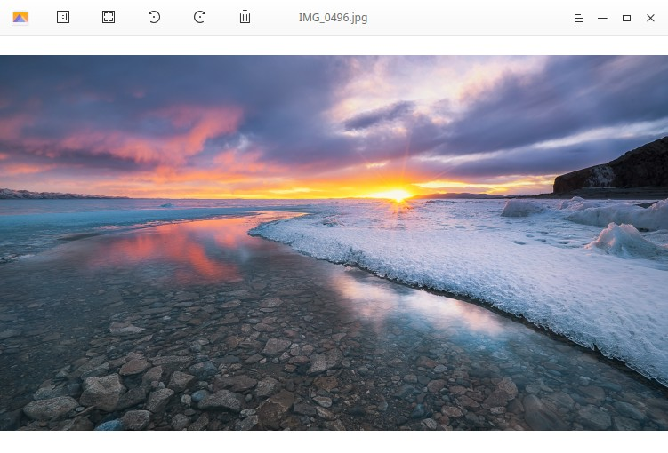
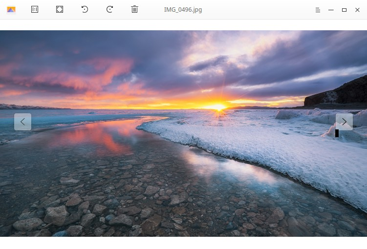
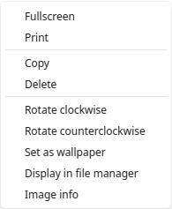
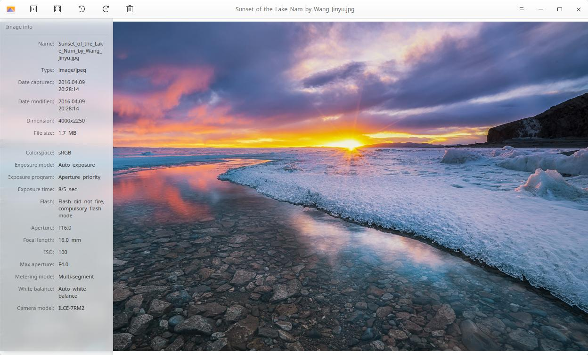

# Image Viewer|../common/deepin-image-viewer.svg|

## Overview

Deepin Image Viewer is a lightweight image viewer with fashion interface and smooth performance. It supports multiple image formats, user can view any kind of image. 

## Guide

User can run, close and create shortcut for Deepin Image Viewer by the following ways.

### Run Deepin Image Viewer

1. Click  on dock to enter Launcher interface.
2. Locate  by scrolling mouse wheel or searching by "Deepin Image Viewer" in Launcher interface.
3. Right click on , user can
 - Click on **Send to desktop** to create a desktop shortcut.
 - Click on **Send to dock** to fix the application on dock.
 - Click on **Add to startup** to add the application to startup, it will automatically run when the system starts up.

### Close Deepin Image Viewer

1. In Deepin Image Viewer interface, click on  to exit Deepin Image Viewer.
2. Right click on  on dock, select **Close all** to exit Deepin Image Viewer.
3. Click on  and select **Exit** to exit Deepin Image Viewer.

## Image Viewing

### Open Image
You can use one of the following ways to open image files:

- Right click on an image, select **Open with** > **Deepin Image Viewer**. 
- Double-click an image to open it, if Deepin Image Viewer has been set as the default application for image viewing.
- Open Deepin Image Viewer, click **Open Image** and select the image file to open it.
- Open Deepin Image Viewer, drag the image to the interface to open it.
- Drag the image to Deepin Image Viewer icon on desktop or dock to open it.

> : In Control Center, user can set Deepin Image Viewer as the default image viewer. Specific operations refer to [Default Application Settings](dman:///dde#Default Application Settings).

### Main Interface

<table class="block1">
    <caption></caption>
    <tbody>
        <tr>
            <td></td>
            <td>1:1 Size</td>
            <td>The image will show in 1:1 size without changing the size of the window. </td>
        </tr>
    	<tr>
            <td></td>
            <td>Fit to window</td>
            <td>The image will resize to adapt to the current window.</td>
        </tr>
        <tr>
            <td></td>
            <td>Rotate clockwise</td>
            <td>Rotate the image 90 degrees clockwise.</td>
        </tr>
        <tr>
            <td></td>
            <td>Rotate counterclockwise</td>
            <td>Rotate the image 90 degrees counterclockwise.</td>
        </tr>
        <tr>
            <td></td>
            <td>Delete</td>
            <td>Delete the current image.</td>
        </tr>
        <tr>
            <td></td>
            <td>Previous</td>
            <td>Switch to previous image.</td>
        </tr>
        <tr>
            <td></td>
            <td>Next</td>
            <td>Switch to next image.</td>
        </tr>
    </tbody>
</table>

> : In 1:1 size mode, if the image size exceeds the window, a navigation window will appear at the lower right corner, which helps user to fast locate image areas. User can click on the top right corner of navigation window to close it, then it won't automatically show next time. In 1:1 size mode, user can **Hide/Show navigation window** in the context menu.

### Print Image

User can print image in Deepin Image Viewer.

1. Right click on the image in Deepin Image Viewer interface and select **Print**.
2. Choose a printer and set the print options.
3. Click on **Print ** to send the picture to the printer.

> ：If you selected a PDF printer, you'll need to choose a location for the printed pdf file.

### Copy Image

User can copy images in Deepin Image Viewer.

1. Right click on the image in Deepin Image Viewer interface and select **Copy**.
2. On the target place, right click on the blank area and select **Paste** to copy image to the place.

> ：It copies both the path and the content of picture.

### Delete Image

User can delete images from Deepin Image Viewer by the following ways.

- Click on the  icon on the Deepin Image Viewer interface. 
- Right click on the image and select **Delete**.
- Click on the image and press .

### Rotate Image

1. Right click on the image in Deepin Image Viewer interface and select **Rotate clockwise** or **Rotate counterclockwise**.
2. The image will rotate clockwise or counterclockwise for 90 degrees.

### Set Image as Wallpaper

User can set an image as the desktop wallpaper. Right click on the image in Deepin Image Viewer interface and select **Set as wallpaper**.

### View Image Information

User can view the detailed information of the image.
1. Right click on the image in Deepin Image Viewer interface and select **Image info**.
2. An information window will pop up at the left side of Deepin Image Viewer interface.

## Main Menu

### Dark Theme

1. On Deepin Image Viewer interface, click on .
2. Select **Dark Theme**.
3. The interface will switch to dark theme.

### Help
Click "Help" to get the manual, which will help you further know and use Deepin Image Viewer.

1. On Deepin Image Viewer interface, click on .
2. Click on **Help** to view the manual of Deepin Image Viewer.

### About

1. On Deepin Image Viewer interface, click on .
2. Click on **About** to view the version and introduction of Deepin Image Viewer.

### Exit

1. On Deepin Image Viewer interface, click on .
2. Click on **Exit** to exit Deepin Image Viewer.
