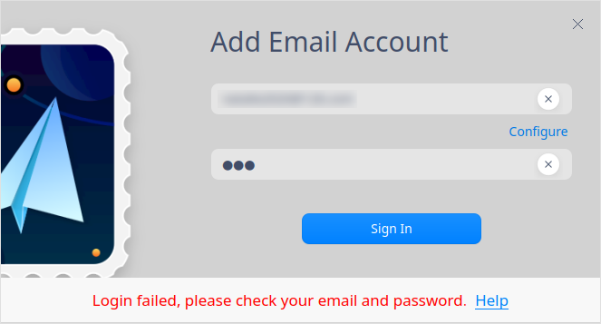
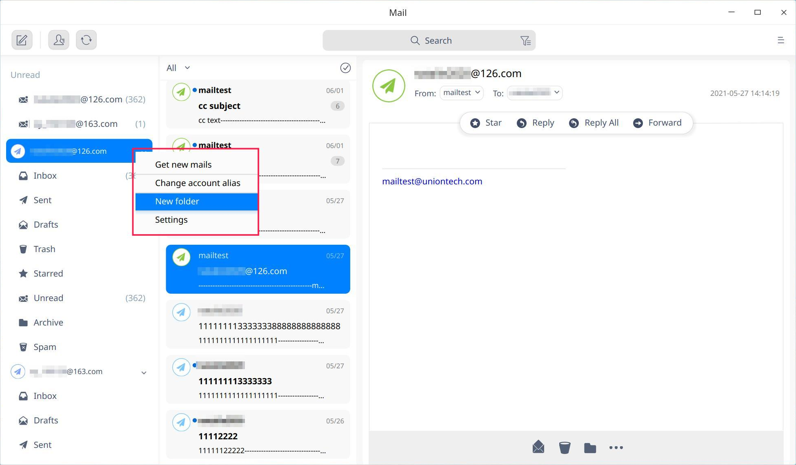
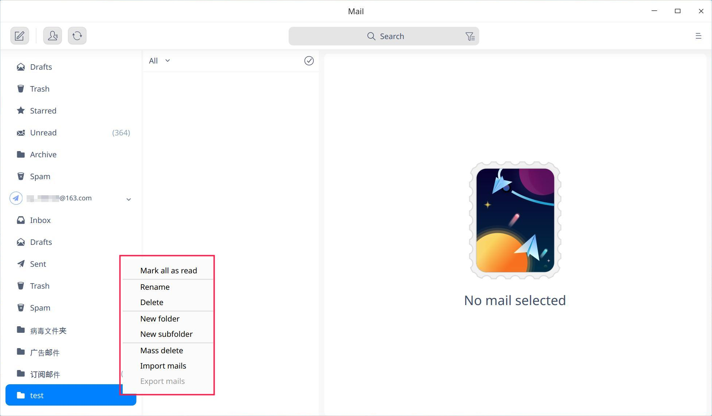
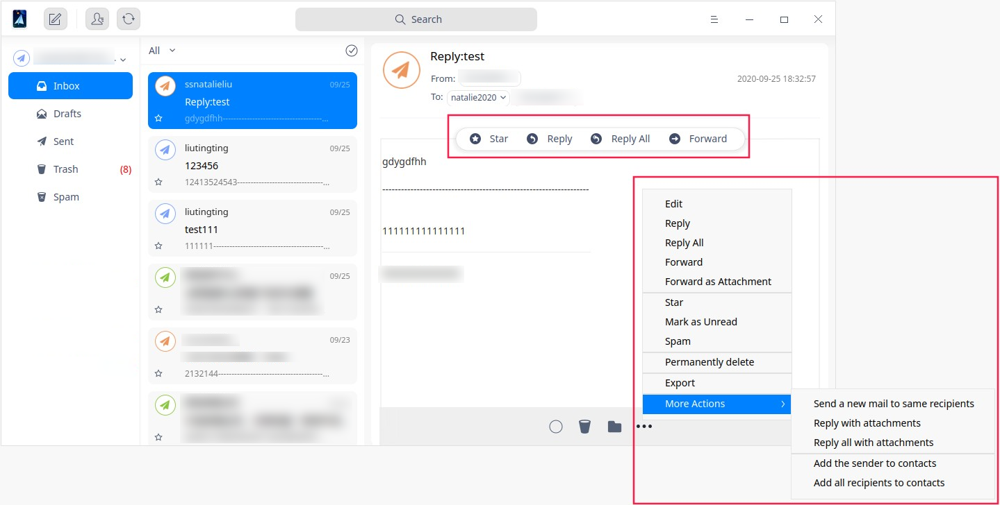
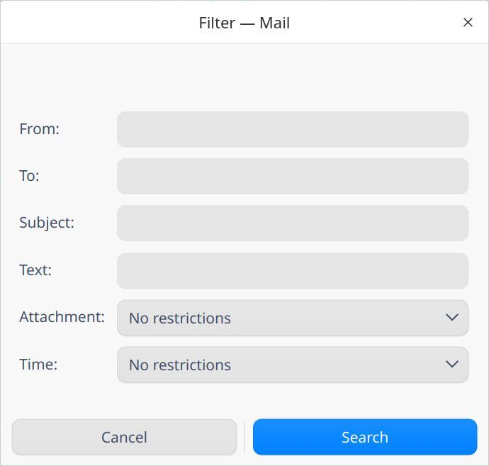
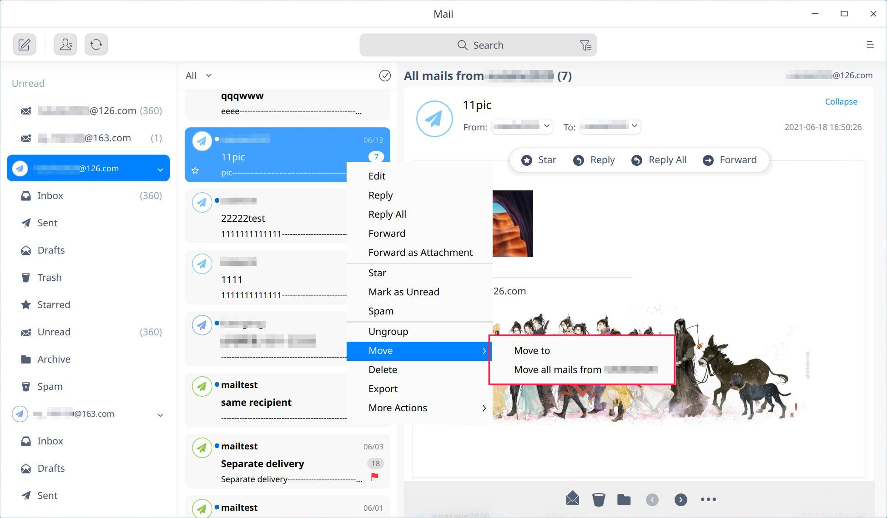
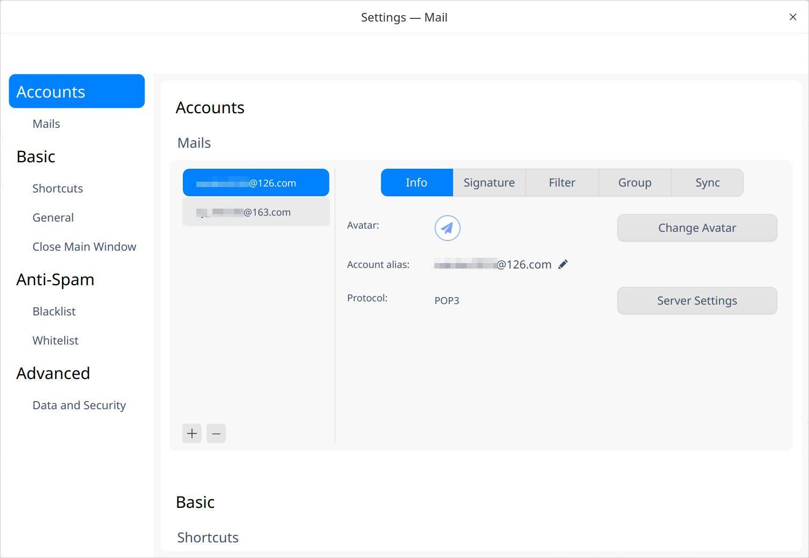
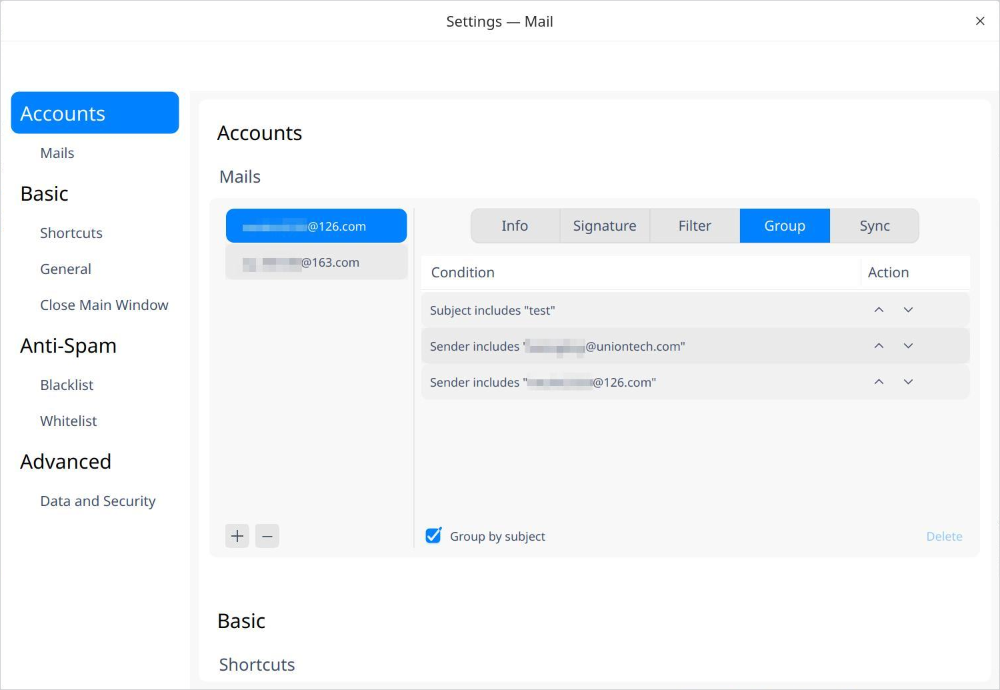

# Mail|../common/deepin-mail.svg|

## Overview

Mail is an easy-to-use desktop e-mail client supporting IMAP and POP3, which can manage multiple mailbox accounts at the same time.

## Guide

You can run, close or create a shortcut of Mail as follows.

### Run Mail

1. Click    in the lower left corner of the dock to enter launcher interface.
2. Locate by scrolling the mouse wheel or searching "Mail" in the Launcher interface and click it to run. 
3. Right-clickto:
   - Select **Send to desktop** to create a shortcut on the desktop.
   - Select **Send to dock** to fix it onto the dock.
   - Select **Add to startup** to add it to startup. When the computer starts up, Mail runs automatically.

### Exit Mail

- On Mail interface, click  to exit.
- Right-clickon Dock and select  **Close All** to exit.
- On Mail interface, click   and select  **Exit**.

## Sign In

1. Open Mail, enter your Email address and password and click **Sign In**. 

   > Tips: click  to view Help manual of Mail.

  

2. The program will automatically detect whether the entered Email address suffix is in the server database or not: 

   - If it is, you can sign in directly;

   - If it's not, you can click **Configure** to add it.

     
> Notes: Mailboxes such as QQ mailbox, Netease mailbox (163.com and 126.com), Sina mailbox and so on can be used in Mail only after POP3 / IMAP / exchange and other services are enabled. After enabling the service, the server will generate an authorization code. Enter the email address and authorization code in the sign-in interface to sign in. If it fails, click **Help** to view more information.

## Main Interface

The main interface of Mail is composed of items and functions such as account, mailbox directory, mail list, mail body, compose, get new mails, and search. 

<table class="block1">
    <caption>Main Interface</caption>
    <tbody>
        <tr>
            <td width="20px">1</td>
            <td width="100px">Compose</td>
            <td>You can write a mail quickly.</td>
        </tr>
        <tr>
            <td>2</td>
            <td>Contacts</td>
            <td>A list of contacts is displayed here. You can also add information such as the contact's telephone number and address.</td>
        </tr>
         <tr>
            <td>3</td>
            <td>Get new mails</td>
            <td>To synchronize mailbox data from server, including mails, address book, calendar, etc.</td>
        </tr>
        <tr>
            <td>4</td>
            <td>Search</td>
            <td>To quickly find locally loaded mails.</td>
        </tr>
        <tr>
            <td>5</td>
            <td>Main Menu</td>
            <td>To set the mailbox, switch themes, view manual, etc.</td>
        </tr>         <tr>
            <td>6</td>
            <td>Account</td>
            <td>It displays a list of all mailbox accounts added.</td>
        </tr>
        <tr>
            <td>7</td>
            <td>Mailbox directory</td>
            <td>The mailbox directory is used to sort out mail data. Different categories of mailbox directories may be different. In addition to the general fixed directory, the others are created by users.</td>
        </tr>
         <tr>
            <td>8</td>
            <td>Mail list</td>
            <td>It displays all mails in the mailbox directory, including the sender, subject, abstract, sending time and star status.</td>
        </tr> 
          <tr>
            <td>9</td>
            <td>Mail body</td>
            <td>It displays the email title, sender and receiver information, time and content.</td>
        </tr> 
   </tbody>
   </table>

## New Mailbox Directory

Mailbox directory is used to sort and collate mail data. The mailbox directory of different protocols may be different, please take the actual situation as the case may be. For example, the mailbox account of pop protocol has a starred mail directory, which is used to store the starred mails.

In addition to the general, fixed directory, you can create new mailbox directories.

1. In the main interface, right-click the mailbox account and select **New folder**.

2. After entering the folder name, the new mailbox directory is created.

3. Right-click the new mailbox directory to rename, create subfolders, mass delete and so on.

## Compose

1. On the main interface, click to enter mail composing page.
2. Enter the receiver's mailbox account or click   to add a receiver from Contacts, you can also choose whether to "CC" or "BCC" or not. 
3. The e-mail body supports rich text editing, including inserting pictures and links, adding attachments and signature, and so on. The default signature is your mailbox account. Click "Signature" drop-down box to edit your signature. 
4. After editing is finished, click **Send**.  Click  to select **Send separately** or **Send later** to select a time for the mail to be sent.

## Get New Mails

"Get new mails" is to synchronize mailbox data from the server, including mail, contacts, etc. The system synchronizes mailbox data every 15 minutes by default. In the Main Menu > Settings, you can select the amount of mails to receive every time and auto receive intervals.

Here are two ways to receive email:

- Select an account, click.
- Select an account and right-click, select **Get new mails**.

## View Mails

1. Click **All** in the mail list to view all mails, unread mails, starred mails, mails with attachments or mails @ me. 
2. After a mail is selected in the mail list, you can view its subject, sender/receiver(s), time and the mail body. If you select several mails, the mail bodies would not be displayed. 
   - Hold **Ctrl** key, click mails in order to select multiple mails at a time;
   - Click mail A and hold **Shift** key, and then click mail B to select all mails displayed between mail A and B.

3. Click the sender's/receiver's mailbox to view the sender's/receiver's details and correspondence, and you can add them to the Contacts as well.

   

4. In the mail body area, you can edit, forward, star, move, delete the mail or do other operations.  

## Search Mails

The searching functions helps you to find the locally loaded mail you need quickly. 

1. Click  in the main interface, input the keywords, then you can select "Subject", "Text", "From", "To" to search mails.
2. Click  to filter mails more precisely. You can input information of sender/receiver, input subject/text keywords, and select attachment, period to do precise search.

   

## Group

"Grouping mails" means to group all mails by sender or keywords. The conditions you set here would be added to Main Menu > Settings > Accounts >Group automatically.

   - Group by sender: select a mail and right-click, select **Group** > **Group all mails from XXX**. Then all mails sent by XXX would be grouped together.
   - Group by keywords: select a mail and right-click, select **Group** > **Group by Subject**, an editing box pops up. Input keywords and click **Confirm**. Then mails whose subjects contain this keyword would be grouped together.

## Ungroup

Right-click the grouped mails and select **Ungroup**. And then the grouped mails would be displayed separately. Conditions in "Settings > Accounts > Group" would also be deleted automatically.

## Move Mails

You can move any mail(s) in the current folder to another; or move all mails from this sender.

## Delete Mails

Mails could be deleted individually or in batches. Generally, deleted mails will be stored in "Trash". You can also choose to delete them permanently in "Trash".

### Delete One Mail

There are two ways to delete one mail. 

- Select a mail in the mail list and right-click, select **Delete**. 
- In the mail body area, click.

### Delete in Batches

Select the specified directory to be deleted and right-click, and select **Mass delete**. You can delete the email according to periods, for example, one week ago or a month ago.

## Import Mails

In the mailbox directory list, select one directory and right-click to select **Import mails**. The interface of File Manager pops up, select the mails to be imported, and click **Open** to import the specified directory.

## Export Mails

Mails can be exported individually or in batch.

### Export One Mail

1. There are two ways to export one mail: 

   - Select a mail or several mails in the mail list and right-click, select **Export**. 

   - In the mail body area, click , and then select **Export**.

2. Select a storing path in File Manager and then click **Save**. 

### Export in Batches

Select the specified directory and right-click, and select **Export mails**. The interface of File Manager pops up, select a storing path and then click **Save**. 

## Contacts

On the main interface, click to enter Contacts. You can view the contacts list and information, and complete the contact phone number, address and other information. Click to add new contacts. 

## Main Menu

In main menu, you can set the mailbox, switch the window themes, and view the help manual. 

### Settings

Click   on the main interface and click **Settings**. You can set the accounts, basic settings, anti-spam and advanced settings. 

#### Accounts

In "Accounts" setting interface, you can add or delete accounts. Click  to add more accounts. Click  to delete accounts. You can set "Info", "Signature", "Filter", "Group" and "Sync" for each account.

**Info**: click **Info** to modify avatar, set account alias, and configure server.
**Signature**: the default signature is the mail account. Click **Signature** to edit current signature or add new signature.

**Filter**: click **Filter**. Multiple conditions could be set up to filter mails. When you receive mails that meet any one of the above mentioned conditions, special operation would be carried out. For example, when you receive mails from XXX, move them to "Spam" automatically.

Mails would be filtered by the rules set in the list from the top downwards. When there is any conflict among the rules, the topper one would be executed. One mail would be filtered by one rule at most, then it would not be filtered by others. 

**Group**: click **Group**, check **Group by subject**, mails with the same subject in the Inbox are grouped. The grouping condition selected in the mail list will also be automatically added to the selection box. For details, please refer to [Group](#Group).

**Sync**: click **Sync** to set the amount of mails to be received from the server.

#### Basic

**Shortcuts**: the shortcut keys for common operations.

**General**: settings "launch at system startup", "show an alert", and auto receive intervals, etc. 

**Close Main Window**:

   - Select **Minimize to system tray**. When you close the main window, it will be minimized to system tray.
   - Select **Exit**. When you close the main window, you will exit Mail directly.

     

#### Anti-Spam

**Blacklist**: All mails sent from the mailboxes listed in blacklist are rejected. You can add, export and import the blacklist.

**Whitelist**: All mails sent from the mailboxes listed in whitelist are received. You can add, export and import the whitelist.

#### Advanced

Based on the security consideration of mailbox data, you can enable security password. When there are no activities in 15 minutes, Mail will be locked automatically, and you should enter the password to unlock it. 

#### Restore Defaults

Click **Restore Defaults** to restore all your settings to defaults.

### Theme

The window theme includes Light Theme, Dark Theme and System Theme.

1. Click   on the main interface.
2. Click **Theme** to choose one theme.

### Help

Click Help to get the manual, which will help you further know and use Mail.

1. Click   on the main interface.
2. Click  **Help** to view the manual of Mail.

### About

1. Click   on the main interface.
2. Click **About** to view version information about Mail.

### Exit

1. Click   on the main interface.
2. Click  **Exit**.

Update Date: 2021-06-23 Version: 5.1
