# 邮箱|../common/deepin_mail.svg|

## 概述

邮箱是一款简单好用的邮件管理应用程序，支持IMAP和POP3协议，可同时管理多个邮箱帐号。

## 使用入门

您可以通过以下方式运行或关闭邮箱，或者创建快捷方式。

### 运行邮箱

1. 单击任务栏上的启动器图标，进入启动器界面。
2. 上下滚动鼠标滚轮浏览或通过搜索，找到邮箱图标，并单击运行 。
3. 右键单击，您可以：
   - 单击 **发送到桌面**，在桌面创建快捷方式。

   - 单击 **发送到任务栏**，将应用程序固定到任务栏。

   - 单击 **开机自动启动**，将应用程序添加到开机启动项，在电脑开机时自动运行该应用程序。

### 关闭邮箱

- 在邮箱主界面，单击   ，退出邮箱。
- 右键单击任务栏上的，选择 **关闭所有** 来退出邮箱。
- 在邮箱主界面单击  ，选择 **退出** 邮箱。

## 登录

1. 打开邮箱，在邮箱登录界面输入邮箱帐号、密码或授权码后，单击 **登录**。

   > 窍门：单击帮助按钮，可以查看邮箱的帮助手册。

   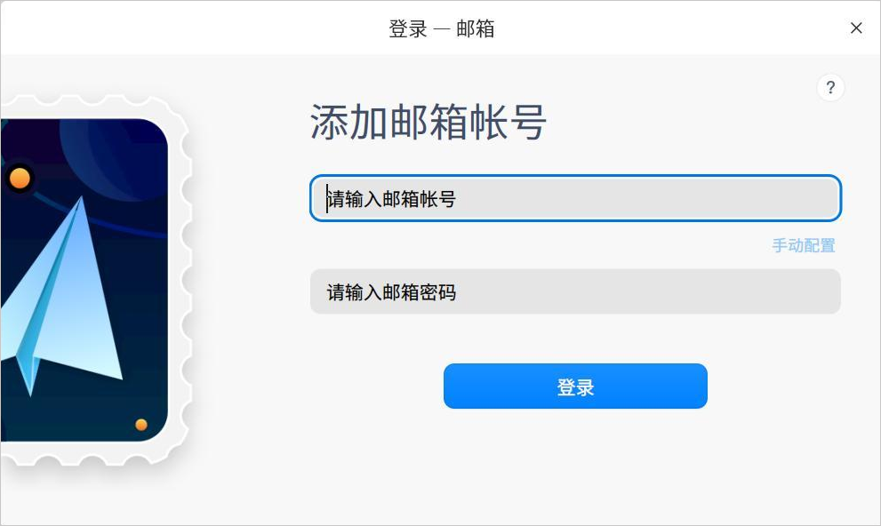

2. 程序会自动检测输入的邮箱后缀是否在服务器数据库中：

   - 如果邮箱后缀在服务器数据库中，则可直接登录；

   - 如果邮箱后缀不在服务器数据库中，则需单击 **手动配置** 手动添加。

     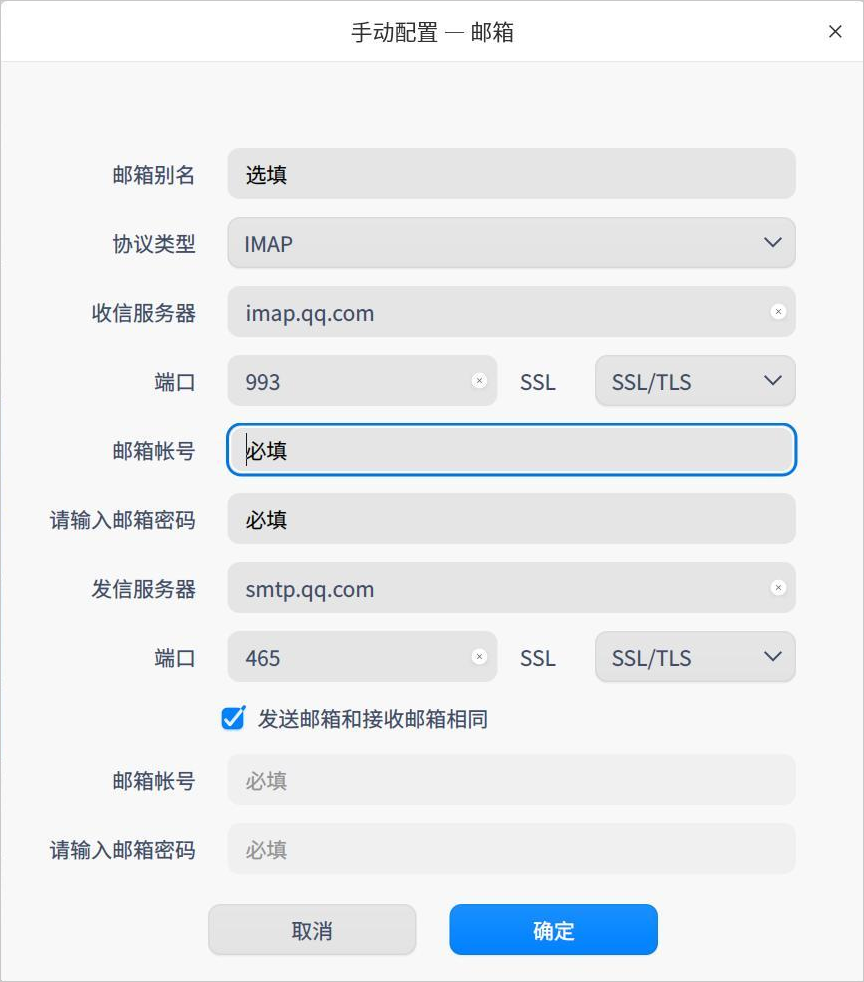
> 说明：QQ邮箱、网易邮箱（163.com及126.com）、新浪邮箱等需要开启POP3/IMAP/exchange等服务后才可以在邮箱中使用。开启服务后，服务端会产生授权码。在登录界面输入邮箱帐户及授权码即可登录邮箱。如果登录失败，单击 **查看帮助** 则可查看对应的帮助信息。
>
> 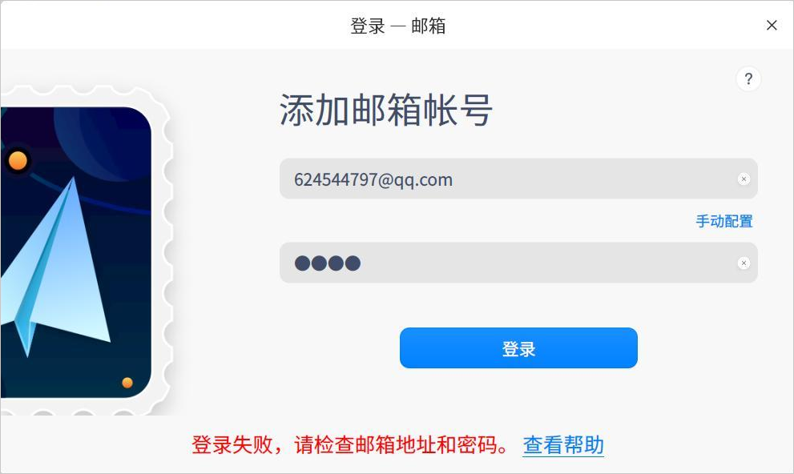

## 主界面

邮箱主界面由邮箱帐户、邮箱目录、邮件列表、邮件正文、写邮件、收邮件、通讯录、搜索等组成。

<table class="block1">
    <caption>主界面</caption>
    <tbody>
        <tr>
            <td width="20px">1</td>
            <td width="100px">写邮件</td>
            <td>快速开始写邮件。</td>
        </tr>
        <tr>
            <td>2</td>
            <td>通讯录</td>
            <td>展示通讯录列表及联系人的信息，同时可补充联系人电话号码、地址等信息。</td>
        </tr>
         <tr>
            <td>3</td>
            <td>收邮件</td>
            <td>从服务器同步邮箱数据，包括邮件，地址簿等信息。</td>
        </tr>
        <tr>
            <td>4</td>
            <td>搜索</td>
            <td>快速查找本地已加载的邮件。</td>
        </tr>
        <tr>
            <td>5</td>
            <td>主菜单</td>
            <td>进行邮箱相关设置、切换窗口主题，查看帮助手册等操作。</td>
        </tr>
         <tr>
            <td>6</td>
            <td>邮箱帐户</td>
            <td>展示添加的所有邮箱帐户列表。</td>
        </tr>
        <tr>
            <td>7</td>
            <td>邮箱目录</td>
            <td>邮箱目录用于分类整理邮件数据，不同类别的邮箱目录可能不同。除了通用固定目录外，还可以新建邮箱目录。</td>
        </tr>
         <tr>
            <td>8</td>
            <td>邮件列表</td>
            <td>展示邮箱目录下的所有邮件，显示内容包括：发件人、主题、摘要、发件时间及标星状态。</td>
        </tr> 
          <tr>
            <td>9</td>
            <td>邮件正文</td>
            <td>展示邮件标题、收发件人信息、时间及正文内容。</td>
        </tr> 
   </tbody>
   </table>

## 新建邮箱目录

邮箱目录用于分类整理邮件数据，不同协议的邮箱目录可能不同，请以实际情况为准。例如pop协议的邮箱帐号有星标邮件目录，用于存放星标邮件。

除了通用固定的目录外，还可以新建邮箱目录。

1. 在邮箱主界面，右键单击邮箱帐号，并选择 **新建文件夹**。

   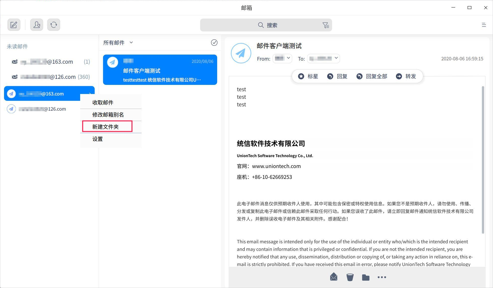

2. 输入文件夹名称后，新的邮箱目录创建完成。

3. 右键单击新的邮箱目录，可以进行重命名、创建子文件夹、批量删除等操作。

   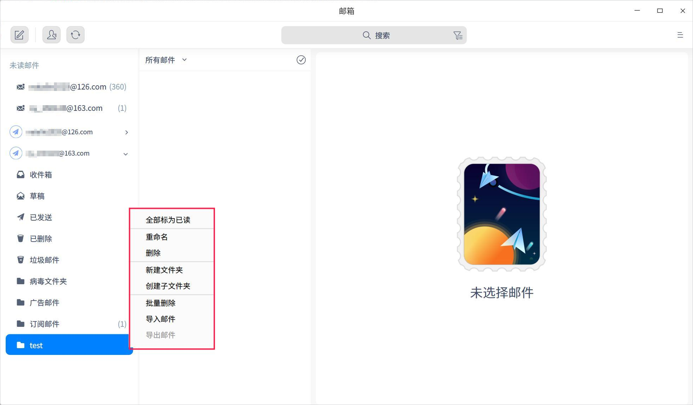

## 写邮件

1. 在邮箱主界面，单击写邮件按钮，进入写邮件界面。

2. 输入收件人邮箱帐号，或单击添加按钮 从通讯录中选择收件人，还可以选择抄送和密送。

3. 邮件正文支持富文本编辑，包括插入图片、链接等功能，支持添加附件、签名等功能。默认签名为您的邮箱帐号，单击 “签名” 下拉框，可以编辑签名信息。

4. 编辑完成后，单击 **发送** 即可。单击更多按钮，还可以选择定时发送、分别发送等。 

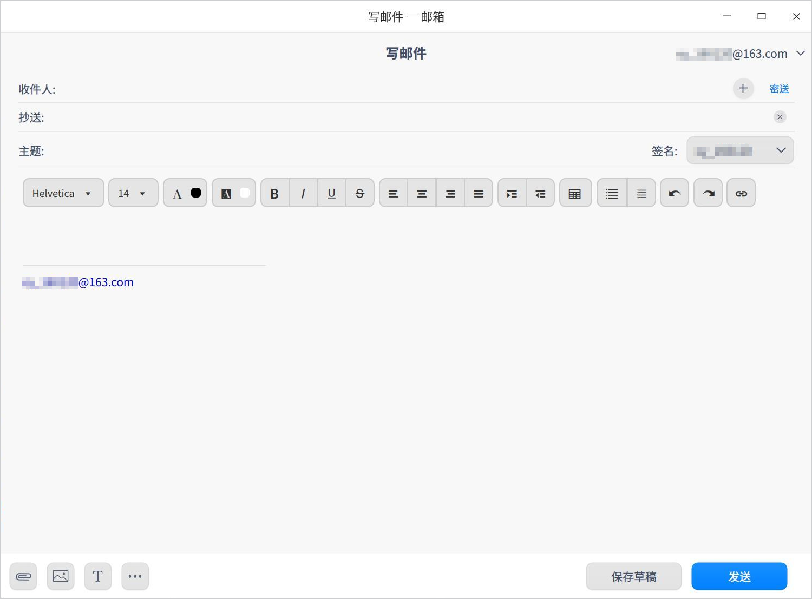

## 收邮件

收邮件是从服务器同步邮箱数据，包括邮件，通讯录等信息，系统默认每15分钟同步1次邮箱数据。在主菜单的邮箱设置界面中，可以选择每次收取邮件的数量和自动收件的时间间隔。

收取邮件有两种方式：

- 选中邮箱帐户，单击收取邮件按钮。

- 选中邮箱帐户并单击右键，选择 **收取邮件**。

## 查看邮件

1. 在邮件列表中单击 **所有邮件**，可以选择查看所有邮件、未读邮件、星标邮件、含附件或@我的邮件。

2. 单击选中的邮件后，可查看该邮件的主题、收发件人、时间及正文等信息。如果您选中多个邮件，则不会显示邮件内容。

   - 按住 **Ctrl** 键，用鼠标左键依次单击邮件，可选中多个邮件；

   - 用鼠标左键单击A邮件，然后按住 **Shift** 键 ，再用左键单击B邮件，可选中从A到B之间的所有邮件。

3. 单击发件人或收件人邮箱，可查看收发件人的详细信息及往来邮件，还可以将他们添加到通讯录。

   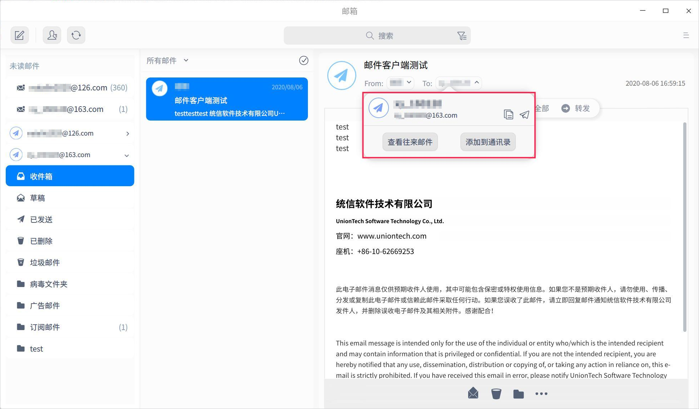

4. 在邮件正文区域，可以对邮件进行编辑、转发、标星、移动、删除等操作。

   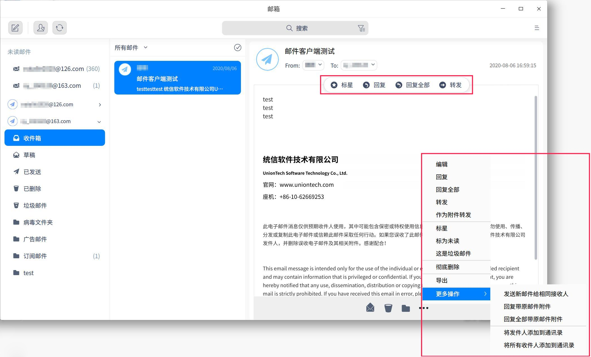

## 搜索邮件

邮件搜索功能可以快速定位本地已加载的邮件。

1. 在邮箱主界面单击搜索按钮，输入关键字后，可以选择 “主题” 、 “全文 ”、“发件人” 或 “收件人” 搜索邮件。

2. 单击筛选按钮，还可以进行更精确的搜索。在筛选界面，您可以输入发件人、收件人信息，输入主题、全文关键字，选择是否有附件、选择时间范围进行精确搜索。

   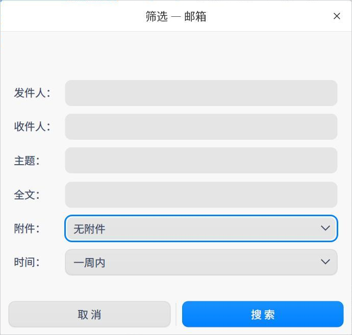

## 聚合邮件

聚合邮件可以将发件人或主题关键字相同的邮件聚合在一起，聚合条件则会自动添加到帐号设置界面的聚合页签中。

- 按发件人聚合：选中一个邮件并单击右键，选择 **聚合 > 聚合来自xxx的所有邮件**。所有来至xxx发件人的邮件都会聚合在一起。

- 按主题关键字聚合：选中一个邮件并单击右键，选择 **聚合 > 聚合特定主题关键字的所有邮件**，弹出选框。输入关键词后，单击 **确定**  后，邮件主题中包含该关键词的邮件都会聚合在一起。

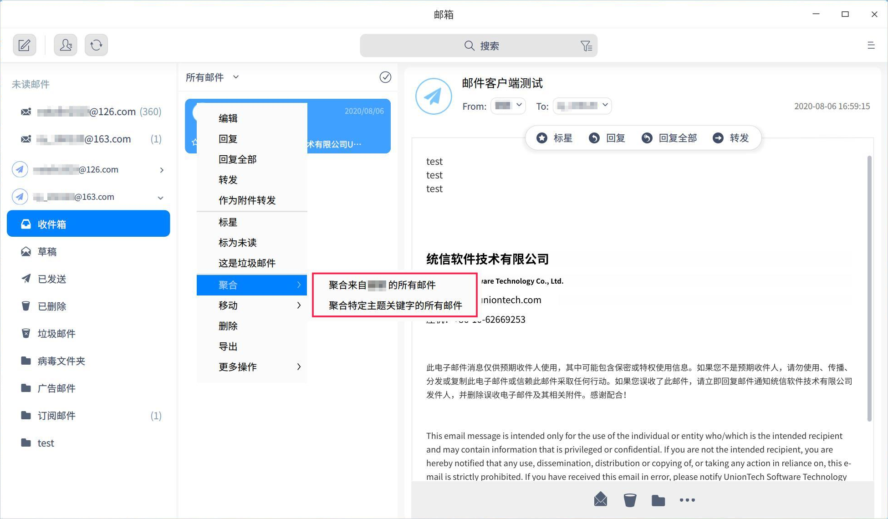

## 取消聚合邮件

右键单击已聚合的邮件，选择 **取消聚合**，已聚合的邮件则会分开显示，帐号设置界面的聚合页签中的聚合条件也会自动删除。

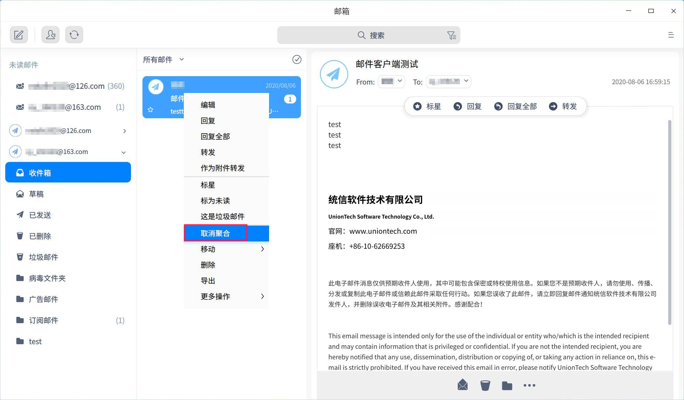

## 移动邮件

将当前文件夹的邮件移动到其他文件夹，可以移动一个邮件，或移动该发件人的所有邮件。

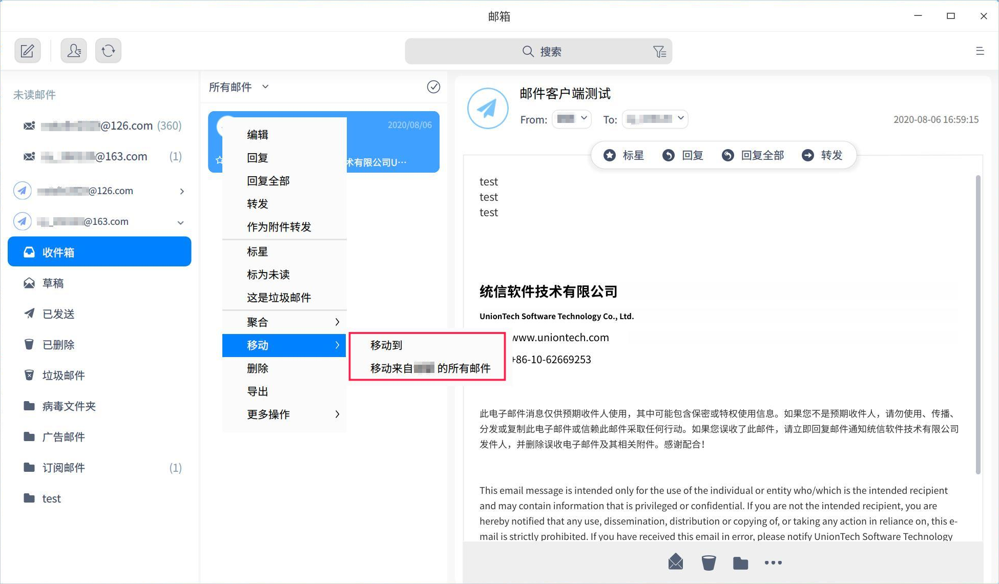

## 删除邮件

删除邮件可以选择单个删除或批量删除，删除后的邮件会存放到 “已删除” 目录，您还可以在 **已删除** 目录中永久删除邮件。

### 单个删除

单个删除邮件有两种方式：

- 在邮件列表选中一个或多个邮件并单击右键，选择 **删除**。
- 在邮件正文中，单击删除按钮。

### 批量删除

选中要删除的邮箱目录并单击右键，选择 **批量删除**，您可以删除一定时间范围内的邮件，如删除一周前，一个月前的邮件等。

## 导入邮件

在邮箱目录列表中，选中邮箱目录并单击右键，选择 **导入邮件**。弹出文件管理器窗口，选择需要导入的邮件后，单击 **打开** 即可导入到指定目录。

## 导出邮件

导出邮件可以单独导出，也支持批量导出。

### 单个导出

1. 单个导出邮件有两种方式：
   - 在邮件列表选中一个或多个邮件并单击右键，选择 **导出**。

   - 在邮件正文中，单击更多操作按钮后，选择 **导出**。
2. 弹出文件管理器窗口，选择存储路径后单击 **保存**。

### 批量导出

选中指定的邮箱目录并单击右键，选择 **导出邮件**，弹出文件管理器窗口，选择存储路径后单击 **保存**。

## 通讯录

在邮箱主界面，单击通讯录按钮，进入通讯录界面。可查看通讯录列表及联系人的信息，同时可补充联系人电话号码、地址等信息，单击还可以添加新联系人。

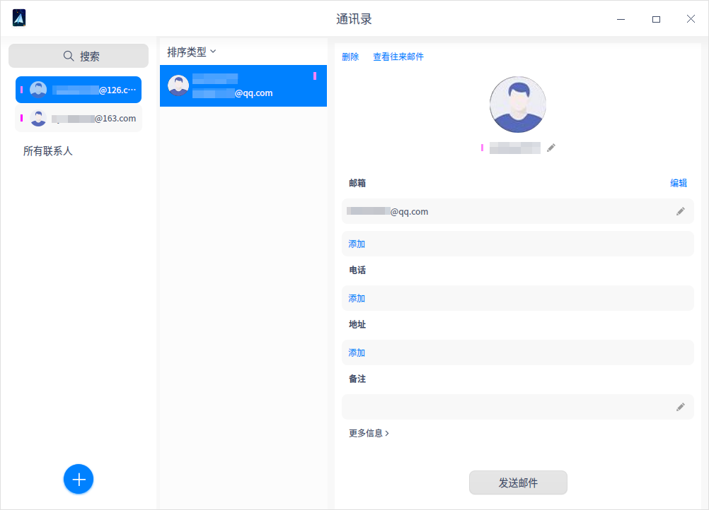

## 主菜单

在邮箱主菜单中，可以进行邮箱相关设置、切换窗口主题，查看帮助手册等。

### 设置

在邮箱主界面，单击 。进入邮箱设置界面，可进行帐号设置、基本设置、反垃圾设置及高级设置。

#### 帐号设置

在帐号设置界面，可以添加或删除邮箱帐号，单击添加按钮，可继续添加新的邮箱帐号。单击删除按钮后，可选择删除邮箱帐号。每个邮箱帐号都可以进行邮箱、签名、过滤规格、聚合、收件数量设置。

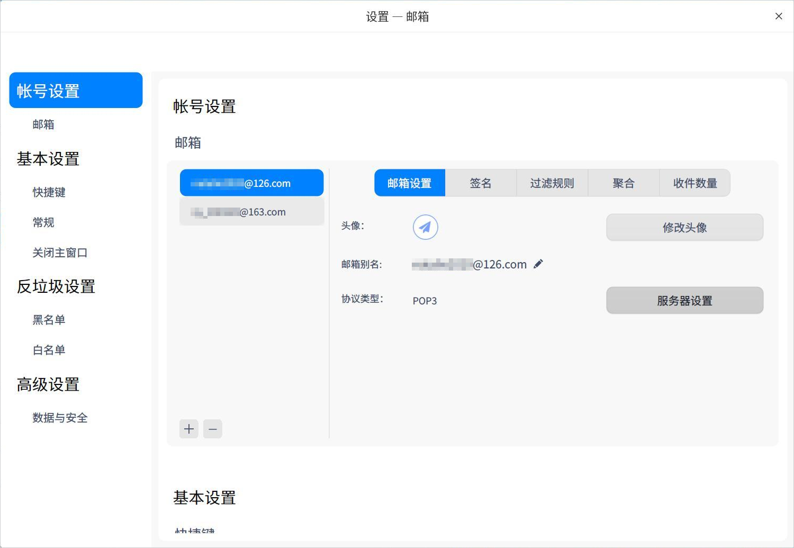
&nbsp;&nbsp;&nbsp;&nbsp;&nbsp;&nbsp;&nbsp;&nbsp;&nbsp;&nbsp;&nbsp;&nbsp;&nbsp;

**邮箱设置**：单击 **邮箱设置** 页签，可以修改头像，设置邮箱别名，配置服务器。

**签名**：默认签名为邮箱帐号，单击 **签名** 页签，可以编辑当前签名或添加新的签名。

**过滤规则**：单击 **过滤规则** 页签，可以设置多个条件对邮件进行组合过滤，只要满足一个条件的邮件就会执行特定操作。例如：当收到某人的邮件时直接移动到垃圾邮件。

邮件将按过滤规则列表从上至下的顺序进行检查，当规则出现冲突时执行较上方的规则，且同一封邮件仅能命中一条规则，之后将不再向下检查。

&nbsp;&nbsp;&nbsp;&nbsp;&nbsp;&nbsp;&nbsp;&nbsp;&nbsp;&nbsp;&nbsp;&nbsp;&nbsp;

**聚合**：单击 **聚合** 页签，勾选 **按主题聚合**后，收件箱中主题相同的邮件则会聚合在一起。在邮件列表中选择的邮件聚合条件也会自动添加到选框中，详细信息请参考 [聚合邮件](#聚合邮件)。

&nbsp;&nbsp;&nbsp;&nbsp;&nbsp;&nbsp;&nbsp;&nbsp;&nbsp;&nbsp;&nbsp;&nbsp;&nbsp;

**收件数量**：单击 **收件数量** ，可以设置从服务器收取邮件的数量。

#### 基本设置

**快捷键**：邮箱中常用操作的快捷键。

**常规设置**：邮箱开机启动、收件提醒及自动收件时间间隔等的基本设置。

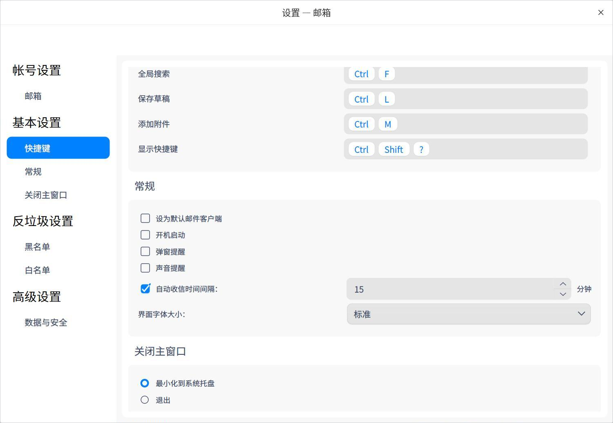
&nbsp;&nbsp;&nbsp;&nbsp;&nbsp;&nbsp;&nbsp;&nbsp;&nbsp;&nbsp;&nbsp;&nbsp;&nbsp;

**关闭主窗口**：

- 选择 **最小化到系统托盘**，关闭主窗口时，应用将隐藏到系统托盘。
- 选择 **退出**，关闭主窗口时直接退出应用。

#### 反垃圾设置

**黑名单**：在黑名单列表里的邮箱发过来的邮件全部拒收，可添加、删除、导出及导入黑名单。

**白名单**：在白名单列表里的邮箱发过来的邮件全部接收，可添加、删除、导出及导入白名单。

#### 高级设置

基于邮箱数据安全考虑，建议开启安全锁，设置开启密码。当鼠标和键盘超过15分钟未操作，邮箱将自动锁定，唤醒时需要输入开启密码。

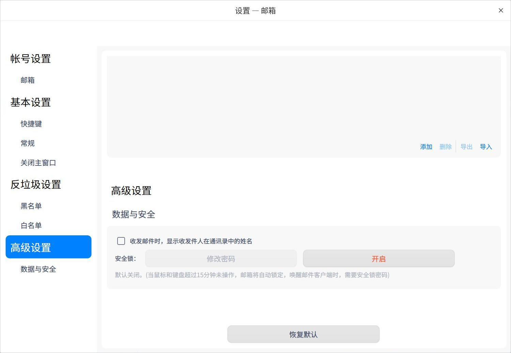

#### 恢复默认

单击 **恢复默认** ，可恢复当前页面为默认设置。

### 主题

窗口主题包含浅色主题、深色主题和系统主题。

1. 在邮箱主界面，单击。
2. 单击 **主题**，选择一个主题颜色。

### 帮助

1. 在邮箱主界面，单击 。
2. 单击 **帮助** ，查看帮助手册，进一步了解和使用邮箱。

### 关于

1. 在邮箱主界面，单击 。
2. 单击 **关于**，查看邮箱的版本和介绍。

### 退出

1. 在邮箱主界面，单击 。
2. 单击 **退出**。

文档更新时间: 2021-06-23 版本: 5.1
