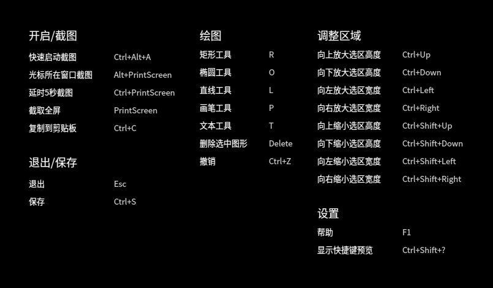
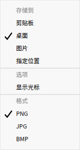

# h截图录屏|../common/deepin-screenshot.svg|

## 概述

截图录屏是一款集截图和录制屏幕于一体的工具。在截图或者录制屏幕时，既可以自动选定窗口，也可手动选择区域。

## 使用入门

通过以下方式运行、关闭截图录屏，同时还可以创建快捷方式。

### 运行截图录屏

1. 点击桌面底部的  ，进入启动器界面。
2. 上下滚动鼠标滚轮浏览或通过搜索，找到截图录屏  点击运行。
3. 右键单击  ，您可以：

   - 点击 **发送到桌面**，在桌面创建快捷方式。
   - 点击 **发送到任务栏**，将应用程序固定到任务栏。
   - 点击 **开机自动启动**，将应用程序添加到开机启动项，在电脑开机时自动运行该应用。

> 说明：如果截图录屏已经默认固定在任务栏上，您也可以点击任务栏上的  来运行。

### 关闭截图录屏

- 截图录屏会在截图结束后自动退出。
- 截图录屏会在录制结束后自动退出。
- 在截图录屏界面，点击 ，退出录屏。
- 按下键盘上的 Ctrl + S 组合键 或 esc 键。
- 在截图录屏界面，点击鼠标右键，选择 **保存** 或 **退出**。

## 操作介绍

### 截图

您可以通过多种方式来实现快速截图：

- 使用键盘上的  键来截取整个显示器的屏幕。
- 使用各个应用软件如腾讯 QQ、Chrome 浏览器等软件的截图功能。
- 使用专业的截图软件来截取屏幕，如操作系统自带的录屏截图软件。

#### 快捷键

通过快捷键来进行相关操作，省时又省力。

1. 在截图模式下，按下键盘上的 ++ 组合键，打开快捷键预览界面。
2. 在快捷键预览界面，您可以查看到所有的快捷键。

#### 选择截图区域

目前比较常用的有三种截图区域：全屏、程序窗口和自选区域。在截图时选中对应的区域，在区域四周会出现一个蓝色边框，并且该区域会亮度显示。

> 说明：当电脑多屏显示时，您也可以使用录屏截图来截取不同屏幕上的区域。

##### 选择全屏

选择全屏是识别当前显示器的整个屏幕。

&nbsp;&nbsp;&nbsp;&nbsp;&nbsp;&nbsp;&nbsp;&nbsp;&nbsp;&nbsp;&nbsp;&nbsp;&nbsp;

您可以通过操作以下步骤来选择全屏：

1. 按下键盘上的 ++ 组合键，进入截图模式。
2. 将鼠标指针移至桌面上，录屏截图会自动选中整个屏幕，并在其左上角显示当前截图区域的尺寸大小。
3. 点击桌面，在桌面的右下角会弹出工具栏。
4. 如果要退出截图，请点击工具栏上的  或点击鼠标右键选择 **退出**。

您也可以直接操作以下步骤来进行全屏截图：

- 如果您已经将录屏截图固定到任务栏，右键单击任务栏上的  ，然后选择截取全屏 。
- 按下键盘上的  键，实现全屏截图。

##### 选择程序窗口

选择程序窗口是自动识别当前的应用窗口。

&nbsp;&nbsp;&nbsp;&nbsp;&nbsp;&nbsp;&nbsp;&nbsp;&nbsp;&nbsp;&nbsp;&nbsp;&nbsp;

1. 按下键盘上的 ++ 组合键，进入截图模式。
2. 将鼠标指针移至打开的应用窗口上，录屏截图会自动选中该窗口，并在其左上角显示当前截图区域的尺寸大小。
3. 点击窗口，在窗口的右下角会弹出工具栏。
4. 如果要退出截图，请点击工具栏上的   或点击鼠标右键选择 **退出**。

##### 选择自选区域

选择自选区域是通过拖动鼠标，自由选择截取的范围。

&nbsp;&nbsp;&nbsp;&nbsp;&nbsp;&nbsp;&nbsp;&nbsp;&nbsp;&nbsp;&nbsp;&nbsp;&nbsp;

1. 按下键盘上的 ++ 组合键，进入截图模式。
2. 按住鼠标左键不放，拖动鼠标选择截图区域，在其左上角将实时显示当前截图区域的尺寸大小。
3. 释放鼠标左键，完成截图，在截图区域的右下角会弹出工具栏。
4. 如果要退出截图，请点击工具栏上的   或点击鼠标右键选择 **退出**。

#### 调整截图区域

您可以对截图区域进行微调，例如放大或缩小截取范围，移动截图等。

##### 放大/ 缩小截图区域

将鼠标指针置于截图区域的蓝色边框上，鼠标指针变为 。您可以：
- 按住鼠标左键不放，拖动鼠标来放大或缩小截图区域。
- 按下键盘上的 + 或  来上下扩展截图区域，按下键盘上的 + 或  来左右扩展截图区域。

&nbsp;&nbsp;&nbsp;&nbsp;&nbsp;&nbsp;&nbsp;&nbsp;&nbsp;&nbsp;&nbsp;&nbsp;&nbsp;

##### 移动截图位置

将鼠标指针置于截图区域上，鼠标指针变为 。您可以：
- 按住鼠标左键不放，拖动鼠标来移动截图区域的位置。
- 按下键盘上的  或  来上下移动截图区域，按下键盘上的  或  来左右移动截图区域。

#### 编辑截图

录屏截图自带的图片编辑功能，包括图形标记、文字批注等，完全可以满足您的日常图片处理需求。您还可以给图片打上马赛克，保护您的隐私。

您可以通过执行以下操作之一来编辑截图：

- 点击工具栏上的工具图标来编辑。
- 通过快捷键来快速切换各个编辑工具。
- 当选中截图区域后，点击鼠标右键来选择编辑工具。

#### 绘制图形

您可以在截取的图片中绘制一些简单的图形，如矩形、椭圆等。

##### 工具栏说明

在截图过程中，您可以点击工具栏及其对应属性栏上的各个图标以完成各项操作。运行录屏截图，通过鼠标选中截图区域后，工具栏会自动出现在截图的下方。

> 注意：如果您已经对工具栏和属性栏中，如线条粗细、字体大小等进行了设置，录屏截图会记住您的选择。当您下次启动录屏截图后，将默认使用该设置，您也可以重新进行选择。

<table class="block1">
    <caption>图标说明</caption>
    <tbody>
        <tr>
            <td></td>
            <td>矩形工具</td>
            <td class="blank"></td>
            <td></td>
            <td>椭圆工具</td>
        <td class="blank"></td>
            <td></td>
            <td>线条工具</td>
        </tr>
          <tr>
            <td></td>
            <td>画笔工具</td>
            <td class="blank"></td>
            <td></td>
            <td>文本工具</td>
            <td class="blank"></td>
            <td></td>
            <td>退出截图</td>
        </tr>
    </tbody>
</table>
&nbsp;&nbsp;&nbsp;&nbsp;&nbsp;&nbsp;&nbsp;&nbsp;&nbsp;&nbsp;&nbsp;&nbsp;&nbsp;

##### 矩形工具

&nbsp;&nbsp;&nbsp;&nbsp;&nbsp;&nbsp;&nbsp;&nbsp;&nbsp;&nbsp;&nbsp;&nbsp;&nbsp;

1. 在截图区域下方的工具栏中，点击 。
2. 在工具栏展开面板中，选择矩形边线的粗细。
3. 将鼠标指针置于截图区域上，鼠标指针变为 。
4. 按住鼠标左键不放，拖动鼠标以完成图形区域的绘制。
5. 如果截图中包含了个人隐私信息，请点击工具栏展开面板中的  或  来涂抹。

&nbsp;&nbsp;&nbsp;&nbsp;&nbsp;&nbsp;&nbsp;&nbsp;&nbsp;&nbsp;&nbsp;&nbsp;&nbsp;

&nbsp;&nbsp;&nbsp;&nbsp;&nbsp;&nbsp;&nbsp;&nbsp;&nbsp;&nbsp;&nbsp;&nbsp;&nbsp;

##### 椭圆工具

&nbsp;&nbsp;&nbsp;&nbsp;&nbsp;&nbsp;&nbsp;&nbsp;&nbsp;&nbsp;&nbsp;&nbsp;&nbsp;

1. 在截图区域下方的工具栏中，点击 。
2. 在工具栏展开面板中，选择椭圆边线的粗细。
3. 将鼠标指针置于截图区域上，鼠标指针变为 。
4. 按住鼠标左键不放，拖动鼠标以完成图形区域的绘制。
5. 如果截图中包含了个人隐私信息，请点击工具栏展开面板中的  或  来涂抹。

##### 直线和箭头工具

&nbsp;&nbsp;&nbsp;&nbsp;&nbsp;&nbsp;&nbsp;&nbsp;&nbsp;&nbsp;&nbsp;&nbsp;&nbsp;

1. 在截图区域下方的工具栏中，点击 。
2. 在工具栏展开面板中，选择线条的粗细。
3. 点击  或 ，在直线和箭头之间切换。
4. 将鼠标指针置于截图区域上，鼠标指针变为 或 。
5. 按住鼠标左键不放，拖动鼠标以完成图形区域的绘制。

##### 画笔工具

&nbsp;&nbsp;&nbsp;&nbsp;&nbsp;&nbsp;&nbsp;&nbsp;&nbsp;&nbsp;&nbsp;&nbsp;&nbsp;

1. 在截图区域下方的工具栏中，点击 。
2. 在工具栏展开面板中，选择画笔的粗细。
3. 将鼠标指针置于截图区域上，鼠标指针变为 。
4. 按住鼠标左键不放，拖动鼠标以完成图形区域的绘制。

如果需要绘制正方形、圆形等图形，您可以：

- 按住键盘上的  键，然后选择 ，绘制正方形。
- 按住键盘上的  键，然后选择 ，绘制圆形。
- 按住键盘上的  键，然后选择或，绘制水平或垂直方向的直线或带箭头的直线。

#### 修改图形
如果您在截图中绘制了其他的图形，您可以对绘制的图形进行修改和移动。

&nbsp;&nbsp;&nbsp;&nbsp;&nbsp;&nbsp;&nbsp;&nbsp;&nbsp;&nbsp;&nbsp;&nbsp;&nbsp;

##### 移动图形
1. 将鼠标指针置于图形的边线上，此时鼠标指针变为 。
2. 按住鼠标左键不放，可以将图形移动到截图区域的任何位置。
3. 按下键盘上的  或  来上下移动图形，按下键盘上的  或  来左右移动图形。

##### 编辑图形
1. 将鼠标指针置于图形的边线上。
2. 点击鼠标左键，进入图形的编辑模式，您可以：
   - 按下键盘上的  键，删除图形。
   - 按下键盘上的 + 键，返回至上一步操作。
   - 将鼠标指针置于编辑框上，此时鼠标指针变成 ，通过拖动鼠标指针，来放大或缩小图形区域。
   - 按下键盘上的 + 或  来上下扩展图形区域，按下键盘上的 + 或  来左右扩展图形区域。
   - 将鼠标指针置于编辑框的  上，此时鼠标指针变成 ，通过拖动鼠标指针，来旋转图形。
3. 在编辑框外点击鼠标左键，退出编辑模式。

#### 添加文字批注

对截取的图片进行文字补充和说明，帮助他人更清楚的了解截取的图片。

&nbsp;&nbsp;&nbsp;&nbsp;&nbsp;&nbsp;&nbsp;&nbsp;&nbsp;&nbsp;&nbsp;&nbsp;&nbsp;

1. 在截图区域下方的工具栏中，点击 。
2. 在工具栏展开面板中，选择字号来调整批注的字体大小。
3. 将鼠标指针置于截取的图片上，此时鼠标指针变为 。
4. 点击要添加批注的地方，将出现一个待输入的文本框。
5. 在文本框中输入文字。

#### 修改文字批注

如果您已经添加了文字批注，您可以对文字批注进行修改和移动。

##### 移动文字批注

1. 将鼠标指针置于文字上，此时鼠标指针变为 。
2. 按住鼠标左键不放，可以将文字移动到截图区域的任何位置。

##### 编辑文字批注
1. 将鼠标指针置于文字上，此时鼠标指针变为 。
2. 点击鼠标左键，进入文字编辑模式，您可以：
   - 按下键盘上的  键，删除文字批注。
   - 按下键盘上的 + 键，返回至上一步操作。
   - 在文本框内，修改文字信息。
3. 在文本框外点击鼠标左键，退出编辑模式。

#### 设置标记颜色
录屏截图总共提供了4种颜色供您选择，您可以选择不同的颜色来进行不同的图形标记。

1. 在截图区域出现的工具栏中，选择一种工具。
2. 在工具栏展开的属性面板中，点击或或或，选择一种颜色。

#### 保存截图
将截取的图片保存下来，为后续的使用储存素材！

当截图保存成功之后，您可以在桌面右上角看到提示信息，点击 **查看**，可打开截图所在的文件夹。

开启录屏截图，并选定截图区域后，您可以通过执行以下操作之一来保存截取的图片：

- 双击鼠标左键来保存。
- 点击截图工具栏中的“截图”按钮。
- 按下键盘上的 + 组合键来保存。
- 在截取的图片中，点击鼠标右键，选择 **保存** 完成保存操作。

> 说明：在以上操作中，截取的图片默认存放到桌面。

您还可以在截图界面的工具栏中，点击 **选项** 的下拉选项：

&nbsp;&nbsp;&nbsp;&nbsp;&nbsp;&nbsp;&nbsp;&nbsp;&nbsp;&nbsp;&nbsp;&nbsp;&nbsp;

- 选择 **剪贴板**，将图片保存到剪贴板中。
- 选择 **桌面**，默认设置，将图片保存到桌面。
- 选择 **图片**，截图文件自动保存到图片文件夹目录下。
- 选择 **指定位置**，点击后弹出选取文件夹对话框，选择文件夹后，截图文件将自动保存到用户设定的文件夹目录下。
- 选择 **显示光标**，光标在截图区域内，截图生成图片时会同时显示光标所在的位置和样式。
- 选择 **PNG/JPG/BMP**，设置图片格式。

### 录屏

#### 工具栏说明

&nbsp;&nbsp;&nbsp;&nbsp;&nbsp;&nbsp;&nbsp;&nbsp;&nbsp;&nbsp;&nbsp;&nbsp;&nbsp;

> 说明：
- 若在控制中心>个性化中关闭窗口特效，录屏功能将会被隐藏。
-  龙芯、SW平台不支持录屏功能。

<table class="block1">
    <caption>图标说明</caption>
    <tbody>
        <tr>
            <td></td>
            <td>麦克风</td>
            <td class="blank"></td>
            <td></td>
            <td>系统音频</td>
        <td class="blank"></td>
            <td></td>
            <td>显示按键</td>
        </tr>
          <tr>
            <td></td>
            <td>开启摄像头</td>
            <td class="blank"></td>
            <td></td>
            <td>显示鼠标点击</td>
            <td class="blank"></td>
            <td></td>
            <td>退出录屏</td>
        </tr>
    </tbody>
</table>
&nbsp;&nbsp;&nbsp;&nbsp;&nbsp;&nbsp;&nbsp;&nbsp;&nbsp;&nbsp;&nbsp;&nbsp;&nbsp;

#### 选择录制区域

录屏启动后直接开始选择录制区域，可以选择全屏、自动识别窗口和自定义窗口。

- 全屏和自动识别窗口：在选择录制区域时，随着鼠标移动，录屏会自动识别桌面上的窗口，被识别的窗口上会出现一个矩形选择框，单击鼠标就可以选中当前窗口录制。由于整个桌面也可以算作一个窗口，所以当鼠标位于桌面背景上的时候，应用会识别成全屏录制。
- 自定义窗口：在选择录制区域时，可以使用鼠标圈选任意区域，被圈选的区域上显示矩形选择框，此时您还可以拖动选择框内部和边缘来调整选择框的位置和大小，然后再单击鼠标选择当前窗口录制。

#### 设置录制声音/按键/摄像头/鼠标点击

在录制视频的工具栏中，您可以根据需要设置声音、按键、摄像头等为录制视频做准备。

- 录制声音：包含麦克风、内置音频，默认开启。
- 按键：点击显示按键，录屏时显示操作按键，最多支持5个最近操作按键同时显示。再次点击可以取消按键显示。
- 摄像头：点击后，显示摄像头窗口在录制画面，可拖拽窗口边角位置调整窗口大小/调整位置，再次点击可以取消开启，无法显示图像则展示为黑屏。
- 鼠标点击：点击后，录屏时显示鼠标、触屏；再次点击可以取消显示。

> 注意：请先检测接入设备是否支持声音录制、摄像头功能。
- 当接入设备支持声音录制、摄像头功能时，用户可以设置相应的操作。
- 当接入设备不支持声音录制、摄像头功能时，按钮为置灰状态，用户不能设置相应的操作。

#### 设置录制格式和帧率

选择好录制区域后，在录屏界面的工具栏中，点击 **选项** 的下拉选项，您可以录制 **GIF** 、 **MP4** 或 **MKV** 格式的视频，还可以设置视频帧率。

> 说明：如果默认的录屏设置不是您想要的，请更改设置之后再启动视频录制。

#### 录制视频

录屏可以自定义录制区域，还可以选择录制格式，基本操作步骤如下：

1. 启动录屏后，点击 **录屏** 开始选择录制区域。
2. 选择录制格式。
3. 点击 **开始录屏**，录制开始后，托盘区域出现录制图标并闪烁。
4. 录制完成后点击任务栏上的图标或者托盘区域录制图标结束录制。

录制结束后视频将自动保存到桌面。

> 说明：在录制视频时，如果接入多屏显示器，不论多屏显示器为复制模式还是扩展模式，仅针对当前操作屏进行录屏。

### 查看帮助手册

启动录屏后按下键盘上的  键即可打开帮助手册。
