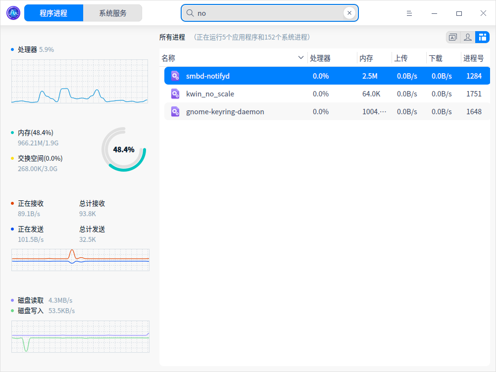
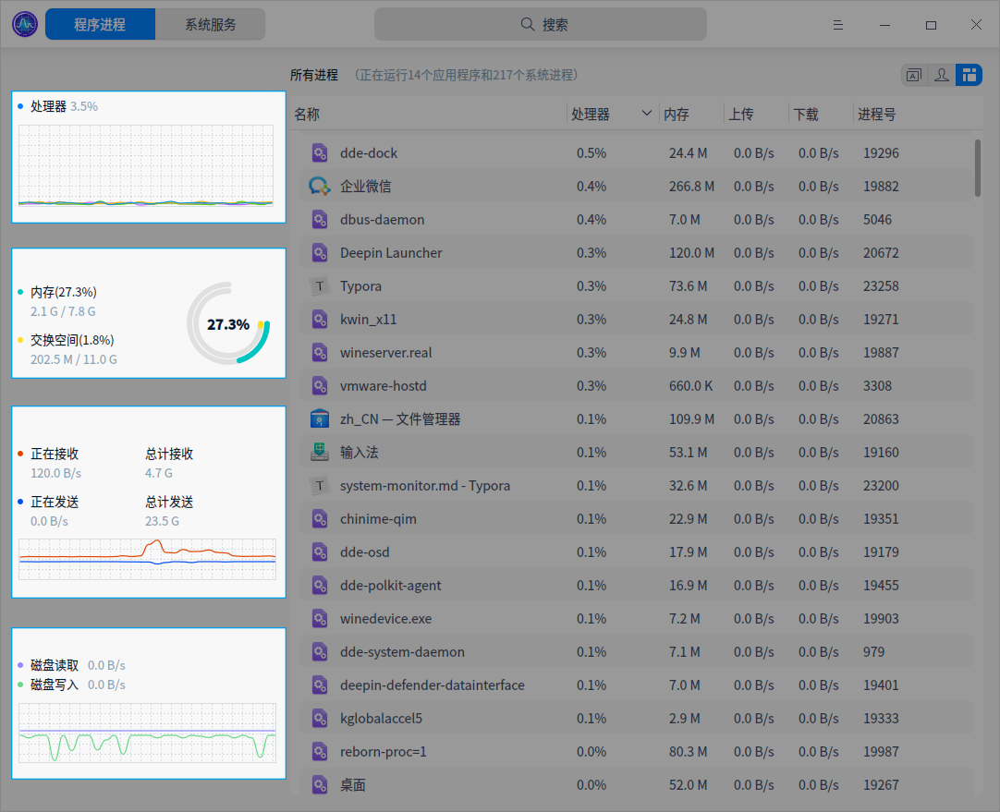
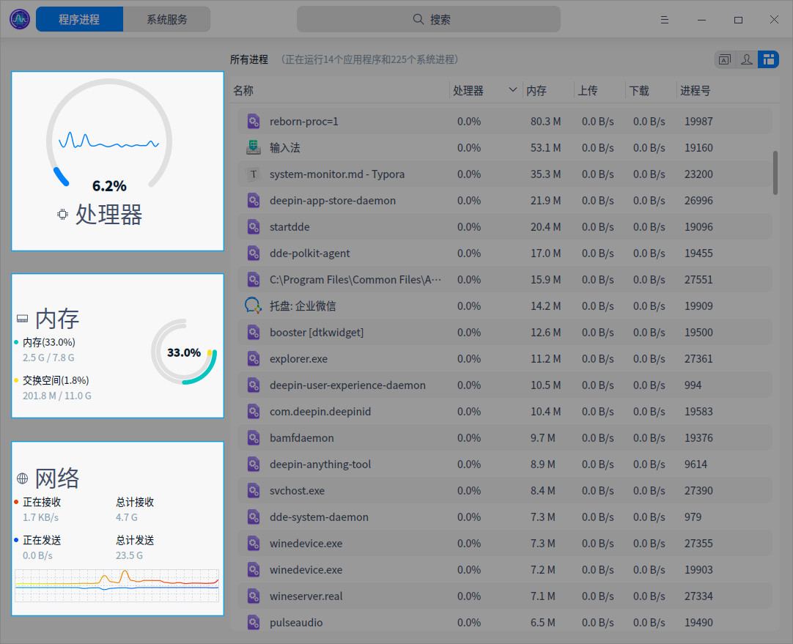
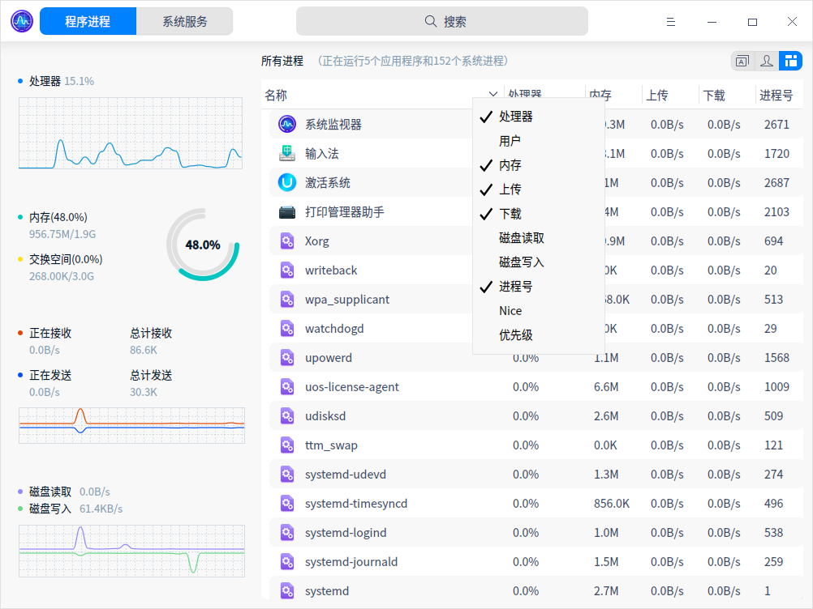
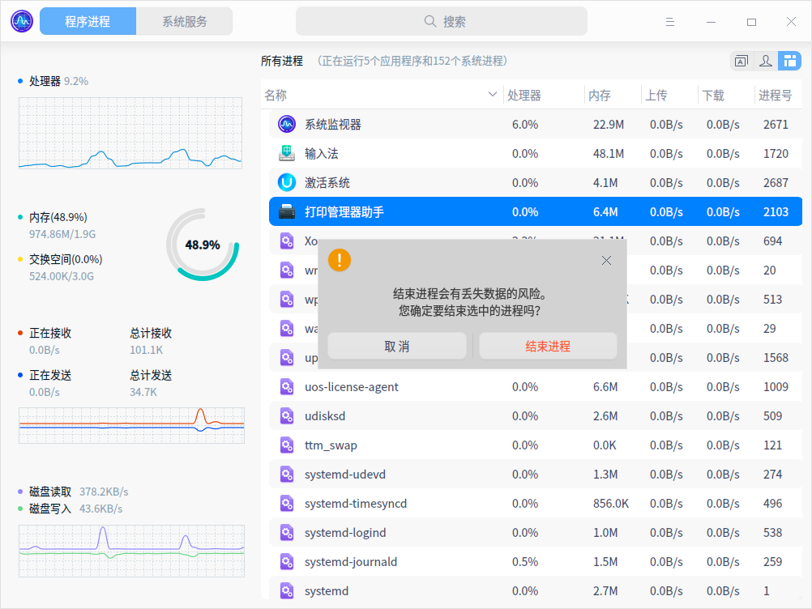
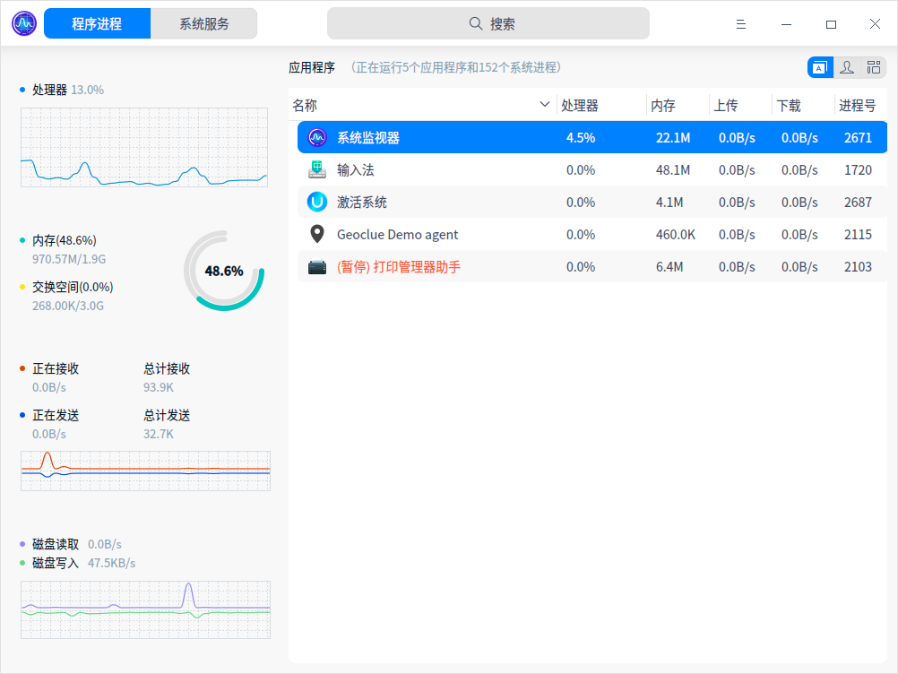
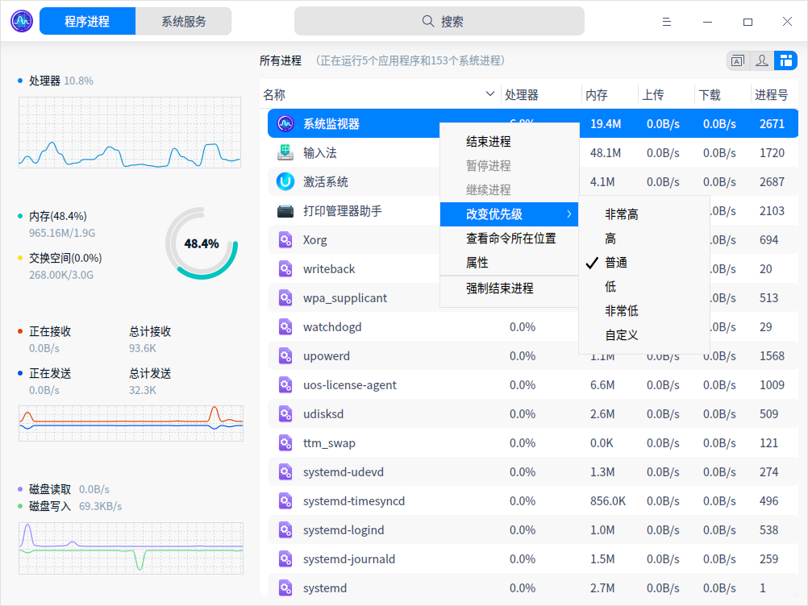

# 系统监视器|../common/deepin-system-monitor.svg|

## 概述

系统监视器是一个对硬件负载、程序运行和系统服务，进行监测查看和管理操作的系统工具。系统监视器可以实时监控处理器状态、内存占用率、网络上传下载速度、还可以管理系统进程和应用进程，也支持搜索进程和强制结束进程。

## 操作介绍

### 搜索进程

1. 在系统监视器顶部的搜索框，您可以：
   - 点击 ，输入关键字。   
2. 输入内容后快速定位。
   - 当搜索到匹配的信息时，在界面显示搜索结果列表。
   - 当没有搜索到匹配的信息时，在界面显示 “无搜索结果”。

### 硬件监控

系统监视器可以实时监控电脑的处理器、内存、网络状态：

- 处理器监控使用数值和图形实时显示处理器占用率，还可以通过圆环或波形显示最近一段时间的处理器占用趋势。

   - 在“舒展”视图下，使用圆环图和百分比数字显示处理器运行负载。圆环中间的曲线显示最近一段时间的处理器的运行负载情况，曲线会根据曲线波峰波谷高度自适应圆环内部的高度。
   - 在“紧凑”视图下，使用示波图和百分比数字显示处理器运行负载。示波图显示最近一段时间的处理器运行负载情况，曲线会根据波峰波谷高度自适应示波图显示高度。

- 内存监控使用数值和图形实时显示内存占用率，还可以显示内存总量和当前占用量，交换分区内存总量和当前占用量。
- 网络监控可以实时显示当前上传下载速度，还可以通过波形显示最近一段时间的上传下载速度趋势。
- 磁盘监控可以实时显示当前磁盘读写速度，还可以通过波形显示最近一段时间的磁盘读写速度趋势。

### 程序进程管理

#### 切换进程标签

您可以点击界面右上角的图标切换进程标签，分别可以查看应用程序进程、我的进程和所有进程。

- 点击图标  切换到 **应用程序进程** 页面。
- 点击图标  切换到 **我的进程** 页面。
- 点击图标  切换到 **所有进程** 页面。

#### 调整进程排序

进程列表可以根据名称、处理器、用户、内存、上传、下载、磁盘读取、磁盘写入、进程号、Nice、优先级等进行排列。

- 在系统监视器界面点击进程列表顶部的标签，进程会按照对应的标签排序，多次点击可以切换升序和降序。
- 在系统监视器界面右键单击进程列表顶部的标签栏，可以取消勾选标签来隐藏对应的标签列，再次勾选可以恢复显示。

#### 结束进程
您可以使用系统监视器结束系统和应用进程。
1. 在系统监视器界面上，右键单击需要结束的进程。
2. 选择 **结束进程**。
3. 在弹出窗口点击 **结束进程**，来确认结束该进程。

#### 结束应用程序

1. 在系统监视器界面，点击 。
2. 选择 **强制结束应用程序**。   
   
   >说明：**强制结束应用程序** 只能用来关闭图形化进程。
3. 根据屏幕提示在桌面上点击想要关闭的应用窗口。
4. 在弹出的对话框中点击 **强制结束**，来确认结束该应用。

>窍门：您可以选择一个程序进程，右键单击 **结束进程** 关闭进程。

#### 暂停和继续进程

您可以使用系统监视器暂停和继续进程。

1. 在系统监视器界面上，右键单击一个进程。
2. 选择 **暂停进程**，被暂停的进程会带有暂停标签并变成红色。
3. 再次右键单击被暂停的进程，选择 **继续进程** 可以继续该进程。

#### 改变进程优先级

1. 在系统监视器界面上，右键单击一个进程。
2. 选择 **改变优先级** 来进行设置。
您还可以自定义进程的优先级。

#### 查看进程路径

1. 在系统监视器界面上，右键单击一个进程。
2. 选择 **查看命令所在位置**，可以在文件管理器中打开该进程的所在目录。

#### 查看进程属性

1. 在系统监视器界面上，右键单击一个进程。
2. 选择 **属性**，可以查看进程的英文名、命令行、启动时间。

### 系统服务管理

您可以启动、停止、重新启动、设置启动方式、刷新系统服务进程。
在系统服务列表，禁止强制结束应用程序。

>注意：为系统更好的运行，请勿结束系统服务自身的进程以及根进程。

#### 启动系统服务

1. 在系统监视器界面上，选择 **系统服务** 页签。
2. 选中某个未启动的系统进程，右键单击 **启动**；如果弹出授权对话框，请输入密码授权。
3. 系统服务的“活动”会置为“已启用”。
4. 右键点击已选中的系统进程，选择 **设置启动方式**，将启动方式设置为自动或者手动。
5. 右键单击 **刷新**，刷新服务列表。

   

#### 停止系统服务

1. 在系统监视器界面上，选择 **系统服务** 页签。
2. 选中某个已启动的系统进程，右键单击 **停止**；如果弹出授权对话框，请输入密码授权。
3. 系统服务的“活动”会置为“未启用”。
4. 右键单击 **刷新**，刷新服务列表。

您也可以右键单击 **重新启动** 系统服务。

## 主菜单

在主菜单中，您可以切换监控模式、切换窗口主题、查看帮助手册、了解系统监视器的更多信息。

### 主题

窗口主题包含浅色主题、深色主题和跟随系统主题，其中跟随系统主题为默认设置。

1. 在相册界面，点击 。
2. 点击 **主题**，选择一个主题颜色。

### 视图

系统监视器提供了舒展模式和紧凑模式，您可以根据需要选择展现监控信息的模式。

1. 在系统监视器界面，点击 。
2. 点击 **视图**，选择一种视图模式。

>说明：在系统服务列表下切换视图后，需要切换至程序进程列表中查看视图。

### 帮助

查看帮助手册，通过帮助进一步让您了解和使用系统监视器。

1. 在系统监视器界面，点击 。
2. 点击 **帮助**。
3. 查看关于系统监视器的帮助手册。

### 关于

1. 在系统监视器界面，点击 。
2. 点击 **关于**。
3. 查看关于系统监视器的版本和介绍。

### 退出

1. 在系统监视器界面，点击 。
2. 点击 **退出**。

文档更新时间: 2020-09-09 版本: 5.6
