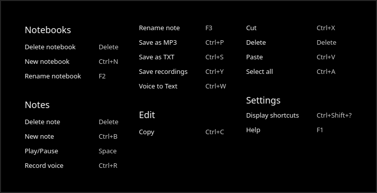
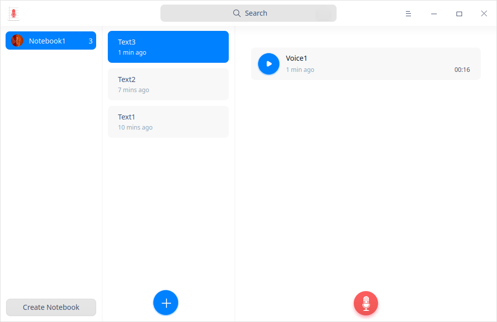
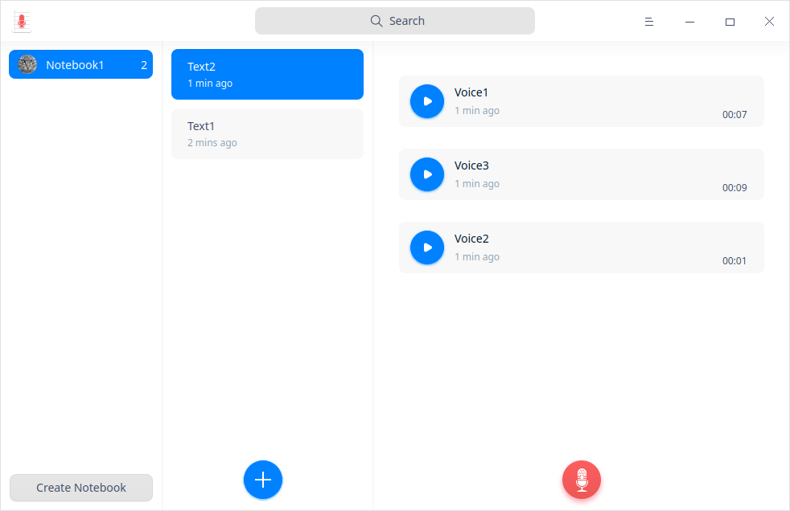
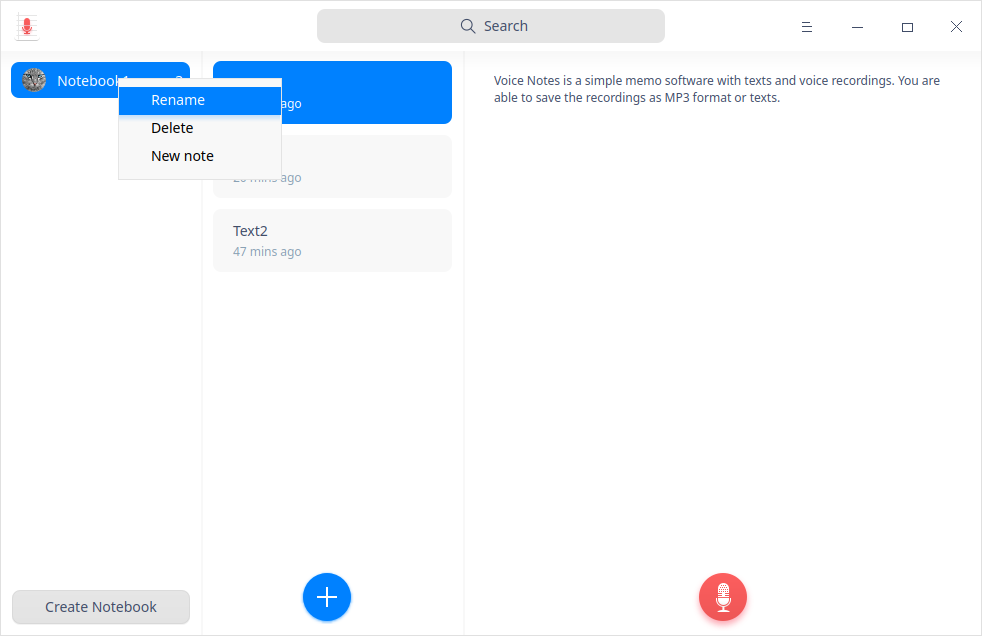

# Voice Note|../common/deepin-voice-note.svg|

## Overview

Voice Notes is a simple memo software with texts and voice recordings. You are able to save the recordings as MP3 format or texts. 

## Guide

You can run, exit or create a shortcut for Voice Note by the following ways.

### Run Voice Note

1.  Click on dock to enter the Launcher interface.
2.  Locate by scrolling the mouse wheel or searching Voice Note in the Launcher interface and click it to run.
3.  Right-click  and you can:

   - Click **Send to desktop** to create a desktop shortcut.
   - Click **Send to dock** to fix it on Dock.
   - Click **Add to startup** to add it to startup and it will auto run when the system boots.

> : If Voice Note has been fixed on dock by default, you can click   to run.

### Exit Voice Note

- Click on the Voice Note interface to exit Voice Note.
- Right-click on dock and select **Close All** to exit.
- Click  on the Voice Note interface and select  **Exit** to exit.

### View Shortcuts

On the Voice Note interface, press  **Ctrl** + **Shift** +**？** on the keyboard to view shortcuts. Proficiency in shortcuts will greatly improve your efficiency.

 

## Operation Instructions

### Create Voice Note

- Click **Create Notebook** to create a new notebook when there is no note in Voice Note.

&nbsp;&nbsp;&nbsp;&nbsp;&nbsp;&nbsp;&nbsp;&nbsp;&nbsp;&nbsp;&nbsp;&nbsp;&nbsp;

- When there is note created in Voice Note, click  the  icon on the Voice Note interface to create a new note.

  You can start recording voices or making texts after creating a note.
  
  The default naming rules for voice notes is Voice Note (n), among which n is an integer no less than 0.

### Recording Audios

You can finish audio recording easily by the following two steps:

1. Click the  icon on the Voice Note interface to start recording.
2.  Click the  icon to finish recording.

> : Click the icon to pause recording during the recording process and click   again to resume recording.

> : The maximum recording time is 60 minutes.

### Recording Playback

The finished recordings are displayed on the Voice Note interface in list. Select a recording file and click the icon to listen to the playback.

> : Click the icon to pause or stop playback and click again to resume playback when you are listening to the recording.

### Search

1. In the search box on top of the Voice Note interface, you can:

   - Clickto enter keywords.
   - Clickto input voices and the voices will be converted to texts and displayed in the in the search box.

2.  Press the **Enter** key on the keyboard to realize quick location.

   - When there is matched information, the search result list will be displayed on the right.

   - When there is no matched information, "No search results" will be displayed on the right.

3.  Clickin the search box  to clear the currently-entered keywords or cancel the search. 

### Convert Voices to Texts

1. Select a recording file on the Voice Note interface.
2. Click the icon and select **Voice to Text**.

### Save Recordings as MP3 Format

1.   Select a recording file on the Voice Note interface.
2.   Click the icon and select **Save as MP3**.
3.   Save the recordings to the storage device in MP3 format.

### Add Text Notes

1. Click the  icon on the Voice Note interface to add a new note.
2.  Click **Add Text Note**  to enter the texts to be recorded.

> : It is available to record audios in notes. Please refer to recording audios for details.

### Save as TXT

1.  Select a text note on the Voice Note interface.
2.  Click the icon and select **Save as TXT**.
3.  Save the text note to the storage device in TXT format.
    

### Rename New Notes

The completed note file will be automatically saved as "Note (n)" and you can rename it. 

1.  On the Voice Note interface, right-click a created note.
2.  Select **Rename**.
3.  Enter the file name.
4. Click in the blank area on the interface or press the **Enter** key on the keyboard to finish renaming.

### Delete Recordings

1.  Select a recording file on the Voice Note interface.
2.  Click the icon and select **Delete**.

3.  Click **Delete** in the pop-up prompt box.

### Delete Text Notes

1.   Select a text note on the Voice Note interface.
2.  Click the icon and select **Delete**.

3.  Click **Delete** in the pop-up prompt box.

### Delete New Notes

1. On the Voice Note interface, right-click to create a new note.
2.  Select **Delete** to delete the new notes.

## Main Menu

On the main menu, you can switch window themes, view help manual and get more information about Voice Notes.

### Theme

The window theme includes Light Theme, Dark Theme and System Theme (default).

1. On the Voice Note interface, click.
2. Click **Theme** to select a theme.

### Help

View Help to get more information about Voice Note.

1.  On the Voice Note interface, click  .
2.  Click **Help**.
3.  View the manual.

### About

1.  On the Voice Note interface, click  . 
2.  Click **About**.
3.  View the version description.

### Exit

1. On the Voice Note interface, click  .
2.  Click **Exit** to exit.
