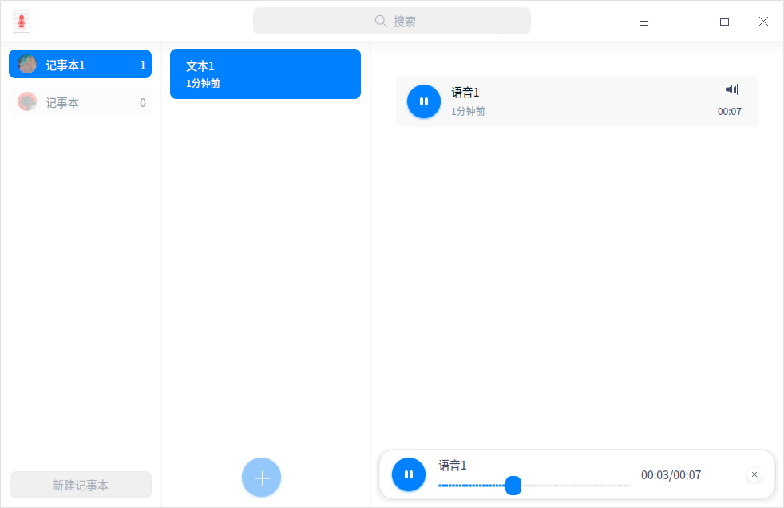
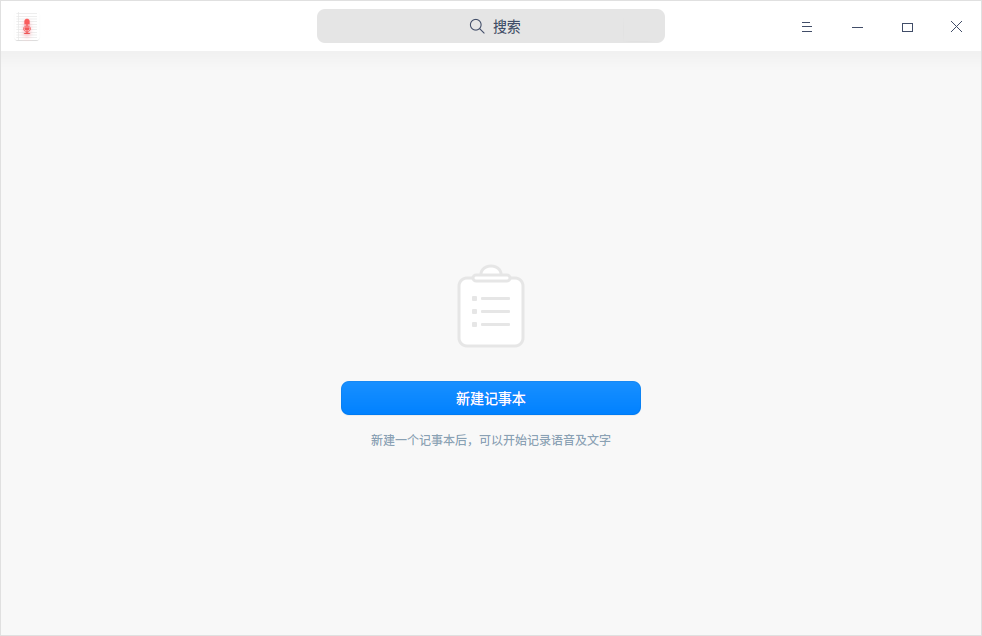
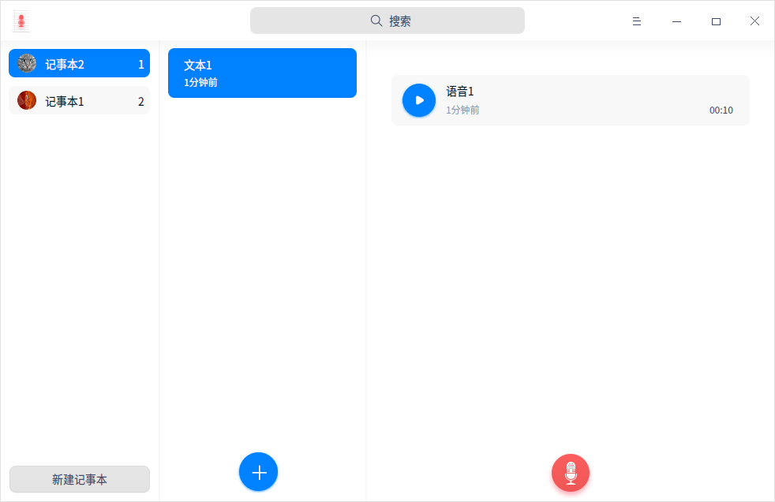
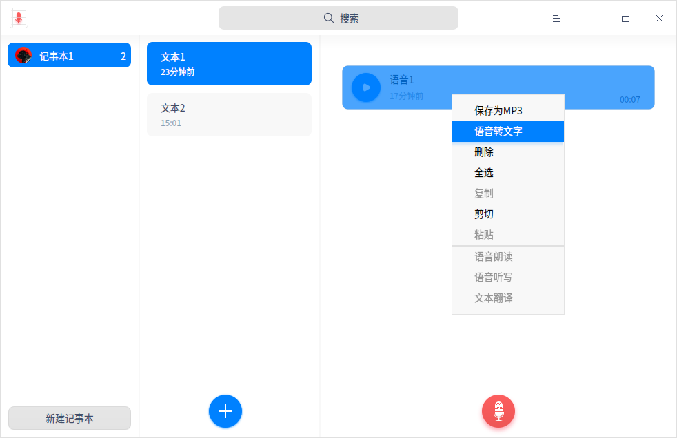
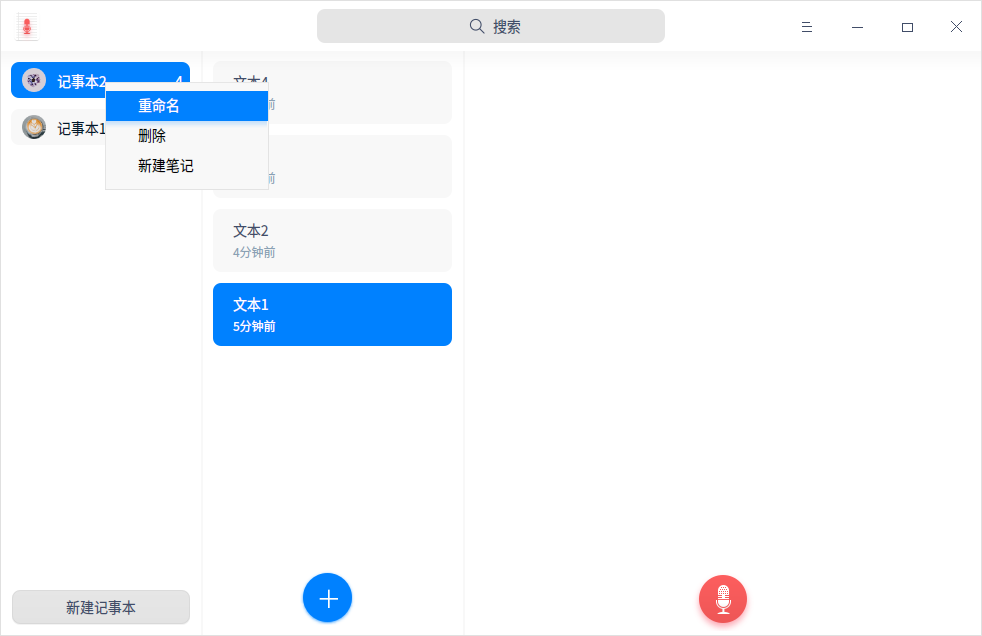

# 语音记事本|../common/deepin-voice-note.svg|

## 概述

语音记事本是一款设计简洁、美观易用的集文本、录音来记事的软件。

## 使用入门

通过以下方式运行、关闭语音记事本，同时还可以创建快捷方式。

### 运行语音记事本

1. 点击桌面底部的 ，进入启动器界面。
2. 上下滚动鼠标滚轮浏览或通过搜索，找到语音记事本 点击运行。
3. 右键单击 ，您可以：

   - 点击 **发送到桌面**，在桌面创建快捷方式。
   - 点击 **发送到任务栏**，将应用程序固定到任务栏。
   - 点击 **开机自动启动**，将应用程序添加到开机启动项，在电脑开机时自动运行该应用。

> 说明：如果语音记事本已经默认固定在任务栏上，您也可以点击任务栏上的 来运行。

### 关闭语音记事本

- 在语音记事本界面点击 ，退出语音记事本。
- 在任务栏右键单击 ，选择 **关闭所有** 来退出语音记事本。
- 在语音记事本界面点击 ，选择 **退出** 来退出语音记事本。

### 查看快捷键

在语音记事本界面上，按下键盘上的 **Ctrl + Shift + ?** 组合键来查看快捷键，熟练的使用快捷键，将大大提升您的操作效率。

 

## 操作介绍

### 创建语音记事本

- 当语音记事本中尚无记事本时，点击 **新建记事本**，创建一个新的记事本。

&nbsp;&nbsp;&nbsp;&nbsp;&nbsp;&nbsp;&nbsp;&nbsp;&nbsp;&nbsp;&nbsp;&nbsp;&nbsp;

- 当第一次新建记事本后，系统默认帮您创建一个文本，此时在文本列表内点击 按钮可继续创建新文本。

  创建新的文本后，可以开始记录语音及文字。
  
  记事本默认的命名规则为 记事本（n），其中n≥0，n为整数 。

### 录制音频

轻松两步，完成一段录音，基本录音步骤如下：

1. 在语音记事本界面上点击  按钮，开始录音。
2. 点击  按钮完成录音。

> 窍门：录音过程中您可以点击  按钮暂停录音，想继续录音时再点一下  就可以了。

> 说明：录音的限制时长为60分钟。

### 录音回放

录制完成后，录音以列表形式显示在语音记事本界面上，选择一个录音文件，点击播放按钮可以收听录音回放。

> 窍门：收听录音回放时可以点击  按钮暂停或停止播放录音，想继续回放时再点一下  就可以了。

### 搜索

1. 在语音记事本顶部搜索框中，您可以：
   - 点击 ，输入关键字。
2. 按下键盘上的 **Enter** 键后快速定位。
   - 当搜索到匹配的信息时，在界面显示搜索结果列表。
   - 当没有搜索到匹配的信息时，在界面显示 “无搜索结果”。
3. 在搜索文本框中点击  清除当前输入的关键字或取消搜索。

### 语音转文字

1. 在语音记事本界面上，选择一个录音文件。
2. 单击鼠标右键选择 **语音转文字**。

### 保存为MP3格式

1. 在语音记事本界面上，选择一个录音文件。
2. 单击鼠标右键，选择 **保存为MP3**。
3. 将录音文件保存至储存设备中。

### 添加文字笔记

1. 在语音记事本界面上点击  按钮，添加新的文本笔记。
2. 将光标移入右侧详情页内，点击鼠标左键后输入文字笔记。

> 窍门：在记事本中可以录制音频，详细操作请参考 [录制音频](#录制音频)。

### 保存为TXT文件

1. 在语音记事本界面上，选择一个文字笔记。
2. 单击鼠标右键选择 **保存为TXT**。
3. 将文字笔记保存至储存设备中。

### 重命名记事本

记事文件完成后，文件将自动保存名为“记事本（n）”，您可以重命名记事本。

1. 在语音记事本界面上，右键单击一个记事本。
2. 选择 **重命名**。
3. 输入文件名称。
4. 鼠标点击界面空白处或者按下键盘上的 **Enter** 键完成重命名。

> 窍门: 您也可以对记事本下的各个文本笔记进行重命名，详细操作可参考重命名记事本。

### 删除录音

1. 在语音记事本界面上，选择一个录音文件。
2. 单击鼠标右键选择 **删除**。
3. 在弹出的提示窗口中，点击 **确定**。

### 删除文字笔记

1. 在语音记事本界面上，选择一个文字笔记。
2. 单击鼠标右键选择 **删除**。
3. 在弹出的提示窗口中，点击 **确定**。

### 删除记事本

1. 在语音记事本界面上，选择一个记事本。
2. 单击鼠标右键选择 **删除**。
3. 在弹出的提示窗口中，点击 **确定**。

## 主菜单

在主菜单中，您可以切换窗口主题、查看帮助手册，了解语音记事本的更多信息。

### 主题

窗口主题包含浅色主题、深色主题和跟随系统主题，其中跟随系统主题为默认设置。

1. 在语音记事本界面，点击 。
2. 点击 **主题**，选择一个主题颜色。

### 帮助

查看帮助手册，通过帮助进一步让您了解和使用语音记事本。

1. 在语音记事本界面，点击 。
2. 点击 **帮助**。
3. 查看关于语音记事本的帮助手册。

### 关于

1. 在语音记事本界面，点击 。
2. 点击 **关于**。
3. 查看关于语音记事本的版本和介绍。

### 退出

1. 在语音记事本界面，点击 。
2. 点击 **退出**。

