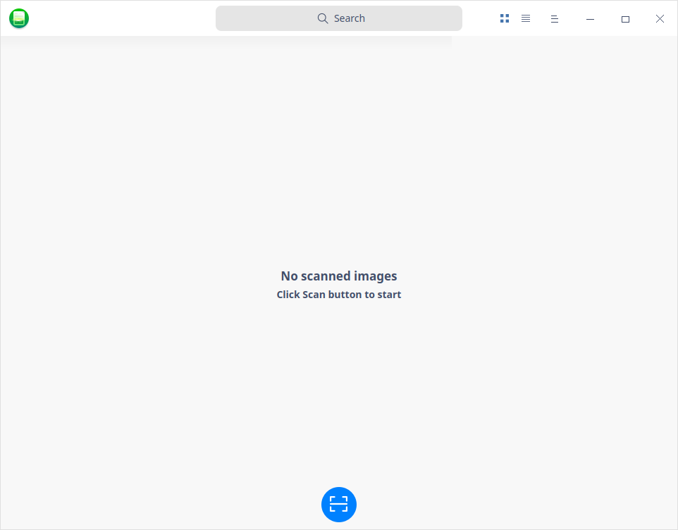
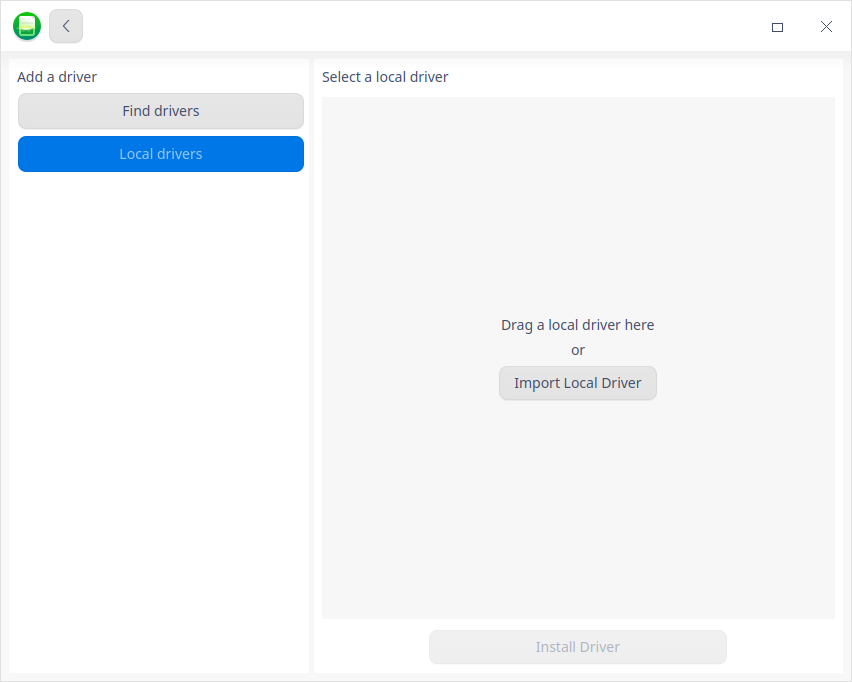
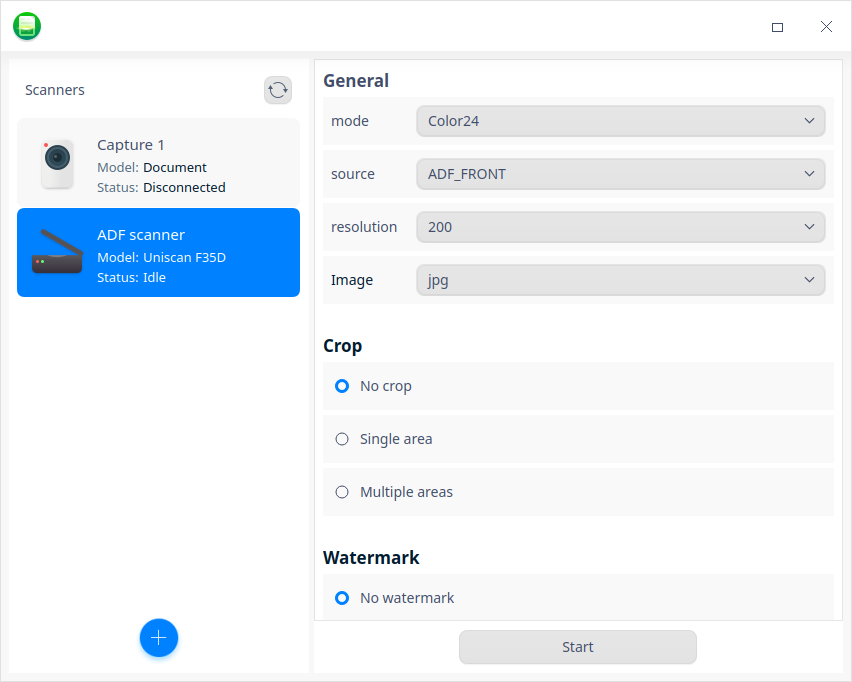
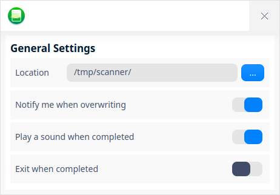

# Scan Assistant|../common/scan-manager.svg|

## Overview 

Scan Assistant is a tool for managing multiple scanning devices at the same time. 

## Guide

You can run, close or create a shortcut of Scan Assistant as follows.

### Run Scan Assistant

1. Click    in the lower left corner of the dock to enter launcher interface.
2. Locate  by scrolling the mouse wheel or searching "Scan Assistant" in the Launcher interface and click it to run. 
3. Right-click to:
   - Select **Send to desktop** to create a shortcut on the desktop.
   - Select **Send to dock** to fix it onto the dock.
   - Select **Add to startup** to add it to startup. When the computer starts up, Scan Assistant runs automatically.

### Exit Scan Assistant

- On Scan Assistant interface, click  to exit.
- Right-clickon Dock and select  **Close All** to exit.
- On Scan Assistant interface, click   and select  **Exit**.

## Operations

Connect a scanning device to your computer and turn it on. 

On Scan Assistant main interface, click, all scanning devices connected to the current computer will be shown in a list, such as captures and scanners. If the corresponding device list is not displayed, the driver needs to be installed.

### Installing drivers

1. In the scanning interface, click  to add a driver to install the scanner. 

2. You can choose online installation or manual installation.

   - **Find drivers**: this function depends on the driver pool, and it is being developed.

   - **Local drivers**: you can download the driver package corresponding to the scanning device from the official website in advance. You can drag it here directly or click **Import Local Driver** and select the downloaded driver package, click **Install Driver**. 

     

3. After the driver is installed successfully, return to the main interface and click  to check if the scanner is displayed in the scanners list. 

### Capture

1. After selecting the capture, scanning parameters can be set in the right side of the interface, including general settings, cropping, watermark and image processing scheme.

   **General**: you can set resolution, format(i.e. video format), image(i.e. image format, supporting jpg/bmp/tif) and color mode(supporting colorful, grey, black and white) here.

   **Method**: The default method is manual scan. You can also select timer and the time.

   **Crop**: The default setting is "no crop", but you can select "single area" or "multiple areas". If "multiple areas" is selected, you can shoot multiple files at the same time and cut them into multiple pictures.

   **Watermark**: the watermark can be added to the captured image to protect it from image theft.

   **Images**: This function is to optimize the pictures, for example, if "red seal" is selected, the document containing red seals could be clearer.

   

2. Click **Start**. You can set 1:1 display scale, zoom in/out, rotate and crop the scanning area.

3. After the above mentioned settings are done, click **Scan**. The capture would be saved automatically and displayed on the right side, and you can double-click it to open it.

   

### Scanner

1. After selecting the scanner, scanning parameters can be set in the right side of the interface, including general settings, cropping, watermark and image processing scheme.

   **General**: you can set mode(color24, gray8, lineart), source(ADF_FRONT, ADF_DUPLEX, FLAT_FRONT), resolution, image(i.e. image format) here.

   **Crop**: The default setting is "no crop", but you can select "single area" or "multiple areas". If "multiple areas" is selected, you can shoot multiple files at the same time and cut them into multiple pictures.

   **Watermark**: the watermark can be added to the captured image to protect it from image theft.

   **Images**: This function is to optimize the pictures, for example, if "red seal" is selected, the document containing red seals could be clearer.

   

   

2. After the above mentioned settings are done, click **Start**. 

3. Click **Scan**. The scanned image would be displayed on the interface, and you can double-click it to open it.

### Image processing

1. All images would be displayed in the main interface. You can click  or to view them in icon view or list view.

2. Select an image and right-click, you can edit, export, rename, display in file manager, combine into PDF, attach to mail, and delete it.

   

   - Edit: select this function to edit it in Draw. 

   - Export: select this function to export directly. If there are many pictures, you can combine them into PDF first, and then export them to the folder in the specified location.
   - Rename: select this function to rename it, so as to make it easy to find. 
   - Display in file manager: select this function to open the folder where the image is stored.
   - Attach to mail: all scanned images could be sent in mails. If there are many pictures, you can combine them into PDF first, and then attach them to mail.

## Main Menu

In the main menu, you can do settings, switch window themes, view manual and get more information about Scan Assistant.

### Settings

1. Click on the interface.

2. Click **Settings** to set up the storing location, switch on/off **Notify me when overwriting**, **Play a sound when completed** and **Exit when completed**. 

   

### Theme

The window theme includes Light Theme, Dark Theme and System Theme.

1.   Click on the interface.
2.   Click **Theme** to select a theme.

### Help

You can click to view the manual, which will help you further know and use Scan Assistant.

1. Click on the interface.
2. Click **Help**.
3. View the manual.

### About

1. Click on the interface.
2. Click **About**.
3. View the version description.

### Exit

1. Click on the interface.
2. Click **Exit**.

Update Date: 2022-01-13 Version: 5.1
