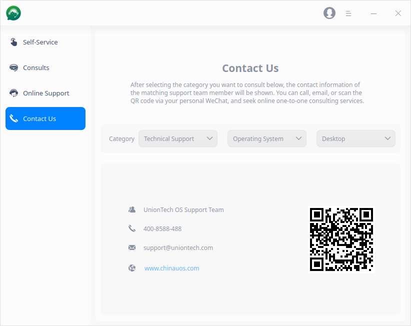

# Uos Service Support|../common/support.svg|

## Overview

Uos Service Support is an application developed by UnionTech Software enabling the user to interact with the UOS official  technical service team on the system side and covering remote services, on-site services, training services, customized services, consulting services, etc. It aims at providing multiple channels of services and support so that the user is able to get fast help and feedback.

## Guide

### Run Uos Service Support

1.  Enter the UOS system and click  on dock to enter the Launcher interface.
2.  Locate by scrolling the mouse wheel or searching "Uos Service Support" in the Launcher interface and click it to run.
3.  Right-click  and you can:

 - Click  **Send to desktop** to create a desktop shortcut.
 - Click **Send to dock** to fix the application on dock.
 - Click **Add to startup** to add the application to startup and it will automatically run when the system starts up.

### Exit Uos Service Support

- On the main interface, click  to exit.
-  Right-click on dock to select **Close All** or **Force Quit** to exit.
- On the Support interface, click  and select **Exit** to exit.

## Self-Service

Click **Self-Service** on the left panel to enter the Self-Service interface. You can  search and read the manual, document center and FAQ on UOS website to resolve issues.  

- **Document Center**: Click the **Document Center** icon and you will be directed to UOS's product website. Input the user name and password to log in (If you don't have an account, you need to sing up first before logging into the website.) and view the corresponding documents in the Document Center page.

- **FAQ**: Click the **FAQ** icon and you will be directed to UOS's product website and enter FAQ page.  

- **Manual**: Click the **Manual** icon to view the manual.

You can also click **More** ro know more about the services.

## Consults

For efficient services, you can leave a message including your connection information and consultation contents in the Consults page so that the customer service could get in touch with you in time and solve the problems quickly.

1.  Click the **Consults** tab on the left panel.

   - Go to the Consults page directly when the external network is available and execute Step 2 below.
   - Click **Contact Us** when the external network is unavailable. Please refer to the operations in [Contact Us](#Contact Us) for details.
   
2.  Set the relevant parameters as shown in the figure below:

   - **Category**: required, e.g. technical support, operation system, desktop.
   - **Title**: required, the detailed title of the consultation or suggestion.
   - **Content**: required,  the description of the problem. The user can drag the screenshot, video and GIF files here.  
   - **Add attachments**: optional, you can add no more than 4 attachments, with each no more than 10MB.
   - **Upload log**: optional and disabled by default.  You can choose to enable it and your personal information will be protected in the process of uploading logs.
   - **Email**: required. You will get the  progress and results from UOS support team in your mailbox. 
   
   
   
   
3.   Click **Submit**  to feedback the message to the UOS service and support team.

   > Notes: If you click **Reset**, all message and uploaded content or attachments will restore to the initial default state. Please operate carefully.
   
4.  After successful submission, please keep an eye on the mailbox you offered about any progress and results.

## Online Support

You are able to communicate with the customer service timely on services and technical issues just by clicking Online Support.

1.  Click **Online Support** on the left panel.

   - You will be directed to the Online Support interface and execute Step 2 below when there is network connection.
   - Please refer to [Contact Us](#Contact Us) for detailed operations when there is no network connection. 

2.    You can chat by instant messaging, send attachments or view the history.

   - Start your online chat just by entering in the input box what you expect to consult. 
   - Click to upload attachments.
   - Click **View history** on top of the dialogue to view the history.

## Contact Us

You can obtain one-to-one consulting services via calls, emails, or by scanning the QR code from your personal WeChat. 

1.  Click **Contact Us** on the left panel to enter the Contact Us interface.
2.   Select the category of your consultation and the contact information of the matching support team member will be shown.  You can contact us by the contact information displayed.

## Main Menu

On the main menu, you can switch window themes, view manual and get more information about Uos Service Support.

### Theme

The window theme includes Light Theme, Dark Theme and System Theme (default).

1.   Click on the interface.
2.   Click **Theme** to select a theme.

### Help

View Help to get more information about Uos Service Support.

1.  Click on the interface.
2.  Click  **Help**.
3.   View the manual.

### About

1.   Click on the interface.
2.   Click **About**.
3.   View the  version description.

### Exit

1.   Click on the interface.
2.  Click **Exit**.

