#  桌面环境|dde|

## 概述
统信操作系统(简称“统信UOS”)是一款美观易用、安全可靠的国产桌面操作系统。统信UOS预装了文件管理器、系统监视器等一系列原生应用。它既能让您体验到丰富多彩的娱乐生活，也可以满足您的日常工作需要。随着功能的不断升级和完善，统信操作系统已成为国内最受欢迎的操作系统之一。

### 系统简介
成功登录系统后，即可体验统信UOS桌面环境。桌面环境主要由桌面、任务栏、启动器、控制中心等组成，是使用该操作系统的基础。

## 桌面
桌面是登录后看到的主屏幕区域。在桌面上可以新建文件/文件夹、排列文件、打开终端、设置壁纸和屏保等，还可以通过启动器 [发送到桌面](#设置快捷方式) 向桌面添加应用的快捷方式。

### 新建文件夹/文档

在桌面新建文件夹或文档，也可以对文件进行常规操作，和在文件管理器中一样。

- 在桌面上，单击鼠标右键，单击 **新建文件夹**，输入新建文件夹的名称。
- 在桌面上，单击鼠标右键，单击 **新建文档**，选择新建文档的类型，输入新建文档的名称。

在桌面文件或文件夹上，单击鼠标右键，在弹出的菜单中主要包含如下功能：

|功能| 说明 |
| ----------- |------------------------------------------ |
| 打开方式    | 选定系统默认打开方式，也可以选择其他关联应用程序来打开。 |
| 压缩/解压缩 |压缩文件或文件夹，或对压缩文件进行解压。 |
| 剪切      |移动文件或文件夹。             |
| 复制      |复制文件或文件夹。             |
| 重命名      |重命名文件或文件夹。            |
| 删除        |删除文件或文件夹。              |
| 创建链接    |创建一个快捷方式。                         |
| 标记信息    |添加标记信息，以对文件或文件夹进行标签化管理。      |
| 属性        |查看文件或文件夹的基本信息，共享方式，及其权限。      |

### 设置排列方式

您可以对桌面上的图标按照需要进行排序。

1. 在桌面上，单击鼠标右键。
2. 单击 **排序方式**，您可以：
   - 单击 **名称**，将按文件的名称顺序显示。
   - 单击 **修改时间**，文件将按最近一次的修改日期顺序显示。
   - 单击 **大小**，将按文件的大小顺序显示。
   - 单击 **类型**，将按文件的类型顺序显示。

> 窍门：您也可以勾选 **自动排列**，桌面图标将从上往下，从左往右按照当前排序规则排列，有图标被删除时后面的图标会自动向前填充。

### 调整图标大小
1. 在桌面上，单击鼠标右键。
2. 单击 **图标大小**。
3. 选择一个合适的图标大小。

> 窍门：您也可以用 **Ctrl** + //鼠标滚动来调整桌面和启动器中的图标大小。

### 设置显示器
从桌面单击右键菜单选择“显示设置”，可以快速进入控制中心设置显示器的缩放比例、分辨率和亮度等。

1. 在桌面上，单击鼠标右键。
2. 单击 **显示设置**，快速进入控制中心的显示设置界面。

> 说明：关于显示的设置，具体操作请参阅 [显示设置](#显示设置) 。

 ### 更改壁纸
选择一些精美、时尚的壁纸来美化桌面，让您的电脑显示与众不同。

1. 在桌面上，单击鼠标右键。
2. 单击 **壁纸与屏保**，在桌面底部预览所有壁纸。
3. 选择某一壁纸后，壁纸就会在桌面和锁屏中生效。
4. 单击 **仅设置桌面** 和 **仅设置锁屏** 来控制壁纸的生效范围。

&nbsp;&nbsp;&nbsp;&nbsp;&nbsp;&nbsp;&nbsp;&nbsp;&nbsp;&nbsp;&nbsp;&nbsp;&nbsp;
> 窍门：您还可以在图片查看器中设置您喜欢的图片为桌面壁纸。

### 设置屏保
屏幕保护程序原本是为了保护显像管，现在一般用来防范他人偷窥您电脑上的一些隐私。

1. 在桌面上，单击鼠标右键。
2. 单击 **壁纸与屏保**，单击 **屏保**，在桌面底部预览所有屏保。
3. 选择其中一个屏保，单击 **设置屏保**，在上方选择 **闲置时间**。
4. 勾选 **恢复时需要密码**，以便更好地保护您的隐私。
5. 待电脑空闲指定时间后，将启动您选择的屏幕保护程序。

### 剪贴板
剪贴板展示当前用户登录系统后复制和剪切的所有文本、图片和文件。使用剪贴板可以快速复制其中的某项内容。注销或关机后，剪贴板会自动清空。

1. 使用快捷键 **Ctrl** + **Alt** + **V** 唤出剪贴板。
2. 双击剪贴板内的某一区块，会快速复制当前内容， 且当前区块会被移动到剪贴板顶部。
3. 选择目标位置粘贴。
4. 鼠标移入剪贴板的某一区块，单击上方的，删除当前内容；单击顶部的 **全部清除**，清空剪贴板。

## 任务栏

任务栏一般是指位于桌面底部的长条，主要由启动器、应用程序图标、托盘区、系统插件等区域组成。在任务栏中，可以打开启动器、显示桌面、进入工作区，对其上的应用程序进行打开、新建、关闭、强制退出等操作，还可以设置输入法，调节音量，连接网络，查看日历，进入关机界面等。

### 认识任务栏图标
任务栏图标包括启动器图标、应用程序图标、托盘区图标、系统插件图标等。

| 图标 | 说明 |
| ------------------------------------------------------------ | :---------------------------------- |
|                    | 启动器 - 单击查看所有已安装的应用。 |
|  | 显示桌面。                                          |
|  | 文件管理器 - 单击查看磁盘中的文件、文件夹。 |
|  | 浏览器 - 单击打开网页。 |
|  | 日历 - 查看日期、新建日程。 |
|  |  控制中心 - 单击进入系统设置。           |
|  | 通知中心 - 显示所有系统和应用的通知。 |
|  | 屏幕键盘 - 单击使用虚拟键盘。 |
|  | 电源 - 单击进入关机界面。 |
| | 回收站。 |

&nbsp;&nbsp;&nbsp;&nbsp;&nbsp;&nbsp;&nbsp;&nbsp;&nbsp;&nbsp;&nbsp;&nbsp;&nbsp;
> 窍门：在高效模式下，单击任务栏最右侧可显示桌面。将鼠标指针移到任务栏上已打开窗口的图标时，会显示相应的预览窗口。

### 切换显示模式
任务栏提供两种显示模式：时尚模式和高效模式，显示不同的图标大小和应用窗口激活效果。

&nbsp;&nbsp;&nbsp;&nbsp;&nbsp;&nbsp;&nbsp;&nbsp;&nbsp;&nbsp;&nbsp;&nbsp;&nbsp;

您可以通过以下操作来切换显示模式：

1. 右键单击任务栏。
2. 在 **模式** 子菜单中选择一种显示模式。

### 设置任务栏位置
您可以将任务栏放置在桌面的任意方向。

1. 右键单击任务栏。
2. 在 **位置** 子菜单中选择一个方向。

### 调整任务栏高度 
鼠标拖动任务栏边缘，改变任务栏高度。

### 显示/隐藏插件
1. 右键单击任务栏。
2. 在 **插件** 子菜单中勾选或取消勾选 **回收站、电源、显示桌面、屏幕键盘、通知中心、时间**，可以设置这些插件在任务栏上的显示和隐藏效果。

### 查看通知消息
当有系统或应用通知时，桌面上方会弹出通知消息。若有按钮，单击按钮执行对应操作；若无按钮，单击关闭此消息。

&nbsp;&nbsp;&nbsp;&nbsp;&nbsp;&nbsp;&nbsp;&nbsp;&nbsp;&nbsp;&nbsp;&nbsp;&nbsp;

此外，还可以单击任务栏上的 ， 打开通知中心，查看所有通知。

### 查看日期时间

- 鼠标指针悬停在任务栏的时间上，可查看当前日期、星期和时间。
- 单击时间，打开日历。

### 进入关机界面
单击任务栏上的  进入关机界面，或在启动器的小窗口模式中单击 。

|功能|说明|
|--|---|
|关机|关闭电脑。|
|重启|关机后再次重新运行您的电脑。|
|锁定|锁定电脑，按下快捷键 **Super** + **L** 锁定。|
|切换用户|选择另一个用户帐户登录。|
|注销|清除当前登录用户的信息。|
|系统监视器|快速启动系统监视器。|

&nbsp;&nbsp;&nbsp;&nbsp;&nbsp;&nbsp;&nbsp;&nbsp;&nbsp;&nbsp;&nbsp;&nbsp;&nbsp;

> 说明：当系统存在多个帐户时才显示 。

### 回收站
在回收站中，可以找到电脑中临时被删除的文件，也可以选择还原或清空这些文件。

#### 还原文件
临时被删除的文件，可以在回收站进行还原，或使用快捷键 **Ctrl** + **Z** 还原刚删除的文件。

1. 在回收站中，选择要恢复的文件。
2. 单击鼠标右键，选择 **还原**。
3. 还原文件到原来的存储路径下。

> 注意：如果原来所在的文件夹已经删除，还原文件时会自动新建文件夹。

#### 删除文件

回收站中可以单独清除某一文件。

1. 在回收站中，选择要删除的文件。
2. 单击鼠标右键，选择 **删除**，即可删除回收站的文件。

#### 清空回收站

在回收站中，单击 **清空**，将彻底删除回收站的所有内容。

## 启动器
启动器  可以管理系统中所有已安装的应用，在启动器中使用分类导航或搜索功能可以快速找到需要的应用程序。

在启动器中可以查看新安装的应用，新安装应用的旁边会出现一个小蓝点提示。

### 切换模式
启动器有全屏和小窗口两种模式。单击启动器界面右上角的图标来切换模式。

两种模式均支持搜索应用、设置快捷方式等操作。

小窗口模式还支持快速打开文件管理器，控制中心和进入关机界面等功能。

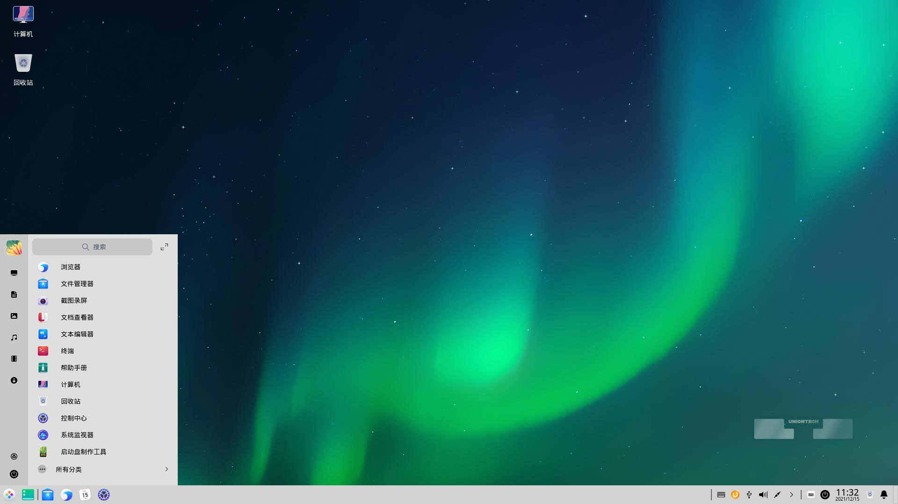

### 排列应用

在全屏模式下，系统默认按照安装时间排列所有应用。

- 将鼠标悬停在应用图标上，按住鼠标左键不放，将应用图标拖拽到指定的位置自由排列。
- 单击启动器界面左上角分类图标进行排列。

&nbsp;&nbsp;&nbsp;&nbsp;&nbsp;&nbsp;&nbsp;&nbsp;&nbsp;&nbsp;&nbsp;&nbsp;&nbsp;

在小窗口模式下，默认按照使用频率排列应用。

### 查找应用

在启动器中，您可以滚动鼠标滚轮或切换分类导航查找应用。

如果知道应用名称，直接在搜索框中输入关键字，快速定位到需要的应用。

### 设置快捷方式
快捷方式提供了一种简单快捷地启动应用的方法。

#### 创建快捷方式
将应用发送到桌面或任务栏上，方便您的后续操作。

在启动器中，右键单击应用图标，您可以：

- 单击 **发送到桌面**，在桌面创建快捷方式。

- 单击 **发送到任务栏**，将应用固定到任务栏。

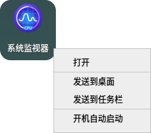

> 说明：您还可以从启动器拖拽应用图标到任务栏上放置。但是当应用处于运行状态时您将无法拖拽固定，此时您可以右键单击任务栏上的应用图标，选择 **驻留** 将应用固定到任务栏，以便下次使用时从任务栏上快速打开。

#### 删除快捷方式
您既可以在桌面直接删除应用的快捷方式，也可以在任务栏和启动器中删除。

**从任务栏上删除**

- 在任务栏上，按住鼠标左键不放，将应用图标拖拽到任务栏以外的区域移除快捷方式。
- 当应用处于运行状态时您将无法拖拽移除，此时可以右键单击任务栏上的应用图标，选择 **移除驻留** 将应用从任务栏上移除。

**从启动器中删除**

在启动器中，右键单击应用图标，您可以：

- 单击 **从桌面上移除**，删除桌面快捷方式。
- 单击 **从任务栏上移除**，将固定到任务栏上的应用移除。

> 说明：以上操作，只能删除应用的快捷方式，而不会卸载应用。

### 运行应用

对于已经创建了桌面快捷方式或固定到任务栏上的应用，您可以通过以下途径来打开应用。

- 双击桌面图标，或右键单击桌面图标选择 **打开**。
- 直接单击任务栏上的应用图标，或右键单击任务栏上的应用图标选择 **打开**。

在启动器中，直接单击应用图标打开，或右键单击应用图标选择 **打开**。

> 窍门：对于经常使用的应用，您可以在启动器中，右键单击应用图标选择 **开机自动启动**。

## 控制中心

统信操作系统通过控制中心来管理系统的基本设置，包括帐户管理、网络设置、时间日期设置、个性化设置、显示设置等。当您进入桌面环境后，单击任务栏上的  即可打开控制中心窗口。

### 首页介绍
控制中心首页主要展示各个设置模块，方便日常查看和快速设置。

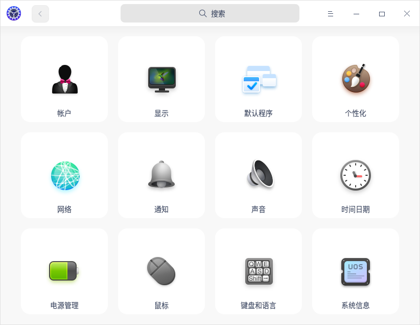

&nbsp;&nbsp;&nbsp;&nbsp;&nbsp;&nbsp;&nbsp;&nbsp;&nbsp;&nbsp;&nbsp;&nbsp;&nbsp;

打开控制中心的某一设置模块后，可以通过左侧导航栏快速切换到另一设置模块。

#### 标题栏
标题栏包含返回按钮，搜索框，主菜单及窗口按钮。

- 返回按钮：若要返回首页，单击 。
- 搜索框：输入关键字后，回车，搜索相应设置。
- 主菜单：单击 进入主菜单。在主菜单中，您可以设置窗口主题，查看版本，或退出控制中心。

### 帐户设置
在安装系统时会创建了一个帐户，在控制中心的帐户设置模块可以修改帐户设置或创建一个新帐户。

#### 创建新帐户

1. 在控制中心首页，单击 。
2. 单击 **创建帐户** 按钮 。
3. 输入用户名、密码和重复密码。
4. 单击 **创建**。
5. 在授权对话框输入当前帐户的密码，新帐户就会添加到帐户列表中。

#### 更改头像

1. 在控制中心首页，单击 。
2. 单击列表中的帐户。
3. 单击帐户头像，选择一个头像或添加本地头像，头像就替换完成了。

#### 设置全名

帐户全名会显示在帐户列表和系统登录界面，可根据需要设置。

1. 在控制中心首页，单击 。
2. 单击列表中的帐户。
3. 单击 **设置全名** 后的 ，输入帐户全名。

#### 修改密码

1. 在控制中心首页，单击 。
2. 单击当前帐户。
3. 单击 **修改密码**，进入修改密码页面。
4. 输入当前密码、新密码和重复密码。

#### 自动登录
开启“自动登录”后， 下次启动系统时（重启、开机）可直接进入桌面。在锁屏和注销后再次登录需要密码。
1. 在控制中心首页，单击。
2. 单击当前帐户。
3. 打开 **自动登录** 开关，在弹出的授权对话框中输入当前帐户密码并确定后，开启自动登录功能。

#### 设置密码有效期

1. 在控制中心首页，单击 。
2. 单击当前帐户。
3. 设置密码有效期，可以设置密码长期有效或具体的有效天数。

>  说明：密码有效期自修改之日起开始计算。

例如：用户A在9月1日修改了密码。之后，将密码有效期更改为30天。在这种情况下，密码可以在9月1日至9月30日这期间的30天正常使用。

#### 删除帐户

1. 在控制中心首页，单击 。
2. 单击其他未登录的帐户。
3. 单击 **删除帐户** 。
4. 在弹出的确认界面中单击 **删除**。

> 注意: 已登录的帐户无法被删除。

#### 权限设置

支持添加管理员用户、普通用户、自定义用户。

##### 设置组

添加或修改帐户时，可以选择系统内已有的组。

### 显示设置
设置显示器的亮度、分辨率、屏幕方向以及缩放倍数等，让您的电脑显示到达最佳状态。

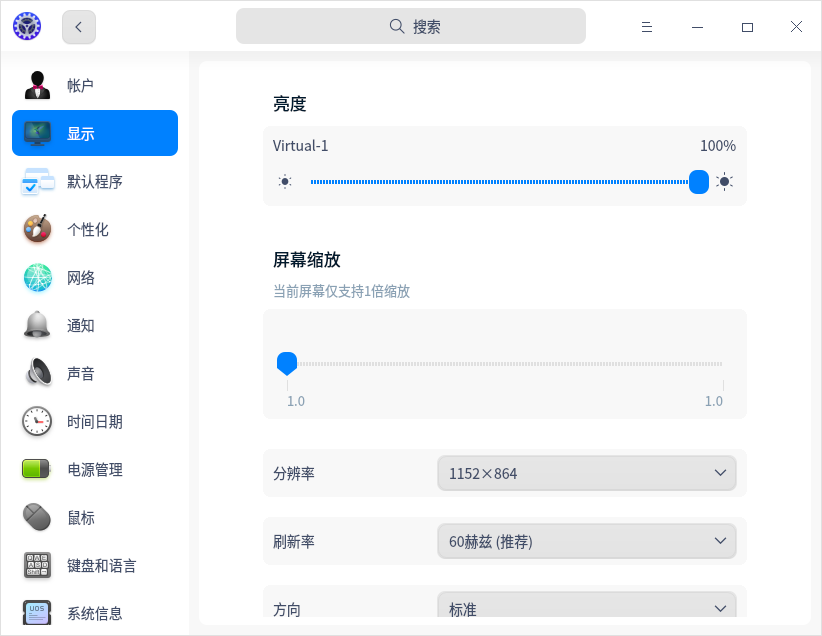

#### 单屏设置

当显示屏为单屏时，可以调节显示屏亮度、分辨率、刷新率、显示方向等。

##### 调节亮度

1. 在控制中心首页，单击 。
2. 在亮度区域，拖动亮度条滑块，调节屏幕亮度。

##### 设置屏幕缩放

当桌面和窗口显示过大或过小时，您可能需要调节屏幕缩放，以便正常显示。

1. 在控制中心首页，单击 。
2. 在屏幕缩放区域， 单击或拖动滑块调整缩放倍数。
3. 注销后重新登录系统屏幕缩放操作即可生效。

>  说明：
> - 当检测到屏幕为高分屏时，会自动调整缩放倍数。
> - 部分应用可能不支持屏幕缩放，您可以在启动器中右键单击该应用，选择 **禁用屏幕缩放**，以获得更好的显示效果。

##### 更改分辨率

1. 在控制中心首页，单击 。
2. 在分辨率区域的下拉列表中，选择合适的分辨率参数。
3. 单击 **保存**。

##### 设置屏幕刷新率

1. 在控制中心首页，单击 。
2. 在刷新率区域的下拉列表中，选择一个合适的刷新率。
3. 单击 **保存**。

##### 改变屏幕方向

1. 在控制中心首页，单击 。
2. 在方向区域的下拉列表中，选择一个合适的方向参数，改变屏幕方向。
3. 单击 **保存**。

#### 多屏设置

多屏显示可以让屏幕的视野无限延伸，使用VGA、HDMI、DP等线缆将电脑和另一台显示器、投影仪等连接起来，电脑上的内容即可同时在多个屏幕中显示。当电脑设备连接上另一台显示设备，多屏显示模式设置模块才会出现。

1. 在控制中心首页，单击 。
2. 在多屏设置区域，模式下拉框中选择屏幕显示样式。
 - **复制** 将主屏的显示内容复制到其他屏幕。
 - **扩展** 将主屏的显示内容扩展到其他屏幕，扩大桌面区域。
 - **仅在xxx显示** 只在某个屏幕显示内容。

在多屏环境下，按下快捷键 **Super** + **P** 调出多屏显示模式的OSD。
详细操作方法如下。

1. 按住 **Super** 不放，再按下 **P** 或鼠标单击来进行模式选择。
2. 松开按键，确认选择，模式生效。

> 说明：当多屏显示时：
>
> - 副屏也支持桌面图标显示、右键菜单操作等功能。
> - 任务栏右键菜单显示 **多屏显示设置**，多屏显示设置包含 **仅主屏显示**、**跟随鼠标位置显示** 选项。

### 默认程序设置

当安装有多个功能相似的应用程序时，可以通过右键菜单或控制中心为某种类型的文件指定其中的一个应用作为打开文件的默认启动程序。

#### 设置默认程序

1. 右键单击文件，选择 **打开方式** > **选择默认程序**。
2. 选择一个应用，自动勾选"设为默认"，单击 **确定**。
3. 该应用将自动添加到控制中心的默认程序列表。

#### 更改默认程序

1. 在控制中心首页，单击 。
2. 选择一个文件类型进入默认程序列表。
3. 在列表中选择另一个应用程序。

#### 添加默认程序

1. 在控制中心首页，单击 。
2. 选择文件类型进入默认程序列表。
3. 单击列表下的 **添加默认程序** 按钮，选择desktop文件（一般在/usr/share/applications)，或特定的二进制文件。
4. 该程序将添加到列表，并自动设置为默认程序。

#### 删除默认程序

在默认程序列表中，您只能删除自己添加的应用程序，不能删除系统已经安装的应用。要删除系统已经安装的应用，只能卸载应用。卸载后该应用将自动从默认程序列表中删除。

可用以下方法删除自己添加的默认程序。

1. 在控制中心首页，单击 。
2. 选择文件类型进入默认程序列表。
3. 单击程序后面的，删除默认程序。

### 个性化设置
在控制中心个性化设置模块可以进行一些通用的个性化设置，包括系统主题、活动用色、字体，改变桌面和窗口的外观。除此之外还可设置图标主题、光标主题和字体。

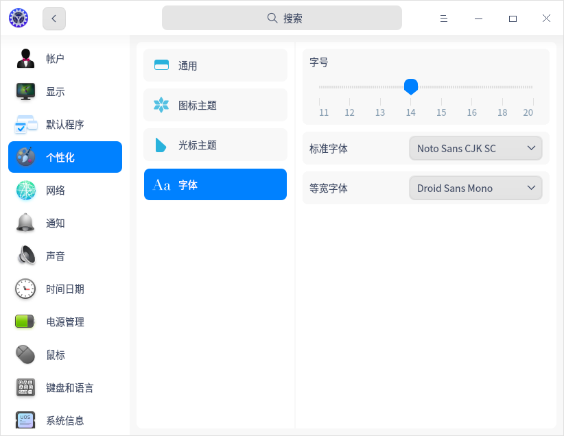

#### 设置窗口主题
1. 在控制中心首页，单击 。
2. 单击 **通用**，选择一种窗口主题。
3. 该主题即为系统窗口主题。

> 窍门：自动主题表示根据当前时区的时间，根据日出日落的时间自动更换窗口主题。日出后是浅色，日落后是深色。

#### 更改活动用色
活动用色是指选中某一选项时的强调色。

1. 在控制中心首页，单击 。
2. 单击 **通用**。
3. 单击 **活动用色** 下的一种颜色，可实时查看该颜色效果。

#### 设置图标主题

1. 在控制中心首页，单击 。
2. 单击 **图标主题**，选择一款图标样式。

#### 设置光标主题

1. 在控制中心首页，单击 。
2. 单击 **光标主题**，选择一款光标样式。

#### 更改系统字体

1. 在控制中心首页，单击 。
2. 单击 **字体**，进入设置字体界面。
3. 设置系统字号和字体。

### 网络设置
登录系统后，您需要连接网络，才能接收邮件、浏览新闻、下载文件、聊天、网上购物等。

> 窍门：您可以单击任务栏托盘区的网络图标，查看当前网络状态。

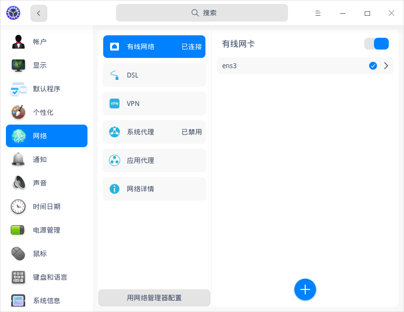

#### 有线网络

有线网络安全快速稳定，是最常见的网络连接方式。当您设置好路由器后，把网线两端分别插入电脑和路由器，即可连接有线网络。

1. 将网线插入电脑上的网络插孔。
2. 将网线的另一端插入路由器或网络端口。
3. 在控制中心首页，单击  。
4. 单击 **有线网络**，进入有线网络设置界面。
5. 打开 **有线网卡**，开启有线网络连接功能。
6. 当网络连接成功后，桌面右上角将弹出“已连接有线连接”的提示信息。

您还可以在有线网络的设置界面，编辑或新建有线网络设置。

#### 无线网络

无线网络帮助您摆脱线缆的束缚，上网形式更加灵活，支持更多设备使用。

##### 连接无线网络

1. 在控制中心首页，单击  。
2. 单击 **无线网络**，进入无线网络设置界面。
3. 打开 **无线网卡**，开启无线网络连接功能。
4. 电脑会自动搜索并显示附近可用的无线网络。
5. 选择需要连接的无线网络。
 - 如果该网络是开放的，将自动连接到此网络。
 - 如果该网络是加密的，请根据提示输入密码，单击 **连接**，然后将自动完成连接。

##### 连接隐藏网络

为了防止他人扫描到自己的WiFi，进而破解WiFi密码连接您的网络，您可以在路由器设置界面隐藏无线网络。设置后，您需要手动连接隐藏网络才能上网。

1. 在控制中心首页，单击  。
2. 单击 **无线网络**，进入无线网络设置界面。
3. 单击 **连接到隐藏网络**。
4. 输入网络名称、SSID和其他必填选项。
5. 单击 **保存** 。

#### 无线热点

无线热点将电脑连接的网络信号转换为WiFi热点，以供一定距离内的其他设备无线上网。要开启无线热点，电脑必须连接到网络并装有支持热点功能的无线网卡。

1. 在控制中心首页，单击  。
2. 单击 **个人热点**。
3. 打开 **热点** 开关，设置热点信息。
4. 单击 **保存** 。

#### 移动网络

当您处于一个没有网络信号的地方时，可以使用无线上网卡来上网。在有电话信号覆盖的任何地方，无线上网卡通过运营商的移动数据网络接入宽带服务。

1. 将移动网卡插入电脑上的USB接口中。
2. 电脑将根据移动网卡和运营商信息，自动适配并自动连接网络。
3. 在控制中心首页，单击  。
4. 单击 **移动网络**，查看详细设置信息。

#### 拨号网络

拨号上网（DSL）是指通过本地电话拨号连接到网络的连接方式。配置好调制解调器，通过网线连接调制解调器的网口和电脑的网口后，创建宽带拨号连接，输入运营商提供的用户名和密码，即可拨号连接到Internet上。

##### 新建拨号连接

1. 在控制中心首页，单击  。
2. 单击 **DSL**，单击 **创建PPPoE连接** 按钮 。
3. 输入宽带名称、帐户、密码。
4. 单击 **保存**，系统自动创建宽带连接并尝试连接。

#### VPN

VPN即虚拟专用网络，其主要功能是在公用网络上建立专用网络，进行加密通讯。无论您是在外地出差还是在家中办公，只要能上网就能利用VPN访问企业的内网资源。您还可以使用VPN加速访问其他国家的网站。

1. 在控制中心首页，单击  。
2. 单击 **VPN**，选择 **添加VPN** 按钮 或 **导入VPN** 按钮。
3. 选择VPN协议类型，并输入名称、网关、帐号、密码等信息。（导入VPN会自动填充信息）
4. 单击 **保存**，系统自动尝试连接VPN网络。
5. 您可以将VPN设置导出，备用或共享给其他用户。

> 说明：打开 **仅用于相对应的网络上的资源** 开关，可以不将VPN设置为默认路由，只在特定的网络资源上生效。

#### 系统代理

1. 在控制中心首页，单击  。
2. 单击 **系统代理**，进入系统代理界面。
3. 开启系统代理，在代理类型后的下拉框中选择 **手动** 或 **自动**。
   - 选择 **手动**，需要配置代理服务器的地址和端口等信息。
   - 选择 **自动**，需要配置URL，系统将自动配置代理服务器的信息。
4. 单击 保存。

#### 应用代理

1. 在控制中心首页，单击  。
2. 单击 **应用代理**。
3. 设置应用代理参数。
4. 单击 **保存**。

> 说明：应用代理设置成功后，打开启动器，右键单击应用图标，可以选择 **使用代理**。

#### 网络详情

在网络详情界面，您可以查看MAC、IP地址、网关和其他网络信息。

1. 在控制中心首页，单击 。
2. 单击 **网络详情**，进入网络信息界面。
3. 查看当前有线网络或无线网络的信息。

### 通知设置

设置通知勿扰模式，开启或关闭某些应用的通知显示。

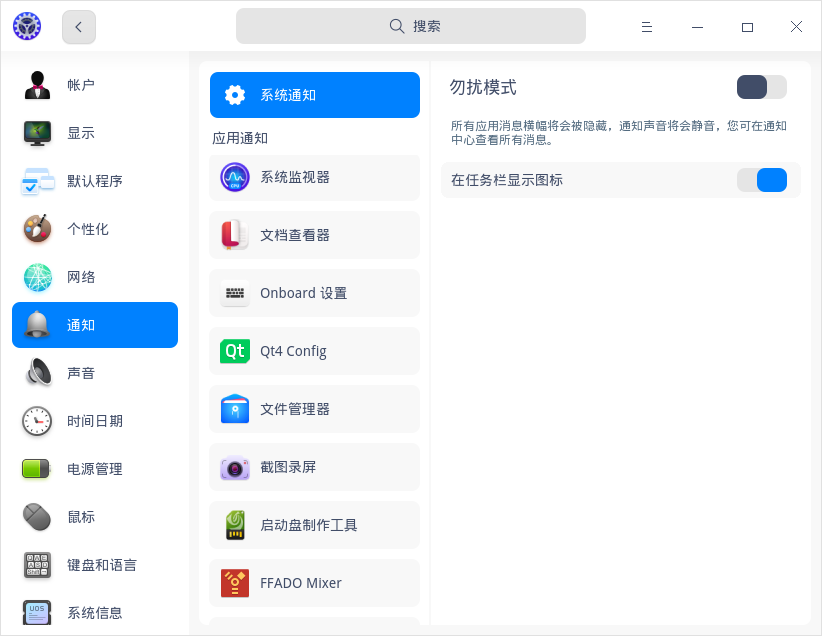

#### 设置系统通知

设置系统通知的勿扰模式及是否在任务栏显示通知图标。

1. 在控制中心首页，单击 。

2. 单击 **系统通知**，进入系统通知界面。

   - 开启或关闭勿扰模式。
      当开启勿扰模式后，可以设置勿扰模式的开启时间、结束时间；也可以设置 **在屏幕锁屏时** 显示通知。开启勿扰模式可以使所有通知静音，但您可以在通知中心查看所有消息。
   - 设置是否在任务栏显示通知图标。

#### 设置应用通知

自定义设置个性化的应用通知显示。

1. 在控制中心首页，单击 。
2. 在应用通知区域选择一个应用，开启后，您可以勾选：
   - 通知时提示声音
   - 锁屏时显示消息
   - 在通知中心显示
   - 显示消息预览

### 声音设置

输入输出设备声音的设置（如设置扬声器和麦克风），让您听得更舒适，录音更清晰。

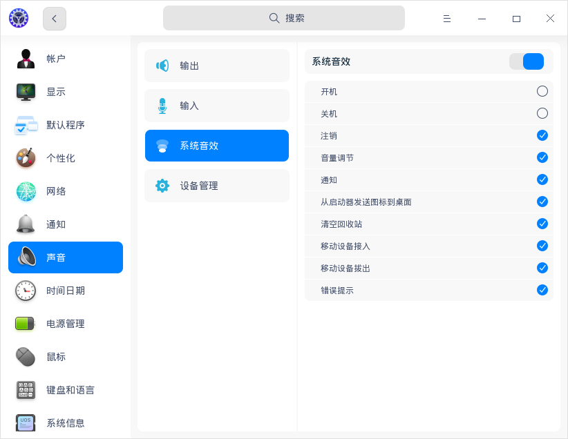

#### 输出设备

1. 在控制中心首页，单击 。
2. 单击 **输出**，进入输出设备配置界面，您可以：
   - 通过拖曳滑块调节输出音量和左/右声道平衡。
   - 打开 **音量增强**，音量的可调节区间由0~100% 转变为0~150%。
   - 在输出设备后面的下拉框中选择输出设备类型。

#### 输入设备

1. 在控制中心首页，单击 。
2. 单击 **输入**，进入输入设备配置界面，您可以：
   - 通过拖曳音量滑块调节输入音量。
   - 打开启用开关，还可以设置 **噪音抑制** 功能。
   - 在输入设备后面的下拉框中选择输入设备类型。

>  窍门：通常，需要调大输入音量，确保能够听到声源的声音，但是音量不宜过大，因为这会导致声音失真。可以对着输入设备如麦克风以正常说话的音量讲话，并观察反馈音量的变化，变化较明显，则说明输入音量合适。

#### 系统音效

1. 在控制中心首页，单击 。
2. 单击 **系统音效**，勾选选项，开启某一事件发生时的声音效果。

>  窍门：您可以单击试听音效。

#### 设备管理

1. 在控制中心首页，单击 。
2. 单击 **设备管理**，开启/禁用输入设备、输出设备。

### 蓝牙设置

蓝牙能够实现短距离的无线通信。通过蓝牙无需网络或连接线就可以与附近的其它蓝牙设备连接。常见的蓝牙设备包括：蓝牙键盘、蓝牙鼠标、蓝牙耳机、蓝牙音响等。

&nbsp;&nbsp;&nbsp;&nbsp;&nbsp;&nbsp;&nbsp;&nbsp;&nbsp;&nbsp;&nbsp;&nbsp;&nbsp;

>  说明：有些电脑没有配备蓝牙，您可以购买蓝牙适配器，接入电脑中使用。

#### 修改蓝牙名称

1. 在控制中心首页，单击  。
2. 单击蓝牙名称旁的 ，输入本机新的蓝牙名称。

>  说明：修改蓝牙名称后，将自动对外广播蓝牙设备的新名字，需要其他设备重新进行搜索。

#### 连接蓝牙设备

1. 在控制中心首页，单击 。
2. 开启 **蓝牙**，系统将自动扫描附近的蓝牙设备，并显示在 **其他设备** 列表。
3. 单击想连接的蓝牙设备，在该设备上输入蓝牙配对码（若需要），配对成功后将自动连接。
4. 连接成功后，蓝牙设备会添加到 **我的设备** 列表中。
5. 在我的设备列表中单击该设备，您可以 **断开连接**，修改设备名称。

#### 使用蓝牙传送/接收文件

UOS PC与非UOS PC或者UOS PC与移动设备（手机/平板）之间通过蓝牙设备传送/接收文件。

前提条件：发送端蓝牙设备与接收端蓝牙设备已配对并连接成功。

**使用UOS PC端蓝牙传送文件**

场景：发送端（UOS PC）通过蓝牙向接收端（非UOS PC/手机/平板）传送文件。

1. 在控制中心首页，单击 。
2. 开启 **蓝牙**，系统将自动扫描附近的蓝牙设备。
3. 进入“我的设备”选择已配对连接的蓝牙设备，单击已连接附近的  进入详情，单击 **发送文件** 按钮（仅PC/手机/平板的蓝牙设备有该按钮），在弹出的文件管理器窗口中选择要发送的文件，单击 **打开**。
4. 在弹出的 “蓝牙文件传输” 窗口中，选择接收此文件的蓝牙设备，单击 **发送**，发送传输文件请求。

**使用手机端蓝牙传送文件**

场景：发送端（以安卓手机为例）通过蓝牙向接收端（UOS PC）传送文件。

1. 开启 **蓝牙**，系统将自动扫描附近的蓝牙设备。
2. 选择已配对并连接成功的蓝牙设备。
3. 在手机中选择文件，单击 **发送**，通过蓝牙发送文件。

**使用蓝牙接收文件**

发送端发送文件后，接收端弹出提示窗口，用户可以单击 **接受** 或 **拒绝** 文件。

- 如果接收端蓝牙设备同意接收，则发送端开始传输文件并显示发送文件窗口，文件传输完成后，接收端会弹出提示信息，用户可以查看接收成功的文件。
- 如果接收端为如下情况，发送端部分文件传输失败，会显示在传输失败列表。
   - 接收端蓝牙设备选择拒绝，则结束传输，显示传输失败。
   - 接收端蓝牙设备超时未操作或超出传输范围，则显示传输失败（蓝牙设备连接失败）。
   - 接收端即不单击接收也不单击拒绝，默认1分钟后则结束传输，显示传输失败。

### 时间日期

选择正确的所在时区，即可在电脑上显示所在地的时间和日期，也可以手动修改时间和日期。

#### 修改时区
在您安装系统时，已选择了系统时区。若要修改系统时区，请按如下步骤设置。

1. 在控制中心首页，单击 。
2. 单击 **时区列表**。
3. 单击 **修改系统时区**， 通过搜索或单击地图选择时区。
4. 单击 **确定**。

#### 添加时区

您可以同时使用多个时区，以便查看另一时区的时间。

1. 在控制中心首页，单击 。
2. 单击 **时区列表**。
3. 单击 **添加时区** 按钮，通过搜索或单击地图选择时区。
4. 单击 **添加**。

#### 删除时区

1. 在控制中心首页，单击 。
2. 单击 **时区列表**。
3. 单击时区列表后面的 **编辑**。
4. 单击 **删除** 按钮 ，删除已添加的时区。

#### 修改时间和日期
默认情况下，系统通过网络自动同步该时区的本地时间和日期。您也可以手动修改时间和日期。手动设置后，自动同步功能会被关闭。
1. 在控制中心首页，单击 。

2. 单击 **时间设置** 。
3. 关闭 **自动同步配置**。
4. 手动设置正确的时间和日期。
5. 单击 **确定**。

> 说明：您还可以打开 **自动同步配置**，设置服务器同步参数。

#### 设置时间日期格式

系统支持即时设置时间日期的格式。

1. 在控制中心首页，单击 。
2. 单击 **格式设置**，可以设置星期、长短日期、长短时间等格式。

### 电源管理

对系统电源进行一些设置，如设置显示器的关闭时间、自动锁屏时间等。

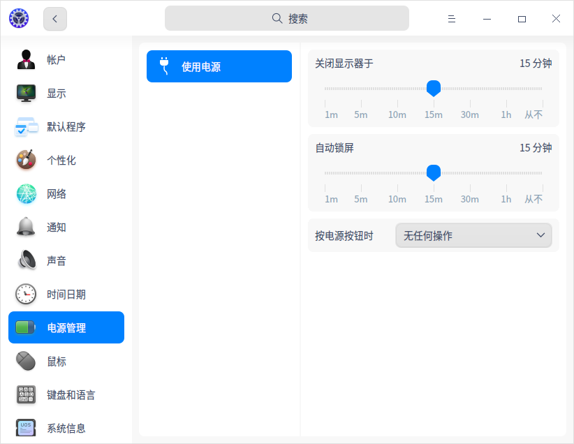

&nbsp;&nbsp;&nbsp;&nbsp;&nbsp;&nbsp;&nbsp;&nbsp;&nbsp;&nbsp;&nbsp;&nbsp;&nbsp;

#### 设置显示器关闭时间

1. 在控制中心首页，单击 。
2. 单击 **使用电源**。
3. 选择关闭显示器的时间。

#### 设置自动锁屏时间

1. 在控制中心首页，单击 。
2. 单击 **使用电源**。
3. 选择自动锁屏的时间。

#### 设置按电源按钮时显示状态

1. 在控制中心首页，单击 。
2. 单击 **使用电源**。
3. 选择电源按钮 **关机**、**关闭显示器** 或 **无任何操作**，更改电源设置。

更改设置后会即时生效，并有通知提示。

### 鼠标

鼠标是电脑常用的输入设备。使用鼠标，可以使操作更加简便快捷。在控制中心鼠标设置模块，用户可以对鼠标进行设置，从而让设备使用体验更加符合自己的使用习惯。

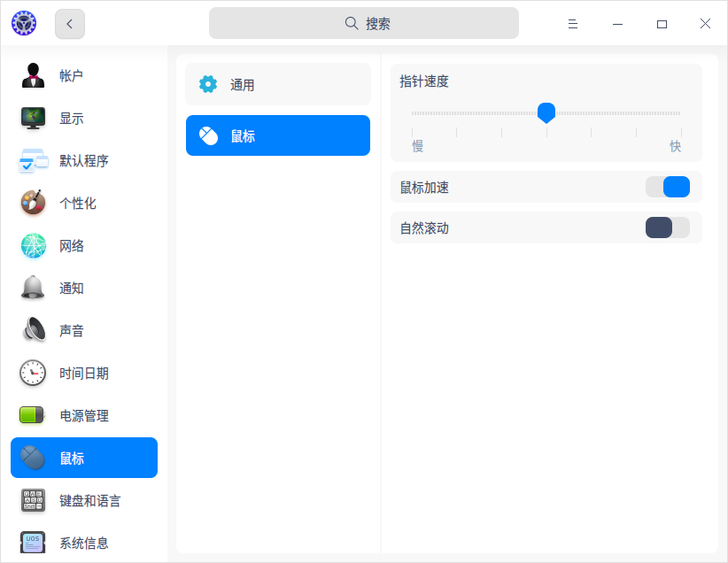

#### 通用设置

1. 在控制中心首页，单击 。
2. 单击 **通用**。
3. 开启 **左手模式**，调节鼠标和触控板的**滚动速度**，**双击速度**。

> 说明：开启左手模式后，鼠标的左右键功能互换。

#### 鼠标设置

插入或连接鼠标后，在控制中心进行相关设置，让其更符合您的使用习惯。

1. 在控制中心首页，单击 。
2. 单击 **鼠标**。
3. 调节 **指针速度**， 控制鼠标移动时指针移动的速度。
4. 单击 **自然滚动** / **鼠标加速** 开关，开启相应功能。

> 说明：
> - 开启鼠标加速，提高了指针精确度，鼠标指针在屏幕上的移动距离会根据移动速度的加快而增加。可以根据使用情况开启或关闭。
> - 自然滚动开启后，鼠标滚轮向下滚动，内容会向下滚动；鼠标滚轮向上滚动，内容会向上滚动。

### 键盘和语言

在此模块可以设置键盘属性，以便符合个人的输入习惯，还可以根据国家和语言调整键盘布局，设置输入法、系统语言，以及自定义快捷键。

#### 键盘属性

1. 在控制中心首页，单击 。
2. 单击 **通用**。
2. 调节 **重复延迟**/**重复速度**。
3. 单击“请在此测试”，按下键盘上的任意字符不松开，查看调节效果。
4. 单击 **启用数字键盘**/**大写锁定提示** 开关，开启相应功能。

#### 键盘布局
键盘布局可以为当前语言设置自定义键盘。完成键盘布局设置后，按下键盘上的按键，屏幕上会按照键盘布局设置好的字符进行显示。更改键盘布局后，屏幕上的字符可能与键盘按键上的字符不相符。

一般在安装系统时就已经设置了键盘布局，可以根据需求添加或删除其他的键盘布局。

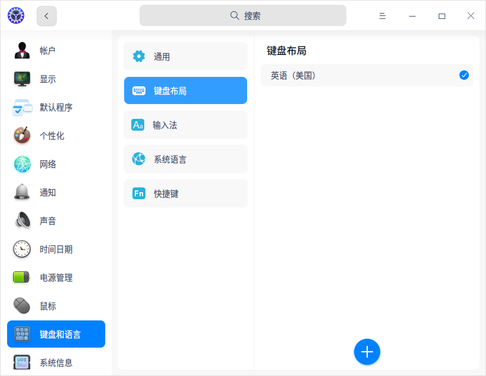

##### 添加键盘布局

1. 在控制中心首页，单击 。
2. 单击 **键盘布局**，进入键盘布局界面。
3. 单击 **添加** 按钮，单击某一键盘布局即可添加到列表。

##### 删除键盘布局

1. 在控制中心首页，单击 。
2. 单击 **键盘布局**，进入键盘布局界面。
3. 单击”键盘布局“后的 **编辑**。
4. 单击 **删除** 按钮 ，删除该键盘布局。

#### 输入法

对输入法进行设置，可以为系统提供更丰富的输入方式。在输入法界面可以添加多个输入法，设置输入法切换的快捷键，以便用户选择符合个人打字习惯的输入方式。

##### 添加输入法

您可以添加多个输入法到输入法管理列表，以便切换输入法。

1. 在控制中心首页，单击 。
2. 单击 **输入法**，进入输入法界面。
3. 单击 **添加** 按钮  ，您可以进入添加输入法界面，选择输入法，将该输入法添加到输入法管理列表。

> 说明： 在输入法管理界面，单击 **编辑**，单击 **删除** 按钮即可移除某输入法。对于被移除（非卸载）的输入法，可以在添加输入法界面进行添加。

##### 设置输入法排序

1. 在控制中心首页，单击 。
2. 单击 **输入法**，进入输入法界面。
3. 在输入法管理区域，上下拖动输入法或单击输入法后面的上下箭头，进行排序。

##### 设置输入法配置项

1. 在控制中心首页，单击 。
2. 单击 **输入法**，进入输入法界面。
3. 在输入法管理区域，单击输入法后面的 **设置** 按钮 ，设置输入法自身的配置项。

##### 设置输入法切换快捷键

1. 在控制中心首页，单击 。
2. 单击 **输入法**，进入输入法界面。
3. 在快捷键区域，切换输入法下拉框中，选择输入法切换的快捷键。

> 说明：输入法切换快捷键设置成功后，当切换输入法，自动切换为输入法对应的键盘布局。选择 **切换方式**， 让切换后的键盘布局应用于整个系统或当前应用。

#### 系统语言

系统语言默认为安装系统时所选择的语言，可以随时进行更改。在系统语言列表可以添加多个语言，以便切换系统语言。

##### 添加系统语言
您可以添加多个语言到系统语言列表，以便切换系统语言。

1. 在控制中心首页，单击 。
2. 单击 **系统语言**，进入系统语言界面。
3. 单击 **添加** 按钮  进入语言列表。
4. 选择语言，该语言将自动添加到系统语言列表。

##### 切换系统语言

1. 在控制中心首页，单击 。
2. 单击 **系统语言**，进入系统语言界面。
3. 选择要切换的语言，系统将自动开始安装语言包。
4. 语言包安装完成后，需要注销后重新登录，以便设置生效。

> 注意：更改系统语言后，键盘布局可能也会发生改变。重新登录时，请确保使用正确的键盘布局来输入密码。

#### 快捷键
快捷键列表显示了系统所有的快捷键，在这里查看、修改和自定义快捷键。

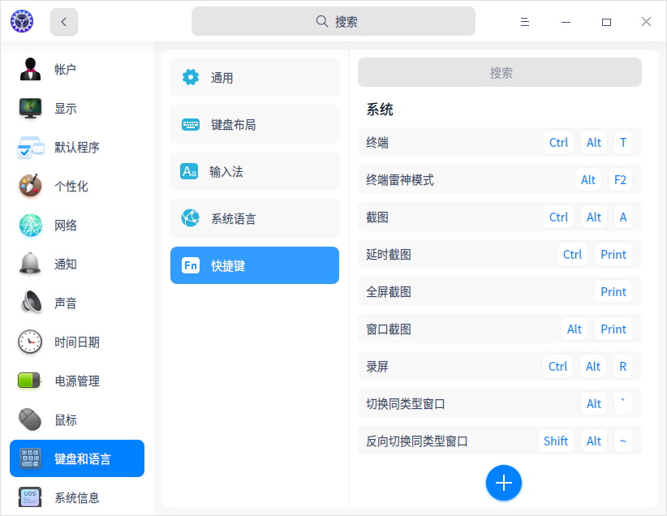

##### 查看快捷键

1. 在控制中心首页，单击 。
2. 单击 **快捷键**，进入快捷键设置界面。
3. 搜索或查看默认的系统快捷键、窗口快捷键和工作区快捷键。

##### 修改快捷键

1. 在控制中心首页，单击 。
2. 单击 **快捷键**，进入快捷键设置界面。
3. 单击需要修改的快捷键。
4. 使用键盘输入新的快捷键。

> 窍门：若要禁用快捷键，请按下键盘上的 **Backspace** 键。若要取消修改快捷键，按下键盘上 **Esc** 键， 或单击下方的”恢复默认”按钮。

##### 自定义快捷键
您可以为常用的应用自定义一个快捷键。

1. 在控制中心首页，单击 。
2. 单击 **快捷键**。
3. 单击 **添加** 按钮，进入添加快捷键界面。
4. 输入快捷键名称、命令和快捷键。
5. 单击 **添加**。
6. 添加成功后，单击”自定义快捷键“后的 **编辑**。
7. 单击某个快捷键后删除按钮 ， 删除自定义的快捷键。

> 窍门：若要修改快捷键，单击输入新的快捷键即可。若要修改自定义快捷键的名称和命令，单击“自定义快捷键”后的 **编辑** ，单击快捷键名称后的 ，进入修改页面。

### 系统信息

查看系统版本、版本授权和电脑硬件等信息，以及该系统的一些协议。

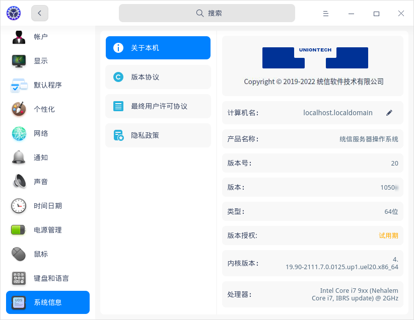

#### 关于本机

1. 在控制中心首页，单击 。
2. 在 **关于本机** 下，您可以：
   - 单击  修改计算机名。
   - 查看当前系统版本、版本授权及电脑硬件信息。

#### 版本协议

1. 在控制中心首页，单击 。
2. 在 **版本协议** 下，查看系统版本协议。

#### 最终用户许可协议

1. 在控制中心首页，单击 。
2. 在 **最终用户许可协议** 下，查看最终用户许可协议。

#### 隐私政策

1. 在控制中心首页，单击 。
2. 在 **隐私政策** 下，查看隐私政策。

### 授权管理

您可以通过GUI界面查看版本授权状态，也可以通过命令行操作来激活系统。

命令行的操作如下：

1. 按下 **Ctrl + Alt + T** 快捷键打开终端。

2. 执行如下命令。

命令：
`uos-activator-cmd  [OPTION]  <key><keyfile><keysfile><index><url>`

uos-activator-cmd  [选项]  <序列号><激活文件><离线激活文件><默认服务器索引><自定义服务器地址>

查看系统激活状态和帮助提示信息，执行无参数程序命令 uos-activator-cmd 。

当需要激活系统或设置服务器地址时，可参考如下参数说明。

| 参数                       | 说明                                                         |
| -------------------------- | ------------------------------------------------------------ |
| -t , -T                    | 用户输入命令+参数（-t或-T），进行试用期激活系统。            |
| -a , -A <key>              | 用户输入命令+参数（-a或-A）+16位或25位序列号，进行序列号激活系统。序列号中可以有”-“字符连接，也可以无”-“字符连接。序列号字母不区分大小写。 |
| -f , -F , --file <keyfile> | 用户输入命令+选项（-f或-f或--file）+.key激活文件，进行激活文件激活系统。 |
| -s , -S                    | 设置激活服务器用户指引和默认服务器列表展示。                 |
| -s , -S --default <index>  | 用户输入命令uos-activator-cmd  -s/-S --default 0表示用户选择激活服务器的地址为：[https://license.chinauos.com](https://license.chinauos.com/)。 |
| -s , -S --http/https <url> | 用户输入命令+参数（-s或-S）+参数（--http/--https自定义服务器）+（url 自定义服务器地址），设置激活服务器地址。 |
| -q , -Q , --query          | 用户输入命令+参数（-q或-Q），查询当前系统对应服务器下的激活状态。 |
| -v , -V , --version        | 用户输入命令+参数（-v或-V或--vision），查看命令行程序版本和程序信息。 |
| -h , -H , --help           | 用户输入命令+参数（-v或-V或--help），查看命令行程序帮助信息。 |

#### 查看激活状态

执行命令 **uos-activator-cmd** ，查看激活状态。

终端显示：

`Ser URL: https://license.chinauos.com`

`Status : Unactivated`

`Autrorization : Not authorized`

`Try 'uos-activator-cmd --help' for more information`

执行命令 **uos-activator-cmd --help**

终端显示：

`Uasge : uos-activator-cmd [options]`

`Options :`

`-t , -T                                 Try full version`

`-a , -A <key>                     Activate with an serial number`

`-f , -F , --file <keyfile>      Activate with an activation file`

`-s , -S                                 Set the activation server address`

`-s , -S --default <index>  Set the default activation server address`

`-s , -S --http <url>            Customize activation server address to http://`

`-s , -S --https <url>           Customize activation server address to https://`

`-q , -Q , --query                 Query activation status`

`-v , -V , --version                Show version information`

`-h , -H , --help                    Displays help`

#### 激活方式

授权管理激活方式分在线激活和离线激活，而在线激活方式分为试用期激活、输入序列号激活、导入激活文件激活。

##### 在线激活

###### 试用期激活

每台设备仅有一次试用期激活机会（默认开机自动激活），从激活当天算起，有效期为180天。试用期完成后，您可以通过购买序列号等方式正式激活系统。

1. 执行命令 **uos-activator-cmd  -t**
终端显示：

You have only one chance to try the full version in 180 days from the activation date. During the trial period, you can use all system features, and activate the system permanently through a serial number or a license file.

Are you sure you want to try the full version(y/n):

2. 用户选择输入y，则确认进行试用期激活。

如果用户选择输入n，则程序运行结束。

###### 序列号激活

执行命令 **uos-activator-cmd  --a  xxxx-xxxx-xxxx-xxxx**

xxxx-xxxx-xxxx-xxxx 表示序列号

###### 文件激活

执行命令 **uos-activator-cmd  -f  filename**

##### **离线激活**

离线激活的前提是系统网络连接异常。

当选择输入序列号或导入授权文件激活时，系统检测网络连接异常，连接不上激活服务器，将进入离线激活。

用户使用移动设备扫描二维码后输入离线激活码。

终端显示：

`Please scan the QR code on your device:`

`To quit activation, press [Ctrl+C]`

`Please input offline activation code:`

#### 激活服务器设置

##### 设置服务器用户指引提示

执行命令 **uos-activator-cmd -s**

终端显示：

`Default servers list:`

`0——[https://license.chinauos.com](https://license.chinauos.com/)`

`1——https://license1.chinauos.com`

`You can use the ‘uos-activator-cmd -s --default number’ to select the default server, or set up a custom server using ‘--http /--https’.`

##### 设置默认服务器

执行命令 **uos-activator-cmd -s --default index**

##### 设置自定义服务器

执行命令 **uos-activator-cmd  -s --http/--https url** 

#### 更换序列号

当系统激活成功后，由于某些原因需要变更序列号。

有且仅当满足如下条件时，支持更换序列号。

- 仅授权状态为已激活时，支持序列号更换。
- 仅授权模式为OPEN时，支持序列号更换。

执行命令 **uos-activator-cmd -c/-C** 更换序列号，仅支持3次序列号更换。