# 桌面環境|dde|

## 概述

統信操作系統（簡稱「統信UOS」）是一款美觀易用、安全可靠的國產桌面操作系統。統信UOS預裝了檔案管理員、看圖、系統監視器等一系列原生應用。它既能讓您體驗到豐富多彩的娛樂生活，也可以滿足您的日常工作需要。隨着功能的不斷升級和完善，統信操作系統已成為國內最受歡迎的桌面操作系統之一。

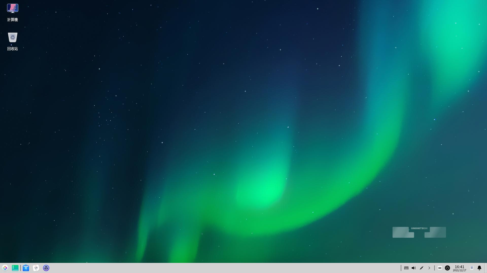

### 系統簡介

初次進入統信操作系統，會自動打開歡迎程序。您可以觀看影片了解系統功能，選擇桌面模式和圖標主題，進一步了解該系統。

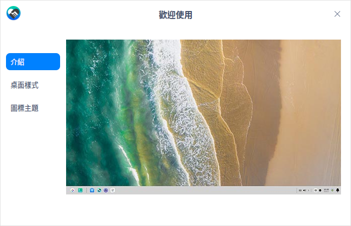

成功登錄系統後，即可體驗統信UOS桌面環境。桌面環境主要由桌面、任務欄、啟動器、控制中心等組成，是您使用該操作系統的基礎。

## 桌面

桌面是登錄後看到的主螢幕區域。在桌面上，您可以新建文件夾/文檔、排序文檔、在終端中打開、設置壁紙與屏保等，還可以通過 [傳送到桌面](#設置快捷方式) 向桌面添加應用的快捷方式。

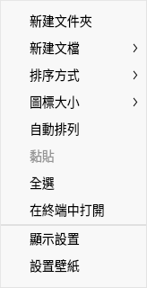

### 新建文件夾/文檔

在桌面新建文件夾或文檔，也可以對文档進行常規操作，和在檔案管理員中一樣。

- 在桌面上，單擊鼠標右鍵，單擊 **新建文件夾**，輸入新建文件夾的名稱。
- 在桌面上，單擊鼠標右鍵，單擊 **新建文檔**，選擇新建文檔的類型，輸入新建文檔的名稱。

在桌面文檔或文件夾上，單擊鼠標右鍵，在彈出的菜單中主要包含如下功能：

| 功能        | 說明                                                     |
| ----------- | -------------------------------------------------------- |
| 打開方式    | 選定系統默認打開方式，也可以選擇其他關聯應用程序來打開。 |
| 剪切        | 移動文檔或文件夾。                                      |
| 複製        | 複製文檔或文件夾。                                      |
| 重命名      | 重命名文檔或文件夾。                                    |
| 刪除        | 刪除文檔或文件夾。                                      |
| 創建鏈接    | 創建一個快捷方式。                                       |
| 標記訊息    | 添加標記訊息，以對文檔或文件夾進行標籤化管理。          |
| 壓縮/解壓縮 | 壓縮文檔或文件夾，或對壓縮文檔進行解壓。               |
| 屬性        | 查看文檔或文件夾的基本訊息、共享方式及其權限。          |

### 設置排列方式

您可以對桌面上的圖標按照需要進行排序。

1. 在桌面上，單擊鼠標右鍵。
2. 單擊 **排序方式**，您可以：
   - 單擊 **名稱**，將按文檔的名稱順序顯示。
   - 單擊 **修改時間**，文檔將按最近一次的修改日期順序顯示。
   - 單擊 **大小**，將按文檔的大小順序顯示。
   - 單擊 **類型**，將按文檔的類型順序顯示。

>  竅門：您也可以勾選 **自動排列**，桌面圖標將從上往下，從左往右按照當前排序規則排列，有圖標被刪除時後面的圖標會自動向前填充。

### 調整圖標大小
1. 在桌面上，單擊鼠標右鍵。
2. 單擊 **圖標大小**。
3. 選擇一個合適的圖標大小。

>  竅門：您也可以用 **Ctrl** + / / 鼠標滾動來調整桌面和啟動器中的圖標大小。

### 設置顯示器

從桌面單擊右鍵菜單選擇「顯示設置」，可以快速進入控制中心設置顯示器的縮放比例、解像度和亮度等。

1. 在桌面上，單擊鼠標右鍵。
2. 單擊 **顯示設置**，快速進入控制中心的顯示設置界面。

>  說明：關於顯示的設置，具體操作請參閱 [顯示設置](#顯示設置)。

 ### 更改壁紙

選擇一些精美、時尚的壁紙來美化桌面，讓您的電腦顯示與眾不同。

1. 在桌面上，單擊鼠標右鍵。
2. 單擊 **設置壁紙**，在桌面底部預覽所有壁紙。
3. 選擇某一壁紙後，壁紙就會在桌面和鎖定螢幕中生效。
4. 單擊 **僅設置桌面** 和 **僅設置鎖屏** 來控制壁紙的生效範圍。

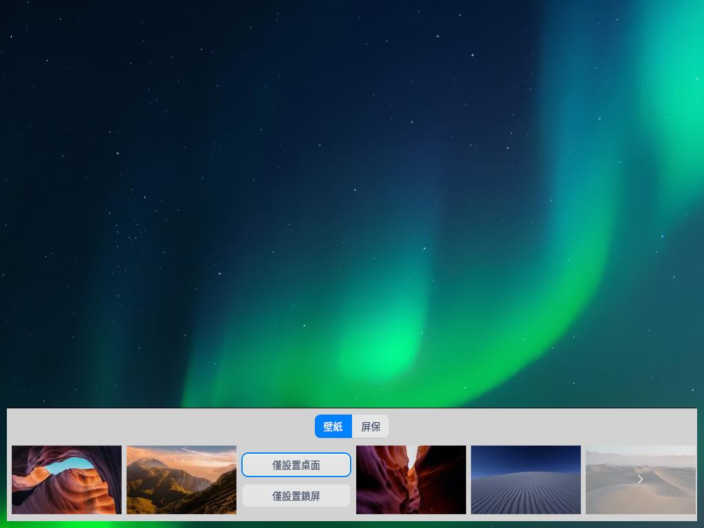

&nbsp;&nbsp;&nbsp;&nbsp;&nbsp;&nbsp;&nbsp;&nbsp;&nbsp;&nbsp;&nbsp;&nbsp;&nbsp;
>  竅門：您還可以在圖片查看器中設置您喜歡的圖片為桌面壁紙。

### 剪貼板

剪貼板展示當前用戶登錄系統後複製和剪切的所有文本、圖片和文檔。使用剪貼板可以快速複製其中的某項內容。註銷或關機後，剪貼板會自動清空。

1. 使用快捷鍵 **Ctrl** + **Alt** + **V** 喚出剪貼板。
2. 雙擊剪貼板內的某一區塊，會快速複製當前內容，且當前區塊會被移動到剪貼板頂部。
3. 選擇目標位置黏貼。
4. 鼠標移入剪貼板的某一區塊，單擊上方的 ，刪除當前內容；單擊頂部的 **全部清除**，清空剪貼板。

## 任務欄

任務欄一般是指位於桌面底部的長條，主要由啟動器、應用程序圖標、托盤區、系統外掛等組成。在任務欄，可以打開啟動器、顯示桌面、進入工作區，對其上的應用程序進行打開、新建、關閉、強制退出等操作，還可以設置輸入法，調節音量，連接網絡，查看日曆，進入關機界面等。

### 認識任務欄圖標

任務欄圖標包括啟動器圖標、應用程序圖標、托盤區圖標、系統外掛圖標等。

| 圖標 | 說明 |
| ------------------------------------------------------------ | :---------------------------------- |
|                         | 啟動器 - 單擊查看所有已安裝的應用。 |                                          |
|  | 顯示桌面。                                          |
|  | 檔案管理員 - 單擊查看磁盤中的文檔、文件夾。 |
| | 瀏覽器 - 單擊打開網頁。 |
|  | 日曆 - 查看日期、新建日程。 |
|  | 控制中心 - 單擊進入系統設置。 |
|  | 通知中心 - 顯示所有系統和應用的通知。 |
|   | 螢幕鍵盤 - 單擊使用虛擬鍵盤。 |
|   | 電源 - 單擊進入關機界面。 |
|| 回收站。 |

&nbsp;&nbsp;&nbsp;&nbsp;&nbsp;&nbsp;&nbsp;&nbsp;&nbsp;&nbsp;&nbsp;&nbsp;&nbsp;
>  竅門：在高效模式下，單擊任務欄右側可顯示桌面。將鼠標指針移到任務欄上已打開窗口的圖標時，會顯示相應的預覽窗口。

### 切換顯示模式

任務欄提供兩種顯示模式：時尚模式和高效模式，顯示不同的圖標大小和應用窗口啟動效果。

&nbsp;&nbsp;&nbsp;&nbsp;&nbsp;&nbsp;&nbsp;&nbsp;&nbsp;&nbsp;&nbsp;&nbsp;&nbsp;

您可以通過以下操作來切換顯示模式：

1. 右鍵單擊任務欄。
2. 在 **模式** 子菜單中選擇一種顯示模式。

### 設置任務欄位置

您可以將任務欄放置在桌面的任意方向。

1. 右鍵單擊任務欄。
2. 在 **位置** 子菜單中選擇一個方向。

### 調整任務欄高度 

鼠標拖動任務欄邊緣，改變任務欄高度。

### 顯示/隱藏任務欄

任務欄可以隱藏，以便最大程度的擴展桌面的可操作區域。 

1. 右鍵單擊任務欄。
2. 在 **狀態** 子菜單中您可以：
   - 選擇 **一直顯示**，任務欄將會一直顯示在桌面上。
   - 選擇 **一直隱藏**，任務欄將會隱藏起來，只有在鼠標移至任務欄區域時才會顯示。
   - 選擇 **智能隱藏**，當佔用任務欄區域時，任務欄自動隱藏。

### 顯示/隱藏外掛

1. 右鍵單擊任務欄。
2. 在 **外掛** 子菜單中勾選或取消勾選 **回收站、電源、顯示桌面、螢幕鍵盤、通知中心、時間**，可以設置這些外掛在任務欄上的顯示和隱藏效果。

### 查看通知

當有系統或應用通知時，會在桌面上方彈出通知消息。若有按鈕，單擊按鈕執行對應操作；若無按鈕，單擊關閉此消息。

&nbsp;&nbsp;&nbsp;&nbsp;&nbsp;&nbsp;&nbsp;&nbsp;&nbsp;&nbsp;&nbsp;&nbsp;&nbsp;

此外，還可以單擊任務欄上的 ， 打開通知中心，查看所有通知。

### 查看日期時間

- 鼠標指針懸停在任務欄的時間上，查看當前日期、星期和時間。
- 單擊時間，打開日曆。

### 進入關機界面

您可以單擊任務欄上的  進入關機界面，也可以在啟動器的小窗口模式中單擊 。

| 功能                                                         | 說明                                          |
| ------------------------------------------------------------ | --------------------------------------------- |
| 關機        | 關閉電腦。                                    |
| 重新啟動        | 關機後再次重新運行您的電腦。                  |
| 待機          | 整個系統將處於低能耗運轉的狀態。                         |
| 休眠                | 沒有swap分區不顯示此項。有swap分區的機器休眠掛載到硬碟。 |
| 鎖定                | 鎖定電腦，按下快捷鍵 **Super** + **L** 鎖定。 |
| 切換使用者 | 選擇另一個用戶帳戶登錄。                      |
| 註銷            | 清除當前登錄用戶的訊息。                      |
| 系統監視器 | 快速啟動系統監視器。                          |

&nbsp;&nbsp;&nbsp;&nbsp;&nbsp;&nbsp;&nbsp;&nbsp;&nbsp;&nbsp;&nbsp;&nbsp;&nbsp;

>  說明：當系統存在多個賬戶時才顯示 **切換使用者** 。

### 回收站

在回收站中，可以找到電腦中臨時被刪除的文件，也可以選擇還原或清空這些文件。

#### 還原文件
臨時被刪除的文件，可以在回收站進行還原，或使用快捷鍵 **Ctrl** + **Z** 還原剛刪除的文件。

1. 在回收站中，選擇要恢復的文件。
2. 單擊鼠標右鍵，選擇 **還原**。
3. 還原文件到原來的存儲路徑下。

> 注意：如果原來所在的文件夾已經刪除，還原文件時會自動新建文件夾。

#### 刪除文件

回收站中可以單獨清除某一文件。

1. 在回收站中，選擇要刪除的文件。
2. 單擊鼠標右鍵，選擇 **刪除**，即可刪除回收站的文件。

#### 清空回收站

在回收站中，單擊 **清空**，將徹底刪除回收站的所有內容。

## 啟動器

啟動器  可以管理系統中所有已安裝的應用，在啟動器中使用分類導航或搜索功能可以快速找到需要的應用程序。

> 說明：arm架構系統暫不支持啟動菜單設置。

在啟動器中可以查看新安裝的應用，新安裝應用的旁邊會出現一個小藍點提示。

### 切換模式

啟動器有全螢幕和小窗口兩種模式。單擊啟動器界面右上角的圖標來切換模式。

兩種模式均支持搜索應用、設置快捷方式等操作。

小窗口模式還支持快速打開檔案管理員、控制中心和進入關機界面等功能。

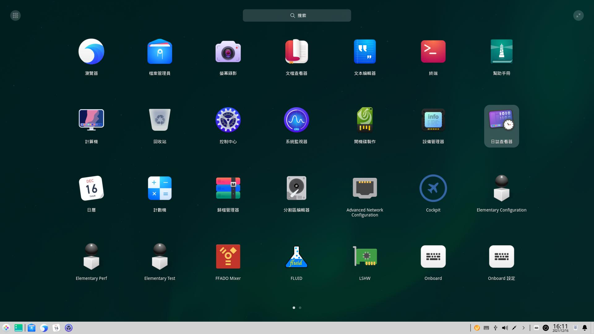

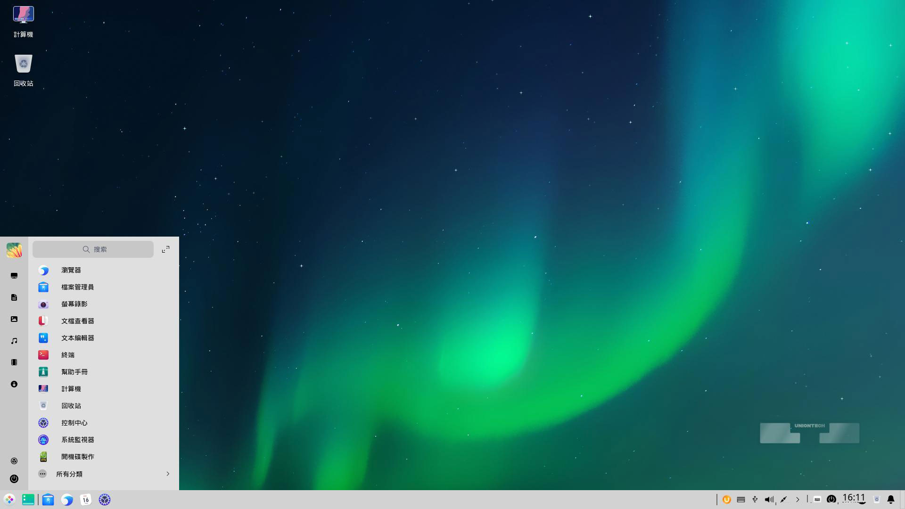

### 排列應用

在全螢幕模式下，系統默認按照安裝時間排列所有應用。

- 將鼠標懸停在應用圖標上，按住鼠標左鍵不放，將應用圖標拖拽到指定的位置自由排列。
- 單擊啟動器界面左上角分類圖標  進行排列。

&nbsp;&nbsp;&nbsp;&nbsp;&nbsp;&nbsp;&nbsp;&nbsp;&nbsp;&nbsp;&nbsp;&nbsp;&nbsp;

在小窗口模式下，默認按照使用頻率排列應用。

### 查找應用

在啟動器中，您可以滾動鼠標滾輪或切換分類導航查找應用。

如果知道應用名稱，直接在搜索框中輸入關鍵字，快速定位到需要的應用。

### 設置快捷方式

快捷方式提供了一種簡單快捷地啟動應用的方法。

#### 創建快捷方式

將應用發送到桌面或任務欄上，方便您的後續操作。

在啟動器中，右鍵單擊應用圖標，您可以：

- 單擊 **傳送到桌面**，在桌面創建快捷方式。

- 單擊 **傳送到任務欄**，將應用固定到任務欄。

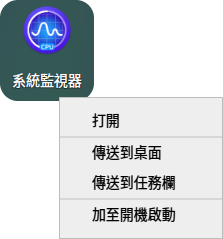

>  說明：您還可以從啟動器拖拽應用圖標到任務欄上放置。但是當應用處於運行狀態時您將無法拖拽固定，此時您可以右鍵單擊任務欄上的應用圖標，選擇 **駐留** 將應用固定到任務欄，以便下次使用時從任務欄上快速打開。

#### 刪除快捷方式

您既可以在桌面直接刪除應用的快捷方式，也可以在任務欄和啟動器中刪除。

**從任務欄上刪除**

- 在任務欄上，按住鼠標左鍵不放，將應用圖標拖拽到任務欄以外的區域移除快捷方式。
- 當應用處於運行狀態時您將無法拖拽移除，此時可以右鍵單擊任務欄上的應用圖標，選擇 **移除駐留** 將應用從任務欄上移除。

**從啟動器中刪除**

在啟動器中，右鍵單擊應用圖標，您可以：

- 單擊 **從桌面移除**，刪除桌面快捷方式。
- 單擊 **從任務欄移除**，將固定到任務欄上的應用移除。

>  說明：以上操作，只會刪除應用的快捷方式，而不會卸載應用。

### 運行應用

對於已經創建了桌面快捷方式或固定到任務欄上的應用，您可以通過以下途徑來打開應用。

- 雙擊桌面圖標，或右鍵單擊桌面圖標選擇 **打開**。
- 直接單擊任務欄上的應用圖標，或右鍵單擊任務欄上的應用圖標選擇 **打開**。

在啟動器中，直接單擊應用圖標打開，或右鍵單擊應用圖標選擇 **打開**。

>  竅門：對於經常使用的應用，您可以在啟動器中，右鍵單擊應用圖標選擇 **開機自動啟動**。

## 控制中心

統信操作系統通過控制中心來管理系統的基本設置，包括帳號管理、網絡設置、日期與時刻設置、個性化設置、顯示設置等。當您進入桌面環境後，單擊任務欄上的  即可打開控制中心窗口。

### 首頁介紹

控制中心首頁主要展示各個設置模塊，方便日常查看和快速設置。

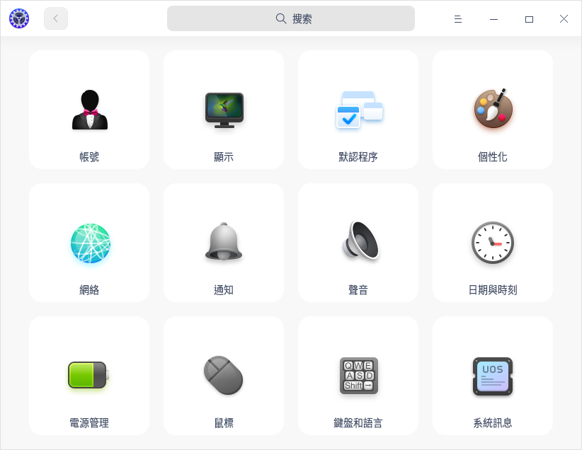

&nbsp;&nbsp;&nbsp;&nbsp;&nbsp;&nbsp;&nbsp;&nbsp;&nbsp;&nbsp;&nbsp;&nbsp;&nbsp;

打開控制中心的某一設置模塊後，可以通過左側導航欄快速切換到另一設置模塊。

#### 標題欄
標題欄包含返回按鈕、搜索框、主菜單及窗口按鈕。

- 返回按鈕：若要返回首頁，單擊 。
- 搜索框：輸入關鍵字，單擊鍵盤上 **Enter** 鍵，搜索相應設置。
- 主菜單：單擊  進入主菜單。在主菜單中，您可以設置窗口主題、查看版本或退出控制中心。

### 賬號設置

在安裝系統時會創建一個賬戶，在控制中心的賬戶設置模塊可以修改賬戶設置或創建一個新賬戶。

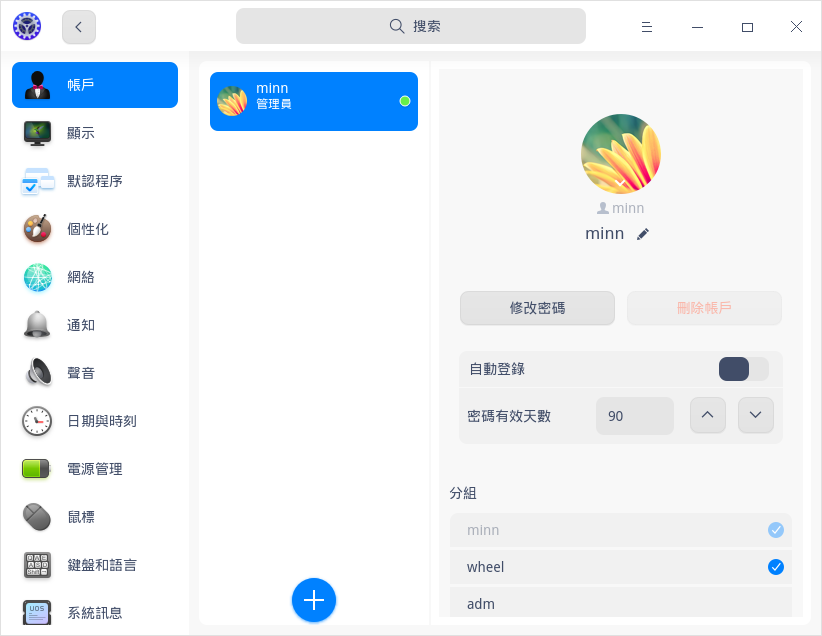

#### 創建新帳號

1. 在控制中心首頁，單擊 。
2. 單擊 **創建帳戶** 按鈕 。
3. 輸入用戶名、密碼和重複密碼。
4. 單擊 **創建**。
5. 在授權對話框輸入當前賬號的密碼，新賬號就會添加到賬號列表中。

#### 更改頭像

1. 在控制中心首頁，單擊 。
2. 單擊列表中的帳號。
3. 單擊賬號頭像，選擇一個頭像或添加本地頭像，頭像就替換完成了。

#### 設置全名

賬號全名會顯示在賬號列表和系統登錄界面，可根據需要設置。

1. 在控制中心首頁，單擊 。
2. 單擊列表中的帳號。
3. 單擊 **設置全名** 後的 ，輸入賬號全名。

#### 修改密碼

1. 在控制中心首頁，單擊 。
2. 單擊當前帳號。
3. 單擊 **修改密碼**，進入修改密碼頁面。
4. 輸入當前密碼、新密碼和重複密碼，單擊 **保存**。

#### 自動登錄

開啟 **自動登錄** 後，下次啟動系統時（重啟、開機）可直接進入桌面。在鎖定螢幕和登出後再次登錄需要密碼。

1. 在控制中心首頁，單擊。
2. 單擊當前帳號。
3. 打開 **自動登錄** 開關，開啟自動登錄功能。

#### 無密碼登錄

開啟 **無密碼登錄** 後，下次登錄系統時（重啟、開機和在登出後再次登錄），不需要密碼，單擊 **登錄** 按鈕 即可登錄系統。

1. 在控制中心首頁，單擊。
2. 單擊當前帳號。
3. 打開 **無密碼登錄** 開關，開啟後可以不用輸入密碼登錄系統。

>  竅門： 
> 
> - 若 **無密碼登錄** 和 **自動登錄** 同時打開，下次啟動系統（重啟、開機）則直接進入桌面。
>
> - 默認勾選 **清空鑰匙環密碼**，在無密碼登錄情況下登錄已經記錄密碼的程序時不需要再次輸入系統登錄密碼，反之則每次都需要輸入系統登錄密碼。

#### 設置指紋ID

指紋ID可以用來登錄系統、解鎖螢幕、特殊操作授權。當需要輸入賬號密碼時，請掃描您的指紋。

1. 在控制中心首頁，單擊 。
2. 單擊當前帳號。
3. 單擊 **添加指紋** 。
4. 使用指紋設備錄入指紋。
5. 待指紋添加成功之後單擊 **完成**。

>  說明：您可以添加多個指紋密碼；也可以刪除一個個指紋密碼。

#### 刪除帳號

1. 在控制中心首頁，單擊 。
2. 單擊其他未登錄的帳戶。
3. 單擊 **刪除賬號** 。
4. 在彈出的確認界面中單擊 **刪除**。

>  注意：已登錄的賬號無法被刪除。

#### 權限設置

除安裝時的第一個帳戶是管理員權限外，後面所添加的所有帳戶都是普通用戶。一個帳戶可以在多個用戶組內。

##### 設置組

添加或修改帳戶時，可以：

- 選擇系統內已有的組。
- 選擇當前用戶同名的組。
- 選擇之前添加帳戶時和其他用戶同名的組。

### 顯示設置

設置顯示器的解析度、亮度、螢幕方向以及縮放倍數，讓您的電腦顯示到達最佳狀態。

#### 單屏設置

當螢幕為單屏時，可以調節螢幕亮度、解像度、刷新率、顯示方向等。

##### 調節亮度

1. 在控制中心首頁，單擊 。
2. 在亮度區域，拖動亮度條滑塊，調節螢幕亮度。

##### 調節色温

1. 在控制中心首頁，單擊 。
2. 在色溫區域，可以：
   - 開啟 **自動調節色溫** 開關，進入護眼模式，自動調節螢幕色溫。
   - 開啟 **手動調節** 色溫開關，手動調節螢幕色溫。

>  說明：**自動調節色溫** 開關開啟時，如單擊開啟 **手動調節** 開關將自動關閉 **自動調節色溫** 開關；反之亦然。

##### 設置螢幕縮放

當桌面和窗口顯示過大或過小時，您可能需要調節螢幕縮放，以便正常顯示。

1. 在控制中心首頁，單擊 。
2. 在螢幕縮放區域， 單擊或拖動滑塊調整縮放倍數。
3. 註銷後重新登錄系統螢幕縮放操作即可生效。

>  說明：
>
> - 當檢測到螢幕為高分屏時，會自動調整縮放倍數。
> - 有的應用可能不支持螢幕縮放，可以在啟動器中右鍵單擊該應用，選擇 **禁用屏幕縮放**，以獲得更好的顯示效果。

##### 更改解像度

1. 在控制中心首頁，單擊 。
2. 在解像度區域的下拉列表中，選擇合適的解像度參數。
3. 單擊 **保存**。

##### 設置螢幕刷新率

1. 在控制中心首頁，單擊 。
2. 在刷新率區域的下拉列表中，選擇一個合適的刷新率。
3. 單擊 **保存**。

##### 改變螢幕方向

1. 在控制中心首頁，單擊 。
2. 在方向區域的下拉列表中，選擇一個合適的方向參數。
3. 單擊 **保存**，改變螢幕方向。

#### 多萤幕顯示設置

多屏顯示可以讓螢幕的視野無限延伸，使用VGA、HDMI、DP等線纜將電腦和另一台顯示器、投影儀等連接起來，電腦上的內容即可同時在多個螢幕中顯示。當電腦設備連接上另一台顯示設備，多屏顯示模式設置模塊才會出現。

1. 在控制中心首頁，單擊 。
2. 在多屏設置區域，模式下拉框中選擇螢幕顯示樣式。

 - **同步** 將主螢幕的顯示內容複製到其他螢幕。
 - **延伸** 將主螢幕的顯示內容擴展到其他螢幕，擴大桌面區域。
 - **僅在xxx顯示** 只在某個螢幕顯示內容。

在多螢幕環境下，按下 **Super** + **P** 調出多螢幕顯示模式的OSD。

詳細操作方法如下。

1. 按住 **Super** 不放，再按下 **P** 或鼠標單擊來進行模式選擇。
2. 鬆開按鍵，確認選擇，模式生效。

>  說明：當多螢幕顯示時，副螢幕也支持桌面圖標顯示、操作右鍵菜單等功能。

### 觸控屏設置

當接入觸控屏時，您可以設置所在螢幕，並對其進行調整。

1. 在控制中心首頁，單擊 。
2. 並對螢幕進行設置，單擊 **確定**。

### 默認程序設置

當安裝有多個功能相似的應用程序時，可以選擇其中的一個應用作為對應文檔類型的默認啟動程序。

#### 設置默認程序

1. 右鍵單擊文檔，選擇 **打開方式** > **選擇默認程序**。
2. 選擇一個應用，自動勾選 **設為默認**，單擊 **確定**。
3. 該應用將自動添加到控制中心的默認程序列表。

#### 更改默認程序

1. 在控制中心首頁，單擊 。
2. 選擇一個文檔類型進入默認程序列表。
3. 在列表中選擇另一個應用程序。

#### 添加默認程序

1. 在控制中心首頁，單擊 。
2. 選擇文檔類型進入默認程序列表。
3. 單擊列表下的**添加默認程序** 按鈕，選擇desktop文檔（一般在/usr/share/applications)，或特定的二進制文檔。
4. 該程序將添加到列表，並自動設置為默認程序。

#### 刪除默認程序

在默認程序列表中，您只能刪除自己添加的應用程序，不能刪除系統已經安裝的應用。要刪除系統已經安裝的應用，只能卸載應用。卸載後該應用將自動從默認程序列表中刪除。

可用以下方法刪除自己添加的默認程序。

1. 在控制中心首頁，單擊 。
2. 選擇文檔類型進入默認程序列表。
3. 單擊程序後面的，刪除默認程序。

### 個性化設置

在控制中心個性化設置模塊可以進行一些通用的個性化設置，包括系統主題、活動用色、字體，改變桌面和窗口的外觀。除此之外還可設置圖標主題、光標主題和字體。

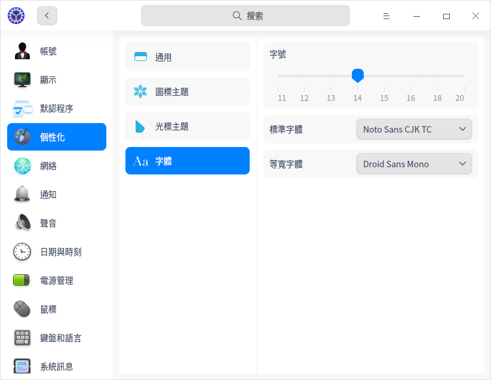

#### 設置窗口主題

1. 在控制中心首頁，單擊 。
2. 單擊 **通用**，選擇一種窗口主題。
3. 該主題即為系統窗口主題。

>  說明：自動主題表示根據當前時區的時間，根據日出日落的時間自動更換窗口主題。日出後是淺色，日落後是深色。

#### 更改活動用色

活動用色是指選中某一選項時的強調色。

1. 在控制中心首頁，單擊 。
2. 單擊 **通用**。
3. 單擊 **活動用色** 下的一種顏色，可實時查看該顏色效果。

#### 設置圖標主題

1. 在控制中心首頁，單擊 。
2. 單擊 **圖標主題**，選擇一款圖標樣式。

#### 設置光標主題

1. 在控制中心首頁，單擊 。
2. 單擊 **光標主題**，選擇一款光標樣式。

#### 更改系統字體

1. 在控制中心首頁，單擊 。
2. 單擊 **字體**，進入設置字體界面。
3. 設置系統字號和字體。

### 網絡設置

登錄系統後，您需要連接網絡，才能接收郵件、瀏覽新聞、下載文檔、聊天、網上購物等。

>  竅門：您可以單擊任務欄托盤區的網絡圖標，查看當前網絡狀態。

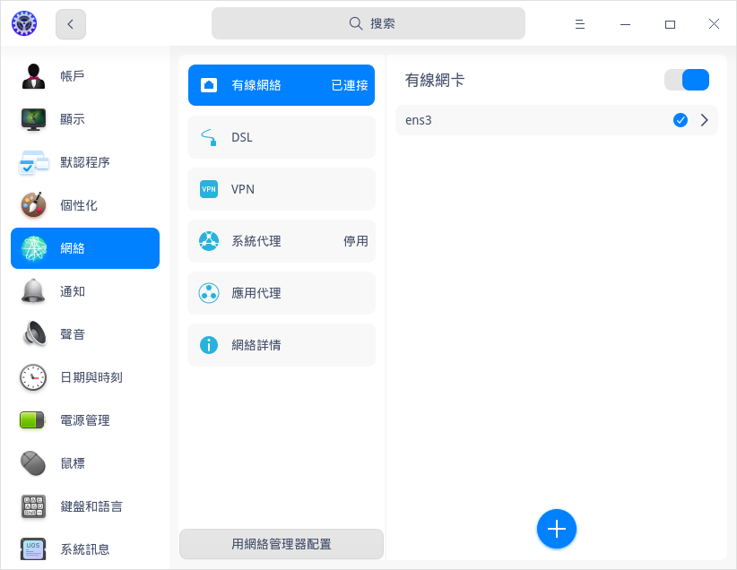

#### 有線網絡

有線網絡安全快速穩定，是最常見的網絡連接方式。當您設置好路由器後，把網線兩端分別插入電腦和路由器，即可連接有線網絡。

1. 將網線插入電腦上的網絡插孔。
2. 將網線的另一端插入路由器或網絡端口。
3. 在控制中心首頁，單擊 。
4. 單擊 **有線網絡**，進入有線網絡設置界面。
5. 打開 **有線網卡**，開啟有線網絡連接功能。
6. 當網絡連接成功後，桌面右上角將彈出 **已連接有線連接** 的提示訊息。

您還可以在有線網絡的設置界面，編輯或新建有線網絡設置。

#### 無線網絡

無線網絡幫助您擺脫線纜的束縛，上網形式更加靈活，支持更多設備使用。

##### 連接無線網絡

1. 在控制中心首頁，單擊 。
2. 單擊 **無線網絡**，進入無線網絡設置界面。
3. 打開 **無線網卡**，開啟無線網絡連接功能。
4. 電腦會自動搜索並顯示附近可用的無線網絡。
5. 選擇需要連接的無線網絡。

   - 如果該網絡是開放的，將自動連接到此網絡。
   - 如果該網絡是加密的，請根據提示輸入密碼，單擊 **連接**，然後將自動完成連接。

##### 連接隱藏網絡

為了防止他人掃描到自己的WiFi，進而破解WiFi密碼連接您的網絡，您可以在路由器設置界面隱藏無線網絡。設置後，您需要手動連接隱藏網絡才能上網。

1. 在控制中心首頁，單擊 。
2. 單擊 **無線網絡**，進入無線網絡設置界面。
3. 單擊 **連接到隱藏網絡**。
4. 輸入網絡名稱、SSID和其他必填選項。
5. 單擊 **保存** 。

#### 無線熱點

無線熱點將電腦連接的網絡信號轉換為WiFi熱點，以供一定距離內的其他設備無線上網。要開啟無線熱點，電腦必須連接到網絡並裝有無線網卡。

1. 在控制中心首頁，單擊 。
2. 單擊 **個人熱點**。
3. 打開 **熱點** 開關，設置熱點訊息。
4. 單擊 **保存**。

#### 移動網絡

當您處於一個沒有網絡信號的地方時，可以使用無線上網卡來上網。在有電話信號覆蓋的任何地方，無線上網卡通過運營商的移動數據網絡接入寬帶服務。

1. 將移動網卡插入電腦上的USB接口中。
2. 電腦將根據移動網卡和運營商訊息，自動適配並自動連接網絡。
3. 在控制中心首頁，單擊 。
4. 單擊 **移動網絡**，查看詳細設置訊息。

#### 撥號網絡

撥號上網（DSL）是指通過本地電話撥號連接到網絡的連接方式。配置好調制解調器，把電話線插入電腦的網絡接口，創建寬帶撥號連接，輸入運營商提供的用戶名和密碼，即可撥號連接到Internet上。

##### 新建撥號連接

1. 在控制中心首頁，單擊  。
2. 單擊 **DSL**，並單擊 **創建PPPoE連接** 按鈕 。
3. 輸入寬帶名稱、用戶名、密碼。
4. 單擊 **保存**，系統自動創建寬帶連接並嘗試連接。

#### VPN

VPN即虛擬專用網絡，其主要功能是在公用網絡上建立專用網絡，進行加密通訊。無論您是在外地出差還是在家中辦公，只要能上網就能利用VPN訪問企業的內網資源。您還可以使用VPN加速訪問其他國家的網站。

1. 在控制中心首頁，單擊 。
2. 單擊 **VPN**，選擇 **添加VPN** 按鈕 或 **導入VPN** 按鈕。
3. 選擇VPN協議類型，並輸入名稱、網關、賬號、密碼等訊息。（導入VPN會自動填充訊息）
4. 單擊 **保存**，系統自動嘗試連接VPN網絡。
5. 您可以將VPN設置導出，備用或共享給其他用戶。

>  說明：打開 **僅用於相對應的網絡上的資源** 開關，可以不將VPN設置為默認路由，只在特定的網絡資源上生效。

#### 系統代理

1. 在控制中心首頁，單擊  。
2. 單擊 **系統代理**，進入系統代理界面。
3. 開啟系統代理，在代理類型後的下拉框中選擇 **手動** 或 **自動**。

   - 單擊 **手動**，輸入代理伺服器的地址和端口訊息。
   - 單擊 **自動**，輸入URL，系統將自動配置代理伺服器的訊息。

4. 單擊 **保存**。

#### 應用代理

1. 在控制中心首頁，單擊  。
2. 單擊 **應用代理**。
3. 設置應用代理參數。
4. 單擊 **保存**。

>  說明：應用代理設置成功後，打開啟動器，右鍵單擊應用圖標，可以選擇 **使用代理**。

#### 網絡詳情

在網絡詳情界面，您可以查看MAC、IP位址、網關和其他網絡訊息。

1. 在控制中心首頁，單擊 。
2. 單擊 **網絡詳情**，進入網絡訊息界面。
3. 查看當前有線網絡或無線網絡的訊息。

### 通知設置

設置通知勿擾模式，開啟或關閉某些應用的通知顯示。

#### 設置系統通知

設置系統通知的勿擾模式及是否在任務欄顯示通知圖標。

1. 在控制中心首頁，單擊 。

2. 單擊 **系統通知**，進入系統通知界面。

   - 開啟或關閉勿擾模式。
     當開啟勿擾模式後，可以設置勿擾模式的開啟時間、結束時間；也可以設置 **在屏幕鎖屏時** 顯示通知。開啟勿擾模式可以使所有通知靜音，但您可以在通知中心查看所有消息。
   - 設置 **是否在任務欄顯示圖標**。

#### 設置應用通知

自定義設置個性化的應用通知顯示。

1. 在控制中心首頁，單擊 。
2. 在應用通知區域選擇一個應用，開啟後，您可以勾選：
   - 通知時提示聲音
   - 鎖屏時顯示消息
   - 在通知中心顯示
   - 顯示消息預覽

### 聲音設置

輸入輸出設備聲音的設置（如設置揚聲器和麥克風），讓您聽得更舒適，錄音更清晰。

#### 输出設備

1. 在控制中心首頁，單擊 。
2. 單擊 **输出**，進入输出設置界面，您可以：
   - 在輸出設備後的下拉框中選擇輸出設備類型。
   - 通過拖曳滑塊調節輸出設備音量和左/右聲道平衡。
   - 打開 **音量增強**，音量的可調節區間由0~100%轉變為0~150%。

#### 輸入設備

1. 在控制中心首頁，單擊 。
2. 單擊 **輸入**，進入輸入設備設置介面，您可以：

   - 在輸入設備後的下拉框中選擇輸入設備類型。
   - 透過拖曳滑塊調節輸入設備音量。
   - 打開 **啟用** 開關，還可以設置 **噪音抑制** 功能。

>  竅門：通常需要調大輸入音量，方可確保能夠聽到聲源的聲音，但是音量不宜過大，否則將導致聲音失真。您可以對着輸入設備以正常說話的音量講話，並觀察反饋音量的變化，變化較明顯，則說明輸入音量合適。

#### 音效

1. 在控制中心首頁，單擊 。
2. 單擊 **音效**，勾選選項，開啟某一事件發生時的聲音效果。

>  竅門：您可以單擊試聽音效。

### 日期與時刻

選擇正確的所在時區，即可在電腦上顯示所在地的時間和日期，也可以手動修改時間和日期。

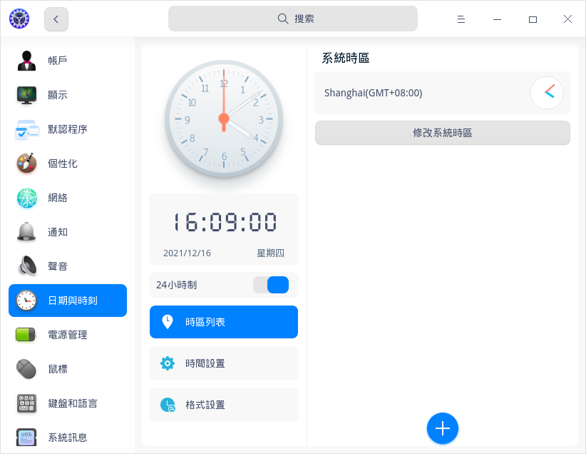

#### 修改時區

在您安裝系統時，已選擇了系統時區。若要修改系統時區，請按如下步驟設置。

1. 在控制中心首頁，單擊 。
2. 單擊 **時區列表**。
3. 單擊 **修改系統時區**， 通過搜索或單擊地圖選擇時區。
4. 單擊 **確定**。

#### 添加時區

您可以同時使用多個時區，以便查看另一時區的時間。

1. 在控制中心首頁，單擊 。
2. 單擊 **時區列表**。
3. 單擊 **添加時區** 按鈕 ，通過搜索或單擊地圖選擇時區。
4. 單擊 **添加**。

#### 刪除時區

1. 在控制中心首頁，單擊 。
2. 單擊 **時區列表**。
3. 單擊時區列表後面的 **更改**。
4. 單擊 **刪除** 按鈕 ，刪除已添加的時區。

#### 修改時間和日期

默認情況下，系統通過網絡自動同步該時區的本地時間和日期。您也可以手動修改時間和日期。手動設置後，自動同步功能會被關閉。

1. 在控制中心首頁，單擊 。
2. 單擊 **時間設置** 。
3. 關閉 **自動同步配置**。
4. 手動設置正確的時間和日期。
5. 單擊 **確定**。

> 說明：您還可以打開 **自動同步配置**、設置伺服器同步參數。

#### 設置時間日期格式

系統支持即時設置時間日期的格式。

1. 在控制中心首頁，單擊 。
2. 單擊 **格式設置**，可以設置星期、長短日期、長短時間等格式。

### 電源管理

對系統電源進行一些設置，讓筆記本電池更耐用，讓系統更安全。

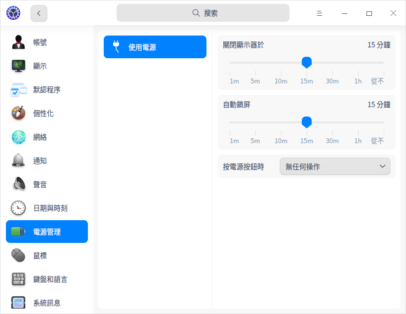

&nbsp;&nbsp;&nbsp;&nbsp;&nbsp;&nbsp;&nbsp;&nbsp;&nbsp;&nbsp;&nbsp;&nbsp;&nbsp;

#### 調整性能模式

1. 在控制中心首頁，單擊 。
2. 單擊 **通用**。
3. 在性能模式區域，選擇 **平衡模式**、**高性能模式** 或 **節能模式**。

> 說明：僅當硬件支持高性能模式時，才顯示 **高性能模式** 選項。

#### 設置節能模式

為降低電腦的耗電量，您可以對節能模式進行設置，降低螢幕亮度。

1. 在控制中心首頁，單擊 。
2. 單擊 **通用**。
3. 選擇 **節能模式**。
4. 在節能設置下：
   - 打開 **低電量時自動開啟** 節能模式（僅手提電腦支持）。
   - 打開 **使用電池時自動開啟** 節能模式（僅手提電腦支持）。
   - 拖動 **自動降低亮度** 條滑塊，調節亮度。

> 說明：當關閉 **使用電池時自動開啟** 節能模式時，則直接進入 **平衡模式**。

#### 喚醒時需要密碼

1. 在控制中心首頁，單擊 。
2. 單擊 **通用**。
3. 打開 **待機恢復時需要密碼**/**喚醒顯示器時需要密碼**，開啟相應安全設置。

#### 設置顯示器關閉時間

1. 在控制中心首頁，單擊 。
2. 單擊 **使用電源** 或 **使用電池**。
3. 選擇關閉顯示器的時間。

>  說明：筆記本電腦用戶可以在 **使用電源** 和 **使用電池** 下對同一設置項分別設置不同的時間。

#### 設置電腦待機時間

1. 在控制中心首頁，單擊 。
2. 單擊 **使用電源** 或 **使用電池**。
3. 選擇電腦進入待機模式的時間。

#### 設置自動鎖屏時間

1. 在控制中心首頁，單擊 。
2. 單擊 **使用電源** 或 **使用電池**。
3. 選擇自動鎖屏的時間。

#### 設置合蓋顯示狀態

1. 在控制中心首頁，點擊 。
2. 點擊 **使用電源** 或 **使用電池**。
3. 設置 **筆記本合蓋時** 為 **待機**、**休眠**、**關閉顯示器** 或 **無任何操作**。

>  說明：僅筆記本電腦支持設置合蓋顯示狀態。

#### 設置按電源按鈕時顯示狀態

1. 在控制中心首頁，單擊 。
2. 單擊 **使用電源** 或 **使用電池**。
3. 選擇按電源按鈕時的顯示狀態 **關機**、**關閉顯示器** 或 **無任何操作**，更改按電源按鈕時的設置。

更改設置後會即時生效，並有通知提示。

#### 設置低電量通知

1. 在控制中心首頁，單擊 。
2. 單擊 **使用電池**。
3. 打開 **低電量通知**，當電池剩餘電量低於設置的閾值（例如，20%）時，系統會發出低電量通知。

通過拖拽低電量滑塊，調節低電量的閾值；或通過拖拽自動待機電量滑塊，調節待機電量的閾值。

>  說明：僅筆記本電腦支持設置低電量通知。

#### 設置自動待機電量

1. 在控制中心首頁，單擊 。
2. 單擊 **使用電池**。
3. 拖動 **自動待機電量** 條滑塊，調節自動待機電量。

>  說明：僅筆記本電腦支持設置自動待機電量。

### 鼠標和觸控板

鼠標和觸控板是電腦常用的輸入設備。使用鼠標，可以使操作更加簡便快捷。對於手提電腦用戶，當沒有鼠標時，也可以使用觸控板代替鼠標進行操作。部分設備還支持指點杆，使用指點杆不需要將手指從基準鍵上移開便能操縱鼠標。在控制中心鼠標設置模塊，用戶可以對鼠標、觸控板和指點杆進行設置，從而讓設備使用體驗更加符合自己的使用習慣。

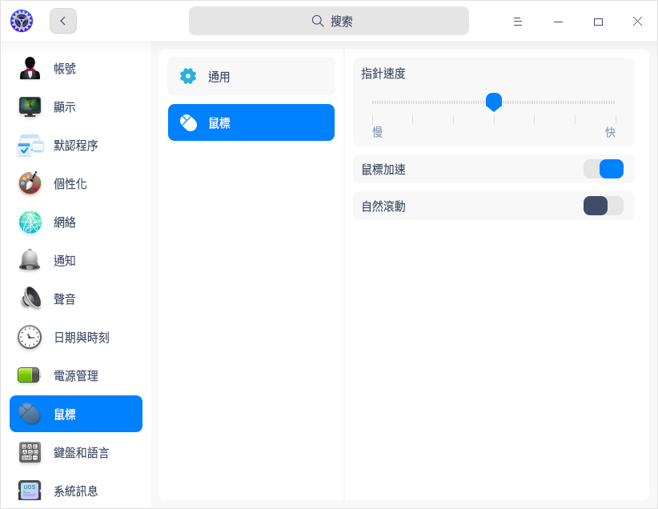

#### 通用設置

1. 在控制中心首頁，單擊 。
2. 單擊 **通用**。
3. 開啟 **左手模式**，調節鼠標和觸控板的**滾動速度**，**雙擊速度**。

>  說明：開啟 **左手模式** 後，鼠標和觸控板的左右鍵功能互換。

#### 鼠標設置

插入或連接鼠標後，在控制中心進行相關設置，讓其更符合您的使用習慣。

>  說明：當沒有觸控板時，不會顯示 **插入鼠標時禁用觸控板**。
>

1. 在控制中心首頁，單擊 。
2. 單擊 **鼠標**。
3. 調節 **指針速度**， 控制鼠標移動時指針移動的速度。
4. 單擊 **自然滾動**/**鼠標加速** 開關，開啟相應功能。

>  說明：
>
> - 開啟鼠標加速，提高了指針精確度，鼠標指針在螢幕上的移動距離會根據移動速度的加快而增加。可以根據使用情況開啟或關閉。
> - 自然滾動開啟後，鼠標滾輪向下滾動，內容會向下滾動；鼠標滾輪向上滾動，內容會向上滾動。

#### 觸控板設置

若您使用的是筆記本電腦，可以在 **鼠標** > **通用** 界面開啟 **輸入時禁用觸控板**，在 **鼠標** > **鼠標** 界面開啟 **插入鼠標時禁用觸控板**，以避免誤觸觸控板。

您還可以調節觸控板的 **指針速度**，控制手指移動時指針移動的速度；開啟自然滾動，變更滾動方向。

#### 指點杆設置

指點杆，常稱為小紅帽，是一種主要應用於筆記本電腦的定點設備，可用來控制指針的移動。

1. 在控制中心首頁，單擊 。
2. 單擊 **指點杆**。
3. 調節 **指針速度**， 控制使用指點杆時指針移動的速度。

### 鍵盤和語言

在此模塊可以設置鍵盤屬性，以便符合個人的輸入習慣，還可以根據國家和語言調整鍵盤佈局，設置輸入法、系統語言，以及自定義快捷鍵。

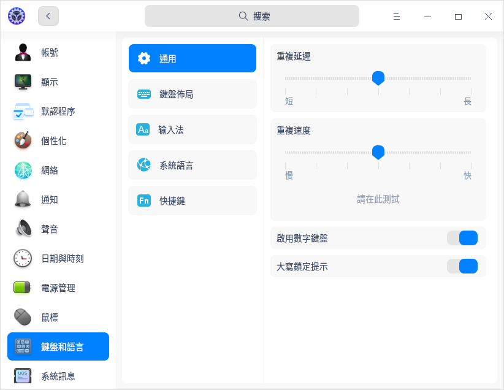

#### 鍵盤屬性

1. 在控制中心首頁，單擊 。
2. 單擊 **通用**。
3. 調節 **重複延遲**/**重複速度**。
4. 單擊 **請在此測試**，按下鍵盤上的任意字符不鬆開，查看調節效果。
5. 單擊 **啟用數字鍵盤**/**大寫鎖定提示** 開關，開啟相應功能。

#### 鍵盤佈局

鍵盤佈局可以為當前語言設置自定義鍵盤。完成鍵盤佈局設置後，按下鍵盤上的按鍵，螢幕上會按照鍵盤佈局設置好的字符進行顯示。更改鍵盤佈局後，螢幕上的字符可能與鍵盤按鍵上的字符不相符。

一般在安裝系統時就已經設置了鍵盤佈局，可以根據需求添加或刪除其他的鍵盤佈局。

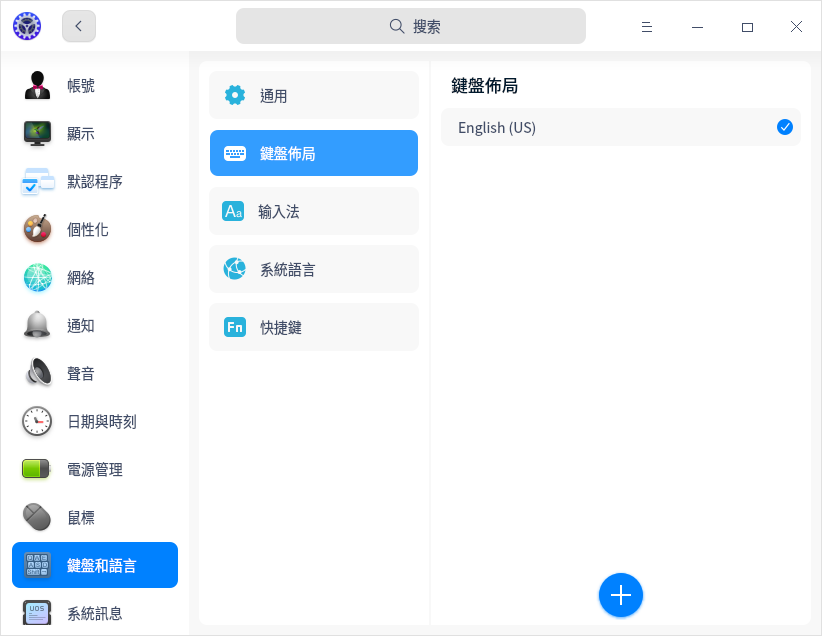

##### 添加鍵盤佈局

1. 在控制中心首頁，單擊 。
2. 單擊 **鍵盤佈局**，進入鍵盤佈局界面。
3. 單擊 **添加** 按鈕 ，單擊某一鍵盤佈局即可添加到列表。

##### 刪除鍵盤佈局

1. 在控制中心首頁，單擊 。
2. 單擊 **鍵盤佈局**，進入鍵盤佈局界面。
3. 單擊 **鍵盤佈局** 後的 **更改**。
4. 單擊 **刪除** 按鈕 ，刪除該鍵盤佈局。

#### 輸入法

對輸入法進行設置，可以為系統提供更豐富的輸入方式。在輸入法界面可以添加多個輸入法，設置輸入法切換的快捷鍵，以便用戶選擇符合個人打字習慣的輸入方式。

##### 添加輸入法

您可以添加多個輸入法到輸入法管理列表，以便切換輸入法。

1. 在控制中心首頁，單擊 。
2. 單擊 **輸入法**，進入輸入法界面。
3. 單擊 **添加** 按鈕  ，您可以進入添加輸入法界面，選擇輸入法，將該輸入法添加到輸入法管理列表。

> 說明： 在輸入法管理界面，單擊 **編輯**，單擊 **刪除** 按鈕即可移除某輸入法。對於被移除（非卸載）的輸入法，可以在添加輸入法界面進行添加。

##### 設置輸入法排序

1. 在控制中心首頁，單擊 。
2. 單擊 **輸入法**，進入輸入法界面。
3. 在輸入法管理區域，上下拖動輸入法或單擊輸入法後面的上下箭頭，進行排序。

##### 設置輸入法配置項

1. 在控制中心首頁，單擊 。
2. 單擊 **輸入法**，進入輸入法界面。
3. 在輸入法管理區域，單擊輸入法後面的 **設置** 按鈕 ，設置輸入法自身的配置項。

##### 設置輸入法切換快捷鍵

1. 在控制中心首頁，單擊 。
2. 單擊 **輸入法**，進入輸入法界面。
3. 在快捷鍵區域，切換輸入法下拉框中，選擇輸入法切換的快捷鍵。

> 說明：輸入法切換快捷鍵設置成功後，當切換輸入法，自動切換為輸入法對應的鍵盤佈局。選擇 **切換方式**， 讓切換後的鍵盤佈局應用於整個系統或當前應用。

#### 系統語言

系統語言默認為安裝系統時所選擇的語言，可以隨時進行更改。在系統語言列表可以添加多個語言，以便切換系統語言。

##### 添加系統語言

您可以添加多個語言到系統語言列表，以便切換系統語言。

1. 在控制中心首頁，單擊 。
2. 單擊 **系統語言**，進入系統語言界面。
3. 單擊 **添加** 按鈕  進入語言列表。
4. 選擇語言，該語言將自動添加到系統語言列表。

##### 設置系統語言

1. 在控制中心首頁，單擊 。
2. 單擊 **系統語言**，進入系統語言界面。
3. 選擇要切換的語言，系統將自動開始安裝語言包。
4. 語言包安裝完成後，需要登出後重新登入，以便讓設置生效。

>  注意：更改系統語言後，鍵盤佈局可能也會發生改變。重新登入時，請確保使用正確的鍵盤佈局來輸入密碼。

#### 快捷鍵

快捷鍵列表顯示了系統所有的快捷鍵，在這裏查看、修改和自定義快捷鍵。

##### 查看快捷鍵

1. 在控制中心首頁，單擊 。
2. 單擊 **快捷鍵**，進入快捷鍵設置界面。
3. 搜索或查看默認的系統快捷鍵、窗口快捷鍵和工作區快捷鍵。

##### 修改快捷鍵

1. 在控制中心首頁，單擊 。
2. 單擊 **快捷鍵**，進入快捷鍵設置界面。
3. 單擊需要修改的快捷鍵。
4. 使用鍵盤輸入新的快捷鍵。

>  竅門：若要禁用快捷鍵，請按下鍵盤上的 **Backspace**  鍵。若要取消修改快捷鍵，按下 **Esc** 鍵，或單擊下方的 **恢復默認** 按鈕。

##### 自定義快捷鍵

您可以為常用的應用自定義一個快捷鍵。

1. 在控制中心首頁，單擊 。
2. 單擊 **快捷鍵**。
3. 單擊 **添加** 按鈕 ，進入添加快捷鍵界面。
4. 輸入快捷鍵名稱、命令和快捷鍵。
5. 單擊 **添加**。
6. 添加成功後，單擊 **自定義快捷鍵** 後的 **更改**。
7. 單擊某個快捷鍵後 **刪除** 按鈕 ， 刪除自定義的快捷鍵。

>  竅門：若要修改快捷鍵，單擊輸入新的快捷鍵即可。若要修改自定義快捷鍵的名稱和命令，單擊 **自定義快捷鍵** 後的 **更改** ，單擊快捷鍵名稱後的 ，進入修改頁面。

### 系統訊息

您可以查看系統版本、版本協議和電腦硬件等訊息，以及該系統的一些協議。

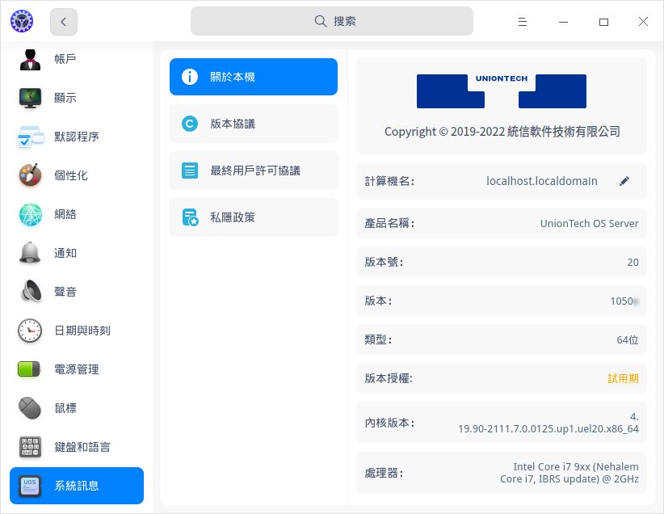、

#### 關於本機

1. 在控制中心首頁，單擊 。
2. 在 **關於本機** 下，您可以查看當前系統版本、版本授權及電腦硬件訊息。
3. 若系統未啟動，可在此頁面單擊 **啟動**，進行系統啟動。

#### 版本協議

1. 在控制中心首頁，單擊 。
2. 在 **版本協議** 下，查看系統版本協議。

#### 最終用戶許可協議

1. 在控制中心首頁，單擊 。
2. 在 **最終用戶許可協議** 下，查看最終用戶許可協議。

#### 私隱政策

1. 在控制中心首頁，單擊 。
2. 在 **私隱政策** 下，查看私隱政策。

### 授權管理

您可以通過GUI界面查看版本授權狀態，也可以通過命令行操作來啟用系統。

命令行的操作如下：

1. 按下 **Ctrl + Alt + T** 快捷鍵打開終端。

2. 執行如下命令。

命令：
`uos-activator-cmd  [OPTION]  <key><keyfile><keysfile><index><url>`

uos-activator-cmd  [選項]  <序列號><啟用文件><離線啟用文件><默認伺服器索引><自定義伺服器地址>

查看系統啟用狀態和幫助提示訊息，執行無參數程序命令 uos-activator-cmd 。

當需要啟用系統或設置伺服器地址時，可參考如下參數說明。

| 參數                       | 說明                                                         |
| -------------------------- | ------------------------------------------------------------ |
| -t , -T                    | 用戶輸入命令+參數（-t或-T），進行試用期啟用系統。            |
| -a , -A <key>              | 用戶輸入命令+參數（-a或-A）+16位或25位序列號，進行序列號啟用系統。序列號中可以有”-“字符連接，也可以無”-“字符連接。序列號字母不區分大小寫。 |
| -f , -F , --file <keyfile> | 用戶輸入命令+選項（-f或-f或--file）+.key啟用文件，進行啟用文件啟用系統。 |
| -s , -S                    | 設置啟用伺服器用戶指引和默認伺服器列表展示。                 |
| -s , -S --default <index>  | 用戶輸入命令uos-activator-cmd  -s/-S --default 0表示用戶選擇啟用伺服器的地址為：[https://license.chinauos.com](https://license.chinauos.com/)。 |
| -s , -S --http/https <url> | 用戶輸入命令+參數（-s或-S）+參數（--http/--https自定義伺服器）+（url 自定義伺服器地址），設置啟用伺服器地址。 |
| -q , -Q , --query          | 用戶輸入命令+參數（-q或-Q），查詢當前系統對應伺服器下的啟用狀態。 |
| -v , -V , --version        | 用戶輸入命令+參數（-v或-V或--vision），查看命令行程序版本和程序訊息。 |
| -h , -H , --help           | 用戶輸入命令+參數（-v或-V或--help），查看命令行程序幫助訊息。 |

#### 查看啟用狀態

執行命令 **uos-activator-cmd** ，查看啟用狀態。

終端顯示：

`Ser URL: https://license.chinauos.com`

`Status : Unactivated`

`Autrorization : Not authorized`

`Try 'uos-activator-cmd --help' for more information`

執行命令 **uos-activator-cmd --help**

終端顯示：

`Uasge : uos-activator-cmd [options]`

`Options :`

`-t , -T                                 Try full version`

`-a , -A <key>                     Activate with an serial number`

`-f , -F , --file <keyfile>      Activate with an activation file`

`-s , -S                                 Set the activation server address`

`-s , -S --default <index>  Set the default activation server address`

`-s , -S --http <url>            Customize activation server address to http://`

`-s , -S --https <url>           Customize activation server address to https://`

`-q , -Q , --query                 Query activation status`

`-v , -V , --version                Show version information`

`-h , -H , --help                    Displays help`

#### 啟用方式

授權管理啟用方式分在線啟用和離線啟用，而在線啟用方式分為試用期啟用、輸入序列號啟用、導入啟用文件啟用。

##### 在線啟用

###### 試用期啟用

1. 執行命令 **uos-activator-cmd  -t**
終端顯示：

You have only one chance to try the full version in 180 days from the activation date. During the trial period, you can use all system features, and activate the system permanently through a serial number or a license file.

Are you sure you want to try the full version(y/n):

2. 用戶選擇輸入y，則確認進行試用期啟用。

如果用戶選擇輸入n，則程序運行結束。

###### 序列號啟用

執行命令 **uos-activator-cmd  --a  xxxx-xxxx-xxxx-xxxx**

xxxx-xxxx-xxxx-xxxx 表示序列號

###### 文件啟用

執行命令 **uos-activator-cmd  -f  filename**

##### **離線啟用**

離線啟用的前提是系統網絡連接異常。

當選擇輸入序列號或導入授權文件啟用時，系統檢測網絡連接異常，連接不上啟用伺服器，將進入離線啟用。

用戶使用移動設備掃描二維碼後輸入離線啟用碼。

終端顯示：

`Please scan the QR code on your device:`

`To quit activation, press [Ctrl+C]`

`Please input offline activation code:`

#### 啟用伺服器設置

##### 設置伺服器用戶指引提示

執行命令 **uos-activator-cmd -s**

終端顯示：

`Default servers list:`

`0——[https://license.chinauos.com](https://license.chinauos.com/)`

`1——https://license1.chinauos.com`

`You can use the ‘uos-activator-cmd -s --default number’ to select the default server, or set up a custom server using ‘--http /--https’.`

##### 設置默認伺服器

執行命令 **uos-activator-cmd -s --default index**

##### 設置自定義伺服器

執行命令 **uos-activator-cmd  -s --http/--https url** 

