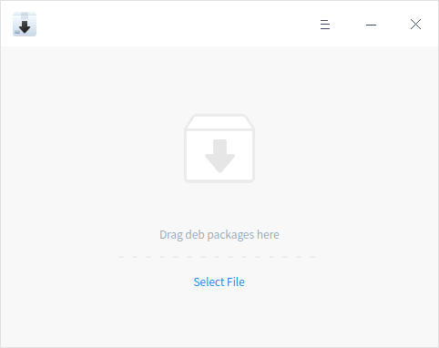

# Package Installer |../common/deepin-deb-installer.svg|

## Overview

Package Installer is an easy-to-use .deb package management tool with a simple interface for users to quickly install customized applications not included in App Store supporting bulk installation, version identification and auto completion.  

## Operations

### Run Package Installer

You can open Package Installer as follows:

- Double click a .deb package to run.
- Click the icon of Package Installer from Launcher to run. 

### Install

Package Installer is capable to install an individual application or multiple applications.

### Singularly Install

1. On Package Installer interface, click **Select File** to add a .deb package.
2. Click **Open**.
3. Click **Install**.
4. If an authentication window pops up, please input password.
5. You can click  or  to display or collapse the installing process.
6. Click **Back** to continue installing other packages or click **OK** to exit.

> Notes: Package Installer will detect your package. If it has been installed locally before, you will get a prompt saying "same version installed" or "other version installed". You can choose whether to **Reinstall** or **Remove**. 

### Bulk Install

To install multiple .deb packages at a time, you can click **Select File** or drag files into Package Installer. Please refer to [Singularly Install](#Singularly Install) for operation steps. Pay attention to the following:

- You can view installing process when multiply installing.
- Only **Install** button is displayed in the window. Installation would be done for packages of those other versions have been installed locally before. Re-installation would be done for packages of those the same versions have been installed locally before.
- To remove a package from the list, right-click it and select **Delete**. 

### Unable to Install

Package Installer is able to identify the packages could not be installed automatically.

Please read the prompt carefully, common causes include: 

- Broken dependencies.
- Unmatched package architecture.

### Uninstall

Package Installer is used to uninstall .deb packages of those the same or different versions have been installed already. 

1. On Package Installer interface, click **Select File**.
2. Select a package which is already installed in the computer and click **Open**. 
3. Click **Remove**, then there will be a prompt and click **Confirm** to uninstall.
4. Click **OK** to exit.

> Attention: The system or other applications would be affected if you have uninstalled some applications. Please operate carefully. 

## Main Menu

On the main menu, you can switch window themes, view manual and get more information about Package Installer.

### Theme

The window theme includes Light Theme, Dark Theme and System Theme (default).

1.   Click on the interface.
2.   Click **Theme** to select a theme.

### Help

You can click to view the manual, which will help you further know and use Package Installer.

1. Click on the interface.
2. Click **Help**.
3. View the manual.

### About

1. Click on the interface.
2. Click **About**.
3. View the version description.

### Exit

1. Click on the interface.
2. Click **Exit**.

Update Date: 2021-01-13 Version: 5.7
