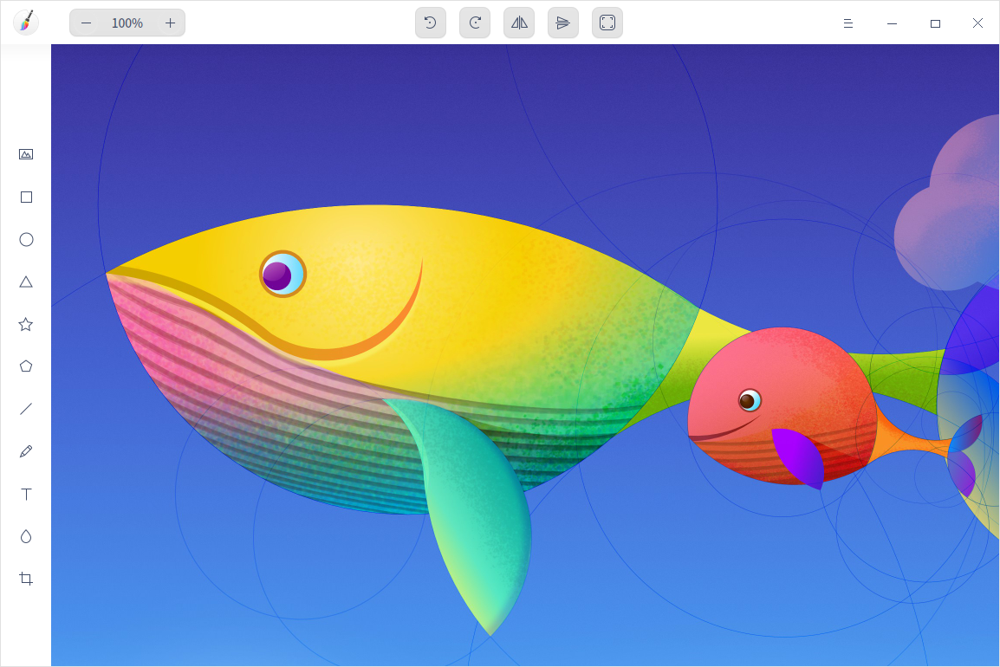
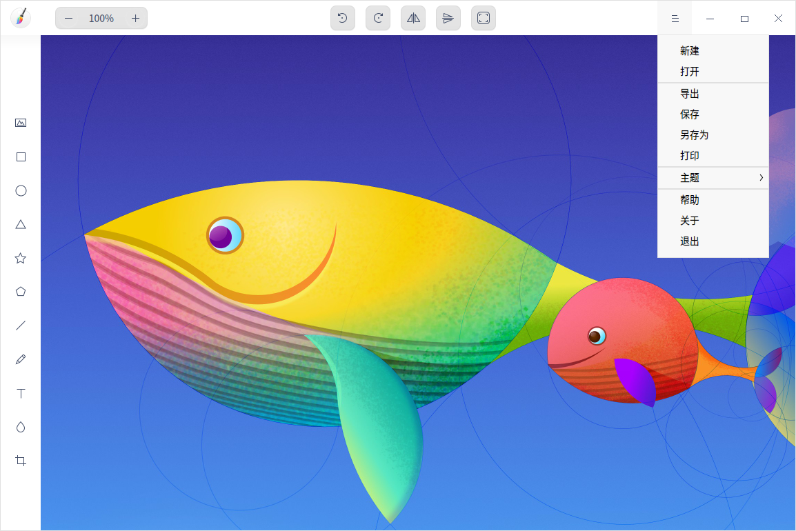
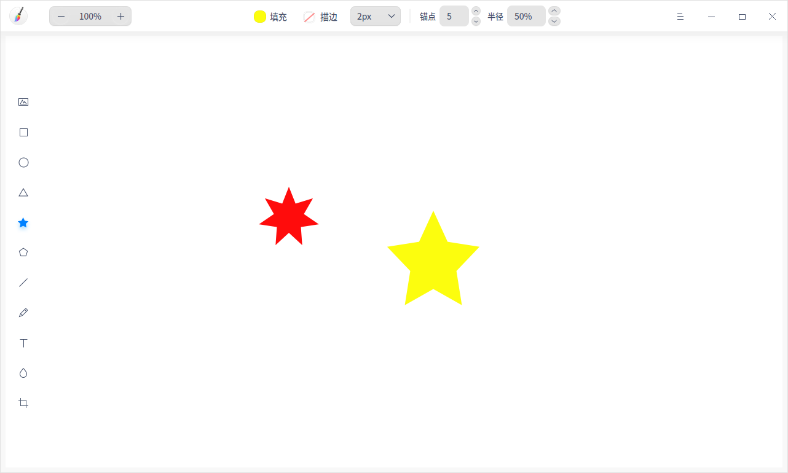
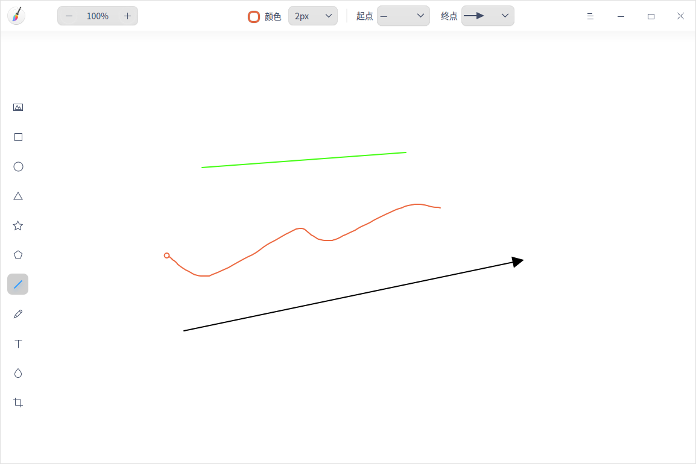
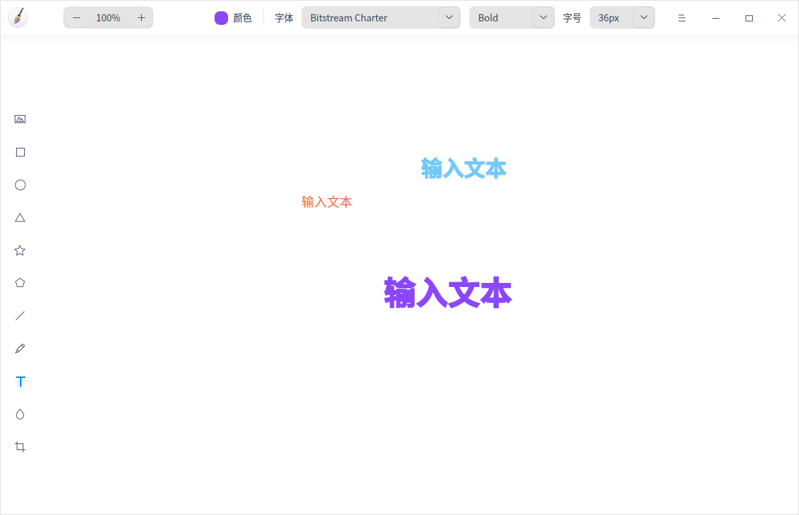
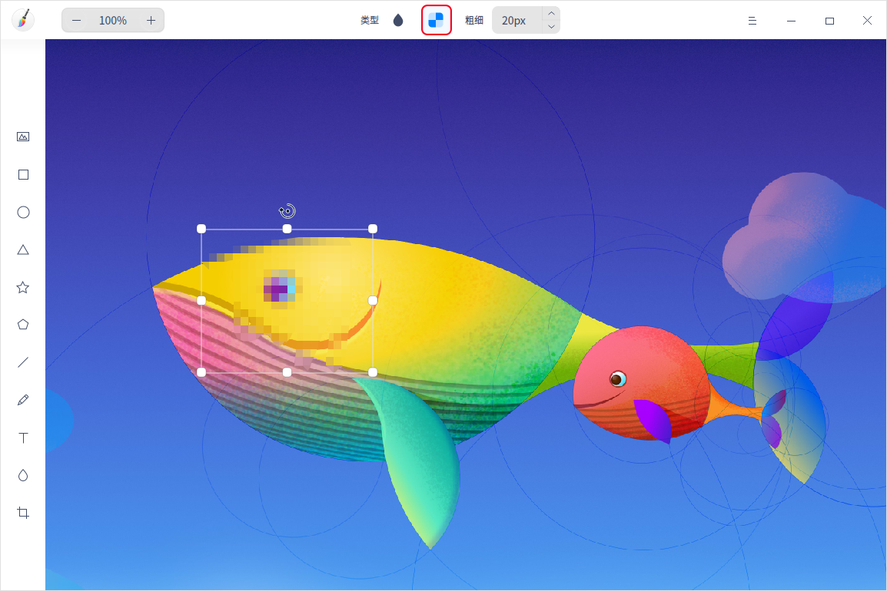
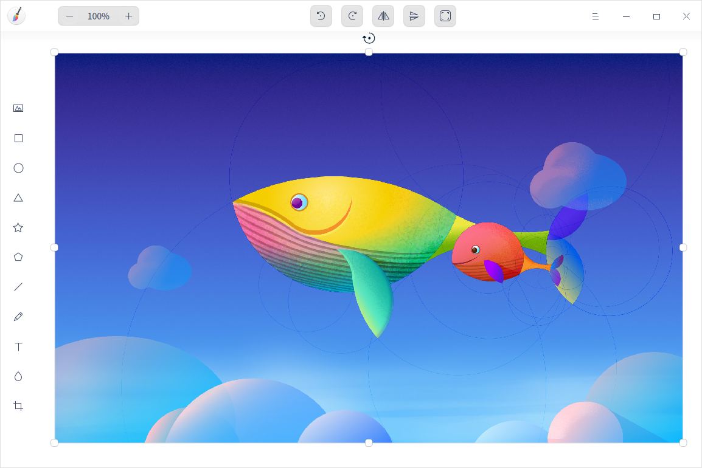
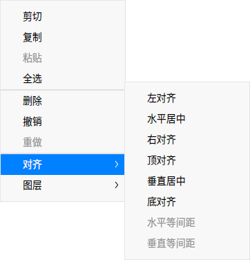
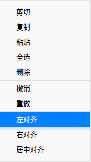
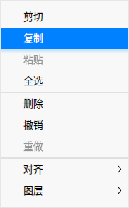

# 画板|../common/deepin-draw.svg|

## 概述

画板是一款简单的绘图工具，支持旋转、裁剪、翻转、添加文字、绘制形状等功能。您可以对本地图片进行简单编辑，也可以绘制一张简单图片。

## 使用入门

通过以下方式运行或关闭画板，或者创建画板的快捷方式。

### 运行画板

1. 单击任务栏上的启动器图标，进入启动器界面。
2. 上下滚动鼠标滚轮浏览或通过搜索，找到画板图标 ，单击运行。
3. 右键单击 ，您可以：
 - 单击 **发送到桌面**，在桌面创建快捷方式。
 - 单击 **发送到任务栏**，将应用程序固定到任务栏。
 - 单击 **开机自动启动**，将应用程序添加到开机启动项，在电脑开机时自动运行该应用。

>窍门：您可以在控制中心中将画板设置为默认的图片查看程序，具体操作请参考 [默认程序设置](dman:///dde#默认程序设置)。

### 关闭画板

- 在画板界面单击  ，退出画板。
- 在任务栏右键单击 ，选择 **关闭所有**，退出画板。
- 在画板界面单击 ，选择 **退出**，退出画板。

### 查看快捷键

在画板界面，使用快捷键 **Ctrl + Shift + ?** 打开快捷键预览界面。熟练地使用快捷键，将大大提升您的操作效率。

## 常用功能

使用画板可以处理导入的图片，也可以自由绘制图形，并可以导出多种图片格式。

### 新建标签页

- 在画板界面上，单击  > **新建**，新建标签页。
- 当窗口有两个或两个以上标签页时，也可以单击按钮 ， 新建标签页。

### 关闭标签页

- 鼠标左键单击标签页，单击按钮 ，关闭当前标签页。
- 鼠标右键单击标签页，选择 **关闭标签页** 或 **关闭其他标签页**。

### 打开图片

1. 在画板界面，单击  或  > **打开** 。
2. 选择想要导入的图片，单击 **打开** 导入图片。

   目前仅支持导入30张图片，且支持的图片格式为JPG、PNG、TIF、BMP和DDF。

### 导出图片

1. 在画板界面，单击  > **导出**。
2. 设置文件名、路径、文件格式、图片质量等参数。
3. 单击 **保存**。

### 保存图片

1. 在画板界面，单击  > **保存** 或  > **另存为**。
2. 设置保存的文件名、格式。
3. 单击 **保存**。

> 说明：填写保存文件名时可以省略后缀名，会自动保存为文件格式栏选择的格式。

### 打印图片

1. 在画板界面，单击  > **打印**。
2. 选择打印机，设置打印参数。
3. 单击 **打印**。

> 说明：单击 **高级设置** 可以自定义打印效果。

## 绘画工具

使用画板的绘画工具，可以充分发挥想象力和创造力，自由绘制各种图形。

### 形状工具

1. 在画板界面，单击  或  或  或  或 。
2. 您可以设置图形的参数：
 - 单击 **填充** 设置图形的填充颜色和透明度。
 - 单击 **描边** 设置图形的描边颜色和透明度。
 - 在粗细值下拉框中设置图形的描边粗细。
 - 设置锚点数（取值范围为3-50个）和半径值（取值范围为0%-100%），仅适用于星型。
 - 设置侧边数（取值范围为4-10条），仅适用于多边形。
   
   > 说明：锚点数、半径值和侧边数既可以通过单击按钮  或  来调节，也可以选中数值后使用键盘上 或  键或者滚动鼠标来调节。

3. 在画板区域拖动鼠标来绘制形状。

> 窍门：在使用  或  或  或  或  绘制图形时，配合键盘上的 **Shift** 或 **Shift + Alt** 键可以画出正方形、正圆、正三角、正五角星、正多边形。

### 直线/画笔工具

1. 在画板界面，单击  或 。
2. 您可以设置直线或画笔的参数：
   - 单击 **颜色** 设置画笔的颜色和透明度。
   - 在粗细值下拉框中设置画笔的粗细值。
   - 设置线条的起点和终点样式。
3. 在画板区域拖动鼠标来绘制线条。

### 文本工具

1. 在画板界面，单击 。
2. 您可以设置文本样式：
   - 单击 **颜色** 设置文本的填充颜色和透明度。
   - 在 **字体** 下拉框中选择字体样式。
   - 设置常规字体或加粗字体。
   - 在 **字号**下拉框中选择字号大小。
3. 在画板区域单击鼠标后在文本框中输入文字。

>窍门：您也可以使用快捷键调节字号大小：当字体处于编辑状态时，单击属性栏上的字号大小，按下键盘上的  键或  键调节大小。

### 模糊工具

1. 在画板界面，单击 。
2. 选择模糊类型。
3. 选择涂抹区域的粗细值。
4. 在画板区域拖动鼠标来涂抹需要模糊的区域。

## 编辑功能
使用画板的编辑功能可对图形进行复制、裁剪、旋转等操作；也可对图层和文字进行调整。

### 选择

绘制图形后，可以进行以下操作：

- 对已绘制的图形、文字、模糊区域进行选择。
- 支持拖动鼠标框选图形，框选中的图形变为选择状态。
- 处于选择状态中的图形，可拖拽边缘调整其大小。
- 支持按住 **Shift** 键，选择多个图形。

> 说明：单击画板空白区域，取消当前已选图形。

### 裁剪

1. 在画板界面，单击  进入裁剪模式。
2. 选择裁剪模式，选定需要裁剪的区域。
  - 自由：自定义截取，手动输入尺寸或拖动裁剪边框来调整需要裁剪的区域。
  - 原始：按照原图比例截取，如1:1、2:3、8:5、 16:9。

3. 按 **Enter** 键或单击属性栏上的图标 ，裁剪画布。

### 翻转

1. 在画板界面，选择已导入的图片。
2. 单击  或  将图片垂直翻转或水平翻转。

### 旋转

1. 在画板界面，选中图片。
2. 单击  或  将图片顺时针或逆时针旋转90°，或鼠标左键按住旋转按钮  来旋转图片。

### 自适应画布

1. 在画板界面，选择已导入的图片。
2. 单击 ，根据图片自适应画布大小。
   - 若选择单张图片，根据图片的宽高来调整画布大小。
   - 若选择多张图片，根据最大边界范围调整画布大小。

### 调整图层

1. 在画板界面，选择一个图形。
2. 单击鼠标右键选择 **图层**，在其下拉列表选择 **向上一层**、**向下一层**、**置于顶层** 或 **置于底层** 来调整图层顺序。

### 对齐图层

1. 在画板界面，选中一个或多个图形。
2. 单击鼠标右键选择 **对齐**，在其下拉列表选择 **左对齐**、**水平居中**、**右对齐**、**顶对齐**、**垂直居中**、**底对齐**、**水平等间矩** 或 **垂直等间矩** 来调整图层对齐方式。

>说明：
>- 仅选中一个图形进行操作时，图层则与画布对齐。
>- 选中三个或三个以上的图形时，才能进行“水平等间矩”和“垂直等间矩”的操作。

### 对齐文本

1. 在画板界面，单击 ，调整文本框大小。
2. 选中文本内容后单击鼠标右键选择 **左对齐**、**右对齐**、**居中对齐** 来对齐文本。

### 复制和粘贴

1. 在画板界面，选中需要复制的图形。
2. 单击鼠标右键选择 **复制** 或使用快捷键 **Ctrl + C** 将图形复制到剪贴板。
3. 单击鼠标右键选择 **粘贴** 或使用快捷键 **Ctrl + V** 将图形粘贴到画板上。

### 删除

1. 在画板界面，选择一个图形。
2. 单击鼠标右键选择 **删除** 或使用快捷键 **Delete **将选中的图形删除。

## 主菜单

在主菜单中，您可以新建标签页、[打开图片](#打开图片)、[导出图片](#导出图片)、[保存图片](#保存图片)、打印图片、切换窗口主题、查看帮助手册，了解画板的更多信息。

### 新建

您可以通过新建添加一个标签页。

1. 在画板界面，单击 。
2. 选择 **新建**，添加一个标签页。

### 主题

窗口主题包含浅色主题、深色主题和系统主题。

1. 在画板界面，单击 。
2. 选择 **主题**，选择一个主题颜色。

### 帮助

查看帮助手册，进一步了解和使用画板。

1. 在画板界面，单击 。
2. 选择 **帮助**。
3. 查看画板的帮助手册。

### 关于

1. 在画板界面，单击 。
2. 选择 **关于**。
3. 查看画板的版本和介绍。

### 退出

1. 在画板界面，单击 。
2. 选择 **退出**。

文档更新时间: 2021-04-14 版本: 5.8
