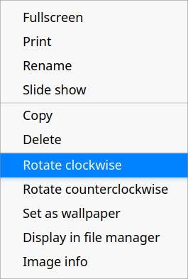
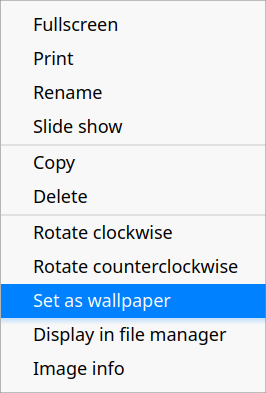
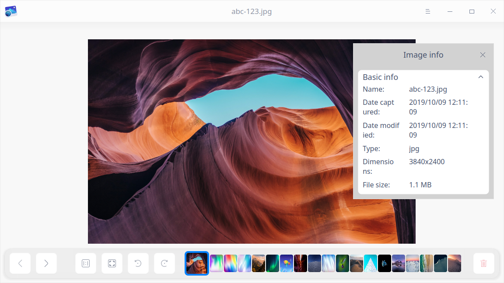

# Image Viewer|../common/deepin-image-viewer.svg|

## Overview

Image Viewer is a lightweight image viewer with fashion interface and smooth performance. It supports multiple image formats and you can view any kind of image. 

## Guide

You can run, close and create shortcuts for Image Viewer by the following ways.

### Run Image Viewer

1. Click  on dock to enter the Launcher interface.
2. Locate  by scrolling the mouse wheel or searching "image viewer" in the Launcher interface.
3. Right click and the user can
 - Click **Send to desktop** to create a desktop shortcut.
 - Click **Send to dock** to fix the application on dock.
 - Click **Add to startup** to add the application to startup and it will automatically run when the system starts up.

### Exit Image Viewer

1. On the Image Viewer interface, click   to exit Image Viewer.
2. Right-click  on dock and select **Close All** to exit Image Viewer.
3. Click  on the Image Viewer interface and select **Exit** to exit Image Viewer.

### View Shortcuts 

On the Image Viewer interface, press **Ctrl+ Shift+ ？** on the keyboard to view shortcuts. 

## Image Viewing

### Open Images
You can use one of the following ways to open image files:

- Right-click an image and select **Open with** > **Image Viewer**. 
- Double-click an image to open it, if Image Viewer has been set as the default application for image viewing.
- Open Image Viewer, click **Open Image** and select the image file to open it.
- Open Image Viewer and drag the image to the interface to open it.
- Drag the image to the Image Viewer icon on desktop or dock to open it.

> Tips: In Control Center, you can set Image Viewer as the default image viewer. Please refer to [Default Applications](dman:///dde#Default Application Settings) for specific operations.

The supported images include the following format: BMP, ICO, PG/JPE/JPEG, PNG, TGA, TIF/TIFF, XPM, GIF, SGI, RAW, WEBP, CR2, NEF, DNG, RAF, MEF, MRW, XBM, SVG, ORF and MNG.

### Main Interface

| Icon                                               | Name                    | Description                                                  |
| -------------------------------------------------- | ----------------------- | ------------------------------------------------------------ |
|                      | Previous                | Switch to the previous image.                                |
|                              | Next                    | Switch to the next image.                                    |
|                | 1:1 Size                | The image will show in 1:1 size without changing the size of the window. |
|              | Fit to window           | The image will be resized to adapt to the current window.    |
|  | Rotate clockwise        | Rotate the image 90 degrees clockwise.                       |
|              | Rotate counterclockwise | Rotate the image 90 degrees counterclockwise.                |
|                          | Delete                  | Delete the current image.                                    |

> Tips: If the image size exceeds the window, a navigation window will appear at the lower left corner of the interface, which helps the user to fast locate image areas. You can click X at the top right corner of navigation window to close it and then it won't automatically show next time. You can select **Hide/Show navigation window** in the right-click context menu.

> Notes: The Rotate and Delete icons are grayed out and disabled for system images.

### Print Images

You can print images in Image Viewer.

1. Right-click the image on the Image Viewer interface and select **Print**.
2. Choose a printer and set the print options.
3. Click **Print ** to send the picture to the printer.

### Rename Images

1. Right-click the image on the Image Viewer interface and select **Rename**.
2. Input a new name in the pop-up window.
3. Click **Confirm** to finish renaming.

### Slide show

1. Right-click the image on the Image Viewer interface.  and .
2. Select **Slide show** and all images will be played as slides in fullscreen. 
3. Press  to exit slide show.

### Copy Images

You can copy images in Image Viewer.

1. Right-click the image on the Image Viewer interface and select **Copy**.
2. On the target place, right-click the blank area and select **Paste** to copy image to the place.

> Tips: Both the path and the content of picture are copied.

### Delete Images

The user can delete images from Image Viewer by the following ways.

- Click the  icon on the Image Viewer interface. 
- Right-click the image and select **Delete**.
- Press  on the Image Viewer interface.

### Rotate Images

1. Right-click the image on the Image Viewer interface and select **Rotate clockwise** or **Rotate counterclockwise**.
2. The image will rotate clockwise or counterclockwise for 90 degrees.

### Set the Image as Wallpaper

You can set an image as the desktop wallpaper. Right-click the image on the Image Viewer interface and select **Set as wallpaper**.

### View Image Information

You can view the detailed information of the image.
1. Right-click the image in the Image Viewer interface and select **Image info**.
2. The Image info window will pop displaying the detailed information of the Image.

## Main Menu

In the main menu, you can switch window themes, view help and get more information about Image Viewer.

### Theme

The window theme includes Light Theme, Dark Theme and System Theme (default).

1. On the Image Viewer interface, click .
2. Click **Theme** to choose one.

### Help
Click "Help" to get the manual, which will help you further know and use Image Viewer.

1. On the Image Viewer interface, click .
2. Click **Help** to view the manual of  Image Viewer.

### About

1. On the Image Viewer interface, click .
2. Click **About** to view the version and introductions of Image Viewer.

### Exit

1. On the Image Viewer interface, click .
2. Click **Exit** to exit Image Viewer.

Update Date: 2020-08-26 Version: 5.6
