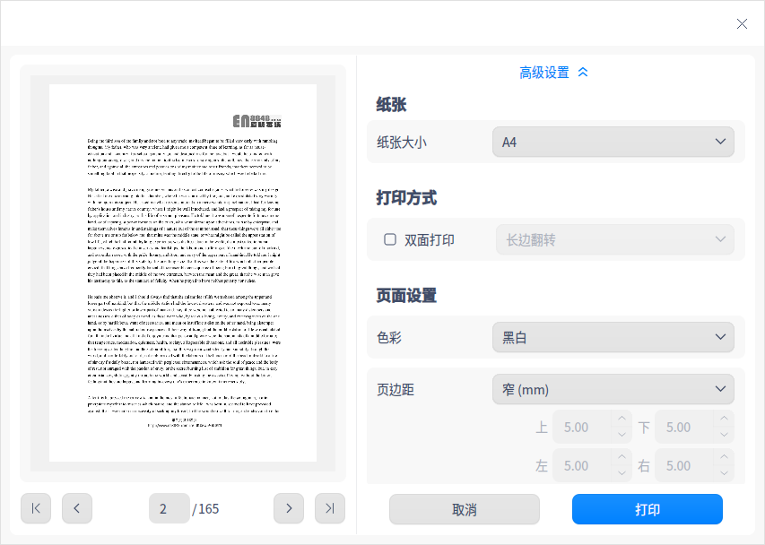

# 文档查看器|../common/deepin-reader.svg|

## 概述

文档查看器是系统自带的文档查看软件。不仅可以打开、查看文件，还可以对文档进行添加书签、添加注释以及对选择的文本进行高亮显示等操作。

## 使用入门

通过以下方式运行或关闭文档查看器，或者创建文档查看器的快捷方式。

### 运行文档查看器

1. 点击桌面底部的 ，进入启动器界面。
2. 上下滚动鼠标滚轮浏览或通过搜索，找到文档查看器 点击运行。
3. 右键单击 ，您可以：

 - 点击 **发送到桌面**，在桌面创建快捷方式。
 - 点击 **发送到任务栏**，将应用程序固定到任务栏。
 - 点击 **开机自动启动**，将应用程序添加到开机启动项，在电脑开机时自动运行该应用。

   > 窍门：您可以在控制中心中将文档查看器设置为默认的文档查看程序，具体操作请参考 [默认程序设置](dman:///dde#默认程序设置)。

### 关闭文档查看器

- 在文档查看器界面点击 ，退出文档查看器。
- 在任务栏右键单击 ，选择 **关闭所有** 来退出文档查看器。
- 在文档查看器界面点击 ，选择 **退出** 来退出文档查看器。

### 查看快捷键

在文档查看器界面上，按下键盘上的 **Ctrl + Shift + ?** 组合键来查看快捷键，熟练地使用快捷键，将大大提升您的操作效率。

## 基本功能

文档查看器具备基本的文件管理功能，可以执行打开、保存、打印文件、管理标签页、书签、注释等操作。

### 打开文件

您可采用以下方式打开文件

- 直接将文件拖拽到界面或其图标上。
- 右键单击文件，选择 **打开方式 > 选择默认程序**，在程序列表中选择文档查看器打开。

   > 窍门：直接双击文件会使用默认程序打开文件，您可以右键单击文件，在 **属性 > 打开方式** 中选择一个默认程序，也可以到控制中心[默认程序设置](dman:///dde#默认程序设置)中去设置此类文件的全局默认程序。

- 在文档查看器初始界面，点击 **选择文件**。
- 在文档查看器界面，使用 **Ctrl + O** 组合键，选择文件打开。

   > 说明：文档查看器支持的文件格式有：PDF、DJVU。

### 保存文件

对当前正在编辑、修改的文档进行保存。

- 使用 **Ctrl + S** 组合键保存当前文件。
- 点击 > **保存**，保存文件。
  
   > 窍门：您还可以使用 **Ctrl + Shift + S** 或点击 > **另存为**，另存文件。

### 打印文件

在文档查看器中使用打印，需要您连接并配置好打印机。

1. 在文档查看器中打开一个文档，在文档界面单击鼠标右键选择 **打印**，也可以使用组合键 **Ctrl + P** 打开打印预览。
2. 在打印预览界面，您可以预览文件，选择打印机并设置打印页面。
3. 在打印预览界面，点击 **高级设置**，可配置纸张大小、打印方式等相关参数。
4. 点击 **打印** 即可将文件发送到打印机打印。

### 管理标签页

新增标签页

- 点击  > **新标签页**，新增一个标签页。
- 当标签页达2个或2个以上时，会出现 + 按钮，点击后可添加新标签页。

使用以下方式切换/调整标签页

- 支持在同一窗口内拖拽调整标签页排序。
- 支持点击  或  按钮，左右移动。
- 滚动鼠标支持自动切换标签页。 
- 当目前只有一个窗口时，双击文档或右击文档选择文档查看器方式，在最早打开的窗口中打开文档。

窗口间的操作

- 支持拖拽标签页移出当前窗口，创建一个新的窗口。
- 支持拖拽标签页从一个窗口到另一个窗口中。
- 当目前有多个窗口时，双击文档或右击文档选择文档查看器方式，在最早打开的窗口中打开文档。

多窗口多标签页拖拽规则：

- 同时拖拽多个文档到应用时，一个窗口打开多个标签页显示各个文档。
- 可以同时打开多个应用窗口，每个窗口之间的标签页可以互相拖拽。
- 同一个文档只能在同窗口内打开一次，在多个窗口下，同一个文档也只能打开一次。
- 当同一个文档没有做任何操作时，保存按钮置灰。

### 管理书签

在文档查看器界面，打开一个文档。

- 添加书签
   - 右键单击文档查看器中的文件页，选择 **添加书签**，可以为当前正在浏览的页面添加书签。
   - 将鼠标移至浏览页面右上角书签区域显示 ，点击书签图标为当前页添加书签，书签图标变为蓝色填充色。
- 删除书签：
   - 在已添加书签的页面，右键单击书签，选择 **删除书签** 来删除书签。
   - 鼠标移到书签位置, 点击有填充颜色的书签，可以取消(删除)该书签。

   > 说明：鼠标移到书签位置附近才会显示书签图标。鼠标移出书签区域，书签图标消失。出现书签图标后，再点击，书签图标变成有填充颜色图标，当书签图标为有填充颜色时，不管鼠标有没有在书签附近，该图标一直显示。

### 管理注释

在文档查看器界面，打开一个文档。

- 添加注释
   1.  使用选择工具选择文本内容后点击右键，选择 **添加注释**。
   2.  在弹出的注释窗口中输入注释内容。
   3.  点击其他区域，自动保存输入内容。
   
   完成注释后被选中的文本内容会被显示高亮。

   > 窍门：您也可以在文档空白处或者需要添加注释的地方，单击右键选择 **添加注释**，完成注释后该处会显示一个高亮注释图标。

   > 说明：
   > * 如果注释窗口不输入内容，直接点击其他区域，则添加注释不成功或该条注释自动删除。
   > * 输入文本内容后，点击其他区域，注释内容自动保存，并且收缩成小图标的形式。

- 复制注释
   -  在页面上，右键单击已完成注释的高亮文本内容，在右键菜单中选择 **复制**，可以复制该条注释的全部内容。
   -  在页面上，右键单击注释图标，在右键菜单中选择 **复制**，可以复制该条注释的全部内容。
   -  点击，在左侧选择注释目录 ，选定一个注释，右键单击选择 **复制**，可以复制这条注释的全部内容。

- 显示注释  
   1.  将鼠标悬停至注释图标上，在出现的浮框中显示部分注释内容。
   2.  点击注释图标，弹出注释窗口，可以查看、重新编辑注释内容。

- 删除注释
   - 右键点击已完成注释的高亮文本内容，在右键菜单中选择 **取消高亮**，可以删除该条注释内容。
   - 右键点击注释图标，在右键菜单中选择 **删除注释**，可以删除该条注释内容。
   - 在左侧选择注释目录 ，选定一个注释，右键单击选择 **删除注释**，删除这条注释，对应页面上的这条注释内容也删除。

   > 说明：
   > + 支持在当前页移动注释图标。
   > + DJVU格式的文件不支持添加注释。

## 常用操作

文档查看器具备很多特色功能，这些功能都是为了让文件管理更加简单、高效。

### 搜索

目前搜索只针对当前标签页。

1. 在文档查看器界面，打开一个文档。
2. 在文档页面点击鼠标右键，选择 **搜索** 或使用快捷键 **Ctrl + F** 打开搜索窗口。
3. 在搜索框中，您可以：
   
   - 点击，输入关键字。
4. 按下键盘上的 **Enter** 键进行搜索。
   - 当搜索到匹配的信息时，侧边栏会显示全部搜索结果，文档中会高亮显示匹配项。
   - 当没有搜索到匹配的信息时，侧边栏会显示“无搜索结果”。
5.  当搜索到匹配信息后，点击搜索窗口的  或  可逐个查找上一个或下一个匹配项。
6. 点击某条搜索结果，跳转到对应页面，该页面的搜索结果高亮显示。   
   
   > 注意：当有些PDF文档的文本编码成图片存储在文档中时是不可搜索的。   
7.  清除搜索框中的信息，即可清除搜索结果。   
   
   > 说明：DJVU格式的文件不支持搜索功能。

### 在文档中移动

您可以使用下列办法之一在文档的每页中移动：

- 使用鼠标滚轮向上或向下滚屏。
- 使用文档窗口的滚动条，向上或向下拖动滚动条。
- 使用您键盘的向上和向下键。
- 点击 > **工具** > **手型工具**，页面上会显示 ，用鼠标拖挪页面，就像您正在抓住页面那样。

### 快速翻页

您能够使用下列方法之一在文档的页面中移动：

- 右键单击，在快捷菜单中选择  **前一页** 或 **后一页** 。
- 按下键盘上的  或  键。
- 转至指定页面：
  - 输入页码数并按回车键。
  - 如果您想直接浏览文档的开头或结尾：右键单击，在快捷菜单中选择 **第一页** 或 **最后一页**。

### 切换目录

通过缩略图可以进行文档缩略图目录 、文档目录  、书签目录 、注释目录  的切换。手动拖拽目录边框，缩略图跟随可拖拽宽度大小的变化而变化。

### 全屏

1. 在文档查看器界面，单击鼠标右键选择 **全屏** 或使用快捷键 **F11**，文档将以全屏形式展示。
2. 将鼠标移到窗口顶部或者左侧区域，呼出顶部工具栏或侧边工具栏；将鼠标移出区域外，工具栏自动隐藏。
3. 在全屏状态下，呼出侧边栏后点击缩略图 ，侧边工具栏会一直显示。
4. 按下键盘上的 **Esc** 键或使用快捷键 **F11** 退出全屏。

### 幻灯片放映 

1. 在文档查看器界面，单击鼠标右键选择 **幻灯片放映**，文档页面将以幻灯片形式进行播放。
3. 点击  或  切换文档页面，也可以点击  停止播放。
4. 按下键盘上的 **Esc** 键退出播放。

### 放大和缩小

使用下列方法之一放大或缩小页面：

- 按下键盘上的 **Ctrl + “+”** 或 **Ctrl + “-”** 。
- 按下键盘上的 **Ctrl** 键的同时按住鼠标中键向上或向下滑动。
- 在文档查看器界面菜单栏，点击 “**+** ”放大或 “**-**” 缩小 。

   > 说明：支持手动输入，菜单栏下拉框显示调整比例供选择：10%、25%、50%、75%、100%、125%、150%、175%、200%、300%、400%、500%。文档跟着比例依次放大缩小。

### 设置高亮

1. 在文档查看器界面选中文本，单击鼠标右键选择 **高亮**，此时有不同的高亮颜色可供选择。 

   > 说明：如果文本还没有被高亮显示，则 **取消高亮** 显示菜单置灰。
2. 选定一种颜色，被选中的文本内容将以该颜色为底纹高亮显示。
3. 选中已经高亮显示的文本，点击 **取消高亮**，可以删除文字高亮显示效果。
   > 说明：
   > -  软件记住用户上次选择的高亮显示颜色，当下次用户再进行文本高亮显示操作时，默认使用用户上次选择的高亮颜色。用户可以根据喜好切换可供选择的高亮颜色。
   > - DJVU格式的文件不支持高亮设置。

### 调整页面视图

在工具栏缩放比例下拉框中，您可以：

- 点击 **双页显示**，进入双页显示模式。
- 点击 **默认大小**，页面以100%比例显示。
- 点击 **适合页面**，当前窗口显示整页。
- 点击 **适应高度**，页面高度在视窗内全部显示。
- 点击 **适应宽度**，页面宽度在视窗内全部显示。 

### 适配窗口

使用以下方式之一适配窗口：

- 鼠标拖拽窗口时，文本需根据窗口拖拽大小等比例调整适配。 
- 切换窗口大小时，左边目录栏展示比例需根据窗口大小比例进行等比调整适配。   
- 如果在高分屏的情况下，缩略图左边栏宽度需要与屏幕分辨率进行等比例适配，需要适配高分屏的宽度值。 

### 旋转

1. 在文档查看器界面，打开一个文件。
2. 单击鼠标右键选择 **左旋转** 或 **右旋转**，页面全部同时向左或向右旋转90°。

### 查看文档信息

1. 在文档查看器界面，打开一个文件。
2. 单击鼠标右键选择 **文档信息**，展示文档的属性相关参数信息。

## 主菜单

在主菜单中，您可以新建窗口、新建标签页、[保存文件](#保存文件)、[搜索文件](#搜索)、切换窗口主题、查看帮助手册，了解文档查看器的更多信息。

### 在文件管理器中显示

1. 在文档查看器界面，单击 。
2. 选择 **在文件管理器中显示**，打开并定位该文件存放在文件夹的位置。

### 放大镜

1. 在文档查看器界面，单击  。
2. 选择 **放大镜**，将鼠标移动到页面需要查看的区域，则该区域内容放大。
3. 按下键盘上的 **Esc** 键或右键单击，即可取消放大镜功能。

### 主题

窗口主题包含浅色主题、深色主题和跟随系统主题，其中跟随系统主题为默认设置。

1. 在文档查看器界面，单击 。
2. 选择 **主题**，选择一个主题颜色。

### 帮助

查看帮助手册，通过帮助进一步让您了解和使用文档查看器。

1. 在文档查看器界面，单击 。
2. 选择 **帮助**。
3. 查看关于文档查看器的帮助手册。

### 关于

1. 在文档查看器界面，单击 。
2. 选择 **关于**。
3. 查看关于文档查看器的版本和介绍。

### 退出

1. 在文档查看器界面，单击 。
2. 选择 **退出**。

文档更新时间: 2021-01-13 版本: 5.8
