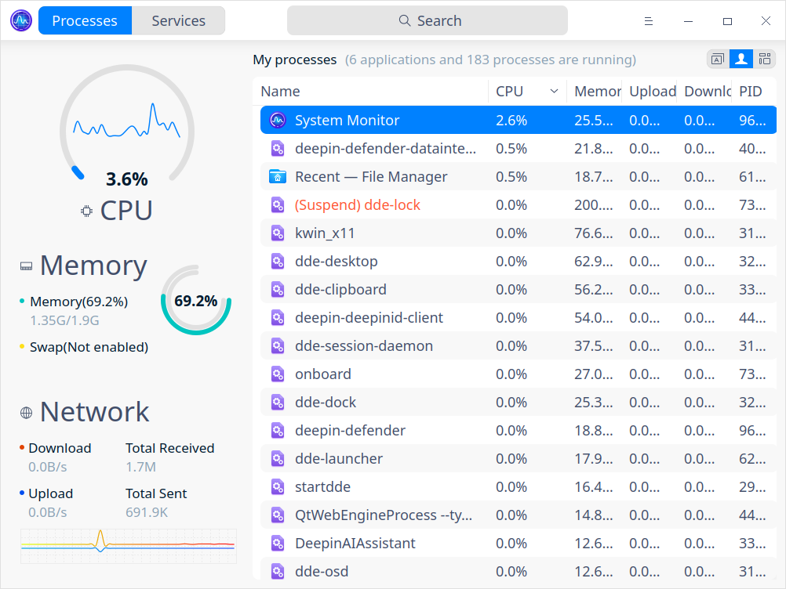

# System Monitor |../common/deepin-system-monitor.svg|

## Overview

System Monitor is a system tool monitoring and managing hardware load, program running and system services. It's capable to real-time monitor CPU status, memory footprint, and upload/download speed, manage system and application processes, search and force end processes as well.

## Basic Operations

### Search Process

1. In the searching box, you can click  to input keywords. 
2. Press   to search to locate quickly. 
   - All matching information will be displayed in a list. 
   - If searching fails, "No search results" will be displayed. 

### Hardware Monitoring

System Monitor can monitor the CPU, memory and network status of your system:

- CPU monitoring, you can view the CPU usage and usage trends through graphics, number and curve.

  - In "Expand view", CPU load is displayed in doughnut chart with percentage. The curve inside the doughnut shows the recent CPU load summary, the height of which automatically fits the inner height of the doughnut height. 
  
  - In "Compact view", CPU load is displayed in oscillogram with percentage. The curve shows the recent CPU load summary, the height of which automatically fits the height of the oscillogram. 
  
- Memory monitoring shows the memory real-time usage, total memory and current usage, total swap space and current usage in percentage and graphics.
- Network monitoring shows the current downloading and uploading speed, and the trend in recent time in waves.
- Disk monitoring shows the current reading and writing speed, and the trend in recent time in waves.

### Process Management

#### Switch Process Tabs

Click the top right tabs on interface to view "Applications", "My processes" and "All processes".

- Click  to switch to **Applications**. 
- Click  to switch to **My processes**. 
- Click  to switch to **All processes**.

#### Adjust Process Order

You can adjust the process order by Name, CPU, User, Memory, Upload, Download, Disk read, Disk write, PID, Nice and Priority.

- On System Monitor interface, click the top tabs of process list to sort the processes. Multiple clicks to sort from low to high or high to low.
- Right-click the top tabs to check options you want to view or to uncheck options you want to hide.

#### End Process

System Monitor can be used to end processes.

1. On System Monitor interface, right-click the process you want to end.
2. Select **End Process**.
3. Click **End** in the pop-up window to confirm.

#### End Application

1. On System Monitor interface, click .

2. Select **Force end application**.
> Notes: This function can only end graphical processes.

3. Click the opened application window under the prompt.

4. Click **Force End** in the pop-up window to confirm.

> Tips: You can select a process, right-click and select **End Process**. 

#### Suspend/Resume Process

1. On System Monitor interface, right-click the process you want to suspend.
2. Select **Suspend process**. The process will be tagged with **(Suspend)** and becomes red in the list. 
3. Right-click it again and select **Resume process** to resume it.

#### Change Process Priority 

1. On System Monitor interface, right-click a process.

2. Select **Change priority** and select a level.

You can also custom a priority level.

#### View Process Location

1. On System Monitor interface, right-click the process you want to view.
2. Select **View command location** to open the location in File Manager. 

#### View Process Properties

1. On System Monitor interface, right-click the process you want to view.
2. Select **Properties** to view the process name, command line and start time.

### System service management

You can start, stop, restart, set startup type, refresh system service processes.
In the list of system services, force end application is prohibited.
>Attention: For better system operation, please don't end any processes of the system services and root processes.

#### Start system service
1. Select **Services** tab on System Monitor interface.
2. Select a process that is not started yet, right-click and select **Start**. Please enter password if authentication window pops up.
3. **Active** is displayed in the **Active** column.
4. Right-click and select **Startup type**, you will have two options "Auto" and "Manual".
5. Right-click and select **Refresh**.

#### Stop system service

1. Select **Services** tab on System Monitor interface.
2. Select a process that is started already, right-click and select **Stop**. Please enter password if authentication window pops up.
3. **Inactive** is displayed in the **Active** column.
4. Right-click and select **Refresh**.

You can also right-click a system process and select **Restart**. 

## Main Menu

In main menu, you can switch monitoring modes and themes, view help manual and learn more information of System Monitor.

### Theme

The window theme includes Light Theme, Dark Theme and System Theme (default).

1. Click on the interface.
2. Click **Theme** to choose one.

### View

System Monitor offers expand view and compact view for you to choose.

1. Click on the interface.

2. Click **View** to choose one mode.

> Notes: If you switched views under "Services" tab, you would have to go to "Processes" tab to view the effect.

### Help

You can click to view the manual, which will help you further know and use System Monitor.

1. Click on the interface.
2. Click **Help**.
3. View the manual.

### About

1. Click on the interface.
2. Click **About**.
3. View the version description.

### Exit

1. Click on the interface.
2. Click **Exit**.

Update Date: 2020-08-26 Version: 5.6
