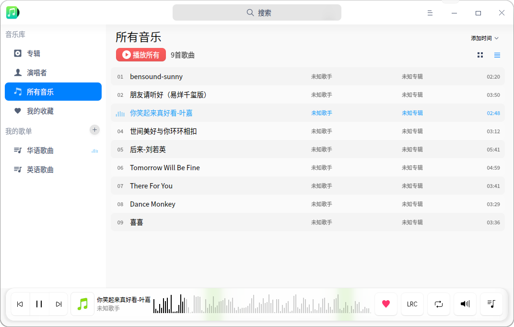
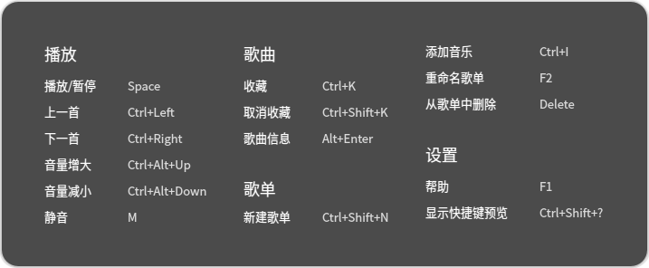
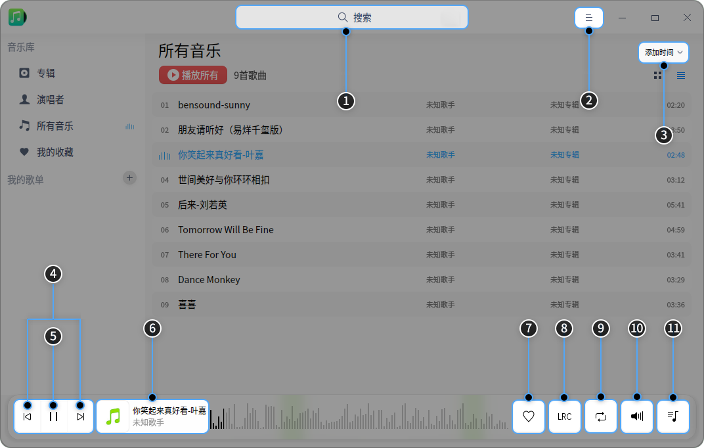
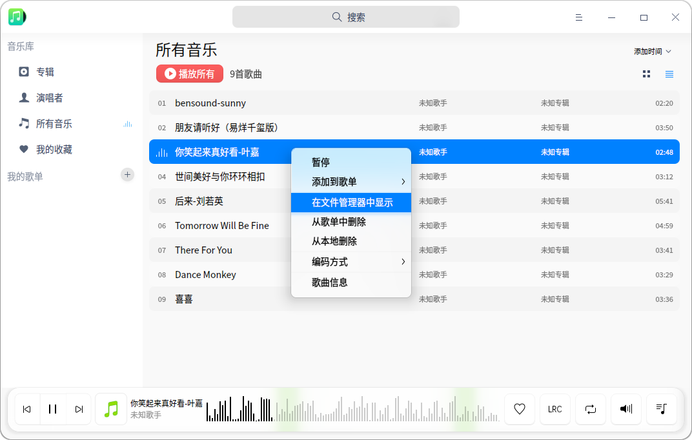
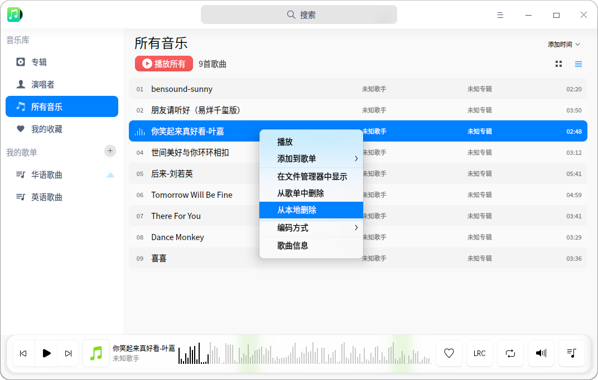
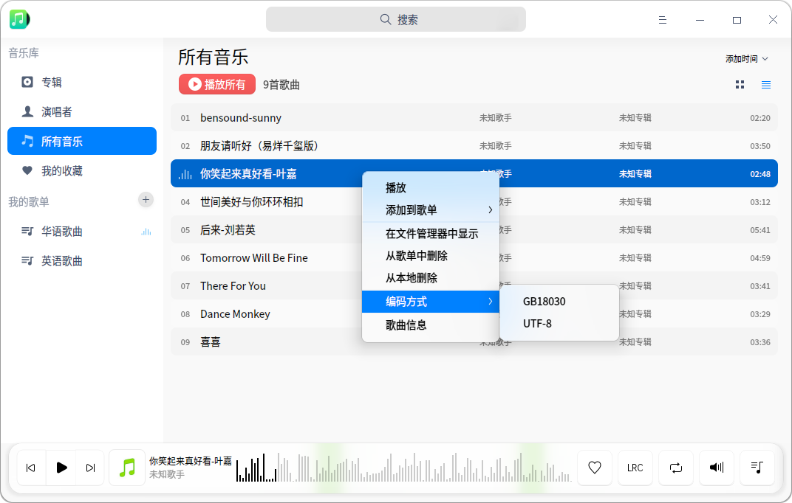
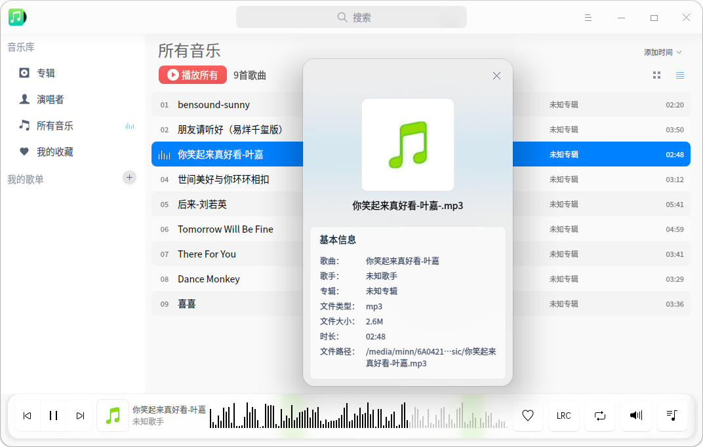
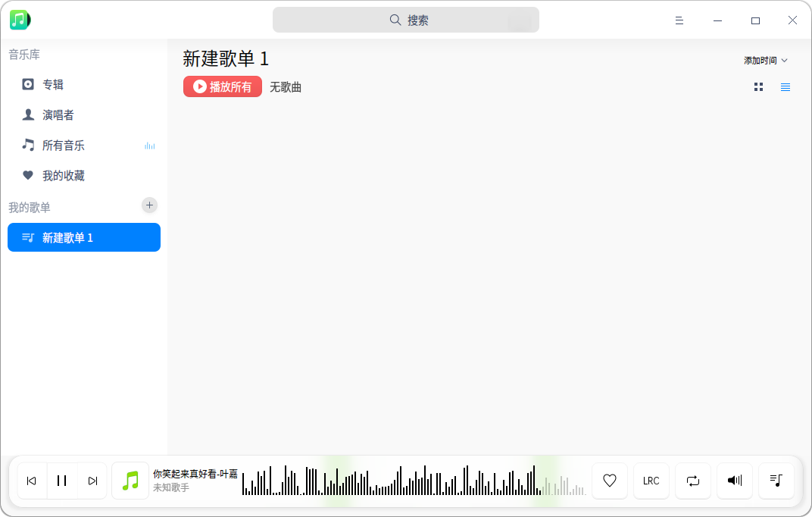
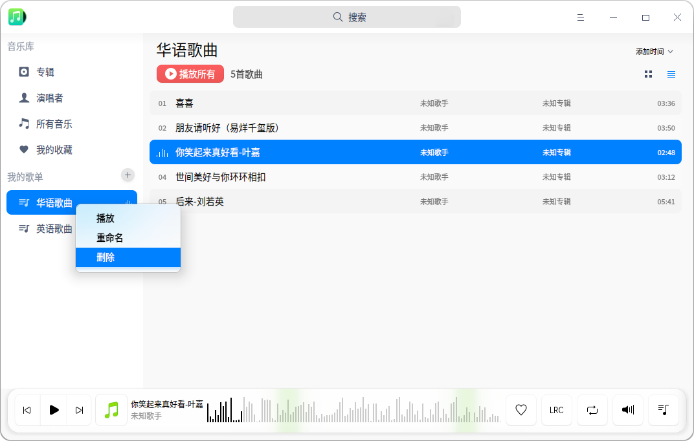

# 音乐|../common/deepin-music.svg|

## 概述

音乐是一款专注于本地音乐播放的应用程序，为您提供全新的界面设计、极致的播放体验，同时还具有扫描本地音乐、歌词同步等功能。

## 使用入门

通过以下方式运行、关闭音乐，同时还可以创建快捷方式。

### 运行音乐

1. 点击桌面底部的  ，进入启动器界面。
2. 上下滚动鼠标滚轮浏览或通过搜索，找到音乐  点击运行。
3. 右键单击  ，您可以：
   - 点击 **发送到桌面**，在桌面创建快捷方式。
   - 点击 **发送到任务栏**，将应用程序固定到任务栏。
   - 点击 **开机自动启动**，将应用程序添加到开机启动项，在电脑开机时自动运行该应用。

> ：如果音乐已经默认固定在任务栏上，您也可以点击任务栏上的  来运行。

### 隐藏到系统托盘

音乐也可以隐藏到系统托盘中。

在音乐界面点击  关闭主窗口，在弹窗中选择 **最小化到系统托盘**，然后点击 **确定**。

> :在弹窗中勾选 **不再提示**，可以不再显示该弹窗。

将音乐隐藏到系统托盘之后，您可以右键单击托盘中的图标选择：

- 暂停/播放。
- 上一首。
- 下一首。
- 退出。

### 关闭音乐

- 在音乐界面，如果您设置关闭主窗口的操作是退出，可以点击 ，退出音乐。
- 右键单击系统托盘中的 ，选择 **退出**，退出音乐。
- 右键单击任务栏上的 ，选择 **关闭所有**，退出音乐。

### 查看快捷键

在音乐界面上，按下  +  +  组合键来查看快捷键，熟练的使用快捷键，将大大提升您的操作效率。

## 界面介绍

通过界面按钮可以进行常规的播放操作，查看播放列表和歌曲歌词信息。

| 标号 | 名称          | 说明                                                         |
| ---- | ------------- | ------------------------------------------------------------ |
| 1    | 搜索框        | 用户可以通过搜素框快速查找音乐。                             |
| 2    | 主菜单        | 通过菜单栏您可以新建歌单、添加音乐、设置音乐、查看帮助手册、关于音乐、退出音乐。 |
| 3    | 排序方式      | 可以对音乐列表进行排序，排序方式包括：添加时间、歌曲名称、歌手名称、专辑名称。 默认按添加时间排序。 |
| 4    | 上一首/下一首 | 点击可以切换到上一首/下一首音乐。                            |
| 5    | 播放/暂停按钮 | 点击可以开始播放/暂停播放。                                  |
| 6    | 播放框        | 显示当前播放歌曲名、封面、专辑名。                           |
| 7    | 收藏          | 将喜欢的音乐添加到我的收藏列表中，再次点击可以取消。         |
| 8    | 歌词          | 点击可以切换到歌词界面，点击歌词界面上的图标可以关闭。       |
| 9    | 播放模式      | 点击可以切换播放模式，包括：列表循环、单曲循环、随机播放。   |
| 10   | 音量调节      | 点击调节播放音量大小。                                       |
| 11   | 播放队列      | 点击可以打开播放队列。                                       |

## 常用操作

您可以在音乐中对本地音乐进行添加、删除、查看信息等基本操作。

### 添加音乐

您可以通过如下方法添加音乐到音乐播放器中：
- 在音乐界面，如果界面中还没有音乐文件，点击 **添加歌曲文件** 可以自定义选择本地的音乐文件，选择音乐添加到播放列表或点击 **扫描** 添加音乐。
- 在音乐界面，如果界面中还没有音乐文件，点击**添加歌曲目录**可以自定义选择本地的歌曲目录，批量添加歌曲文件。
- 在音乐界面，选择  > **添加新歌单** 或者  > **添加音乐**，选择音乐文件将该音乐文件添加到播放列表。
- 直接将音乐文件/文件夹拖拽到音乐界面，添加音乐文件到播放列表。

### 搜索音乐

1. 在音乐界面顶部搜索框中，您可以：
   - 点击，输入关键字。
   
2. 按下键盘上的 **Enter** 键进行搜索。

   - 当搜索到匹配的信息时，在搜索结果列表点击播放全部，可以播放搜索结果列表中音乐。

   - 当没有搜索到匹配的信息时，在列表中间显示 “无搜索结果“。

3. 在搜索框中点击或删除输入的信息，即可清除当前输入的信息或取消搜索。

### 播放音乐

您可以通过如下方法播放音乐：

- 在音乐列表，双击某一选中的歌曲或右键单击 **播放** ，可以播放当前歌曲。
- 在左侧导航栏播放列表下选择某歌单，右键单击 **播放**，可以按照当前设置的播放顺序播放当前歌单中所有歌曲。
- 在音乐列表，点击 **播放所有**，可以按照当前设置的播放顺序播放当前列表中所有歌曲。

> ：在音乐界面，点击 播放选中的歌曲；点击 暂停正在播放的歌曲；点击 或  ，按照当前播放模式切换到上一首或下一首歌曲。

### 收藏音乐

1. 在音乐界面，点击 。
2. 弹出提示信息 **成功添加到“我的收藏”**，当前音乐即收藏到我的收藏列表中。

> ：您也可以右键单击要收藏的音乐文件，将其收藏到我的收藏列表中。

### 查看歌词

在音乐界面，点击切换到歌词界面，再次点击，收起歌词界面。

### 调整播放模式

在音乐界面，点击  或   或 调整播放模式。

其中，

 ：单曲循环

 ：随机播放

：列表循环

### 在文件管理器中显示

1. 在音乐界面，右键单击音乐文件。
2. 点击 **在文件管理器中显示**，打开并定位该音乐的存放文件夹位置。

### 删除音乐

1. 在音乐界面播放列表中，右键单击要删除的音乐文件。
2. 点击 **从歌单中删除**，将该音乐文件从歌曲列表中删除，该音乐文件仍会保留在在本地文件夹中。
3. 点击 **从本地删除**，将该音乐文件从歌曲列表和本地文件夹中一并删除。

### 设置编码方式

用户可以对显示乱码的歌曲进行编码方式的切换，以使其正常显示。

1. 在音乐界面播放列表中，右键单击音乐文件。
2. 点击 **编码方式**，选择一种编码方式。

### 查看音乐信息

1. 在音乐界面播放列表中，右键单击音乐文件。
2. 点击 **歌曲信息**，您可以查看歌曲名称、歌手名称、专辑、文件类型、文件大小、时长、文件路径等信息。

## 我的歌单管理

您可以在音乐界面进行新建歌单、重命名歌单、删除歌单、将音乐添加到我的歌单等操作。

> ：**所有音乐** 和 **我的收藏** 是默认列表，不能删除。自定义的播放列表都是 **所有音乐** 列表的子集。**我的收藏** 列表既可以直接管理也可以通过主界面上的收藏按钮管理。

### 新建歌单

1. 在音乐界面，点击我的歌单右侧的  。
2. 输入歌单的名称。
3. 按下键盘上的  键。

### 重命名歌单

1. 在播放列表中，右键单击歌单。
2. 选择 **重命名**。

### 添加音乐到歌单

1. 在音乐界面，选择一个音乐文件。
2. 点击鼠标右键。
3. 选择 **添加到歌单**，将歌曲添加到选定的歌单。  

> ：您可以拖拽本地歌曲到某一指定歌单，即将歌曲添加到了当前歌单和所有音乐中。

### 移除歌单中的音乐

1. 在音乐界面，选择一个音乐文件。
2. 点击鼠标右键。
3. 选择 **从歌单中删除**。

### 删除歌单

1. 在播放列表中，选择要删除的歌单。
2. 点击鼠标右键，选择 **删除**。
3. 在弹出的删除歌单提示窗口点击 **删除**，来删除歌单。

## 主菜单

在主菜单中，您可以[添加音乐](#添加音乐)、设置音乐信息、切换窗口主题、查看帮助手册，了解音乐的更多信息。

### 设置

音乐播放的基础信息设置和快捷键设置。

#### 基础设置

1. 在音乐界面，点击  。
2. 点击 **设置**。
3. 在 **播放** 选项，您可以：
   - 勾选 **启动时自动播放** 复选框，在音乐启动后自动播放音乐。
   - 勾选 **启动时记住上次播放进度** 复选框，在音乐启动后接续上次进度播放。
   - 勾选 **开启淡入淡出** 复选框，开启窗口特效。
4. 在 **关闭主窗口** 选项，您可以：
   - 选择 **最小化到系统托盘**。
   - 选择 **退出音乐**。
5. 点击 **恢复默认**，可以将音乐的设置恢复到默认状态。

#### 快捷键设置

1. 在音乐界面，点击  。
2. 点击 **设置**。
3. 在 **快捷键** 选项查看当前快捷键。
4. 您可以选择并重新输入快捷键，来自定义快捷键。

### 主题

窗口主题包含浅色主题、深色主题和系统主题，其中系统主题为默认设置。

1. 在音乐界面，点击。
2. 点击 **主题**，选择一种主题颜色。

### 帮助

查看帮助手册，通过帮助进一步让您了解和使用音乐。

1. 在音乐界面，点击   。
2. 点击 **帮助**。
3. 查看音乐的帮助手册。

### 关于

1. 在音乐界面，点击   。
2. 点击 **关于**。
3. 查看音乐的版本和介绍。

### 退出

1. 在音乐界面，点击 。
2. 点击 **退出**。
