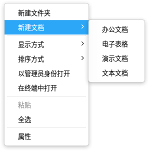
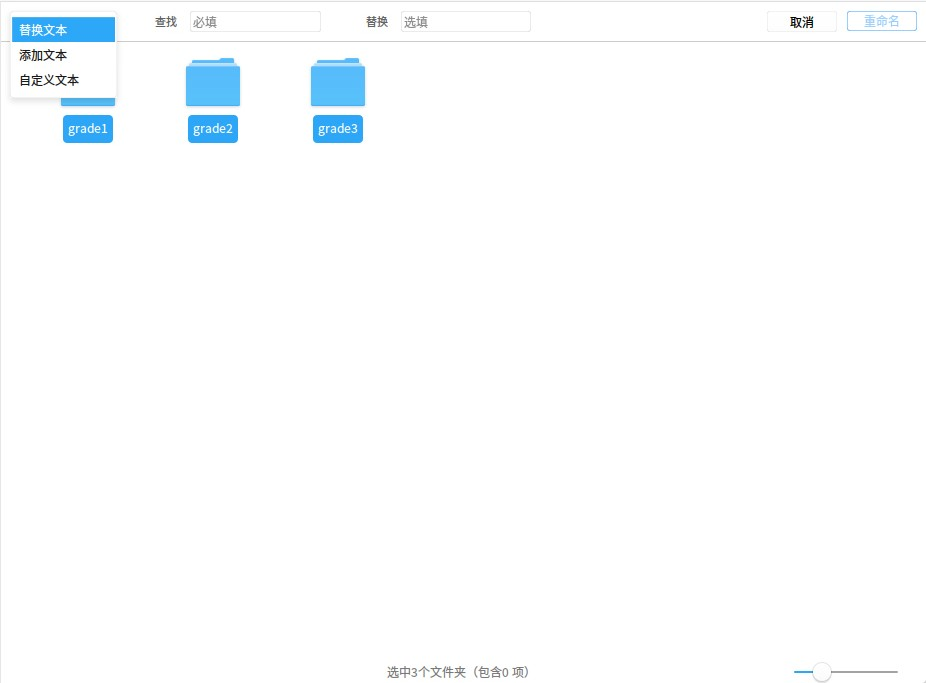
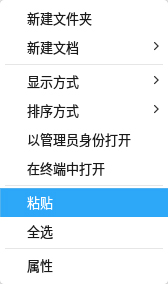
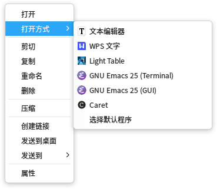
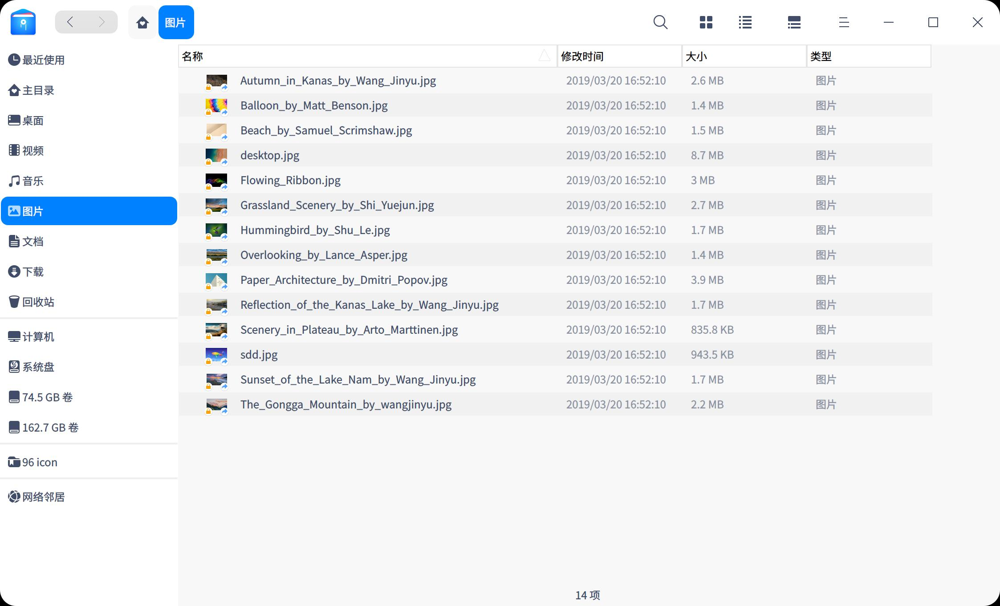
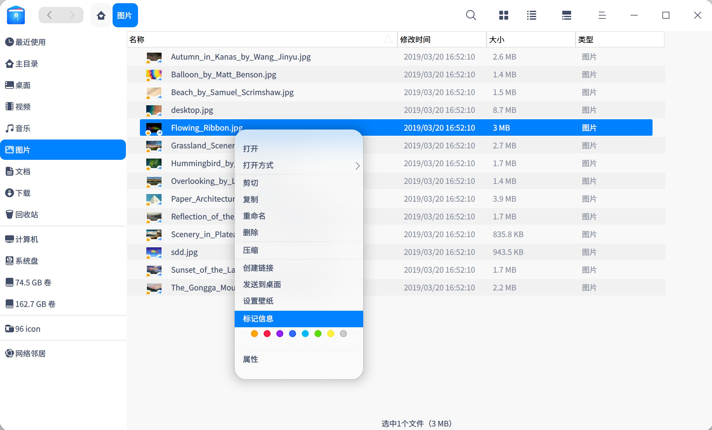
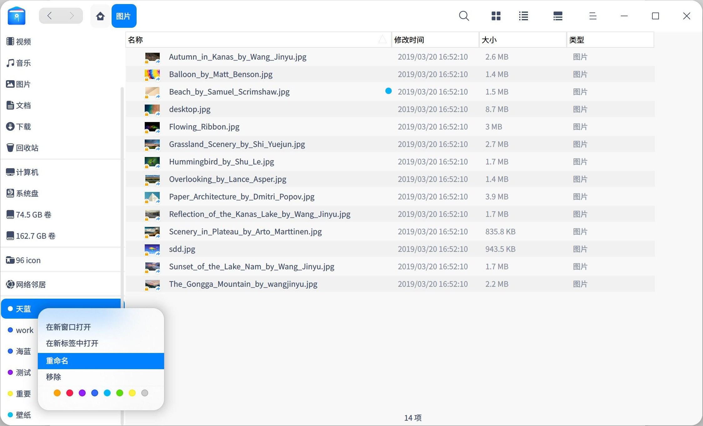
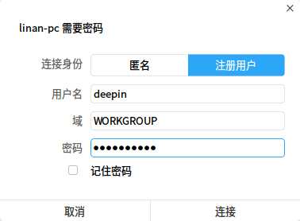
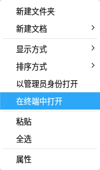
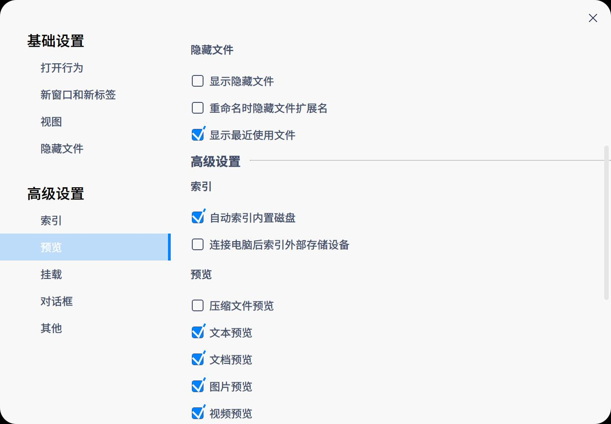

# 深度文件管理器|../common/deepin-file-manager.svg|

## 概述|../common/icon_overview.svg|

深度文件管理器是深度科技开发的一款功能强大、简单易用的文件管理工具。
它沿用了经典文件管理器的功能和布局，并在此基础上简化了用户操作，增加了很多特色功能。一目了然的导航栏、智能识别的搜索框、多样化的视图及排序让您管理起来得心应手，经典和超越，只为给您更好的体验！

## 使用入门|../common/icon_guide.svg|

您可以通过以下方式运行或关闭深度文件管理器，或者创建深度文件管理器的快捷方式。

### 运行深度文件管理器

1. 点击桌面底部的 ，进入启动器界面。
2. 上下滚动鼠标滚轮，通过浏览找到文件管理器  进行点击。
3. 将鼠标指针置于深度文件管理器应用程序的图标上，右键单击   图标，您可以：
 - 点击 **发送到桌面**，在桌面创建快捷方式。
 - 点击 **发送到任务栏**，将应用程序固定到任务栏。
 - 点击 **开机自动启动**，将应用程序添加到开机启动项，在电脑开机时自动运行该应用程序。

### 关闭深度文件管理器

- 在深度文件管理器界面点击   ，退出深度文件管理器。
- 在任务栏右键单击  ，选择 **关闭所有** 来退出深度文件管理器。
- 在深度文件管理器界面点击  ，选择 **退出** 来退出深度文件管理器。

## 主界面|../common/icon_maininterface.svg|

深度文件管理器的主界面简单易用、功能全面，熟练的使用界面功能将使文件管理更加简单高效。

<table class="block1">
    <caption></caption>
    <tbody>
        <tr>
            <td width="20px">1</td>
            <td width="60px">导航栏</td>
            <td>通过点击导航图标可以快速访问本地文件、磁盘、网络邻居、书签、标记等。</td>
        </tr>
        <tr>
            <td>2</td>
            <td>地址栏</td>
            <td>通过地址栏可以快速切换访问历史、在上下级目录间切换、搜索、输入地址访问。</td>
        </tr>
    	<tr>
            <td>3</td>
            <td>视图栏</td>
            <td>通过点击  ,  图标来切换文件管理器的界面视图。</td>
        </tr>
    	<tr>
            <td>4</td>
            <td>菜单栏</td>
            <td>通过主菜单您可以新建窗口、切换深色主题、设置共享密码、设置深度文件管理器、查看帮助文档和关于信息、退出深度文件管理器。</td>
        </tr>
    		<tr>
            <td>5</td>
            <td>状态栏</td>
            <td>显示文件数量或者已选中文件的数量。</td>
        </tr>
    </tbody>
</table>

> ：可拖动左侧导航栏右边的分隔线来改变其宽度。

## 基本功能|../common/icon_basicfuncton.svg|

深度文件管理器具备基本的文件管理功能，对文件(夹)进行新建、复制、重命名、删除等操作都非常简单。

### 新建文件(夹)

#### 新建文件

1. 在深度文件管理器界面上，点击鼠标右键。
2. 点击 **新建文档**。
3. 选择新建文件的类型。
4. 输入新建文件的名称。

#### 新建文件夹

1. 在深度文件管理器界面上，点击鼠标右键。
2. 点击 **新建文件夹**。
3. 输入新建文件夹的名称。

### 重命名文件(夹)

1. 在深度文件管理器界面上，右键单击文件。
2. 选择 **重命名**。
3. 输入文件(夹)名称，按  键或者鼠标点击界面空白区域。

> ：在 **设置** 中勾选“重命名时隐藏文件扩展名”，能更方便地修改文件名称。

### 批量重命名

1. 在深度文件管理器界面上，选中多个文件。
2. 右击文件，并选择 **重命名**。
3. 您可以按照一下方式来批量重命名选中文件：
   - **替换文本 **查找需要替换的文本，并输入替换后的文本，文件名中的关键字将被统一替换。
   - **添加文本** 输入需要添加的文本，并选择位置是名称之前还是之后，文件名将统一加入被添加的文本。
   - **自定义文本** 输入文件名，并输入序列的递进数字，文件名将统一改成新文件名+递进数字。
4. 点击 **重命名** 来完成操作。

### 复制文件(夹)

1. 在深度文件管理器界面上，右键单击文件(夹)。
2. 点击 **复制**。
3. 选择一个目标存储位置。
4. 点击鼠标右键，然后选择 **粘贴**。

 

### 压缩文件(夹)

1. 在深度文件管理器界面上，右键单击文件。
2. 点击 **压缩**。
3. 输入压缩包名称，选择压缩包类型和目标存储位置。
4. 点击 **创建**。

> ：在压缩文件弹窗中您也可以点击 **其他选项** 设置解压密码和设置分卷大小，解压密码和分卷压缩仅支持部分压缩格式。

### 删除文件(夹)

1. 在文件管理器界面上,右键单击文件(夹)。
2. 选择 **删除** 。

- 被删除的文件(夹)可以在回收站中找到，右键单击文件(夹)可以进行 **还原** 或 **彻底删除** 操作。
- 被删除的文件(夹)的快捷方式将会失效。

：外接设备删除文件会将文件彻底删除，无法从回收站找回。

### 撤销操作

在文件管理器中，可以用+来撤销上一步操作，包括：

- 删除新建的文件/文件夹。
- 恢复重命名（包括重命名文件后缀）之前的名字。
- 从回收站还原刚删除的文件/文件夹。
- 恢复文件/文件夹到移动（剪切移动、鼠标移动）前的原始路径。
- 删除复制粘贴的文件/文件夹。

>：如果上面的这些操作是连续的，就可以一直撤消；如果操作中有覆盖某个同名文件和彻底删除文件，则撤消只能返回到这一步。

### 打开方式

1. 在文件管理器界面上，右键单击文件。
2. 选择 **打开方式** > **选择默认程序**。
3. 在程序列表中选择应用程序。

> ：直接双击文件会使用默认程序打开文件，您可以右键单击文件，在 **属性** > **打开方式** 中选择一个默认程序，也可以到控制中心[默认程序设置](dman:///dde#默认程序设置)中去设置此类文件的全局默认程序。

> ：您可以选择相同类型的多个文件，右键选择”打开方式“选项，一次打开多个文件。

### 显示方式

通过点击界面上的  、  图标来切换图标视图、列表视图。

- 图标视图：平铺显示文件的图标、名称、缩略图。

- 列表视图：列表显示文件图标、名称、修改时间、大小、类型等信息。

> ：在列表视图中，把光标置于两列之间的分隔线上， 拖动它来改变列的宽度，双击分隔线可将当前列自动调整为本列内容最宽的宽度。

> ：使用  +1 和  +2 快捷键，切换图标视图和列表视图。

### 排序方式

1. 在文件管理器界面上,单击鼠标右键。
2. 选择 **排序方式**。
3. 在子菜单中选择一种排序方式。

> ：在列表视图中，点击表头栏的列标签来切换升序、降序。

### 文件(夹)属性
1. 在文件管理器界面上,右键单击文件(夹)。
2. 选择 **属性**，查看文件(夹)属性。

> ：查看多个文件属性会显示文件总大小和数量，查看快捷方式将会额外显示源文件地址属性。您还可以使用 + 组合键查看文件属性。

## 常用操作|../common/icon_commoncoperat.svg|

深度文件管理器具备很多特色功能，这些功能都是为了让文件管理更加简单、高效。

### 切换地址栏

地址栏由历史导航、面包屑、输入框共同组成。通常情况下地址栏显示面包屑，当用户点击搜索图标，或者在文件路径上右键选择 **编辑地址**，地址栏会切换为输入框状态，在输入框外点击时，地址栏会自动恢复到面包屑状态。

- 点击历史导航按钮，您可以快速在历史浏览记录间切换，查看前一个地址或者后一个地址。
- 文件所在位置的每一个层级都会形成一个面包屑，通过来回点击面包屑可以快速在不同文件层级间切换。
- 输入框带有智能识别功能，可以直接输入搜索关键词或者访问地址，系统会自动识别和判断。

### 搜索文件

在文件管理器中点击搜索按钮，或使用 + 快捷键进入搜索状态，或在地址栏中直接输入关键词回车，搜索相关文件。
  - 需要指定目录搜索时，请先进入该目录，然后再进行搜索。

> ：在 **设置 **中，默认勾选了“自动索引内置磁盘”，您可以选择勾选“连接电脑后索引外部存储设备”，这样可以加快搜索速度。

#### 高级搜索
1. 在搜索状态下，输入关键词回车，点击右侧的进入高级搜索。
2. 选择搜索范围、文件类型、文件大小和修改时间，进行更精准的搜索。

### 最近使用

在左侧导航栏上默认有 **最近使用** 入口，点击可以查看最近使用的文件。文件默认按照访问时间倒序排列。

> ：若想隐藏“最近使用”，可在设置-基本设置-隐藏文件，取消勾选“显示最近使用文件”。若要隐藏某一个文件的访问记录，右击该文件选择 **移除**，该操作不会删除文件。

### 管理标签

文件管理器的窗口支持多标签显示。

1. 在文件管理器界面上，右键单击文件夹。
2. 选择 **在新标签中打开**。
3. 当窗口有多个标签时，可以：
 - 点击标签栏右侧的 + 继续添加标签。
 - 点击标签上的 × 关闭标签。
 - 将鼠标置于标签栏上，点击鼠标中键关闭标签。

> ：文件管理器窗口只有一个标签时，标签栏是隐藏的，您还可以使用快捷键  +  来新建标签。

### 管理书签

- 添加书签：右键单击文件管理器中的文件夹，选择 **添加书签** 就可以在导航栏创建书签。

- 移动书签：在导航栏上下拖动书签调整书签排序，将书签拖动到导航栏之外放开鼠标可以直接删除书签。

- 删除书签：右键单击书签，选择 **移除** 删除书签，或右键单击已添加书签的文件夹，选择 **移除书签** 来删除书签，也可以将书签拖到导航栏之外来删除书签。

### 管理标记

通过给文件/文件夹添加标记，可以更好的分类管理您的文件。

#### 添加标记

##### 通过编辑框添加标记

1. 右键单击文件（夹），选择 **标记信息**。

2. 输入标记名称。若要添加多个标记，用逗号分隔。

3. 编辑完成后回车，即成功添加标记。

>：标记颜色从8种默认颜色中随机分配。

##### 通过颜色按钮添加标记

右键单击文件（夹），选择“颜色按钮”，直接生成这个颜色的标记。

>：您可以一次为多个文件（夹）添加标记，一个文件（夹）也可以添加多个标记；添加成功的标记会出现在左侧导航栏内。

>：如果文件有标记, 则复制或剪切该文件产生的文件仍然具有同样的标记。

#### 重命名标记

在侧边导航栏中，右键单击某个标记，选择 **重命名**，修改当前标记的名称。

#### 修改标记颜色

在侧边导航栏中，右键单击某个标记，选择“颜色按钮”，即可修改当前标记的颜色。

#### 排序标记

上下拖动标记即可调整标记排序。

#### 删除标记

右键单击某个标记，选择 **移除**，删除当前标记。

### 文件预览

深度文件管理器支持空格键预览功能，选中文件并按下键盘上的空格键就可以快速预览文件。预览窗口可以查看图片分辨率、文档大小、文本内容等，还支持gif、音频、视频播放。

#### 预览视频

1. 选择您要预览的视频文件，按下空格键，即可开始预览。
2. 点击视频任意地方可暂停播放。
3. 播放过程中，可以拖动进度条来快进快退。
4. 点击底部 **打开** 按扭，在默认程序中打开该视频文件。
  

> ：当选择多个文件进行预览时，用或跳转到上一个或下一个文件。

### 权限管理
在文件/文件夹属性窗口中，点击 **权限管理**， 为所有者，群组，和其他用户设置文件权限。

### 我的共享

当您设置了共享文件时，“我的共享”图标将会出现在导航栏上，当所有共享文件都取消共享后，“我的共享”图标自动从侧边栏中移除。

#### 共享本地文件

1. 在文件管理器界面上，右键单击文件夹。
2. 选择 **共享文件夹**。
3. 勾选 **共享此文件夹**。
4. 根据需要设置 **共享名**、**权限** 、**匿名访问** 后关闭标签。
5. 在文件管理器界面上，点击   。
6. 选择 **设置共享密码**。
7. 输入共享密码。
8. 点击 **确定**。

> ：取消勾选 **共享此文件夹** 可以取消文件共享，也可以右键单击文件，选择 **取消共享**。

#### 访问共享文件

局域网中其他用户共享的文件一般都可以在网络邻居中找到，您也可以通过网络邻居访问共享文件。

1. 输入局域网用户的共享地址，按下键盘上的  键。（如：smb://xxx.xxx.x.xxx/share）
2. 输入用户名密码或者匿名访问。
 - 未加密的网络文件可以匿名访问，不需要输入用户名和密码。
 - 加密的网络文件会弹出登陆框，输入账号和密码之后才能访问。如果在用户名密码提示框中勾选 **记住密码** ，再次访问不再需要密码。
3. 点击 **连接**。

### 网络邻居

1. 点击深度文件管理器导航栏上的  图标。
2. 双击想要访问的网络文件。
3. 输入用户名密码或者匿名访问。
 - 未加密的网络文件可以匿名访问，不需要输入用户名和密码。
 - 加密的网络文件会弹出登陆框，输入账号和密码之后才能访问。如果在用户名密码提示框中勾选 **记住密码** ，再次访问不再需要密码。
4. 点击 **连接**。

### 从终端中打开

1. 在文件管理器界面空白处单击鼠标右键。
2. 选择 **从终端中打开**，会启动深度终端并前置，终端的路径为当前目录。

### 创建链接

1. 在文件管理器界面上，右键单击文件(夹)。
2. 选择 **创建链接**。
3. 在弹窗中选择创建位置、链接名称。
4. 点击 **保存**，在目标位置会生成该文件(夹)的快捷方式。

> ：选择 **发送到桌面** 可以直接在桌面上生成该文件(夹)的快捷方式。

### 发送文件(夹)

当有外接磁盘接入时，您可以将文件或文件夹发送到外接磁盘。

1. 在文件管理器界面上，右键单击文件(夹)。
2. 选择 **发送到** > **外接磁盘**。
3. 文件(夹)将会被发送到移动外接磁盘。

## 磁盘管理|../common/icon_diskmanagement.svg|

深度文件管理器可以管理本地和外接磁盘。

### 显示磁盘

您可以在深度文件管理器上的导航栏看到您的本地磁盘，当您挂载外接磁盘或者插入其他移动存储设备时，也可以在导航栏上看到相应的磁盘图标。

<table class="block1">
    <caption></caption>
    <tbody>
        <tr>
            <td>1</td>
            <td>本地磁盘</td>
            <td>本地硬盘分区的所有磁盘</td>
        </tr>
        <tr>
            <td>2</td>
            <td>外接磁盘</td>
            <td>包括移动硬盘、U盘、光盘</td>
        </tr>
    	<tr>
            <td>3</td>
            <td>移动设备</td>
            <td>手机内存、存储卡、SD卡等</td>
        </tr>
    </tbody>
</table>

：如果磁盘或磁盘中的文件夹被加密了，您可以在弹窗中输入密码，解密后查看文件 。

### 卸载/弹出磁盘

- 对于本地磁盘，右键单击左侧导航栏的磁盘图标，选择 **卸载** 来卸载磁盘，磁盘仍将在磁盘列表上存在。
- 对于外接磁盘，右键单击左侧导航栏的磁盘图标，选择 **卸载** 来卸载磁盘，磁盘将从磁盘列表中删除，一并弹出该磁盘的所有分区。
- 如果您选择的是移动硬盘或者光驱，还可以选择 **安全移除** 来移除设备，设备将会断开数据连接，然后切断设备电源。

> ：可点击导航栏中磁盘右边的来卸载磁盘。

### 重命名磁盘
卸载磁盘后，右击该磁盘，选择 **重命名** 来修改卷标名称。

### 格式化磁盘

1. 在深度文件管理器计算机目录下，右键单击需要格式化的磁盘。
2. 选择 **格式化**。
3. 在格式化弹窗设置格式化之后的文件类型和卷标。
4. 点击 **格式化**。

> ：快速格式化速度快，但是数据仍然可能通过工具被恢复，如果想要格式化后的数据无法被恢复，可以取消勾选“快速格式化”，然后执行格式化操作。

## 主菜单|../common/icon_optionsetting.svg|

通过主菜单来新建窗口，切换深色主题，设置文件管理器，查看帮助手册和了解关于信息。

### 新建窗口

打开一个新的文件管理器窗口。

1. 在深度文件管理器界面，点击 。

2. 点击 **新建窗口**。

### 深色主题
1. 在深度文件管理器界面，点击。
2. 点击 **深色主题**，来切换主题颜色。

### 设置

1. 在深度文件管理器界面，点击   。
2. 点击 **设置**。
3. 调整自定义设置让您的文件管理器更顺手：
 - 设置  **打开行为**，自定义是在新窗口打开文件夹还是当前窗口，单击还是双击打开。

 - 设置  **新窗口新标签**，自定义新窗口新标签建立时候默认打开哪个目录。

 - 设置  **视图**，自定义文件图标的大小和默认视图。

 - 设置  **隐藏文件**，自定义是否显示隐藏文件和重命名时隐藏文件扩展名。

 - 设置  **索引**，自定义是否自动索引内置磁盘和连接的外部存储设备。

 - 设置  **预览**，自定义文件管理器显示哪些文件的预览图。

 - 设置  **挂载**，自定义自动挂载功能。

 - 设置  **对话框**，自定义是否使用深度文件管理器的文件选择对话框。

 - 设置  **其他**，自定义是否隐藏系统盘。

### 帮助

您可以点击“帮助”获取深度文件管理器的帮助手册，进一步了解和使用深度文件管理器。

1. 在深度文件管理器界面，点击   。
2. 点击 **帮助**。
3. 查看深度文件管理器的帮助手册。

### 关于

您可以点击“关于”查看深度文件管理器的版本介绍。

1. 在深度文件管理器界面，点击   。
2. 点击 **关于**。
3. 查看深度文件管理器的版本和介绍。

### 退出

您可以从菜单栏退出深度文件管理器。

1. 在深度文件管理器界面，点击 。
2. 点击 **退出**。
