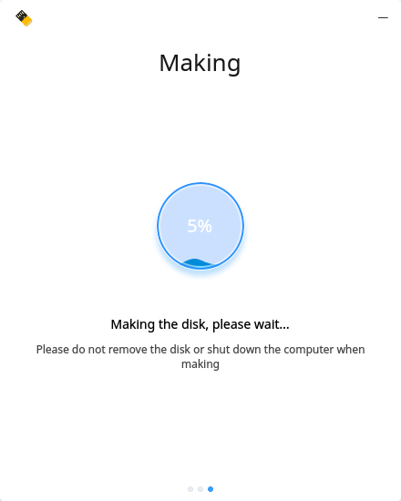
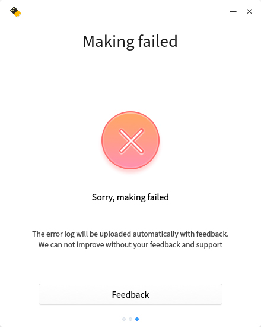

# Deepin Boot Maker|../common/deepin-boot-maker.svg|

## Overview

Deepin Boot Maker is a tool to make deepin boot disk developed by Deepin Technology Team. It's easy to operate with simple interface.

## Basic Operations

### Preparation

1. Download the latest official image file from official website.
2. Prepare a 8GB USB drive.
3. Run Deepin Boot Maker.
 - Deepin Boot Maker is built in deepin.
 - You can download its newest version from official website.
 - You can also extract deepin-boot-maker.exe from the image file in Windows.

### Select Image File

There are two ways to select the image file:

1.Click on **Select an ISO image file** to select the downloaded file, then click on **Next**.

2.Drag an ISO image file and drop it to the interface, then click on **Next**.

> : Please check the MD5 checksum of image file firstly, or will be failed to make.

### Select Making Disk

Select the making disk and click on **Start making** to complete.

> : Please tick the box of **Formatting disk can increase the making success rate**.

### Start Making

There will be a prompt of **Make Successfully** when completed. During the time of making, please do not remove the disk or shut down the computer.

> : There will be a prompt when failed to make, you can click on **Feedback** to auto upload the error log.

## Main Menu

### Help

You can click to view the manual, which will help you further know and use Deepin Boot Maker.

1. On Deepin Boot Maker interface, click on  .
2. Click on **Help**.
3. View the manual.

### About

You can click to view the version description.

1. On Deepin Boot Maker interface, click on .
2. Click on **About**.
3. View the version description.

### Exit

You can click to exit Deepin Boot Maker.

1. On Deepin Boot Maker interface, click on .

2. Click on **Exit** to exit.
