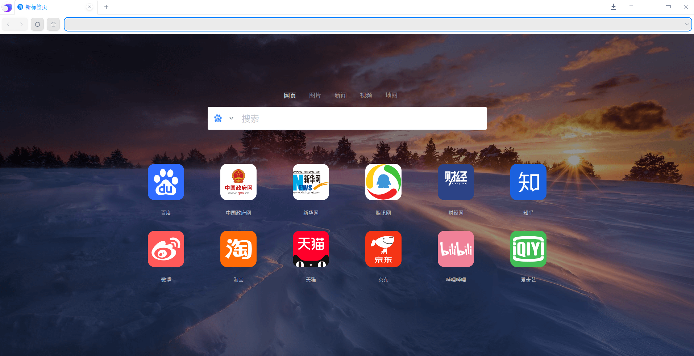

# 浏览器|../common/deepin-browser.svg|

## 概述

浏览器是一种用于检索并展示万维网信息资源的应用程序。可以用来显示万维网或局域网等内的文字、图像及其他信息，方便用户的使用。

## 使用入门

通过以下方式运行或关闭浏览器，或者创建浏览器的快捷方式。

### 运行浏览器

1. 点击桌面底部的 ，进入启动器界面。
2. 上下滚动鼠标滚轮浏览或通过搜索，找到浏览器 点击运行。
3. 右键单击  ，您可以：
 - 点击 **发送到桌面**，在桌面创建快捷方式。
 - 点击 **发送到任务栏**，将应用程序固定到任务栏。
 - 点击 **开机自动启动**，将应用程序添加到开机启动项，在电脑开机时自动运行该应用。

>  ：浏览器默认固定在任务栏上。您也可以点击任务栏上的  打开浏览器。

### 关闭浏览器

   - 在浏览器窗口，点击 ，退出浏览器。
   - 在任务栏右键单击  ，选择 **关闭所有** 来退出浏览器。

## 使用浏览器

### 设置默认浏览器

1. 当打开浏览器时，如果弹出“浏览器不是您的默认浏览器”提示框。
2. 点击 **设为默认浏览器**。

：在控制中心中将浏览器设置为默认的网页程序，具体操作请参阅 [默认程序设置](dman:///dde#默认程序设置)。

### 标签页管理

在浏览器窗口，不仅可以打开、查看多个标签页，还可以在它们之间进行切换。

#### 添加新的标签页

开启浏览器后，您可以通过下列方法之一添加新标签页：

- 在浏览器窗口顶部，点击右侧最后一个标签页旁边的  或右键单击选择 **打开新的标签页(T)**。
- 在浏览器窗口，点击  > **打开新的标签页**。
- 按下键盘上的组合键 Ctrl + T。

#### 在新窗口中打开标签页

开启浏览器后，您可以通过下列方法之一在新窗口中打开标签页：

- 点击标签页并将其拖拽出浏览器窗口。
- 在浏览器窗口，点击  > **打开新的窗口**。
- 按下键盘上的组合键 Ctrl + N。

#### 在新的标签页中打开文件

开启浏览器后，您可以通过下列方法之一在新的标签页中打开文件

- 从计算机的桌面上或文件夹中，将相应文件拖拽到浏览器标签页中。如果可以打开该文件，光标将显示 添加图标。
- 先使用键盘快捷键 Ctrl + O，再在计算机中浏览并选择想要打开的文件。

#### 在新标签页中打开链接

按住 Ctrl 键的同时点击链接。

#### 定制“打开新的标签页”页面

在打开新的标签页后，您会在搜索框下方看到自己经常访问的网站。

- 要访问某个网站，请点击对应图标。
- 要修改或移除某个网站，请将光标指向对应图标再执行修改或移除操作。

#### 添加自定义背景图片

您可以上传照片，以用作浏览器的背景。

点击新标签页右下角的“设置”图标 。

#### 排列标签页

要更改标签页的排列顺序，请沿浏览器窗口顶部拖拽标签页。

- 要将标签页固定在左侧，请右键点击相应标签页，然后选择 **固定标签页**。已固定标签页的尺寸较小，并且只显示网站的图标。
- 要取消固定标签页，请右键点击相应标签页，然后选择 **取消固定标签页**。

#### 关闭标签页

在相应标签页的右上角，点击 关闭标签页。

：关闭窗口中的所有标签页，可以关闭窗口。

#### 恢复标签页或窗口

如果您无意中关闭了某个标签页或窗口，则可以右键单击选择 **重新打开关闭的标签页(E)** 。

#### 强行关闭页面或应用

如果标签页、窗口或扩展程序无法正常运行，您可以在任务栏右键单击  ，选择 **强制退出** 将其强行关闭。

### 搜索引擎管理

#### 设置默认搜索引擎

1. 在浏览器窗口，点击    > **设置**。
2. 在左侧选择 **搜索引擎**，点击 **地址栏中使用的搜索引擎** 旁边的下拉框。
3. 选择一个新的默认搜索引擎。

：如果baidu一直是您的默认搜索引擎，但突然发生变化，则表明您的系统可能已遭到恶意软件的攻击。

#### 添加、修改或移除其他搜索引擎

1. 在浏览器窗口，点击    > **设置**。
2. 在“搜索引擎”下方，点击 **管理搜索引擎**。
3. 找到“其他搜索引擎”。

- **添加**：点击“其他搜索引擎”右侧的 **添加**。填写文本字段，然后点击 **添加**。
- **设为默认搜索引擎**：点击相应搜索引擎右侧的   > **设置** > **搜索引擎**。
- **修改**：点击相应搜索引擎右侧的   > **编辑**。
- **删除**：点击相应搜索引擎右侧的   > **从列表中移除**。

#### 文本字段填写提示

- 搜索引擎字段

   请输入相应搜索引擎的标签或名称。

- 关键字字段

   请为相应搜索引擎输入您要使用的文字快捷方式。这样一来，您便可以在地址栏中输入设置的关键字来快速打开相应搜索引擎。

- 网址（用“%s”代替搜索字词）字段

   请输入相应搜索引擎的结果页对应的网址，然后使用 `%s` 代替搜索字词。

   要查找并修改结果页对应的网址，请执行以下操作：

   1. 转至您要添加的搜索引擎。
   2. 执行一次搜索。
   3. 将搜索结果页的网址复制并粘贴到“网址”字段中。搜索结果页的网址与网站网址有所不同。

### 在浏览器上搜索网络信息

您可以使用浏览器在互联网上、书签列表和浏览记录中快速找到所需信息。

1. 在浏览器窗口，顶部地址栏中，输入需要搜索的信息，并在键盘上按下 **Enter** 键。
2. 您可以选择 **网页**、**图片**、**新闻**、**视频** 或 **地图** 进行查找。

#### 在网页中搜索

您可以在计算机上的网页中查找特定字词或短语。

1. 在浏览器窗口，打开一个网页。
2. 在键盘上按下 Ctrl +F，在窗口的右上角出现的栏中输入搜索字词。
3. 按 **Enter** 键搜索网页。
4. 系统会以黄色突出显示匹配内容。您可以使用滚动条上的黄色标记查看所有匹配内容在网页中的位置。

#### 搜索字词或图片

您可以在网页上查找特定字词、短语或图片的更多相关信息。

1. 在浏览器窗口，打开一个网页。
2. 突出显示某个字词、短语或图片。
3. 在计算机上右键点击它。
4. 点击相应选项，即可使用您的默认搜索引擎开始搜索。

### 下载管理

将文件/图片保存到计算机或设备上，您可以进行下载。下载的文件将保存到您的默认下载位置。

#### 下载文件

1. 打开浏览器。
2. 转到要在其中下载文件的网页。
3. 保存相应文件：

   - 大多数文件：点击下载链接。或者，右键单击相应文件并选择 **目标另存为**。
   - 图片：右键单击相应图片并选择 **图片另存为**。
   - 视频：将光标指向相应视频。点击“下载”图标 下载。如果您无法执行此操作，则表明该视频的所有者或托管网站已禁止下载。
   - PDF 文件：右键单击文件，然后选择 **链接另存为**。
   - 网页：右键单击网页，然后选择 **网页另存为**。
4. 如果系统提示，请选择用于保存该文件的位置，然后点击 **保存**。
   可执行文件（.exe、.dll、.bat）：如果您信任相应文件，请点击 **保存并确认**。如果您对下载文件的内容没有把握，请点击 **取消**。

5. 下载完毕后，您将在浏览器窗口的底部看见该文件。点击文件名即可打开这个文件。
   要在计算机上查找文件，请点击文件名旁边的向下箭头 > 在文件夹中显示，或点击“更多”图标 > 在 Finder 中显示。您下载的文件也会列在“下载内容”页面中。

通过如下操作设置自动下载项。

1. 在浏览器窗口，点击    > **设置 **。
2. 在“隐私和安全”区域，点击"网站设置"旁边的更多图标 >，进入“内容设置”窗口。
3. 点击 **管理例外情况...**。

#### 暂停或取消下载

1. 在屏幕底部，找到要暂停或取消下载的文件。
2. 在屏幕底部相应文件名旁点击向下箭头或“更多”图标。
3. 点击 **暂停**、**继续** 或 **取消**。

#### 下载文件存放路径设置

您可以在计算机上选择用于默认保存下载内容的位置，也可以在每次下载时选择特定的目标位置。

1. 在浏览器窗口，点击    > **设置**。
2. 选择下载设置，点击 **更改**... 可以设置下载文件的默认存放路径。

：如果您要在每次下载时选择具体的位置，请选中“下载前询问每个文件的保存位置”复选框。

#### 查看下载记录

在浏览器窗口，点击   ，可以查看过往的下载记录、查询下载文件。

- 要打开文件，请点击相应的文件名。系统会根据文件类型使用计算机默认的应用打开该文件。
- 要从历史记录中移除某项下载内容，请点击文件右侧的“移除”图标 。系统会将该文件会从 浏览器的“下载内容”页面中移除，但不会将其从计算机上移除。

### 历史记录管理

#### 查看历史记录

历史记录包含了浏览器使用期间内所访问的网站地址与具体时间。

1. 在浏览器窗口，点击    > **历史记录**。
2. 进入历史记录页面，点击 **按浏览时间排序** 或 **按站点排序** 查看历史记录。

#### 手动清除浏览器缓存

1. 在浏览器窗口，点击    > **历史记录**。
2. 点击 **清除上网痕迹**，弹出清除历史记录窗口，您可以：

- 清除这段时间的数据，时间有：
   - 过去一小时
   - 最近一天
   - 最近一周
   - 最近四周
   - 全部

- 清除浏览记录
- 清除新标签页快速访问记录
- 清除下载记录
- 删除Cookie和其他网站数据
- 清除已保存的自动填充表单数据
- 清除地址栏下列列表
- 清理flash缓存
- 整理已保存的密码
- 退出浏览器时自动清除选中项

3. 如果勾选 **退出浏览器时自动清除选中项**，将弹出 **清除上网痕迹** 窗口，点击 **立即清除**。
4. 点击 **清除**。

：还可以点击    > **更多工具** > **清除浏览数据**。

### 主页和启动页设置

您可以对浏览器进行自定义，使其在打开主页或启动页时显示任意网页。这两个网页并不相同，除非您将二者设置为相同的网页。

- 启动页是在计算机上首次启动浏览器后看到的网页。
- 主页是点击“主页”图标  后进入的网页。

如果您的启动页、主页或搜索引擎突然发生变动，则您的计算机上可能存在垃圾软件。了解如何找到和移除您计算机中的恶意软件，并[恢复您的浏览器设置]()。

#### 设置启动页

1. 在浏览器窗口，点击    > **设置 ** > **启动时**。
2. 在右侧“启动时”区域，您可以：
   - **打开主页**：指示浏览器打开一个新的标签页。
      ：默认情况下，打开新标签页，新标签页上会显示浏览器的徽标、搜索栏，以及您最常访问的网站的缩略图。但您也可以为新标签页选择一个有趣的主题背景。

   - **从上次停下的地方继续**：指示浏览器重新打开退出浏览器时正在浏览的网页。
     系统会保存Cookie 和数据，因此您当时登录的任何网站（例如 baidu）都会再次打开。如果不想自动登录到这些网页，请执行以下操作：

       1. 打开浏览器，点击    > **设置** > **隐私和安全**。
       2. 在“隐私和安全”区域，点击网站设置旁边的更多图标 >，进入 **内容设置** 窗口。
       3. 在“Cookie”区域，选择 **仅将本地数据保留到您退出浏览器为止**。

   - **打开特定网页或一组网页**：指示浏览器打开任意网页。

      在打开特定网页或一组网页下方的文本框中添加、修改或删除网址。

如果在“显示”区域，勾选 **显示“主页”按钮**，那么，“主页”按钮 后便会显示在地址栏的左侧。

#### 与您的启动页或主页相关的问题

如果您使用的是计算机，并且发现主页或启动页并不是您自己设置的网页，那么您的计算机上可能存在恶意软件。了解[如何阻止对 浏览器进行篡改]()。

如果使用的是单位或学校的浏览器，网络管理员可能会为您选择启动页或主页。如果是这样，那么您无法进行更改。如需获取更多帮助，请咨询[您的管理员]()。

### 收藏夹管理

#### 添加书签

1. 打开浏览器，进入需要再次访问的网站。
2. 在地址栏右侧，点击星形图标。
3. 弹出添加收藏窗口，设置书签名称或新建文件夹并将书签放入文件夹，点击 **添加**。

#### 查找书签

1. 在浏览器窗口，点击    > **管理收藏夹 **。
2. 在收藏管理器顶部的搜索框中，查找书签。

#### 修改书签

1. 在浏览器窗口，点击    > **管理收藏夹 **。
2. 在收藏管理器页面，选择一个书签，在书签所在行点击 **修改**图标。

#### 删除书签

1. 在浏览器窗口，点击    > **管理收藏夹 **。
2. 在收藏管理器页面，选择一个书签，在书签所在行点击 **删除**图标。

：如果需要修改或删除已经收藏的书签，您还可以在浏览器的窗口某个网页点击星形图标，并在弹出的窗口中点击 **修改** 或 **删除**。

#### 排列书签

1. 在浏览器窗口，点击    > **管理收藏夹 **。
2. 在收藏管理器页面，您可以向上或向下拖动书签，或将书签拖到左侧的文件夹中。您也可复制并粘贴书签，使其按照您预期的顺序排列。

### 在浏览器中翻译网页

当您浏览的网页使用的是您看不懂的语言时，使用翻译功能协助理解网页内容。

1. 在浏览器窗口，转到以其他语言显示的网页。
2. 右键单击弹出快捷菜单，如选择 **翻译中文 (简体) (T)**。

如果无法正常翻译，请尝试刷新该网页。如果仍然无法正常翻译，请右键点击该页面中的任意位置，然后点击 **翻译[相应语言]**。

### 通过浏览器进行打印

使用计算机或移动设备通过浏览器进行打印。

#### 通过标准打印机进行打印

1. 在浏览器窗口，选择需要打印的内容（网页、图片或文件）。
2. 右键单击弹出快捷菜单，选择 **打印**。
3. 在浏览器左侧显示打印窗口，选择目标打印机，然后更改打印所需的设置。
4. 准备就绪后，点击 **打印**。

### 查看源代码

开启浏览器后，您可以通过下列方法之一查看网页源代码：

- 点击    > **更多工具** > **查看源代码**。
- 右键单击弹出快捷菜单，在其中选择 **查看源代码**。

### 审查元素

审查元素可以查看当前网页的css、Javascript和html内容并且可以进行修改。

在浏览器窗口，右键单击弹出快捷菜单，选择 **审查元素(N)**。

：请勿用于非法途径。

### 启动开发者工具

当UI需要设计或调试网站时，可以启用开发者工具。

- 在浏览器窗口，点击    > **更多工具 ** > **开发人员工具(D)** 调出开发者工具。
- 按下键盘上的F12。

## 隐私和安全设置

### Cookie管理

通过浏览器可以对Cookie进行设置，删除现有 Cookie、允许/阻止所有 Cookie，以及对某些网站进行偏好设置。

Cookie 是访问的网站所创建的文件。Cookie 通过保存浏览信息来让您获得更轻松的在线体验。借助 Cookie，网站可使您保持登录状态、记住您的网站偏好设置，并为您提供本地的相关内容。

Cookie 分为：

- 由您访问的网站创建。相应网站会显示在地址栏中。
- 由其他网站创建。这些网站拥有您访问的网页上显示的某些内容（如广告或图片）。

#### 删除 Cookie

如果删除 Cookie，即会退出相应网站，已保存的偏好设置可能也会随之删除。

1. 在浏览器窗口，点击    > **设置 **。
2. 在“隐私和安全”区域，点击"网站设置"旁边的更多图标 >，进入“内容设置”窗口。
3. 在Cookie下方，点击 **所有Cookie和网站数据...**，弹出“Cookie和网站数据”窗口。
   - 删除特定Cookie和网站数据：搜索Cookie和网站数据的名称，在该网站的网址右侧点击 。
   - 删除所有的Cookie和网站数据：点击 **全部删除**。

您还可以删除某个时间段内的 Cookie和网站数据。

1. 在浏览器窗口，点击    > **更多工具 ** > **清除浏览数据**。
2. 在“清除历史记录”窗口，点击“清除这段时间的数据”旁边的下拉菜单，选择一个时间段，如 **过去一小时**或**过去一天**。
3. 勾选 **删除Cookie 和其他网站数据**，并取消选中所有其他项。
4. 点击 **清除**。

#### 更改Cookie设置

1. 在浏览器窗口，点击    > **设置 **。
2. 在“隐私和安全”区域，点击"网站设置"旁边的更多图标 >，进入“内容设置”窗口。
3. 在Cookie下方，您可以：
   - **允许设置本地数据（推荐）**：默认设置
   - **仅将本地数据保留到您退出浏览器为止**：在使用浏览器期间保存浏览器访问活动信息，但在退出浏览器后自动删除相应 Cookie。
   - **阻止网站设置任何数据**：阻止网站保存 Cookie，如果不允许网站保存 Cookie，您将无法浏览大部分需要登录的网站。
   - **阻止第三方Cookie和网站数据**：允许来自所访问网站的 Cookie，但阻止来自其他网站（这些网站拥有相应网页上显示的广告或图片）的 Cookie。
   - **阻止其他网站读取我的上网记录，保护隐私**：系统将会阻止来自其他网站的所有 Cookie 和网站数据，即使相应网站在您的例外情况列表中被设为“允许”也是如此。

   点击 **管理例外情况...**，**允许**/**退出是清除**/**禁止** 某项现有例外情况或权限。

### 已保存的密码管理

如果您在某个网站上输入新密码，浏览器会询问您是否要保存此密码。如需保存，请点击**保存**。

- 要查看即将保存的密码，请点击“预览”图标 。
- 如果网页上有多个密码，请点击向下箭头 ，然后选择您要保存的密码。
- 如果您的用户名显示为空白或不正确，请点击“用户名”旁边的文本框，然后输入您要保存的用户名。
- 如果想保存其他密码，点击“密码”旁边的文本框，然后输入您要保存的密码。

####  使用已保存的密码登录

如果您在之前访问某个网站时保存了该网站的密码，则浏览器可以帮助您登录。

1. 在计算机上，转到您曾访问过的某个网站。
2. 转到该网站的登录表单。

- **如果您为该网站保存了一组用户名和密码**：浏览器会自动填写登录表单。
- **如果您保存了多组用户名和密码**：请选择用户名字段，然后选择您要使用的登录信息。

#### 查看/删除已保存的密码

1. 在浏览器窗口，点击    > **设置 **。
2. 在“自动填充”区域，勾选 **密码**，并点击"密码"旁边的更多图标 >，进入 **密码** 设置窗口。
3. 查看、删除密码。

要清除所有已保存的密码，请参阅[清除浏览数据](#手动清除浏览器缓存)，然后选择“管理已保存的密码”。

#### 启用或停用保存密码的功能

默认情况下，浏览器会询问您是否要保存密码。您可以随时启用或停用此功能。

1. 在浏览器窗口，点击    > **设置 **。
2. 在“自动填充”区域，勾选或取消勾选 **密码**，以开启或关闭提示保存密码。

### 分享位置信息

如果允许网站知道您所在的位置，您将可以从这些网站获取更实用的信息。例如，通过分享您的位置信息，您可以更快速地找到附近的餐厅。

#### 允许网站知道您所在的位置

默认情况下，浏览器会在网站尝试获取您的位置信息时询问您。要允许相应网站知道您所在的位置，请选择**允许**。在分享您的位置信息之前，请先查看相应网站的隐私权政策。

如果您在手机上使用 baidu 作为默认搜索引擎，那么在默认情况下，它会根据您的位置信息搜索您在 baidu 中输入的内容。

#### 更改默认的位置信息设置

1. 在浏览器窗口，点击    > **设置 **。
2. 在“自动填充”区域，勾选 **地址和其他信息**，并点击“地址和其他信息”旁边的更多图标 >，进入 **自动填充设置** 窗口。
3. 点击 **添加新地址...**。

####  浏览器如何分享您的位置信息

如果您允许浏览器将您的位置信息分享给某个网站，浏览器会向 baidu 位置信息服务发送信息，以便了解您的大致位置。随后，浏览器会将您的位置信息分享给该网站。

### 使用摄像头和麦克风

您可以在浏览器中针对某些网站使用摄像头和麦克风。

1. 打开浏览器，转到要使用麦克风和摄像头的网站。
2. 看到系统提示时，选择 **允许 **或 **屏蔽**。

- **允许的网站**：当您浏览网站时，网站就可以开始录制。如果您使用的是其他浏览器 标签页或其他应用，则网站无法开始录制。
- **已屏蔽的网站**：某些网站在遭到屏蔽后将无法正常运行。例如，您将无法参加视频会议

#### 更改网站的摄像头和麦克风权限

1. 在浏览器窗口，点击    > **设置 **。
2. 在“隐私和安全”区域，点击“网站设置”旁边的更多图标 >，进入“内容设置”窗口。
3. 在“麦克风”区域，您可以：
   - 设置麦克风音频
   - 当网站要求使用您的麦克风时询问您（推荐）
   - 不允许网站使用您的麦克风
   点击 **管理例外情况...**，移除某项现有例外情况或权限。

4. 在“摄像头”，您可以：
   - 当网站要求使用您的摄像头时询问您（推荐）
   - 不允许网站使用您的摄像头
   点击 **管理例外情况...**，移除某项现有例外情况或权限。

#### 解决麦克风的问题

如果麦克风不能正常工作，请尝试以下步骤：

1. 检查麦克风是否处于静音
   如果您使用了耳机，请确保耳机线上的静音开关处于关闭状态。另外，请确保您在网站（如baidu）上没有处于静音状态。

2. 检查系统设置是否正常
   请确保您的麦克风是默认录音设备，而且录音电平正确无误：

3. 联系制造商
   如果您仍然遇到问题，请联系麦克风的制造商。

### 更改网站权限

您可以控制网站向您显示的内容，以及在您浏览网页时网站可使用的信息。

#### 更改所有网站的设置

1. 在浏览器窗口，点击    > **设置 **。
2. 在“隐私和安全”区域，点击“网站设置”旁边的更多图标 >，进入“内容设置”窗口。
3. 选择需要更新的权限，您可以更改：

- **Cookie**：Cookie 是您访问过的网站所创建的文件。Cookie 通过保存浏览信息来让您获得更轻松的在线体验。详情请参阅[Cookie管理](#Cookie管理)。
- **图片**：默认情况下，系统允许显示图片。
- **JavaScript**：JavaScript 有助于提高网站的交互性。
- **处理程序**：浏览器允许外部应用和网络服务打开某些链接。例如，某些链接可以打开 Gmail 之类的网站或 iTunes 之类的程序。如果您为某类链接设定了默认操作，后来却想删除它，请参阅[清除浏览数据](#手动清除浏览器缓存)并选择“Cookie 及其他网站数据”。
- **Flash**：借助 Adobe Flash 插件，您可以收听音频内容和观看视频内容。默认情况下，当您访问使用 Flash 的网页时，浏览器会询问您是否要运行 Flash。
- **弹出式窗口**：默认情况下，按下键盘上的组合键 会拦截弹出式窗口，以阻止其自动显示。
- **广告**：您可以选择是否要在含侵扰性广告的网站上看到广告。
- **位置信息**：默认情况下，浏览器会询问您是否允许某个网站查看您的确切位置信息。详情请参阅[分享位置信息](#分享位置信息)。
- **通知**：某些网站（例如 日历）可能会在您的计算机桌面上显示通知。默认情况下，浏览器会询问您是否允许某个网站显示通知。
- **麦克风**：某些网站可能会请求使用您的摄像头和麦克风。详情请参阅[使用摄像头和麦克风](#使用摄像头和麦克风)。
- **摄像头**：某些网站可能会请求使用您的摄像头和麦克风。详情请参阅[使用摄像头和麦克风](#使用摄像头和麦克风)。
- **未经过沙盒屏蔽的插件访问**：某些网站需要使用插件，才能让您执行在线观看视频或安装软件等操作。默认情况下，浏览器会询问您是否允许某个网站的插件绕过浏览器的沙盒来访问您的计算机。
- **自动下载**：如果要从某个网站下载多个文件，请选择是否要自动下载这些文件。
- **MIDI 设备**：某些网站想使用系统专有 (SysEx) 消息来获得 MIDI（乐器数字接口）设备的完全访问权限。
- **USB 设备**：可以将网站连接到 USB 设备，以便网站可以控制和记录设备中的信息。
- **后台同步**：如果计算机在执行某项任务（如发送聊天消息或上传照片）期间断网了，某些网站可以在该计算机恢复联网后完成相应任务。即使您离开该网站，设备也会在后台进行同步操作。
- **缩放级别**：您可以设置特定网站的缩放级别。
- **PDF 文档**：默认情况下，浏览器会使用文档查看器来打开 PDF 文件。要想下载（而非打开）PDF 文件，请开启**下载 PDF 文件，而不是在浏览器中自动打开它们**。
- **受保护的内容**：选择让浏览器播放受保护的内容。

