# 影院|../common/deepin-movie.svg|

## 概述

惬意的悠闲时光，让影院陪您一起度过！

影院提供了直观易用的操作界面和丰富齐全的快捷键，依靠键盘您就能完成所有的播放操作，让您彻底摆脱鼠标点击的束缚。您可以使用影院播放多种格式的视频文件，利用流媒体功能轻松欣赏到网络视频资源。

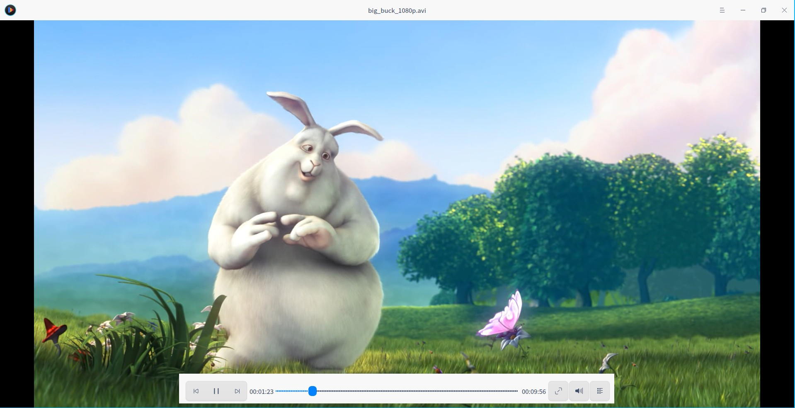

## 使用入门

### 运行影院

1. 点击桌面底部的 ，进入启动器界面。
2. 上下滚动鼠标滚轮浏览或通过搜索，找到影院  点击运行。
3. 右键单击   ，您可以：
 - 点击 **发送到桌面**，在桌面创建快捷方式。
 - 点击 **发送到任务栏**，将应用程序固定到任务栏。
 - 点击 **开机自动启动**，将应用程序添加到开机启动项，在电脑开机时自动运行该应用。

### 关闭影院
- 在影院界面点击   ，退出影院。
- 在任务栏右键单击  ，选择 **关闭所有** 来退出影院。
- 在影院界面点击  ，选择 **退出** 来退出影院。

### 查看快捷键

播放视频之前先了解一下快捷键的配置，让您的后续操作事半功倍。

1. 在影院界面，按下键盘上的 ++ 组合键，打开快捷键预览界面。
2. 在快捷键预览界面，您可以查看到所有的快捷键。

>  ：在视频播放的过程中，您也可以随时调出快捷键预览界面。

 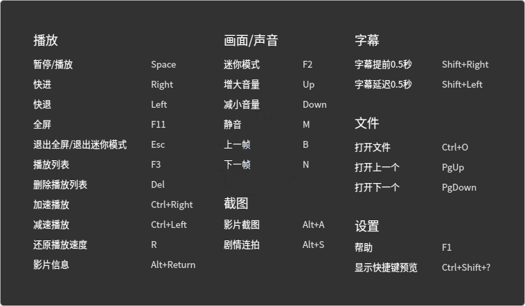

## 主界面

执行常用的播放操作，享受视频带给您的快乐！

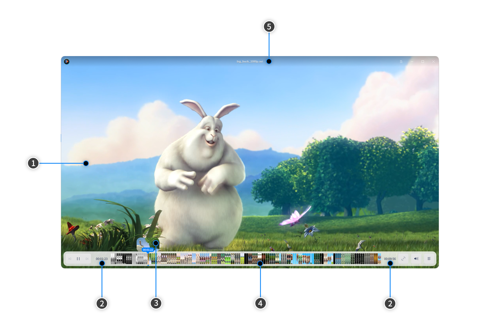

| 标号 | 名称     | 说明                                                         |
| ---- | -------- | ------------------------------------------------------------ |
| 1    | 播放窗口 | 显示视频内容，当鼠标指针移入播放窗口后将显示视频信息和功能图标，当鼠标移出播放窗口或无操作时将隐藏视频信息和功能图标。播放窗口为无框模式，您可以任意拖拽播放窗口，手动调节播放窗口的大小。 |
| 2    | 时间显示 | 显示当前播放视频的时间总长和已经播放的时间信息。             |
| 3    | 进度条   | 显示视频播放进度，拖拽进度条可以改变视频播放进度。将鼠标指针置于进度条上，进度条将智能加粗并显示视频预览窗口。 |
| 4    | 缩略图   | 显示视频内容，您可以通过缩略图查看某一时间点的视频内容。     |
| 5    | 视频标题 | 显示正在播放的视频名称。                                     |

&nbsp;&nbsp;&nbsp;&nbsp;&nbsp;&nbsp;&nbsp;&nbsp;&nbsp;&nbsp;&nbsp;&nbsp;&nbsp;

>  ：当鼠标置于进度条上时，默认显示预览窗口，如果您不需要预览显示，您可以进入设置中去更改，具体操作请参阅 [基础设置](#基础设置)。

### 图标介绍

| 图标                                                  | 名称              | 图标                                                 | 名称           |
| ----------------------------------------------------- | ----------------- | ---------------------------------------------------- | -------------- |
|      | 播放上一个影片    |     | 播放下一个影片 |
|      | 开始播放影片      |  | 暂停播放影片   |
|   | 全屏播放          |   | 调节音量       |
|  | 呼出/隐藏播放列表 |            | 主菜单         |
|              | 最小化按钮        |             | 最大化按钮     |
|            | 关闭按钮          |                                                      |                |

### 播放影片

您可以通过以下方式来播放影片：
- 单击鼠标右键或从选择 **打开文件**，直接播放本地影片。
- 单击鼠标右键或从选择 **打开文件夹**，文件夹中的影音文件将全部显示在播放列表中，并依次进行播放。
- 单击鼠标右键，选择 **打开URL**，粘贴在线播放地址，播放在线影片。
- 单击鼠标右键，选择 **播放光盘**，播放光盘中的影片。
- 直接拖拽文件或文件夹到影院界面上，来播放本地影片。

>  ：使用影院在线播放视频时，请确保您的电脑是连入网络的。

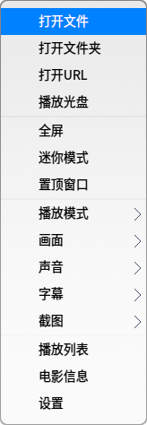

### 快进/快退

1. 在影院界面，按下键盘上的  键，快进视频。
2. 在影院界面，按下键盘上的  键，快退视频。

### 加速/减速播放

1. 在影院界面，按下键盘上的 + 键，视频加速播放。
2. 如果要减速播放，请按下键盘上的 + 键。
3. 如果要恢复原速播放，请按下键盘上的  键。

> ：加速/ 减速播放是相对于原播放速度而言的，每加速/减速一次，视频播放速度默认增加/减少0.1 倍。如果按住键盘上的 + 或  键不放，视频播放速度将递增或递减。最高播放速度为2倍的原播放速度，最低播放速度为0.1倍的原播放速度。

## 功能设置

### 调整播放窗口
在播放影片时，您可以灵活的调整播放窗口大小。

在影院界面上，单击鼠标右键：
- 选择 **全屏**，将播放窗口调整成全屏。
- 选择 **迷你模式**，将播放窗口调整成迷你模式。
- 选择 **置顶窗口**，将播放窗口置顶到桌面上方。
- 您也可以使用鼠标拖拽窗口边缘，自由调整窗口大小。

> ：您可以在播放窗口上双击鼠标，播放窗口将在 **全屏/正常窗口** 之间切换。

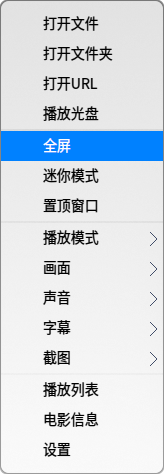

### 调整播放模式

1. 在影院界面上，单击鼠标右键。
2. 将鼠标移动到 **播放顺序**，您可以：
 - 选择 **顺序播放**，影院将按照播放列表顺序依次播放影片，播放列表中最后一个文件播放结束后停止。
 - 选择 **随机播放**，影院将随机播放列表里的文件，播放列表中的文件全部随机播放一遍之后继续循环随机播放。
 - 选择 **单个播放**，影院将当前影片播放完成后停止。
 - 选择 **单个循环**，影院将循环播放当前影片。
 - 选择 **列表循环**，影院将按照播放列表顺序依次播放影片，播放列表中最后一个文件播放结束后重新播放第一个文件。

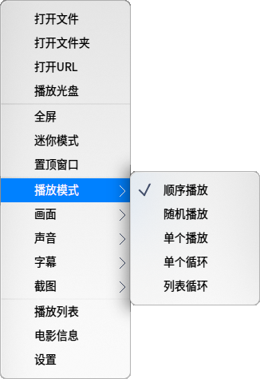

### 调整画面
1. 在影院界面上，单击鼠标右键。
2. 将鼠标移动到 **画面**，您可以：
 - 选择一种画面比例，将播放画面调整成相应的比例。
 - 选择一种旋转方式，将播放画面相应旋转。
 - 跳转到上一帧/下一帧。

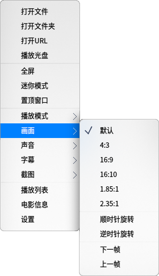

### 调整声音
1. 在影院界面上，单击鼠标右键。
2. 将鼠标移动到 **声音**，您可以：
 - 选择 **声道**，选择影片的播放声道。
 - 选择 **音轨**，选择影片的播放音轨。

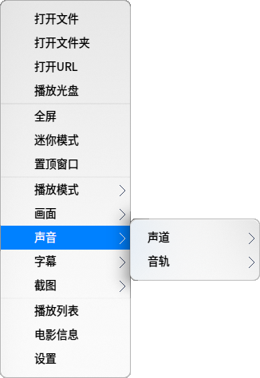

### 调整字幕
1. 在影院界面上，单击鼠标右键。
2. 将鼠标移动到 **字幕**，您可以：
 - 选择 **载入字幕**，手动选择字幕文件加入到影片中。
 - 选择 **查找在线字幕**，影院将在线匹配字幕，匹配成功后自动载入。
 - 选择 **选择字幕**，在多个字幕间切换选择。
 - 选择 **隐藏字幕**，取消当前的字幕显示。
 - 选择 **编码**，切换字幕的编码方式，来解决某些情况下字幕显示乱码的问题。

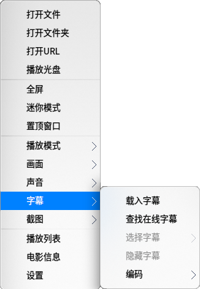

### 截图
1. 在影院界面上，单击鼠标右键。
2. 将鼠标移动到 **截图**，您可以：
 - 选择 **截图**，可以对当前画面进行截图。
 - 选择 **连拍截图**，可以分别截取影片不同时段的图片，最后组成一张剧情连拍预览图。

### 查看影片信息
1. 在影院界面上，单击鼠标右键。
2. 选择 **电影信息**，可以查看影片的文件类型、分辨率、文件大小、媒体时长、文件路径。

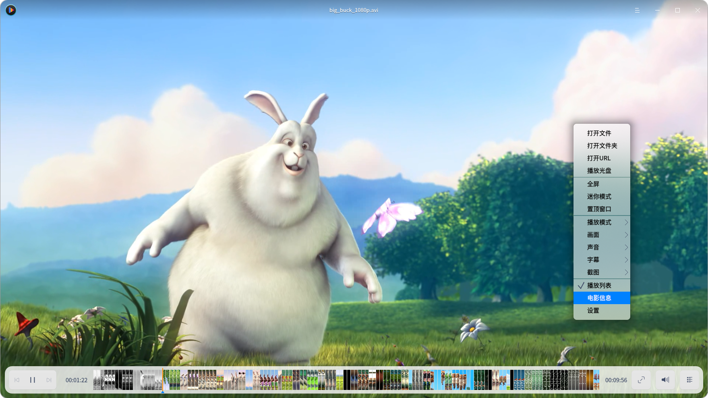

## 列表管理

您可以进入播放列表来添加或删除视频文件。

### 添加影片

您可以向播放列表中添加影片：
- 单击鼠标右键，选择 **打开文件/打开文件夹/打开URL/播放光盘**  或打开 > **打开文件/打开文件夹**，来添加影片到播放列表。
- 您也可以直接拖拽文件/文件夹到播放列表。

### 删除视频文件

1. 在影院界面，点击 。
2. 进入播放列表窗口，将鼠标指针置于视频文件上。
3. 右键单击 **从列表中删除**。

> ： 在播放列表界面，将鼠标指针置于视频文件上，点击 删除视频文件。

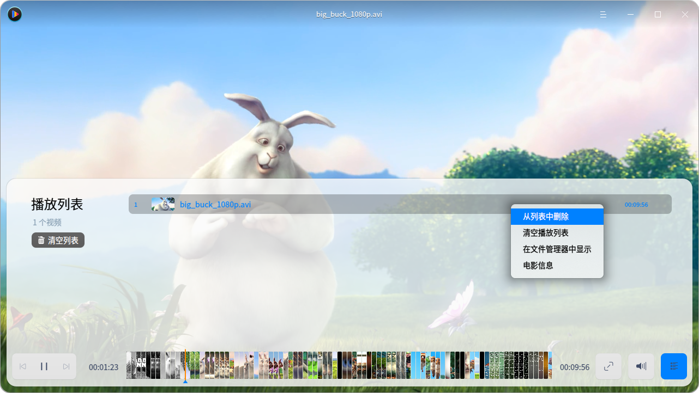

### 清空播放列表

1. 在影院界面，点击 。
2. 进入播放列表窗口，将鼠标指针置于视频文件上。
3. 右键单击 **清空播放列表**。

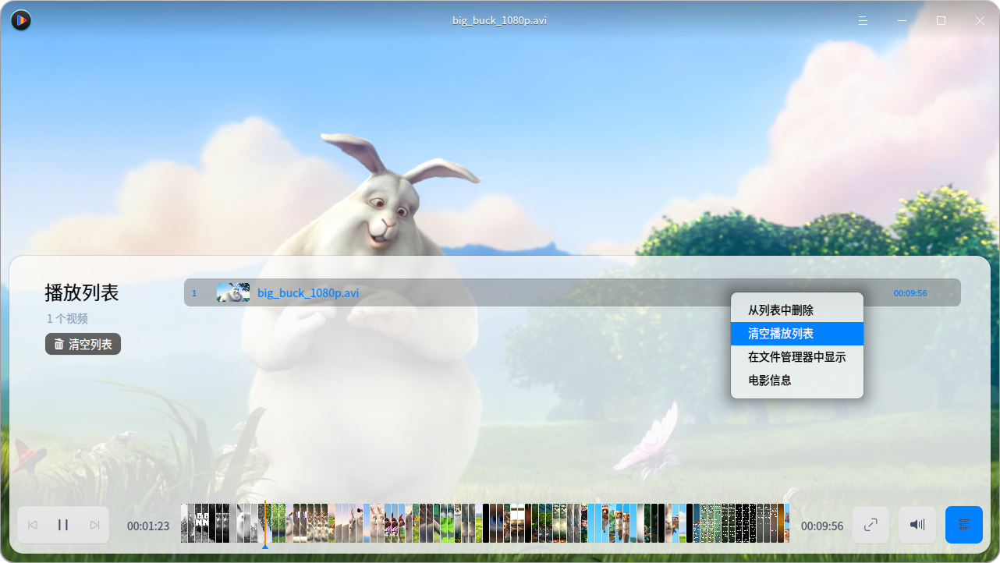

### 在文件管理器中显示

1. 在影院界面，点击 。
2. 进入播放列表窗口，将鼠标指针置于视频文件上。
3. 右键单击 **在文件管理器中显示**，将自动跳转到文件管理器界面并显示到当前文件位置。

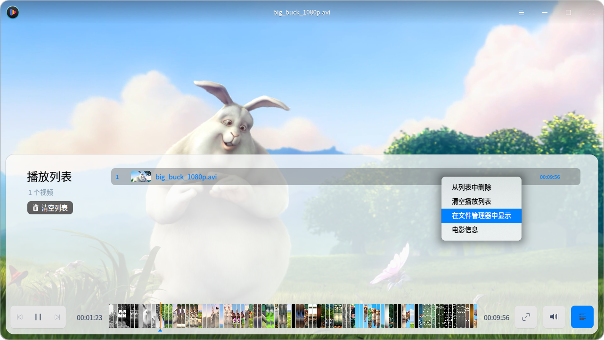

## 主菜单

在主菜单中，您可以打开文件/文件夹、切换窗口主题、查看帮助手册，了解影院的更多信息。
### 设置

您可以对基础信息、快捷键和字幕进行设置。

#### 基础设置

1. 在影院界面，点击鼠标右键或 。
2. 点击 **设置**。
3. 在 **播放** 选项，您可以：
  - 勾选 **退出影院时清空播放列表** 复选框，在您退出影院后将播放列表完全清空。
  - 勾选 **自动从上次停止位置播放** 复选框，在打开影院后自动接续上次关闭时的视频播放。
  - 勾选 **自动查找相似文件连续播放** 复选框，将同一个文件夹下名称相似的视频文件自动添加到播放列表中依次进行播放。
  - 勾选 **鼠标悬停进度条时显示预览** 复选框，当鼠标置于播放进度条上时显示预览窗口。
  - 勾选 **允许同时运行多个影院** 复选框，可以同时打开多个影院窗口来播放不同的视频文件。
  - 勾选 **最小化时暂停** 复选框，在影院最小化时自动暂停视频文件的播放。
4. 在 **截图** 选项，您可以自定义截图的保存路径。

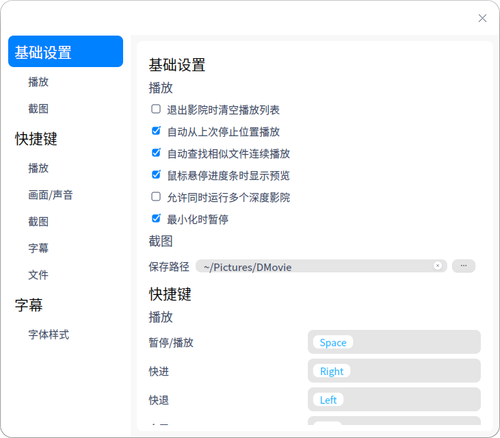

#### 快捷键设置

1. 在影院界面，点击鼠标右键或 。
2. 点击 **设置**。
3. 在 **快捷键** 选项查看当前当前快捷键。
4. 您可以选择并重新输入快捷键，来自定义快捷键。

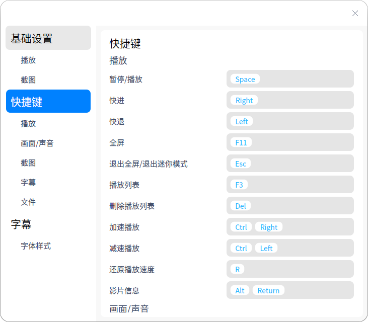

#### 字幕设置

1. 在影院界面，点击鼠标右键或 。
2. 点击 **设置**。
3. 在 **字幕** 选项，您可以：
 - 选择字幕字体。
 - 选择字幕字号。

>  ：点击设置界面上的 **恢复默认**，会将所有设置恢复到默认状态。

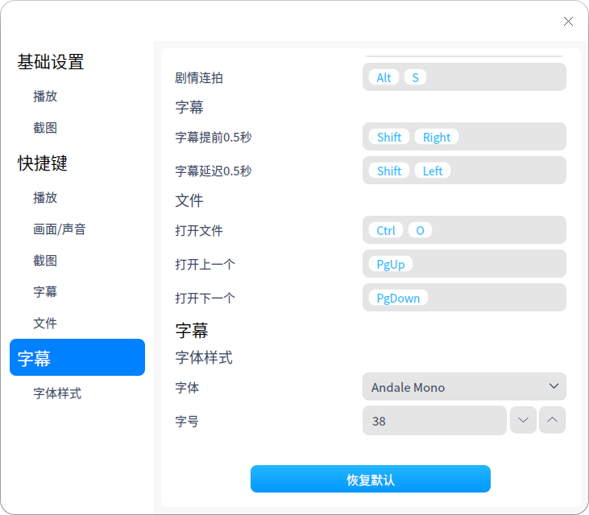

### 主题

窗口主题包含浅色主题、深色主题和系统主题，其中系统主题为默认设置。

1. 在影院界面，点击。
2. 点击 **主题**，选择一种主题颜色。

### 帮助

查看帮助手册，通过帮助进一步让您了解和使用影院。

1. 在影院界面，点击   。
2. 点击 **帮助**。
3. 查看关于影院的帮助手册。

### 关于

1. 在影院界面，点击   。
2. 点击 **关于**。
3. 查看关于影院的版本和介绍。

### 退出

1. 在影院界面，点击 。
2. 点击 **退出**。