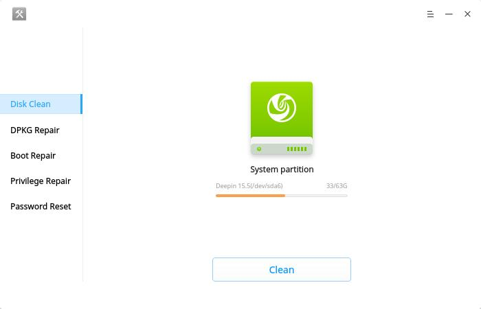
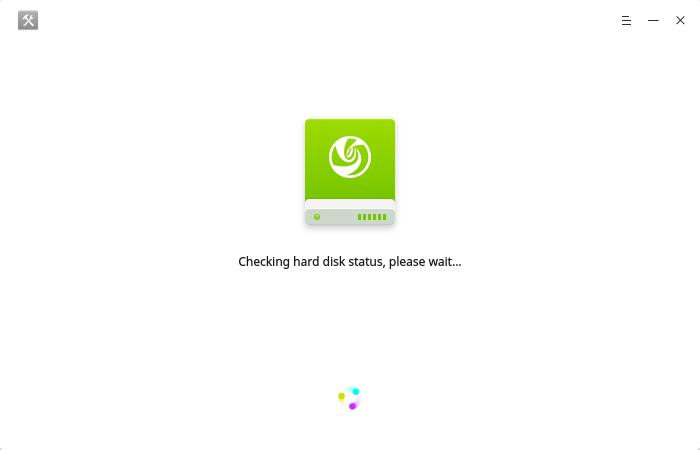
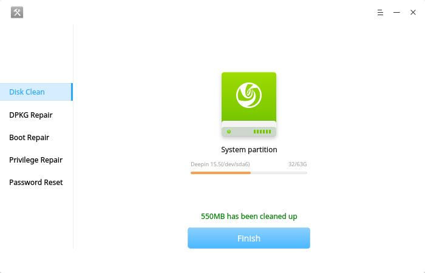
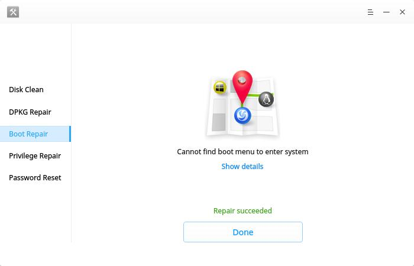

# Deepin Repair|../common/deepin-repair.svg|

## Overview

Deepin Repair is a tool to help users quickly fix some issues in deepin, including hard disk detecting, disk cleaning, DPKG repairing, boot repairing, privilege repairing, password reset, etc.

## Basic Operations

When you cannot find boot menu, have privilege error or forgot login password, you may not be able to enter deepin desktop, then you need to go into Live system to run Deepin Repair.

### Detect and repair disk

Run **Deepin Repair**, after inputting the account password, it will automatically detect your hard disk. If an error was found, there will be a prompt to repair hard disk. If not found, you can go on next steps.

1. If prompted to repair hard disk, click **Repair** to start.

2. When finished, click **Restart Now** to make disk repairing come into effect.

### Clean disk

Cleaning out your PC on a regular basis frees up drive space and helps it run better. 

1. Click **Disk Clean** on the interface.
2. Click **Clean** to remove junk files on your disk.
3. Click **Done** to finish disk cleaning.

### Repair DPKG

If you cannot install or upgrade application, your DPKG may be damaged, then you need to repair DPKG.

1. Click **DPKG Repair** on the interface.
2. Click **Repair** to start, click **Show details** to view the repairing process.
3. Click **Done** to finish DPKG repairing.

: DPKG is the software at the base of the package management system in Debian and its derivatives. It is used to install, remove, and provide information about .deb packages. When there are some problems in DPKG, you may not be able to install or uninstall applications , then you can use Deepin Repair to repair DPKG.

### Repair boot menu

If you cannot find boot menu to enter system, you can go into Live system and run **Boot Repair** to repair boot menu.

1. Click **Boot Repair** on the interface.
2. Click **Repair** to start, click **Show details** to view the repairing process.
3. Click **Done** to finish boot repairing.

### Repair privilege

If you cannot enter desktop due to privilege error, you can go into Live system and run **Boot Repair** to repair privilege.

1. Click **Privilege Repair** on the interface.
2. Click **Repair** to start.
3. Click **Done** to finish privilege repairing.

### Reset login password

If you forgot account password and cannot login, you can go into Live system and run **Boot Repair** to reset login password.

1. Click **Password Reset** on the interface.
2. Click **Reset password**, enter a new password and retype it.
3. Click **Confirm** to reset password.
4. Click **Done** to finish password reset.

## Main Menu

In **Main Menu**, user can view manual, get application information, and exit. On Deepin Repair interface, click on to enter **Main menu**. 

### Help

In **Main Menu**, select **Help** to view the manual of Deepin Repair. 

### About

In **Main Menu**, select **About** to check the version and introduction of Deepin Repair.

### Exit

In **Main Menu**, select **Exit** to exit Deepin Repair.
