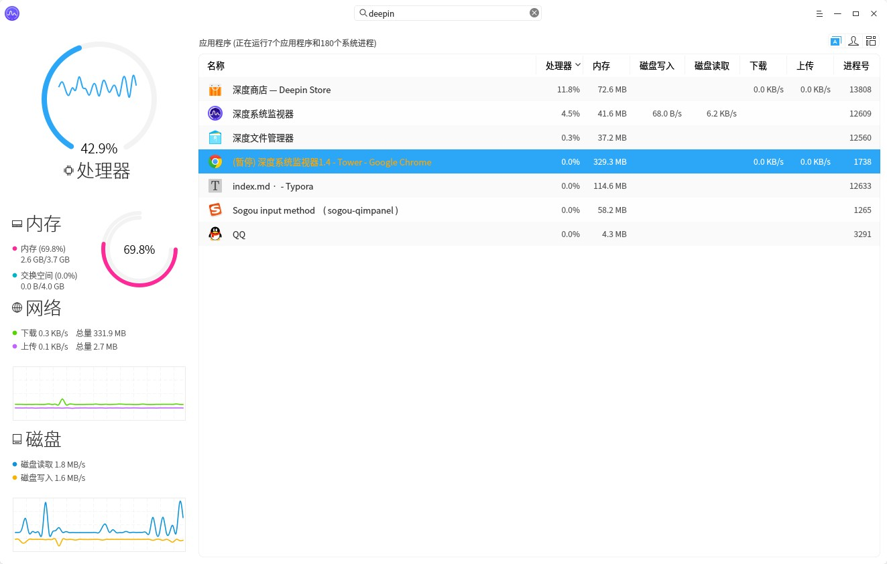
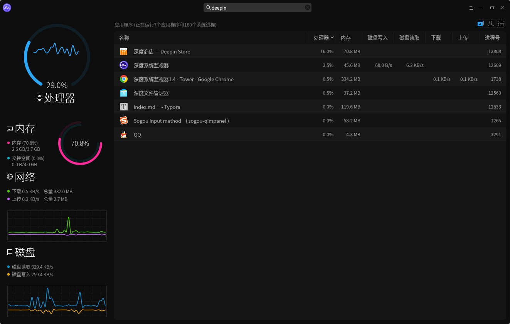

# 系统监视器|../common/deepin-system-monitor.svg|

## 概述

系统监视器是可以帮您实时监控处理器状态、内存占用率、网络上传下载速度、还可以管理您的系统进程和应用进程，支持搜索进程和强结束进程。

## 操作介绍

### 硬件监控

系统监视器可以实时监控电脑的处理器、内存、网络状态：

- 处理器监控使用数值和图形实时显示处理器占用率，还可以通过波形显示最近一段时间的处理器占用趋势。
- 内存监控使用数值和图形实时显示内存占用率，还可以显示内存总量和当前占用量，交换分区内存总量和当前占用量。
- 网络监控可以实时显示当前上传下载速度，还可以通过波形显示最近一段时间的上传下载速度趋势。
- 磁盘监控可以实时显示当前磁盘读写速度，还可以通过波形显示最近一段时间的磁盘读写速度趋势。

### 进程管理

#### 切换进程标签

您可以点击界面右上角的图标切换进程标签，分别可以查看应用程序进程、我的进程和所有进程。

- 在系统监视器界面，选点击图标切换到应用程序进程页面。
- 在系统监视器界面，选点击图标切换到我的进程页面。
- 在系统监视器界面，选点击图标切换到所有进程页面。

#### 调整进程排序

进程列表可以根据名称、处理器、内存、磁盘写入、磁盘读取、下载、上传、进程号排列进程。

- 在系统监视器界面点击进程列表顶部的标签，进程会按照对应的标签排序，多次点击可以切换升序和降序。

- 在系统监视器界面右键单机进程列表顶部的标签栏，可以取消勾选标签来隐藏对应的标签列，再次勾选可以恢复显示。

#### 搜索进程

通过系统监视器顶部的搜索框，可以输入进程名称搜索进程，快速定位。

#### 结束进程
您可以使用系统监视器结束系统和应用进程。
1. 在系统监视器界面上，右键单击需要结束的进程。
2. 选择 **结束进程**。
3. 在弹出窗口点击 **结束进程**，来确认结束该进程。

#### 结束应用程序

1. 在系统监视器界面，点击 。

2. 选择 **强制结束应用程序**。

3. 根据屏幕提示在桌面上点击想要关闭的应用窗口。

4. 在弹出窗口点击 **结束应用**，来确认结束该应用。

   > 右键菜单 **结束进程** 可以关闭所有进程，**强制结束应用程序** 只能用来关闭图形化进程。

#### 暂停和继续进程

您可以使用系统监视器暂停和继续进程。

1. 在系统监视器界面上，右键单击一个进程进程。
2. 选择 **暂停进程**，被暂停的进程会带有暂停标签并变成黄色。
3. 再次右键单击被暂停的进程，选择 **继续进程** 可以恢复该进程。

#### 查看进程路径

1. 在系统监视器界面上，右键单击一个进程。
2. 选择 **查看命令所在位置**，可以在文件管理器中打开该进程的所在目录。

#### 查看进程属性

1. 在系统监视器界面上，右键单击一个进程进程。
2. 选择 **属性**，可以查看进程的英文名、命令行、启动时间。

## 主菜单

在主菜单中，您可以切换窗口主题、切换监控模式、查看帮助手册、了解系统监视器的更多信息。

### 主题

窗口主题包含浅色主题、深色主题和系统主题，其中系统主题为默认设置。

1. 在相册界面，点击。
2. 点击 **主题**，选择一个主题颜色。

### 模式

系统监视器提供了普通模式和紧凑模式，您可以根据需要选择展现监控信息的模式。

1. 在系统监视器界面，点击 。
2. 点击 **模式**，选择一种模式。

### 帮助

查看帮助手册，通过帮助进一步让您了解和使用系统监视器。

1. 在系统监视器界面，点击 。
2. 点击 **帮助**。
3. 查看关于系统监视器的帮助手册。

### 关于

1. 在系统监视器界面，点击 。
2. 点击 **关于**。
3. 查看关于系统监视器的版本和介绍。

### 退出

1. 在系统监视器界面，点击 。
2. 点击 **退出**。

