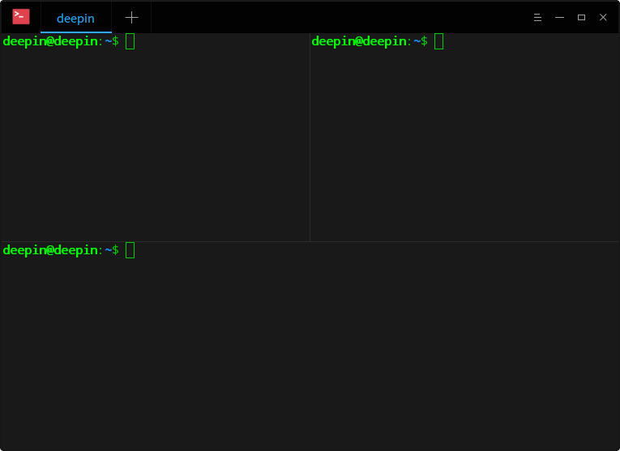
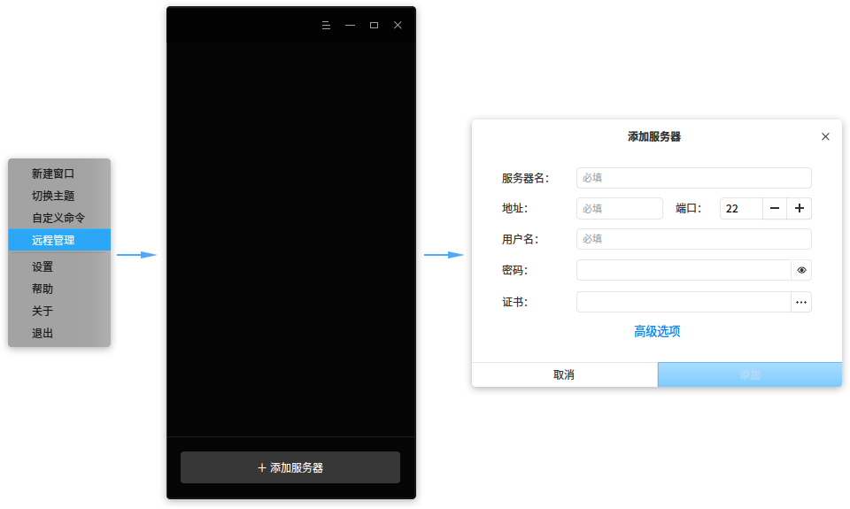
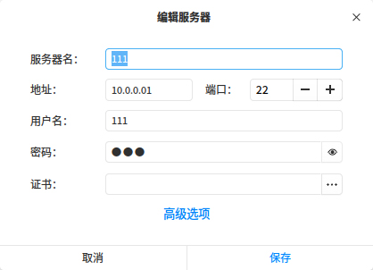
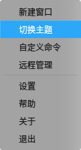
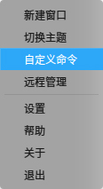

# 终端|../common/deepin-terminal.svg|

## 概述

终端是⼀款集多窗⼝、⼯作区、远程管理、雷神模式等功能的⾼级终端模拟器。它拥有简单的界面，丰富而强大的功能。您可以瞬间启动和关闭，使用起来像普通文件窗口一样流畅，让您在输入命令时心无旁骛，得心应手。试试雷神模式，一边看页面一边输入命令；当有多任务进行时，您可以像在浏览器中增加页签一样建立多个工作区或者将工作区分割成多个窗口；远程管理，上传下载文件再也不是问题。更多强大功能，静待您的发掘！

> 

## 使用入门
通过以下方式运行或关闭终端，或者创建终端的快捷方式。

### 运行终端

1. 点击桌面底部的 ，进入启动器界面。
2. 上下滚动鼠标滚轮浏览或通过搜索，找到终端  点击运行。
3. 右键单击   ，您可以：
 - 点击 **发送到桌面**，在桌面创建快捷方式。
 - 点击 **发送到任务栏**，将应用程序固定到任务栏。
 - 点击 **开机自动启动**，将应用程序添加到开机启动项，在电脑开机时自动运行该应用。

> ：按下键盘上的  +  +  组合键也可以启动终端。

### 关闭终端

- 在终端界面点击   ，退出终端。
- 在任务栏右键单击  ，选择 **关闭所有** 来退出终端。
- 在终端界面点击  ，选择 **退出** 来退出终端。

> ：如果关闭终端时终端里面依然有程序在运行，会弹出一个对话框询问用户是否退出， 避免强制关闭引起的用户数据丢失。

### 查看快捷键

在终端界面上，按下键盘上的  +  +  组合键来查看快捷键，熟练的使用快捷键，将大大提升您的操作效率。

 

## 基本操作

您可以在终端界面点击鼠标右键来进行常规操作。

### 查找 ###
您可以使用“查找”功能来快速查找终端显示的内容。

1. 在终端界面，点击鼠标右键。
2. 点击 **查找**。
3. 在搜索框中输入要查找的字符。
4. 按下键盘上的  键，搜索到的结果将高亮显示。
5. 如果想隐藏搜索界面，可以点击终端空白区域按下键盘上的  键。

> ：搜索时按下键盘上的  键是从当前位置向下搜索，您也可以通过点击搜索界面上的  或   图标来向上搜索或向下搜索。

### 网页搜索 ###
终端可以调用浏览器搜索终端中的内容，快捷又方便。

1. 在终端界面，选中想要搜索的内容。
2. 点击鼠标右键，选择 **搜索**。
3. 选择Google或其他搜索引擎。
4. 您的浏览器将会弹出并搜索所选内容。

### 复制和粘贴 ###
您可以将屏幕内容直接从别处复制到终端中来执行，或将终端中的命令复制到其他地方。

1. 在终端界面，选中要复制的命令或内容。
2. 点击鼠标右键。
3. 选择 **粘贴**，将命令复制到终端执行。
4. 如果要从终端复制命令到其他地方，请选中要复制的命令或内容，点击鼠标右键。
5. 点击 **复制**，将命令复制到别处。

> ：如果当前光标下是超链接内容，即使没有选中任何内容，也可以通过右键菜单复制。

> ：在设置窗口中勾选 **选中文字时自动复制到剪切板**，将提高您的工作效率。

### 雷神模式

雷神模式是终端特有的便捷功能，只需要按下键盘上的  +  组合键就可以打开雷神终端窗口，再按一下  +  组合键隐藏雷神终端窗口。

>  ：您也可以右键单击任务栏上的  图标，选择 **雷神终端**，来打开雷神模式的终端窗口。

### 打开文件和应用程序

在终端界面上选中当前目录下的文件，右键菜单会显示 **打开** 菜单项，点击 **打开** 会调用系统的应用打开选中的文件。

1. 在终端界面，输入 **ls -al** 显示当前目录下的文件。
2. 双击鼠标左键，选中文件名。
3. 单击鼠标右键。
4. 点击  **打开**。

### 调整编码方式  ###
当某些文件信息显示乱码或者错误时，可以通过调整编码方式来解决问题。

1. 在终端界面，点击鼠标右键。
2. 点击 **编码方式**。
3. 选择一种编码方式并查看调整后的效果。
4. 重复步骤3直到内容显示正确。

> ：通常终端都会匹配正确的编码方式，一些特殊情况下出现错误后，您可以手动调整编码方式，如果您可以确定需要哪种编码方式可以直接选择，不确定的情况下可以多尝试几次。

## 窗口操作

窗口是终端实现各种功能的基础，当您启动终端就会看到一个终端窗口，它可以创建多个工作区，也可以分割为多个窗口。

### 新建窗口 ###

在启动器界面打开终端，您可以通过一下方法新建窗口：
 - 选择  > **新建窗口**，将会在桌面打开一个新的终端。
 - 右键单击任务栏上的  图标，选择 **新建窗口**。
 - 使用快捷键 ++1~9，不同的数字会新建一个不同主题的终端窗口。

### 分割窗口 ###

1. 在启动器界面打开终端。
2. 在终端界面，点击鼠标右键。
 - 点击 **纵向分屏**，界面被分为左右两个部分。
 - 点击 **横向分屏**，界面被分为上下两个部分。
3. 您可以在各个终端窗口中输入命令，并可以同时查看到命令执行的结果。

>  ：您也可以按下键盘上的 ++ 组合键来纵向分屏，按下键盘上的 ++ 组合键来横向分屏。

### 重命名窗口 ###

1. 在启动器界面打开终端。
2. 在终端界面，点击鼠标右键。
3. 选择 **重命名标题**。
4. 在弹窗中输入新名称并点击 **重命名**。

>  ：您也可以按下键盘上的  来重命名窗口。

### 全屏显示窗口 ###

1. 在启动器界面打开终端。
2. 按下键盘上的  键，终端将全屏显示。
3. 如果要恢复正常大小显示，请按下键盘上的  键。

>  ：您也可以在终端界面，点击鼠标右键，选择 **全屏** 或 **退出全屏**。

### 关闭窗口 ###
对于分割的多个终端窗口，您可以执行以下操作来关闭：

1. 在终端界面上，将鼠标指针置于其中一个终端窗口中。
2. 点击右键，您可以：
 - 选择 **关闭窗口**，来关闭此终端窗口。
 - 选择 **关闭其他窗口**，来关闭除此窗口以外的其他终端窗口。

## 工作区操作

工作区标签以不同的颜色来显示当前工作区的状态。

### 新建工作区 ###

您可以通过以下方法新建工作区：
- 在终端界面上，点击界面上的 + 号来新建一个工作区。
- 在终端界面上，单击鼠标右键，选择 **新建工作区**。

### 选择工作区 ###
您可以在多个工作区之间任意切换，您可以通过如下方法来选择工作区：

 - 直接点击界面上的工作区标签来选择对应的工作区。
 - 按下键盘上的  +  组合键来依次切换工作区。
 - 按下键盘上的  + 1~9数字键来选择对应的工作区，当工作区大于9时， 将选中最后一个工作区而不是第9个工作区。

### 关闭工作区 ###

1. 将鼠标停留在工作区标签上，标签上会出现  图标。
2. 点击工作区标签上的  图标来关闭工作区。

> ：当工作区中只有一个窗口时，使用右键 **关闭窗口** 也可以关闭当前工作区。

## 远程服务器管理

终端可以通过主菜单或者右键菜单打开远程管理，界面在失去焦点时会自动隐藏。将远程服务器添加到管理列表后只需要点击一下就可以自动登陆。

### 添加服务器
1. 在终端界面上，选择  > **远程管理**。
2. 选择 **添加服务器**，弹出添加服务器对话框。
3. 输入 **服务器名**、**地址**、**用户名**、**密码**。
4. 点击 **添加**。

> ：在添加服务器时，您可以点击 **高级选项** 来设置更多参数，也可以保持默认值，以后需要时再编辑服务器参数。

### 编辑服务器
1.  在终端远程管理界面上，点击服务器上的  按钮。
2.  修改服务器信息。
3.  点击 **保存**。

> ：您也可以自定义服务器名称，方便您区分和使用。

### 分组服务器

当添加服务器填写有分组以后， 服务器会添加到右侧远程管理面板的对应分组中。

1. 在终端界面上，打开编辑服务器对话框。
2. 点击 **高级选项**。
3. 输入 **分组** 信息。
4. 点击 **保存**。

### 搜索服务器
当存在多个服务器或服务器分组时， 会在顶部显示搜索输入框， 以快速搜索所有服务器；

1. 在终端界面上，单击鼠标右键。
2. 选择 **远程管理**。
3. 在搜索框中输入关键词。
4. 按下键盘上的  键，显示搜索结果。

### 上传和下载文件
登陆远程服务器之后，可以直接通过终端上传和下载文件。

#### 上传文件

1. 在终端远程管理界面上，选择一个服务器登陆。
2. 在终端界面上，单击鼠标右键。
3. 选择 **上传文件**。
4. 在弹出的界面中选择要上传的文件。
5. 点击 **上传**，文件将被上传到远程服务器。

#### 下载文件

1. 在终端远程管理界面上，选择一个服务器登陆。
2. 在终端界面上，单击鼠标右键。
3. 选择 **下载文件**。
4. 选择下载文件存放位置。
5. 输入要下载的文件路径，文件将下载到指定位置。

### 删除服务器

1. 在终端界面上，打开添加或编辑服务器对话框。
2. 点击 **高级选项**。
3. 点击 **删除服务器**。
4. 在删除服务器弹窗上，点击 **删除** 来确认删除服务器。

## 主菜单

### 主题

在主菜单中，您可以[新建窗口](#新建窗口)、自定义命令、切换窗口主题、查看帮助手册，了解终端的更多信息。

1. 在终端界面，点击   。
2. 点击 **切换主题**，选择一个主题。

### 自定义命令 ###

1. 在终端界面，点击   。
2. 点击 **自定义命令**。
3. 点击 **添加命令**。
4. 输入命令的 **名称**、**命令**、**快捷键**。
5. 点击 **添加**。

### 基础设置 ###

1. 在终端界面，点击   。
2. 点击 **设置**。
3. 在 **基础** 页签下，您可以：
 - 设置终端的字体及其大小。
 - 设置终端的背景透明度。

### 热键设置 ###

1. 在终端界面，点击   。
2. 点击 **设置**。
3. 在 **快捷键** 页签下，您可以：
 - 点击要修改的功能快捷键，使用键盘输入新的快捷键。
 - 如果要禁用该快捷键，请按下键盘上的  键。

### 高级设置 ###

1. 在终端界面，点击   。
2. 点击 **选项设置**。
3. 在 **高级设置** 页签下，您可以：
 - 设置光标形状。
 - 开启或关闭光标闪烁。
 - 开启或关闭光标（鼠标光标）自动隐藏。
 - 开启或关闭选中文字时自动复制到剪切板。
 - 选择滚动效果。
 - 设置窗口默认大小。
 - 开启或关闭失去焦点自动隐藏雷神窗口。
 - 开启或关闭背景模糊。

：点击 **设置** 页面底部的 **恢复默认** 可以将所有设置项恢复到默认状态。

### 帮助

查看帮助手册，通过帮助进一步让您了解和使用终端。

1. 在终端界面，点击   。
2. 点击 **帮助**。
3. 查看关于终端的帮助手册。

### 关于

1. 在终端界面，点击   。
2. 点击 **关于**。
3. 查看关于终端的版本和介绍。

### 退出

1. 在终端界面，点击 。
2. 点击 **退出**。